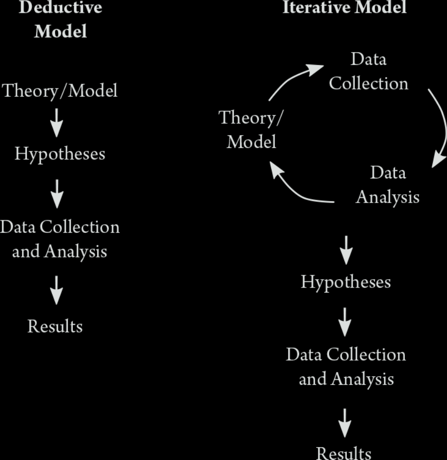

<font size=12>STV2022 -- Store tekstdata</font></br>
<font size=10>Introduksjon</font></br>
{width=50%} 
  
Solveig Bjørkholt\ \ \ \ |\ \ \ \ Martin Søyland 
<font size=6>\<solveig.bjorkholt@stv.uio.no\>\ \ |\ \ \<martin.soyland@stv.uio.no\></font>

```{r setup, include=FALSE,warning=FALSE,message=FALSE}
knitr::opts_chunk$set(echo = FALSE)
knitr::opts_chunk$set(class.source = "code-bg")
refs <- bibtex::read.bib("../../../referanser/stv2022.bib")

library(rvest)
library(tidyverse)


```

# {data-background=tv_debatt.png}

# {data-background=st_debatt.jpg}

# {data-background=horing.png}

# {data-background=eq.png}

</br></br></br>

<p style='font-size:124pt; color:#f0f396; font-weight:bold'>
 Undervisning\ \ \ 
</p>

## Forelesninger {data-background=eq.png}


1. <p style='color:#24D4A7'>Intro! (uke 34)</p>
2. <p style='color:#D13F11'>Anskaffelse og innlasting av tekst  (uke 35)</p>
3. <p style='color:#D13F11'>Forbehandling av tekst 1 (uke 36)</p>
4. <p style='color:#D13F11'>Forbehandling av tekst 2 (uke 37)</p>
5. <p style='color:#5B28D4'>Bruke API (Stortinget) (uke 38)</p>
6. <p style='color:#42D225'>Veiledet versus ikke-veiledet læring (uke 41)</p>
7. <p style='color:#42D225'>Ordbøker, tekstlikhet og sentiment (uke 42)</p>
8. <p style='color:#42D225'>Klassifisering av tekst -- temamodellering (uke 43)</p>
9. <p style='color:#42D225'>Estimere latent posisjon fra tekst (uke 44)</p>
10. <p style='color:#24D4A7'>Oppsummering! (uke 46)</p>


## Seminarer {data-background=rkode.png}

</br></br>

<div class='left' style='float:left;width:30%'>

</div>

. . .

<div class='right' style='float:right;width:65%'>

Hvordan gjøre...

1. ... scraping (uke 36)
2. ... preprosessering (uke 38)
3. ... visualisering (uke 43)
4. ... modellering 1 (uke 44)
5. ... modellering 2 (uke 46)


</div>

## Pensum {data-background=book.jpg}

<div class='left' style='float:left;width:35%'>

</div>

. . .

<div class='right' style='float:right;width:60%'>

<font size=5>

- <p style='background-color:rgba(0, 0, 0, .7); color:#D1B41B'>`r capture.output(print(refs["Grimmer2022"]))`</p>
    - <p style='background-color:rgba(0, 0, 0, .7); color:#ffffff'>Grunnbok!</p>
- <p style='background-color:rgba(0, 0, 0, .7); color:#D1B41B'>`r capture.output(print(refs["Silge2017"]))`</p>
    - <p style='background-color:rgba(0, 0, 0, .7); color:#ffffff'>Tidy tekstformat</p>
- <p style='background-color:rgba(0, 0, 0, .7); color:#D1B41B'>`r capture.output(print(refs["Benoit2017"]))`</p>
    - <p style='background-color:rgba(0, 0, 0, .7); color:#ffffff'>Tekstmodellering</p>
- <p style='background-color:rgba(0, 0, 0, .7); color:#D1B41B'>\+ En hau med artikler og mindre bidrag</p>
    
</font>

</div>

# Prosessen


{width=50%}

<font size="2">@Grimmer2022[p.15]</font>

# Enkelt eksempel

1. Finne og hente data
    - Alle tekster fra siste **No. 4** album
1. Stukturere data
    - Fra rå tekst/.html til datasett
1. Preprosessere data
    - Ta valg!
1. Visualisere data
    - Hva viser data?
1. Analysere data
    - Kan vi gjøre slutninger?

## <font color="white">\ \ \ \ \ \ \ \ \ \ \ \ \ \ \ Finne og hente data</font> {data-background=genius.png data-background-size="1900px"}

</br></br>

<div class='left' style='float:left;width:35%'>

</div>

. . .

<div class='right' style='float:right;width:60%'>

<font size=5>

```{r hente_no4, eval=FALSE, echo=TRUE,class.source="wider-chunk"}
# Laste inn pakker
library(rvest)
library(tidyverse)

# Url for alle sanger i albumet
url <- "https://genius.com/albums/No-4/No-4"

# "Skrape" nettsiden
raw_data <- read_html(url)

# Trekke ut titteltekster fra siden
titler <- raw_data %>% 
  html_elements("div.chart_row-content > a > h3") %>% 
  html_text() %>% 
  str_trim() %>% 
  str_remove_all("\\s+Lyrics")


# Trekke ut urlene til hver sang
track_urls <- sapply(raw_data %>% 
                       html_elements("div.chart_row-content > a") %>% 
                       html_attrs(), 
                     "[[", 1)

# Strukturere tekstene til hver sang
text <- lapply(1:length(track_urls), function(x){
  
  # Skrape url x
  tmp <- read_html(track_urls[x])
  
  # Trekke ut tekst og renske den
  tmp2 <- tmp %>% 
    html_elements("div.Lyrics__Container-sc-1ynbvzw-6.jYfhrf") %>% 
    html_text2() %>% 
    str_split("\\n") %>% 
    unlist() %>% 
    str_c(collapse = " ") %>% 
    str_remove_all("\\[(.*?)\\]") %>% 
    str_replace_all("\\s+", " ") %>% 
    str_trim()
  
  # Legge inn "soving" mellom x'er
  Sys.sleep(2+rnorm(1, 3))
  
  # Returnere resultatet
  return(tmp2)
})

# Kombinere alt til et datasett
no4 <- tibble(spor = 1:length(titler),
              titler, 
              tekst = unlist(text))
head(no4)

```

</font>
</div>

---

</br></br>

```{r hente_no4_2, echo=FALSE}
load("../../data/no4.rda")

no4 %>% 
  mutate(across(everything(), ~ substr(., 1, 29))) %>% 
  head(n = 12)

```


## Fra tekst til tall

<div class='left' style='float:left;width:50%'>

```{r unnest, echo=TRUE}
# Grunnpakke for tekstprosessering
library(tidytext) 

no4_tokens <- no4 %>% 
  group_by(spor) %>% 
  unnest_tokens(output = ord, 
                input = tekst) %>% 
  count(ord)

no4_tokens %>% head(6)

```

</div>

. . .

<div class='right' style='float:right;width:50%'>

```{r top_ord, echo=TRUE}
no4_tokens %>%
  select(spor, ord, n) %>% 
  slice_max(n = 1, 
            order_by = n, 
            with_ties = FALSE)
```


</div>

## Fra tekst til tall (uten stoppord)

<div class='left' style='float:left;width:50%'>

```{r unnest2, echo=TRUE}
# Grunnpakke for tekstprosessering
library(tidytext) 

no4_tokens <- no4 %>% 
  group_by(spor) %>% 
  unnest_tokens(output = ord, 
                input = tekst) %>% 
  count(ord) %>% 
  filter(ord %in% quanteda::stopwords("no") == FALSE)

no4_tokens %>% head(6)

```

</div>

. . .

<div class='right' style='float:right;width:50%'>

```{r top_ord2, echo=TRUE}
no4_tokens %>%
  select(spor, ord, n) %>% 
  slice_max(n = 1, 
            order_by = n, 
            with_ties = FALSE)
```


</div>


## Visualisere data


## Analysere data 

# Typer analyse
<!--Assigned til Solveig! -->

## Deskriptiv

## Veiledet vs. ikke veiledet læring

## Ordbøker, tekstlikhet og sentiment

## Klassifisering av tekst

## Estimere latent posisjon fra tekst

# Oppsummering


# Referanser


<font size=3>
  <div id="refs"></div>
</font>