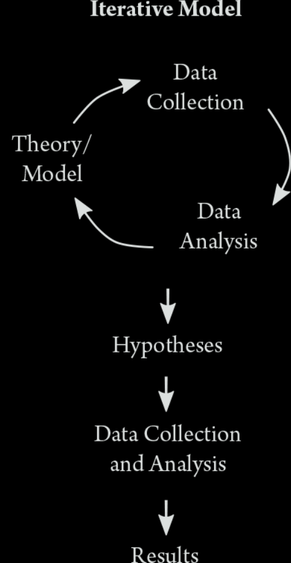
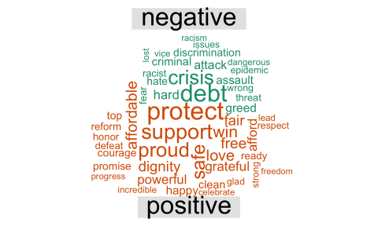
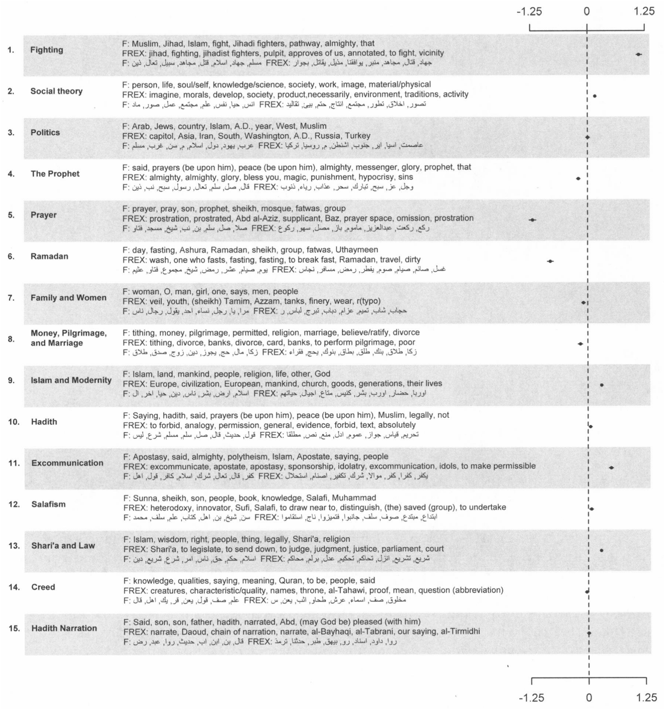
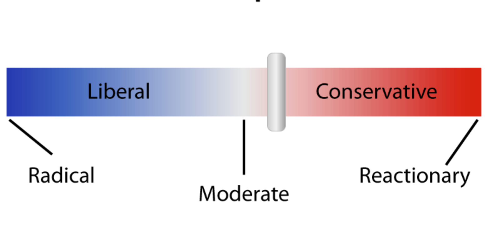

<font size=12>STV2022 -- Store tekstdata</font></br>
<font size=10>Introduksjon</font></br>
{width=50%} 
  
Solveig Bjørkholt\ \ \ \ |\ \ \ \ Martin Søyland 
<font size=6>\<solveig.bjorkholt@stv.uio.no\>\ \ |\ \ \<martin.soyland@stv.uio.no\></font>

```{r setup, include=FALSE,warning=FALSE,message=FALSE}
knitr::opts_chunk$set(echo = FALSE)
knitr::opts_chunk$set(class.source = "code-bg")
refs <- bibtex::read.bib("../../../referanser/stv2022.bib")

library(rvest)
library(tidyverse)


```

<!-- # {data-background=tv_debatt.png} -->

<!-- # {data-background=st_debatt.jpg} -->

<!-- # {data-background=horing.png} -->

# {data-background=eq.png}

</br></br></br>

<p style='font-size:124pt; color:#f0f396; font-weight:bold'>
 Undervisning\ \ \ 
</p>

## Forelesninger {data-background=eq.png}


1. <p style='color:#24D4A7;font-weight:bold'>Intro! (uke 34)</p>
2. <p style='color:#D13F11;font-weight:bold'>Anskaffelse og innlasting av tekst  (uke 35)</p>
3. <p style='color:#D13F11;font-weight:bold'>Forbehandling av tekst 1 (uke 36)</p>
4. <p style='color:#D13F11;font-weight:bold'>Forbehandling av tekst 2 (uke 37)</p>
5. <p style='color:#5B28D4;font-weight:bold'>Bruke API (Stortinget) (uke 38)</p>
6. <p style='color:#42D225;font-weight:bold'>Veiledet versus ikke-veiledet læring (uke 41)</p>
7. <p style='color:#42D225;font-weight:bold'>Ordbøker, tekstlikhet og sentiment (uke 42)</p>
8. <p style='color:#42D225;font-weight:bold'>Klassifisering av tekst -- temamodellering (uke 43)</p>
9. <p style='color:#42D225;font-weight:bold'>Estimere latent posisjon fra tekst (uke 44)</p>
10. <p style='color:#24D4A7;font-weight:bold'>Oppsummering! (uke 46)</p>


## Seminarer {data-background=rkode.png}

</br></br>

<div class='left' style='float:left;width:30%'>

</div>

. . .

<div class='right' style='float:right;width:65%'>

Hvordan gjøre...

1. ... scraping (uke 36)
2. ... preprosessering (uke 38)
3. ... visualisering (uke 43)
4. ... modellering (uke 44)
5. ... fra tekst til funn (Q&A) (uke 46)


</div>

## Pensum {data-background=book.jpg}

<div class='left' style='float:left;width:35%'>

</div>

. . .

<div class='right' style='float:right;width:60%'>

<font size=5>

- <p style='color:#D1B41B'>`r capture.output(print(refs["Grimmer2022"]))`</p>
    - <p style='color:#ffffff'>Grunnbok!</p>
- <p style='color:#D1B41B'>`r capture.output(print(refs["Silge2017"]))`</p>
    - <p style='color:#ffffff'>Tidy tekstformat</p>
- <p style='color:#D1B41B'>`r capture.output(print(refs["Benoit2017"]))`</p>
    - <p style='color:#ffffff'>Tekstmodellering</p>
- <p style='color:#D1B41B'>\+ En hau med artikler og mindre bidrag</p>
    
</font>

</div>

## {data-background=notatbok_blur.png}

</br></br></br></br>

<p style='font-size:90pt; color:#f0f396; font-weight:bold'>
 [Shiny notatbok](https://shinyibv02.uio.no/content/11df8e17-5a81-477d-8e44-b4a6d90e4c72)\ \ \ 
</p>


## {data-background=notatbok_blur.png}

</br></br></br>

<p style='font-size:50pt; color:#f0f396; font-weight:bold'>
  Oppgaven
</p>

<!-- a href link for å åpne i ny tab -->
<a href="https://shinyibv02.uio.no/content/11df8e17-5a81-477d-8e44-b4a6d90e4c72/notatbok.html#oppgaver" target="_blank">All info om oppgaven er i notatboken!</a>

# Prosessen

```{r convert, echo=FALSE, eval=FALSE}
system("convert -crop 250x700+0+0 text_models2.png deductive.png")
system("convert -crop 1000x1300+425+0 text_models2.png iterative.png")

```


<font size="2">@Grimmer2022[p.15]</font>

. . .

<div class='left' style='float:left;width:50%'>

{width=35%}


</div>

. . .

<div class='right' style='float:right;width:50%'>

{width=50%}

</div>

<!-- Rather than continue entertaining the fiction of the  -->
<!-- standard deductive model of social science research,  -->
<!-- in this book we emphasize the recursive nature of the research  -->
<!-- process and explain how thinking iteratively is the best  -->
<!-- approach for analyzing text as data  -->


# Enkelt eksempel

1. Finne og hente data
    - Alle tekster fra siste **No. 4** album
1. Stukturere data
    - Fra rå tekst/.html til datasett
1. Preprosessere data
    - Ta valg!
1. Visualisere data
    - Hva viser data?
1. Analysere data
    - Kan vi gjøre slutninger?

## <font color="white">\ \ \ \ \ \ \ \ \ \ \ \ \ \ \ Finne og hente data</font> {data-background=genius.png data-background-size="1900px"}

</br></br>

<div class='left' style='float:left;width:35%'>

</div>

. . .

<div class='right' style='float:right;width:60%'>

<font size=5>

```{r hente_no4, eval=FALSE, echo=TRUE,class.source="wider-chunk"}
# Laste inn pakker
library(rvest)
library(tidyverse)

# Url for alle sanger i albumet
url <- "https://genius.com/albums/No-4/No-4"

# "Skrape" nettsiden
raw_data <- read_html(url)

# Trekke ut titteltekster fra siden
titler <- raw_data %>% 
  html_elements("div.chart_row-content > a > h3") %>% 
  html_text() %>% 
  str_trim() %>% 
  str_remove_all("\\s+Lyrics")


# Trekke ut urlene til hver sang
track_urls <- sapply(raw_data %>% 
                       html_elements("div.chart_row-content > a") %>% 
                       html_attrs(), 
                     "[[", 1)

# Strukturere tekstene til hver sang
text <- lapply(1:length(track_urls), function(x){
  
  # Skrape url x
  tmp <- read_html(track_urls[x])
  
  # Trekke ut tekst og renske den
  tmp2 <- tmp %>% 
    html_elements("div.Lyrics__Container-sc-1ynbvzw-6.jYfhrf") %>% 
    html_text2() %>% 
    str_split("\\n") %>% 
    unlist() %>% 
    str_c(collapse = " ") %>% 
    str_remove_all("\\[(.*?)\\]") %>% 
    str_replace_all("\\s+", " ") %>% 
    str_trim()
  
  # Legge inn "soving" mellom x'er
  Sys.sleep(2+rnorm(1, 3))
  
  # Returnere resultatet
  return(tmp2)
})

# Kombinere alt til et datasett
no4 <- tibble(spor = 1:length(titler),
              titler, 
              tekst = unlist(text))
head(no4)

```

</font>
</div>

---

</br></br>

```{r hente_no4_2, echo=FALSE}
load("../../data/no4.rda")

no4 %>% 
  mutate(across(everything(), ~ substr(., 1, 29))) %>% 
  head(n = 12)

```


## Fra tekst til tall

<div class='left' style='float:left;width:50%'>

```{r unnest, echo=TRUE}
# Grunnpakke for tekstprosessering
library(tidytext) 

no4_tokens <- no4 %>% 
  group_by(spor) %>% 
  unnest_tokens(output = ord, 
                input = tekst) %>% 
  count(ord)

no4_tokens %>% head(6)

```

</div>

. . .

<div class='right' style='float:right;width:50%'>

```{r top_ord, echo=TRUE}
no4_tokens %>%
  select(spor, ord, n) %>% 
  slice_max(n = 1, 
            order_by = n, 
            with_ties = FALSE)
```


</div>

## Fra tekst til tall (uten stoppord)

<div class='left' style='float:left;width:50%'>

```{r unnest2, echo=TRUE}
# Grunnpakke for tekstprosessering
library(tidytext) 

no4_tokens <- no4 %>% 
  group_by(spor) %>% 
  unnest_tokens(output = ord, 
                input = tekst) %>% 
  count(ord) %>% 
  filter(ord %in% quanteda::stopwords("no") == FALSE)

no4_tokens %>% head(6)

```

</div>

. . .

<div class='right' style='float:right;width:50%'>

```{r top_ord2, echo=TRUE}
no4_tokens %>%
  select(spor, ord, n) %>% 
  slice_max(n = 1, 
            order_by = n, 
            with_ties = FALSE)
```


</div>


## Visualisere data

```{r, echo=-1, message=FALSE, warning=FALSE, fig.height=3.3, fig.width=8.3}
set.seed(4569)
library(ggwordcloud)
no4_tokens %>% 
  filter(n > 4) %>% 
  ggplot(., aes(label = ord, size = n,  color = colors()[1:29])) +
  geom_text_wordcloud_area()+
  scale_size_area(max_size = 50) +
  ggdark::dark_theme_void()

```


# Typer analyse

Hvem er kjent med:

```{r, eval = FALSE, echo = TRUE}
lm(y ~ x1 + x2, data = df)
```


 - Vi ønsker å bruke tekst for å si noe om mønstre og sammenhenger.
 - Det er spesielt tre steg i forskningsprosessen:
 
    - Oppdagelse (discovery)
    - Måling (measurement)
    - Slutning (inference)

. . .

<!-- {width=40%} -->


## Deskriptiv

Deskriptiv analyse handler om å beskrive dataene.

For eksempel:

- Hvilket ord dukker oftest opp på platen?

. . .

```{r telling}
no4_tokens %>%
  ungroup() %>%
  count(ord) %>%
  arrange(desc(n))
```

## Deskriptiv

Eller...

 - Hvilke ord ble brukt mest over ulike tidsperioder?
 - Hvordan fordeler ordbruken seg mellom ulike aktører?
 - Hvilke ord deles mellom de ulike tekstene?

## Deskriptiv

```{r nettverk, message=FALSE}
library(igraph)
library(ggraph)

edgelist <- no4_tokens %>% 
  select(spor, ord)

graph <- graph_from_data_frame(edgelist, directed = FALSE, vertices = NULL)

names <- attributes(degree(graph)) %>% as_tibble()
degree <- degree(graph) %>% as_tibble() %>%
  mutate(from = names$names)

gdat_twomode <- graph %>% 
  igraph::as_data_frame() %>%
  left_join(degree)

gdat_twomode %>% 
  tidygraph::as_tbl_graph() %>% 
  tidygraph::activate(nodes) %>% 
  mutate(degree = degree$value) %>%
  ggraph(layout = "fr") +
  geom_edge_link(color = "gray") +
  geom_node_point(aes(color = degree, 
                      size = degree)) + 
  geom_node_text(aes(label = name), color = "black") +
  theme_graph() + 
  theme(legend.position = "none",
        panel.background = element_blank())
```

## Veiledet vs. ikke veiledet læring

Læring: Maskinen bruker data til å forstå mønstre og sammenhenger selv.

 - Står i kontrast til regelbaserte metoder (ingen læring, kun følge en oppskrift)
 
<br>

 - Tekst regnes gjerne som "stordata", fordi hvert ord blir en variabel.
 - Stordata er godt tilpasset læringsalgoritmer.
 - Vi deler "læring" inn i to:

    - Veiledet læring (det finnes en fasit alt)
    - Ikke-veiledet læring (det finnes ingen fasit)


## Veiledet vs. ikke veiledet læring

**Veildet læring**

<div class='left' style='float:left;width:50%'>

 - Vi vet allerede `Y` (avhengig variabel).
 
 - Maskinen bruker data for å lære sammenhenger som den kan applisere på ny data.
 - Brukes spesielt for måling og slutning.

</div>

. . .


<div class='right' style='float:right;width:50%'>

Kan vi bruke informasjon om disse objektene...

```{r veiledet1}
tibble(frukt = c("banan", "banan", "pære", "banan", "pære"),
       fasong = c("lang", "lang", "rund", "lang", "lang"),
       farge = c("gul", "gul", "grønn", "gul", "grønn"))
```

Til å finne ut om disse objektene er banan eller pære?

```{r veiledet2}
tibble(frukt = c("", ""),
       fasong = c("rund", "lang"),
       farge = c("gul", "grønn"))
```


</div>

## Veiledet vs. ikke veiledet læring

**Ikke-veiledet læring**

<div class='left' style='float:left;width:50%'>

 - Vi vet ikke `Y` (avhengig variabel).
 
 - Maskinen bruker data for å lære om mønstre i data.
 - Brukes spesielt for oppdagelse og måling.

</div>

. . .


<div class='right' style='float:right;width:50%'>

Vi kan bruke informasjon om disse objektene...

```{r ikke-veiledet1}
tibble(fasong = c("lang", "lang", "rund", "lang", "lang"),
       farge = c("gul", "gul", "grønn", "gul", "grønn"),
       størrelse = c("middels", "middels", "liten", "middels", "stor"))
```

Til å si noe om hvordan objektene hører sammen?

```{r ikke-veiledet2}
tibble(fasong = c("lang", "lang", "rund", "lang", "lang"),
       farge = c("gul", "gul", "grønn", "gul", "grønn"),
       størrelse = c("middels", "middels", "liten", "middels", "stor"),
       type = c(1, 1, 2, 1, 2))
```


</div>


## Ordbøker, tekstlikhet og sentiment

**Ordbøker:** Lag deg selv en ordbok over relevante ord, og sjekk hvor mange ganger disse ordene dukker opp i ulike tekster.

 - Ordbøker er regelbaserte 
 
 . . .
 
```{r ordbok, echo = TRUE, message=FALSE}
trist <- tibble(ord = c("gråte", "savne", "våt", "tåre", "tårer", "stakkar", "stygt", "feil", "aldri", "natten", "glemme", "tapte"),
                trist = c(1, 1, 1, 1, 1, 1, 1, 1, 1, 1, 1, 1))

no4_tokens %>%
  ungroup() %>%
  count(ord) %>%
  left_join(trist) %>%
  ggplot(., aes(label = ord, 
                size = n,  
                color = trist)) +
  geom_text_wordcloud_area()+
  scale_size_area(max_size = 10) +
  ggdark::dark_theme_void()

```

## Ordbøker, tekstlikhet og sentiment
 
```{r ordbok-ordsky, echo = FALSE, message=FALSE}
triste_ord <- tibble(ord = c("gråte", "savne", "våt", "tåre", "tårer", "stakkar", "stygt", "feil", "aldri", "natten", "glemme", "tapte"),
                trist = c(1, 1, 1, 1, 1, 1, 1, 1, 1, 1, 1, 1))

no4_tokens %>%
  ungroup() %>%
  count(ord) %>%
  left_join(triste_ord) %>%
  ggplot(., aes(label = ord, 
                size = n,  
                color = trist)) +
  geom_text_wordcloud_area()+
  scale_size_area(max_size = 20) +
  ggdark::dark_theme_void()

```

## Ordbøker, tekstlikhet og sentiment

**Tekstlikhet:** Ta to tekster og sammenlikn hvor like de er.

 - Tekstlikhet kan regnes som ikke-veiledet læring.

. . .

```{r likhet1, echo = TRUE}
no4 %>% 
  filter(spor %in% c(2, 4)) %>% 
  mutate(likhet = c(0.09630868, 0.09630868)) %>%
  select(likhet, titler, tekst)
```

```{r likhet2, eval = FALSE}

tfidf_no4 <- no4_tokens %>%
  count(spor, ord, sort  = TRUE) %>%
  bind_tf_idf(ord, spor, n) %>%
  cast_sparse(spor, ord, tf)

similarities <- text2vec::sim2(tfidf_no4, method = "cosine", norm = "l2")

as.data.frame(as.matrix(similarities)) 

```


## Ordbøker, tekstlikhet og sentiment

**Sentiment:** Finn ut hvor positiv, negativ eller nøytral en tekst er.

 - Sentimentanalyse kan både gjøres gjennom ordbøker og gjennom veiledet læring.
 
<br>    

. . .

{width=60%}


## Klassifisering av tekst

**Klassifisering:** Hva slags type tekst er dette?

 - En kategorisk variabel som klassifiserer teksten.
 - Kan både være veiledet og ikke-veiledet

. . .

```{r klassifisering, echo = TRUE}
no4 %>%
  filter(spor == 1:4) %>%
  mutate(type = c("glad", "trist", "trist", "glad")) %>%
  select(spor, titler, type, tekst)
```

## Klassifisering av tekst

Eksempel fra temamodellering i pensum (Lucas 2015):

{width=60%}


## Estimere latent posisjon fra tekst

**Latent posisjon:** Hvor på en akse befinner denne teksten seg?

 - Latent: Ikke direkte observerbar.
 - Kan både være veiledet og ikke-veiledet.

 - For eksempel: Er et partiprogram på den politiske høyresiden eller venstresiden?
 
. . .

{width=60%}


# Oppsummering

<!--  -->

# Referanser


<font size=3>
  <div id="refs"></div>
</font>