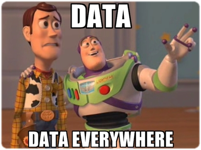
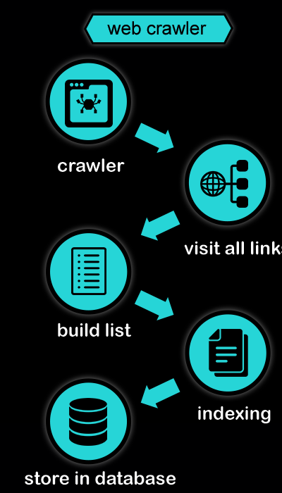

<font size=12>STV2022 -- Store tekstdata</font></br></br>
<p style='font-size:10;color:#D13F11'>[02] Anskaffelse og innlasting av tekst</p></br>
{width=50%} 

Martin Søyland 
<font size=6>\<martin.soyland@stv.uio.no\></font></br>

```{r setup, include=FALSE,warning=FALSE,message=FALSE}
# setwd("./undervisningsmateriell/forelesninger/uke_02/")
knitr::opts_chunk$set(echo = FALSE)
knitr::opts_chunk$set(class.source = "code-bg")
refs <- bibtex::read.bib("../../../referanser/stv2022.bib")

library(rvest)
library(tidyverse)

```


# Disposisjon

1. Strukturerte datasett
2. Semistrukturerte data (APIer)
3. Ustrukturerte data
    - Skraping (med eksempler)
    - Kravling (med eksempler)
    - Fallgruver
4. Kaosdata (Høyland & Søyland)
    - En historie om OCR
5. Oppgave
6. Oppsummering


# Strukturerte datasett

<div class='left' style='float:left;width:45%'>
{width=40%} </br>
{width=40%} </br>
{width=40%} </br>
</div>

<div class='right' style='float:right;width:45%'>
{width=40%} </br>
{width=40%} </br>
{width=40%} </br>
</div>

## Strukturerte datasett

- Datasett som er klar *out of the box*
- oftest 2-dimensjonale: `data[rader, kolonner]`
- ... men mange trenger fortsatt preprosessering

. . .

```{r struct_ex, echo=-1}
set.seed(984984)
tibble(stortingscrape::cases$root) %>% 
  select(id, status, type, title_short) %>% 
  slice_sample(n = 5)

```

## {data-background="./file_formats.png" }

## Vanlige dataformat


| Format | Står for                   | R-funksjon                                    |
|:-------|:---------------------------|:----------------------------------------------|
| .csv   | Comma Separated Values     | `read.csv` // `readr::read_csv()`             |
| .txt   | Text                       | `readLines()` // `textreadr::read_document()` |
| .xlsx  | Excel                      | `readxl::read_xlsx()`                         |
| .html  | HyperText Markup Language  | `rvest::read:html()`                          |
| .xml   | Extensible Markup Language | `rvest::read:html()`                          |
| .json  | JavaScript Object Notation | `jsonlite::read_json()`                       |
| .dta   | Stata                      | `haven::read_dta()`                           |
| .sav   | SPSS                       | `haven::read_sav()`                           |
| ...    | Og tusen andre formater... | ...med egne R-pakker og funksjoner            |


# Semistrukturerte data (APIer)

Application Programming Interface:

. . .

{width=50%}

. . .

Mer i forelesning <p style='color:#5B28D4'>[05] Bruke API (Stortinget) (uke 38)</p>

---

[Tilfeldig side fra Statens vegvesen](https://psi.norge.no/los/ord/parkering-og-hvileplasser)

```txt
<?xml version="1.0" encoding="UTF-8"?>
  <rdf:RDF xmlns:rdf="http://www.w3.org/1999/02/22-rdf-syntax-ns#" xmlns:skos="http://www.w3.org/2004/02/skos/core#">
  <rdf:Description rdf:about="https://psi.norge.no/los/ord/parkering-og-hvileplasser">
  <rdf:type rdf:resource="http://www.w3.org/2004/02/skos/core#Concept"/>
    <skos:inScheme rdf:resource="https://psi.norge.no/los/ontologi/ord"/>
    <skos:prefLabel xml:lang="nn">Parkering</skos:prefLabel>
    <skos:prefLabel xml:lang="nb">Parkering og hvileplasser</skos:prefLabel>
    <skos:prefLabel xml:lang="en">Parking and rest area</skos:prefLabel>
    <skos:hiddenLabel xml:lang="nb">Avgiftsparkering</skos:hiddenLabel>
    <skos:hiddenLabel xml:lang="nn">Avgiftsparkering</skos:hiddenLabel>
    <skos:hiddenLabel xml:lang="nb">Innfartsparkering</skos:hiddenLabel>
    <skos:hiddenLabel xml:lang="nn">Innfartsparkering</skos:hiddenLabel>
    <skos:hiddenLabel xml:lang="nb">Parkeringsavgift</skos:hiddenLabel>
    <skos:hiddenLabel xml:lang="nn">Parkeringsavgift</skos:hiddenLabel>
    <skos:hiddenLabel xml:lang="nb">Parkeringsbot</skos:hiddenLabel>
    <skos:hiddenLabel xml:lang="nn">Parkeringsbot</skos:hiddenLabel>
    <skos:hiddenLabel xml:lang="nb">Parkeringsgebyr</skos:hiddenLabel>
    <skos:hiddenLabel xml:lang="nn">Parkeringsgebyr</skos:hiddenLabel>
    <skos:hiddenLabel xml:lang="nb">Parkeringskort</skos:hiddenLabel>
    <skos:hiddenLabel xml:lang="nn">Parkeringskort</skos:hiddenLabel>
    <skos:hiddenLabel xml:lang="nn">Parkeringsløyve</skos:hiddenLabel>
    <skos:hiddenLabel xml:lang="nb">Parkeringsløyve</skos:hiddenLabel>
    <skos:hiddenLabel xml:lang="nn">Parkeringsløyve</skos:hiddenLabel>
    <skos:hiddenLabel xml:lang="nb">Parkeringsplass</skos:hiddenLabel>
    <skos:hiddenLabel xml:lang="nn">Parkeringsplass</skos:hiddenLabel>
    <skos:hiddenLabel xml:lang="nb">Parkeringstillatelse</skos:hiddenLabel>
    <skos:hiddenLabel xml:lang="nn">Rasteplassar</skos:hiddenLabel>
    <skos:hiddenLabel xml:lang="nb">Rasteplasser</skos:hiddenLabel>
    <skos:hiddenLabel xml:lang="nb">Utfartsparkering</skos:hiddenLabel>
    <skos:hiddenLabel xml:lang="nn">Utfartsparkering</skos:hiddenLabel>
    <skos:note xml:lang="nn">Det skal vere eitt felles regelverk for all parkeringsverksemd. Regelverket skal syte for lik skilting og like reaksjonar ved brot på føresegnene. Det er også ei obligatorisk godkjenningsordning som gjeld både for kommunar, private parkeringsselskap og andre.</skos:note>
    <skos:note xml:lang="nb">Parkeringstillatelser, parkeringsgebyr, regelverk for gateparkering, parkering for forflytningshemmede, klage på parkeringsbot, betaling av parkeringsbot.</skos:note>
    <skos:broader rdf:resource="https://psi.norge.no/los/tema/mobilitetstilbud"/>
    <skos:broader rdf:resource="https://psi.norge.no/los/tema/veg-og-vegregulering"/>
    <skos:broader rdf:resource="https://psi.norge.no/los/tema/yrkestransport"/>
  </rdf:Description>
</rdf:RDF>
```


# Ustrukturerte data

</br> </br> 
{width=55%}

## Skraping vs. kravling

<!-- - Skraping (*web scraping*) er spesifikk -->
<!--     - vi vet hva vi vil ha, og henter bare det -->
<!-- - Kravling (*web crawling*) er generell -->
<!--     - vi vet vi vil ha alt, men ikke nødvendigvis hva alt er -->

. . .

<div class='left' style='float:left;width:50%'>
{width=80%}
</div>

. . .

<div class='right' style='float:right;width:50%'>
{width=70%}
</div>


# Skraping

- Eksempelhypotese:

. . .

> Skandinaviske land blir nevnt oftere enn andre land i NOUer fra Utenriksdepartementet

1. Utvalg/univers: aller NOUer fra UD
2. Datakilde: [regjeringen.no](https://www.regjeringen.no/no/dokument/nou-ar/id1767/?ownerid=833)
3. ~~Fremgangsmåte 1: Laste ned alle 7 dokumentene manuelt~~
4. <font color="#ffa200">Fremgangsmåte 2: Lage en scraper som laster ned og strukturerer dokumentene</font>

## Steg 1: Finne data

- <a href="https://www.regjeringen.no/" target="_blank">Point and click på regjeringen.no</a>
- *Inspect*
- Finn *selector*
- Skriv kode og test med én link

---

```{r nou_base, eval=-c(9,10), echo=TRUE}

library(rvest)
library(stringr)

# rot-url for regjeringen.no
base_url <- "https://www.regjeringen.no/"

# Laster ned siden med alle NOUer fra UD (atm 7 stk)
str_c(base_url, "no/dokument/nou-ar/id1767/?ownerid=833") %>% 
  download.file(., destfile = "./scrape/base.html")

# Trekker ut linkene til hver NOU
nou_links <- read_html("./scrape/base.html") %>% 
  html_elements("h2 > a[data-hitid]") %>% 
  html_attr("href")

nou_links
```

## Steg 2: Laste ned forside for alle NOUer

- <a href="https://www.regjeringen.no/no/dokumenter/nou-2016-8/id2503028/" target="_blank">Bruk én lenke som testobjekt først</a>
- Når det virker: Lag en løkke som laster ned alle NOUene sin forside
- Hvis det krasjer på 1 eller flere sider, inspiser og fiks koden

---

```{r nou_forside, eval=FALSE, echo=TRUE}

# Laster ned forsiden til hver NOU
for(i in nou_links){
  
  # Trekker ut dokument-id
  tmp_id <- str_extract(i, "id[0-9]+")
  
  # Laster ned forsiden til NOU i
  str_c(base_url, i) %>% 
    download.file(., destfile = str_c( "./scrape/nou_forside/", 
                                       tmp_id, 
                                       ".html"))
  
  # Legger til litt tilfeldig søvn
  Sys.sleep(2 + abs(rnorm(1, 0)))
  
  # Printer en beskjed til console om at i nå er ferdig
  message(str_c(
    "Ferdig med: ",
    tmp_id,
    "\n"
  ))
  
}

```

---

```{r sjekke_at_filer_er_der, echo=TRUE, eval=TRUE}
list.files("./scrape/nou_forside/")

nou_forsider <- lapply(
  list.files("./scrape/nou_forside/", full.names = TRUE), 
  read_html
)

nou_forsider[[1]]

```

## Steg 3: Laste ned `.pdf` for alle NOUene

- Se på forsiden til én NOU og identifiser nedlastingsknappen
- *Inspect* -> *Copy selector* -> Rediger og test
- Skriv kode for å trekke ut lenkene
- Last ned `.pdf`-filene

---

```{r nou_pdf_links, echo=TRUE, eval=TRUE}
nou_pdf_links <- lapply(nou_forsider, function(x){
  
  tmp_content_link <- x %>% 
    html_elements("a[title]") %>% 
    html_attr("href")
  
  tmp_content_link[which(str_detect(tmp_content_link, "\\.pdf$"))]
  
}) %>% unlist()

nou_pdf_links

```

---

```{r nou_pdf_dl, echo=TRUE, eval=FALSE}
# Laster ned pdf til hver NOU
for(i in nou_pdf_links){
  
  # Trekker ut dokument-id
  tmp_id <- str_extract(i, "nou(.*?)\\.pdf$")
  
  # Laster ned forsiden til NOU i
  str_c(base_url, i) %>% 
    download.file(., destfile = str_c("./scrape/nou_pdf/", 
                                      tmp_id))
  # Legger til litt tilfeldig søvn
  Sys.sleep(2 + abs(rnorm(1, 0)))
  
  # Printer en beskjed til console om at i nå er ferdig
  message(str_c(
    "Ferdig med: ",
    tmp_id,
    "\n"
  ))
  
}

list.files("./scrape/nou_pdf/")
```

```{r juksechunk, echo=FALSE, eval=TRUE}
list.files("./scrape/nou_pdf/")
```

## Steg 4: Laste inn `.pdf`-filene

- Her bruker vi `textreadr::read_pdf()`

. . .

```{r nou_lese_pdf, eval=TRUE, echo=TRUE, message=FALSE, warning=FALSE}
library(textreadr)

nou_pdfer <-  list.files("./scrape/nou_pdf/", full.names = TRUE)

nou_tekst <- lapply(nou_pdfer, function(x){
  
  read_pdf(x) %>% tibble()
  
})

nou_tekst[[1]] %>% 
  head(., 4)
```

## Steg 5: Konvertere til `.txt`

```{r nou_txt, eval=FALSE, echo=TRUE}

lapply(1:length(nou_tekst), function(x){
  
  tmp_tekst <- nou_tekst[[x]] %>% 
    summarize(tekst = str_c(text, collapse = " "))
  
  txt_file_out <- nou_pdfer[x] %>% 
    str_extract("nou[0-9]+(.*?)\\.pdf") %>% 
    str_remove("\\.pdf")
  
  writeLines(tmp_tekst$tekst,
             str_c("./scrape/nou_txt/", 
                   txt_file_out,
                   ".txt"))
  
})
```

## Steg 6: Neste forelesning ...

... men husk hypotesen:

> Skandinaviske land blir nevnt oftere enn andre land i NOUer fra Utenriksdepartementet

---

```{r nou_analyse, echo=FALSE, error=FALSE, warning=FALSE, message=FALSE}
library(tidytext)

# Hentet fra: https://no.wikipedia.org/wiki/Liste_over_land_etter_areal
countries <- rvest::read_html("./scrape/countries.html") %>% 
  html_elements("table") %>% 
  html_table() %>%
  bind_rows() %>% 
  pull(Land) %>% 
  tolower()


txt_filer <- list.files("./scrape/nou_txt/", full.names = TRUE)

nouer <- lapply(txt_filer, function(x){
  readLines(x) %>% 
    str_c(collapse = " ")
})

nou_data <- tibble(id = str_extract(txt_filer, "nou[0-9]+(.*?)pdf[as]"),
                   tekst = unlist(nouer)) %>% 
  unnest_tokens(token, tekst) %>% 
  filter(token %in% countries) %>% 
  filter(token %in% c("norge", "man") == FALSE) %>% 
  filter(str_detect(token, "^eu$") == FALSE) %>% 
  count(token)

library(ggwordcloud)
skandinavia <- c("danmark",
                 "sverige",
                 "færøyene",
                 "finland",
                 "island")

nou_data$skandinavia <- ifelse(nou_data$token %in% skandinavia, "ja", "nei") %>% 
  factor(., levels = c("nei", "ja"))

nou_data %>% 
  ggplot(., aes(label = token, 
                size = n,
                color = skandinavia)) +
  geom_text_wordcloud_area()+
  scale_size_area(max_size = 40) +
  scale_color_manual(values = c("darkcyan", "red")) +
  ggdark::dark_theme_void()


```

---

OBS!

```{r skand_reg, echo=FALSE, results='asis'}
(lm(n ~ skandinavia, data = nou_data)) %>% 
  stargazer::stargazer(., 
                       type = "html",
                       keep.stat = c("n", "adj.rsq"),
                       covariate.labels = c("Skand. land",
                                            "Konstantledd"))
```


# Kravling


<div class='left' style='float:left;width:50%'>
{width=70%}
</div>

. . .

<div class='right' style='float:right;width:50%'>
- La oss kravle litt rundt på [Virksomme ord](http://virksommeord.no)
- Dette vil ta lang tid! Husk å teste først
- Se på "Taler -- kronologisk"
- Gå inn på en tale og legg merke til linken `/tale/xxxx/`
- Setter kravleren til å bare lagre disse
</div>


---

Ca. 4 timer kjøretid
```{r en_kravler, eval=FALSE, echo=TRUE}

# Laster inn pakke for kravling
library(Rcrawler)


Rcrawler("http://virksommeord.no/", # Nettsiden vi skal kravle
         DIR = "./crawl",           # mappen vi lagrer filene i
         no_cores = 4,              # kjerner for å prosessere data
         dataUrlfilter = "/tale/",  # subset filter for kravling
         RequestsDelay = 2 + abs(rnorm(1)))


```


---

```{r juksechunk2, eval=TRUE, echo=TRUE}
virkord_filer <- list.files("./crawl/virksommeord.no-101413", 
                            full.names = TRUE)

head(virkord_filer)
length(virkord_filer)

```

---

### Kravlingens etterarbeid

```{r, eval=FALSE, echo = TRUE}

virkord_html <- lapply(virkord_filer, rvest::read_html)


virkord_data <- lapply(1:length(virkord_html), function(x){
  
  message(x)
  
  tmp_tekst <- virkord_html[[x]] %>% 
    html_elements("div[class='document'] > p") %>% 
    html_text()
  
  if(identical(character(), tmp_tekst)){
    tmp_tekst <- virkord_html[[x]] %>% 
      html_elements("tr[valign='top']") %>% 
      html_text()
  }
  
  if(identical(character(), tmp_tekst)){
    tmp_tekst <- virkord_html[[x]] %>% 
      html_elements("div[class='document'] > h3") %>% 
      html_text() %>% 
      str_split(., "\\n") %>% 
      unlist()
  }
  
  tmp_forfatter <- virkord_html[[x]] %>% 
    html_elements("div[class='tale-header'] > ul[class='byline'] > li > a") %>% 
    html_text() %>% 
    str_replace_all(., "\\s+", " ") %>% 
    .[1]
  
  tmp_forfatter_link <- virkord_html[[x]] %>% 
    html_elements("div[class='tale-header'] > ul[class='byline'] > li > a") %>% 
    html_attr("href") %>% 
    .[which(str_detect(., "person"))]
  
  tmp_tittel <- virkord_html[[x]] %>% 
    html_elements("div[class='tale-header'] > h1") %>% 
    html_text() %>% 
    str_replace_all(., "\\s+", " ")
  
  tmp_data <- tibble(
    tittel = tmp_tittel,
    forfatter = tmp_forfatter,
    forfatter_link = tmp_forfatter_link,
    avsnitt = 1:length(tmp_tekst),
    tekst = tmp_tekst
  )
  
  return(tmp_data)
})

virkord <- bind_rows(virkord_data)


# save(virkord, file = "./crawl/virksommeord.rda")
```

```{r load_virkdata, echo = FALSE, eval=TRUE}
load("./crawl/virksommeord.rda")
```

---

```{r vise_virkdata, echo=TRUE, eval=TRUE}
virkord %>% sample_n(6)
```

# Fallgruver

</br></br>

{width=80%}

## Front-end vs. back-end

- [Regjeringensarkiv](https://www.regjeringen.no/no/om-regjeringa/tidligere-regjeringer-og-historie/sok-i-regjeringer-siden-1814/id2578015/)
    - regjeringen.no har ikke åpen API
    - men har en back-end API som henter data for oss som gjør siden lesbar
- Se på *Network* i *Inspect*
    - data henter [.json-fil](https://www.regjeringen.no/api/RegjeringDataApi/GetRegjeringer?language=no&term=&period=&page=1) back-end
    - merk: `"Page":1`, `"Hits":20`, `"TotalHits":71`, osv


## Overlaste serveren (timeout){data-background="./504_negate.png"}


## Ikke lagre

- Alltid lagre lokalt!
    - slipper å hente samme side flere ganger
    - stabilitet -- nettsider endrer seg

## robots.txt

- `robots.txt` eksisterer på de fleste nettsider
    - beskriver hva som er lov og ikke lov å skrape

. . .

```{r robots, eval=-1}
download.file("https://vg.no/robots.txt", destfile = "./scrape/vg_robots.txt")

readLines("./scrape/vg_robots.txt")

```

# Kaosdata: En historie om OCR

Høyland & Søyland (2019):

- **Hypotese:** 
    - Mer partisentererte valgsystemer gir mer "partisnakk"
- **Data:**
    - Stortingstaler fra 1910-1931
- **Fremgangsmåte:** 
    - Kvantitativ emneanalyse på tvers av den norske valgreformen i 1919
- **Funn:** 
    - Ja, valgreform endrer atferd
- **Implikasjon:** 
    - Valgsystemet endrer representanters vekting av å følge partilinjen mot å 
    representere sitt valgdistrikt

## Samle data

- Skannede dokumenter fra 1910-1931
- Tigjengelig hos Nasjonalbiblioteket
    - Last ned med "søk og klikk"

. . .

{width=70%}

---

## Preprosessering -- ImageMagick

```{bash imagemagick, eval = FALSE, echo = TRUE}
convert -density 300x300 -shave 10x100;
  not_noisy.png not_noisy_clean1.png

convert not_noisy_clean1.png -normalize ;
  not_noisy_clean2.png

convert not_noisy_clean2.png ;
  -connected-components 4 -threshold 0 -negate;
  not_noisy_clean3.png

convert not_noisy_clean2.png;
  -define connected-components:area-threshold=15;
  -connected-components 4 -threshold 0 -negate; 
  not_noisy_clean4.png

convert not_noisy_clean3.png not_noisy_clean4.png;
  -compose minus -composite;
  not_noisy_clean5.png

convert not_noisy_clean2.png;
  \( -clone 0 -negate -fill white -colorize 100% \) ;
  not_noisy_clean5.png -compose Blend -composite;
  not_noisy_clean6.png

convert not_noisy_clean6.png; 
  -fill black -opaque "#FF00FF" -morphology Erode Disk:0.5; 
  not_noisy_cleaned.png
```

. . .

{width=40%}
{width=40%}

---

## Preprosessering -- Bilde til tekst

{width=70%}

```{bash tesseract, eval = FALSE, echo = TRUE}
# https://github.com/tesseract-ocr/tesseract
tesseract not_noisy_cleaned.png tekst
head -n 10 tekst.txt
```

. . .

```{r show_ocr_text, echo = FALSE, eval = TRUE, warning = FALSE}
readLines("./tekst.txt", n = 7)
```


---

## Preprosessering -- Når ting går galt

- Valg tatt i skanneprosessen kan ha konsekvenser 
- _Grayscale_ vs. sort/hvit
- Linjebrytning av ord med bindestrek

. . .

{width=30%}
{width=30%}

. . .

```{r show_noisy_ocr_text, echo = FALSE, eval = TRUE, warning = FALSE}
readLines("./tekst_noisy.txt", n = 5)
```

---

## Preprosessering -- Tekst til tall (BoW)


```{r bow_ex, echo=FALSE, eval=TRUE, warning=FALSE, message=FALSE}

samp_tekst <- read_csv("st_debates_meta.csv", show_col_types = FALSE)

set.seed(4093)

samp_tekst[sample(1:nrow(samp_tekst), 6), c("speech_id", "name_fixed", "speech")]
```

. . .

```{r bow_ex2, echo=FALSE, eval=TRUE, warning=FALSE, message=FALSE}
samp_tekst <- samp_tekst[sample(1:nrow(samp_tekst), 100), ]

samp_tekst <- samp_tekst %>%
  unnest_tokens(output = "token", input = "speech") %>%
  filter(grepl("[0-9]", token) == FALSE) %>% 
  group_by(speech_id) %>% count(token) %>% 
  cast_dfm(., document = speech_id, term = token, value = n)

as.matrix(samp_tekst[1:6, c("det", "har", "jord", "lærere", "behandling", "park")])

```


---

## Preprosessering -- Hva skal med?

- Stoppord
- Bøyning 
    - full form vs. stemming vs. lemma
    - kjærlighet vs. kjær vs. kjærlighet
- Rekkefølge på ord 
    - unigram, bigram, trigram, osv
- Nynorsk vs. bokmål?
- Kontekstuelle (ikke-språklige) variabler

## Modellering -- Emneanalyse

- Emneanalyse (topic modelling)
    - Emner defineres av ords sameksistens
    - Satt antall emner -- abstraksjonsnivå
    - Induktiv tolkning -- mye lesing
- Structural Topic Model (STM)
    - Estimere effekt av variabler på emnestruktur
    - Her med reform og stortingssesjon


## Modellering -- Resultat

{width=90%}

---

{width=90%}


# Oppsummering

- Strukturerte data :: kaosdata
  - *Out of the box*
  - APIer
  - Skraping
  - Kravling
  - OCR
- Fallgruver
  - Undersøk om back-end finnes
  - Ikke overlast serveren
  - Lagre nedlastede sidene
  - Se på `robots.txt`


# Oppgave [1]

1. Skissér en hypotese basert på eksisterende teorier
    - Husk iterativ prosess -- ikke overtenk!
2. Finn en datakilde du tenker kan brukes til å svare på hypotesen din
    - Pass på å ikke ta vann over hodet!
3. Hent og strukturer data
    - Om det er mye data, start med å strukturere deler av data
4. Gi en kort beskrivelse av hvordan dataene ble fanget og hvordan de er strukturert
    - Ta gjerne med litt om problemer som evt oppstod


