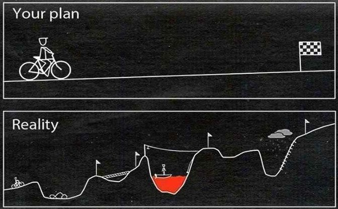

<font size=12>STV2022 -- Store tekstdata</font></br></br>
<p style='font-size:10;color:#D13F11'>[03] Forbehandling av tekst 1</p></br>
{width=50%} 

Martin Søyland 
<font size=6>\<martin.soyland@stv.uio.no\></font></br>

```{r setup, include=FALSE,warning=FALSE,message=FALSE}
# setwd("./undervisningsmateriell/forelesninger/uke_03/")
knitr::opts_chunk$set(echo = FALSE)
knitr::opts_chunk$set(class.source = "code-bg")
refs <- bibtex::read.bib("../../../referanser/stv2022.bib")

library(tidyverse);library(tidytext)

klossmajor <- readLines("./data/klossmajor/Skjønte ikke du var borte.txt")
# toenes <- readLines("./data/saan_av_salve.txt")

str_break <- function(x, width = 7L) {
  x <- unlist(quanteda::tokenize_fastestword(x))
  n <- length(x)
  if (n <= width) return(x)
  n1 <- seq(1L, n, by = width)
  n2 <- seq(width, n, by = width)
  if (n %% width != 0) n2 = c(n2, n)
  
  lines <- character()
  for(i in 1:length(n1)){
    lines[i] <- paste(x[n1[i]:n2[i]], collapse = " ")
  }
 return(lines) 
}
library(spacyr);spacy_initialize("nb_core_news_lg")
```


# Disposisjon

1. Litt om <font style='color:#FFAF00;font-weight:bold'>`regex`</font>
2. Hva er <font style='color:#4B0DFB;font-weight:bold'>forbehandling av tekst</font>, sånn egentlig?
3. <p style='color:#73DF93;font-weight:bold'>Sekk med ord</font> (*Bag of words*)
4. Valg av <font style='color:#FF0700;font-weight:bold'>analyseenhet</font>
5. <font style='color:#009970;font-weight:bold'>Tokenisering</font> (*tokenizing*)
6. Reduksjon av <font style='color:#E39F0B;font-weight:bold'>kompleksitet</font>
7. Konstruere <font style='color:#6CFA00;font-weight:bold'>dokumenttrekkmatrise</font> (DFM)
8. Litt mer `r emo::ji("scared")` avansert `r emo::ji("scared")` preprosessering 
9. Oppsummering


# {data-background=regex.png data-background-position="top" data-background-size=50%}

</br></br></br></br></br>

- Basert på mønster i teksten brukes <font style='color:#FFAF00;font-weight:bold'>*Regular expressions*</font> til å...
    - ...<font style='color:#FF100D;font-weight:bold'>trekke ut segmenter med tekst</font>
        - <font style='color:#8FB399;font-weight:bold'>`str_extract()` // `str_extract_all()`</font>
    - ...<font style='color:#3D01FF;font-weight:bold'>fjerne segmenter med tekst</font>
        - <font style='color:#8FB399;font-weight:bold'>`str_remove()` // `str_remove_all()`</font>
    - ...<font style='color:#0DFFED;font-weight:bold'>erstatte segmenter med tekst</font>
        - <font style='color:#8FB399;font-weight:bold'>`str_replace()` // `str_replace_all()`</font>
    - ...<font style='color:#98FF0D;font-weight:bold'>logisk se om segmenter med tekst eksisterer</font>
        - <font style='color:#8FB399;font-weight:bold'>`str_detect()`</font>

---


```{r regexeks1, eval=TRUE, echo=-1}
eks_streng <- "Solveig er ca. 20 år og har bedre forelesninger enn Martin"
eks_streng %>% cat()
```

. . .

```{r regexeks2, eval=TRUE, echo=TRUE}
str_extract_all(eks_streng, "[A-ZØÆØÅ][a-zæøå]+")

```

. . .

```{r regexeks2b, eval=TRUE, echo=TRUE}
str_extract_all(eks_streng, "[0-9]+")
```

---

```{r regexeks3, eval=TRUE, echo=TRUE}
str_extract(eks_streng, "[0-9]{1}")
str_extract_all(eks_streng, "[0-9]{1}")
str_detect(eks_streng, "\\@")
```

---

```{r regexeks4, eval=TRUE, echo=TRUE}
str_extract_all(eks_streng, "[aeiouyæøå]")

str_replace_all(eks_streng, c("Martin" = "Bjørn", 
                              "Solveig" = "Martin",
                              "20" = "60"))

```

---

Det kan fort bli veldig avansert

. . .

```{r regexeks5, eval=TRUE, echo=TRUE}
to_mailadresser <- c("martin.soyland@stv.uio.no",
                     "solveig_har_en_mail@høhø.com")

str_extract(to_mailadresser, 
           "([a-z]+\\.*)+\\@")

str_extract(to_mailadresser, 
           "([a-z]+[[:punct:]]*)+\\@")
```

---

```{r regexeks6, eval=TRUE, echo=TRUE}
str_extract(to_mailadresser, 
           "^([a-z]+[[:punct:]]*)+\\@([a-z]+[[:punct:]]*)+$")
```

. . .

```{r regexeks7, eval=TRUE, echo=TRUE}
str_extract(to_mailadresser, 
           "(([a-zæøå]+[[:punct:]]*)+\\@*)+")
```

## Et praktisk eksempel

Skraper personer fra [ISV](https://www.sv.uio.no/isv/personer)

```{r isv_liste, echo=TRUE, eval=FALSE, file="./r/regex_eksempler.R"}


```

[Cheet sheet](https://www.rexegg.com/regex-quickstart.html)


# Hva er forbehandling av tekst, sånn egentlig?

- Det vi gjør med data før vi skal analysere (<font style='color:#4B0DFB;font-weight:bold'>preprosessering</font>)
    - gjelder egentlig alle type data, ikke bare tekst
- Valg av <font style='color:#6CFA00;font-weight:bold'>datastruktur</font>
    - hva skal være dokumentene (enhetene) våre?
- Dele opp teksten via <font style='color:#009970;font-weight:bold'>tokenisering</font>
- Grep for å <font style='color:#E39F0B;font-weight:bold'>redusere kompleksitet</font>
    - språk er ekstremt komplekst for en datamaskin å forstå
- Hvordan vi går fra <font style='color:#FF0700;font-weight:bold'>tekst til tall</font>
    - ikke alltid frekvens

## Noen sentrale begreper

- <font style='color:#4B0DFB;font-weight:bold'>Preprosessering:</font> det samme som forbehandling av tekst

- <font style='color:#0BE3E2;font-weight:bold'>Type:</font> unikt segment bokstaver, som sammen gir mening
    - Ord og segmenter som "i dag", "Sogn i Fjordane", osv
- <font style='color:#6CFA00;font-weight:bold'>Token:</font> et spesifikt tilfelle av en type
    - "veldig, veldig bra" har 3 typer men 2 tokens
- <font style='color:#E39F0B;font-weight:bold'>Term:</font> det vi analyseteknikker ser på som en type vi måler
    - stem: "hels" av "helse" eksisterer ikke
- <font style='color:#FF0700;font-weight:bold'>Corpus:</font> en samling dokumenter
    - Latin for noe sånt som "innsamlet materiale"

# {data-background=words.png}

</br></br></br></br>

<p style='font-size:120px;color:#73DF93;font-weight:bold'>Sekk med ord</p>

## BoW antagelse {data-background=torn_negate.png data-background-size="2500px"}

</br></br></br>

- Vi antar at en tekst gir samme mening etter å ha ...
    1. ... klippet ut ordene fra teksten
    2. ... lagt ordene i en pose
    3. ... ristet posen
    4. ... kastet ordene ut igjen
    
## BoW antagelse

</br>
<p style='font-size:25px;color:#598456;font-weight:bold'>Hva handler sangen om?</p>

```{r bow_ex, echo=FALSE}

set.seed(8954558)

bow_ex <- klossmajor %>% 
  str_c(collapse = " ") %>% 
  tibble(text = .) %>% 
  unnest_tokens(token, text) %>% 
  pull(token) %>% 
  sample(., size = length(.)) %>% 
  str_c(collapse = " ")

bow_ex %>% 
  str_break(., width = 10) %>% 
  str_c(., "\n") %>% 
  cat()

```


## Rekkefølge er viktig! 

```{r bow_faktisk, echo=FALSE}
klossmajor %>% str_replace(., "faen", "f*en")

```


# Valg av analyseenhet

{width=66%}

- Hva er enheten i analysen din?

---

</br></br></br>

<font style='color:#4B0DFB;font-weight:bold'>Spørsmål i Stortinget -- hva er enheten?</font>

. . .

```{r storting_eks}

stortingscrape::interp0203 %>% 
  head(., 10) %>% 
  mutate(title = str_sub(title, 4, 34)) %>% 
  select(question_from_id, qustion_to_id, title)


```


## Valg av analyseenhet

Eksempel: </br> Alle tekstene til Klossmajor -- Ordner seg for snille jenter

. . .

```{r laste_inn_klossmajor, eval=TRUE, echo=TRUE}

klossmajor_filer <- list.files("./data/klossmajor", 
                               full.names = TRUE)

klossmajor <- lapply(klossmajor_filer, function(x){
  
  tmp <- readLines(x) %>% 
    tibble(tekst = .)
  
  tmp$tittel <- x %>% 
    str_remove_all("./data/klossmajor/|.txt")  
  
  tmp$linje <- 1:nrow(tmp)
  
  tmp <- tmp %>% dplyr::select(tittel, linje, tekst)
  
  return(tmp)
})

klossmajor <- klossmajor %>% bind_rows()


```

---

### Linjer / Setninger

```{r tekst_i_linjer, echo=-1, eval=TRUE}
set.seed(677)

klossmajor %>% head(3)
```

- Finnes det en bedre måte å dele inn data i her?
    - Ja, i spor/sanger

# Tokenisering (*tokenizing*)

- Vanligvis deler vi analyseenhetene opp i ord ...
- ... men det finnes andre måter:

. . .

```{r tokenizing, echo=TRUE}
library(tokenizers)
eks_streng <- "Her er en streng vi \n kan bruke som eksempelet vårt"

tokenize_characters(eks_streng, simplify = TRUE)

```

---

```{r tokenizing2, echo=TRUE}
tokenize_words(eks_streng, simplify = TRUE)
```

. . .

```{r tokenizing3, echo=TRUE}
tokenize_lines(eks_streng, simplify = TRUE)
```

</br>

- Og mange flere `tokenizers::tokenize*()`
- `tidytext::unnest_tokens()` bruker `tokenizers::tokenize*()`

# Reduksjon av kompleksitet {data-background="sparse.png"}

</br></br></br>

- `r emo::ji("confused")` Språk er komplekst!
- `r emo::ji("magical")` Men vi kan gjøre magi med forenkling
- `r emo::ji("-1")` Kompleks representasjon gir oss lite
- `r emo::ji("thinking")` Hvor mye og hvilken reduksjon, avhenger av spørsmålet man stiller!

## Store bokstaver?

- *Lowercase* av alle ord -> gjøre alle bokstaver små
    - Ord i starten av setningen betyr det samme som de midt i setningen
- Er det alltid riktig?

. . .

```{r lowercaseeks, echo=TRUE}
"Fjell kan være høye, sier Kari Fjell" %>% 
  tokenizers::tokenize_words(.,
                             lowercase = TRUE,
                             stopwords = NULL,
                             strip_punct = FALSE,
                             simplify = TRUE)

```

## Tall // Punktsetting?

- Det er veldig vanlig å fjerne tall og punktsetting fra corpus
    - Gir sjelden informasjon som er relevant
- Er det alltid riktig?

. . .

```{r talleks, echo=TRUE}
"Lov om endring i skattebetalingsloven, §5-7, endres 1.januar 2023" %>% 
  tokenizers::tokenize_words(.,
                             lowercase = TRUE,
                             stopwords = NULL,
                             strip_punct = TRUE,
                             strip_numeric = TRUE,
                             simplify = TRUE)

```


## Stoppord?

- Ord som for seg selv (sekk med ord) ikke gir substansiell mening
- Er det alltid riktig?

. . .

```{r stoppordeks, echo=TRUE}
"Etter jeg hadde forelesning, var jeg ikke fornøyd" %>% 
  tokenizers::tokenize_words(.,
                             lowercase = TRUE,
                             stopwords = quanteda::stopwords("no"),
                             strip_punct = TRUE,
                             strip_numeric = TRUE,
                             simplify = TRUE)

```

## Stemming eller lemmatisering?

<font style='color:#F47F31'>Stemming kutter av halen og bevarer **stammen** av ord</font>

. . .

```{r stemming}
message("Før stemming:")
"Mange fine fugler fløy på himmelen, men én fugl var langt bak" %>% 
  str_c(., collapse = " ") %>% 
  tolower() %>% 
  tokenize_words(., 
                 simplify = TRUE) %>% 
  cat()

message("Etter stemming:")
"Mange fine fugler fløy på himmelen, men én fugl var langt bak" %>% 
  str_c(., collapse = " ") %>% 
  tolower() %>% 
  tokenize_word_stems(., 
                      language = "no",
                      simplify = TRUE) %>% 
  cat()
```

. . .

<font style='color:#289F12'>Funker dårlig på sterke bøyninger:</font>

```{r stemming2}
message("Før stemming:")
"fot, foten, føtter"

message("Etter stemming:")
"fot, foten, føtter" %>% 
  str_c(., collapse = " ") %>% 
  tolower() %>% 
  tokenize_word_stems(.,
                      language = "no",
                      simplify = TRUE)

```

---

</br>

<font style='color:#1AA3DB'>Lemmatisering er å bøye ordet til sin gramatiske rotform</font>

```{r lemmatisering, warning=TRUE, message=FALSE}

spacy_parse("fot, foten, føtter",
            pos = FALSE)

```

</br>

. . .

| Metoder       | Koder                                |
|:--------------|:-------------------------------------|
| Stemming      | `quanteda::dfm_wordstem()`           |
|               | `tokenizers::tokenize_word_stems()`  |
|               | `SnowballC::wordStem()`              |
|               |                                      |
| Lemmatisering | `spacyr::spacy_parse()` (OBS!)       |
|               | Oslo-Bergen tagger                   |


# Dokumenttrekkmatrise (*DFM*) 

- Når vi har bestemt oss for enhets- og reduksjonsstrategi vil vi...
    - ...gå over til tallanlyse
- Her tokeniserer vil til ord og teller på spor/sanger:

. . .

```{r klossmajor_counts, message=FALSE, echo=TRUE}

km_count <- klossmajor %>% 
  group_by(tittel) %>% 
  unnest_tokens(., token, tekst) %>% 
  count(token)

km_count %>% tail(., n = 3)

```

---

- Så gjør vi om til DFM med...
    - ...trekk (ord) som kolonner
    - ...dokument (sanger) som rader

. . .

```{r km_dfm, echo=TRUE}
km_dfm <- km_count %>% 
  cast_dfm(., tittel, token, n)

km_dfm

```

## Trekkreduksjon i DFM

```{r km_dfm_reduksjon, echo=-19}
km_dfm <- klossmajor %>% 
  group_by(tittel) %>% 
  unnest_tokens(., 
                output = token, 
                input = tekst,
                token = "words",
                to_lower = TRUE,
                stopwords = quanteda::stopwords("no"),
                strip_punct = TRUE,
                strip_numeric = TRUE) %>% 
  mutate(token = quanteda::char_wordstem(token, language = "norwegian")) %>% 
  count(token) %>% 
  cast_dfm(., document = tittel, term = token, value = n)
```

. . .

```{r juksechunk_dfm}
km_dfm
```


## Hvilke spor er likest?

- <p style='color:#42D225'>[07] Ordbøker, tekstlikhet og sentiment</p>

. . .

```{r kloss_cos, eval=TRUE, warning=FALSE, error=FALSE, message=FALSE, fig.width=6.85}
library(quanteda.textstats)

km_simil <- textstat_simil(km_dfm, method = "cosine") %>% 
  as.matrix()

diag(km_simil) <- NA

km_simil <- km_simil %>% 
  as_tibble() 

km_simil$Tittel <- names(km_simil)

km_simil <- km_simil %>% 
  pivot_longer(cols = 1:9)


ggplot(km_simil, aes(x = Tittel, y = name, fill = value)) +
  geom_tile(stat = "identity") +
  geom_text(aes(label = ifelse(value > .15, round(value, 2), ""))) +
  scale_fill_gradient2(low = "#FF6E00", mid = "black", high = "#00E5FF", midpoint = 0,
                       limit = c(-0.31, 0.31)) +
  ggdark::dark_mode() +
  labs(x = NULL, y = NULL, color = NULL, fill = NULL) +
  theme(axis.text.x = element_text(angle = 90, hjust = 1, vjust = 0.5))

```


# Litt mer avansert preprosessering

- Noen ganger ønsker vi å bevare kompleksitet i form av ...
    - ...rekkefølge på ord (ngrams)
    - ...ordeksklusivitet (tf-idf)
    - ...ords grammatiske funksjon (PoS)
    - ...enhetsgjenkjenning (NER)

## Ngrams

</br> <font style='color:#6BACDB;font-weight:bold'>Unigram:</font>

```{r ngrams_km1}
klossmajor$tekst[90] %>% 
  tokenize_words(., simplify = TRUE)
```

. . .

</br> <font style='color:#DBC360;font-weight:bold'>Bigram:</font>

```{r ngrams_km2}
klossmajor$tekst[90] %>% 
  tokenize_ngrams(., n = 2, simplify = TRUE)
```

. . .

</br> <font style='color:#5F318F;font-weight:bold'>Trigram:</font>

```{r ngrams_km3}
klossmajor$tekst[90] %>% 
  tokenize_ngrams(., n = 3, simplify = TRUE)
```


## TF-IDF

</br>

$$tf=\frac{antall\ ganger\ token\ er\ i\ dokumentet}{antall\ tokens\ i \ dokumentet}$$</br>

. . .

$$idf=log(\frac{totalt\ antall\ dokument}{antall\ dokumenter\ som\ inneholder\ token})$$</br>

. . .

$$tf-idf=tf*idf$$</br>

---

</br> <font style='color:#DBC360;font-weight:bold'>Toppord basert på frekvens:</font>

```{r tfidf_km1}

km_tfidf <- km_count %>% 
  bind_tf_idf(., 
              term = token,
              document = tittel,
              n = n) %>% 
  filter(token %in% quanteda::stopwords("norwegian") == FALSE)

km_tfidf %>% 
  group_by(tittel) %>% 
  slice_max(., 
            n = 1, 
            order_by = n, 
            with_ties = FALSE) %>% 
  .[c(3:4, 6, 9), ]
```

. . .

</br> <font style='color:#5F318F;font-weight:bold'>Toppord basert på TF-IDF:</font>

```{r tfidf_km2}
km_tfidf %>% 
  group_by(tittel) %>% 
  slice_max(., 
            n = 1, 
            order_by = tf_idf, 
            with_ties = FALSE) %>% 
  .[c(3:4, 6, 9), ]

```

---

</br><font style='color:#6BACDB;font-weight:bold'>Effekt på likhetsanalyse:</font>


```{r tfidf_plotsimil, message=FALSE, warning=FALSE}

km_simil <- textstat_simil(quanteda::dfm_tfidf(km_dfm)) %>% 
  as.matrix()

diag(km_simil) <- NA

km_simil <- km_simil %>% 
  as_tibble() 

km_simil$Tittel <- names(km_simil)

km_simil <- km_simil %>% 
  pivot_longer(cols = 1:9)


ggplot(km_simil, aes(x = Tittel, y = name, fill = value)) +
  geom_tile(stat = "identity") +
  geom_text(aes(label = ifelse(value > .15, round(value, 2), ""))) +
  scale_fill_gradient2(low = "#FF6E00", mid = "black", high = "#00E5FF", midpoint = 0,
                       limit = c(-0.15, 0.15)) +
  ggdark::dark_mode() +
  labs(x = NULL, y = NULL, color = NULL, fill = NULL) +
  theme(axis.text.x = element_text(angle = 90, hjust = 1, vjust = 0.5))
```


## Taledeler (*parts-of-speech*)

</br> <font style='color:#DBC360;font-weight:bold'>Grammatiske funksjonen til et ord (`spacyr`)</font>

</br>

```{r pos_ex, eval=-1}
library(spacyr);spacy_initialize("nb_core_news_lg")

en_sang <- str_c(klossmajor$tekst[209:232], collapse = " ")

en_sang_pos <- spacy_parse(en_sang,
                           entity = FALSE,
                           lemma = FALSE)
en_sang_pos %>% tail()

```


## Navngitte enheter (*named entity*)

</br> <font style='color:#5F318F;font-weight:bold'>Stort sett personer, steder, organisajoner, etc:</font>

```{r skrft_spm_ner}

q <- stortingscrape::get_question("55041")

# Fjerner html tags
q <- str_remove_all(q$question_text, "\\<(.*?)\\>")

q_ner <- spacy_parse(q,
                     lemma = FALSE)

q_ner %>% 
  filter(entity != "")
```

<!-- # Husk! -->

<!-- @Lauderdale2016: -->

<!-- > [...] predictive sources of variation in word use [in...] descending order of importance: </br> -->
<!-- > (1) language, </br> -->
<!-- > (2) style, </br> -->
<!-- > (3) topic, and only then </br> -->
<!-- > (4) position, preference, or sentiment.</br> -->

# Oppsummering

- Preprosessering ...
    - ...`r emo::ji("farmer")` foregår mellom anskaffelse og analyse av tekst 
    - ...`r emo::ji("check")` påvirker analyse [@Denny2018] 
    - ...`r emo::ji("chart")` reduserer kompleksitet i data 
    - ...`r emo::ji("forbidden")` bestemmer forutsettninger (*sekk med ord*) 
    - ...`r emo::ji("thinking")` har ikke en standard oppskrift -- bruk huet! 

# Scrapescript for Klossmajor {data-background="klossmajor.png"}

. . .

```{r all_kode, file="r/scrape_klossmajor.R", echo=TRUE, eval=FALSE}

```
