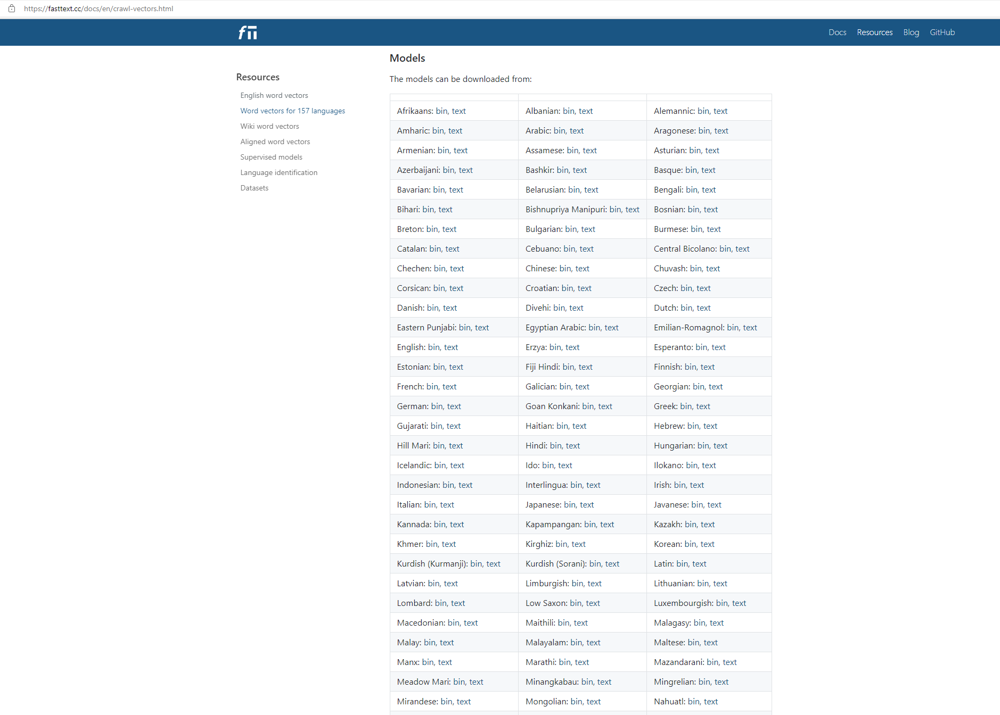

```{r setup, include=FALSE}
knitr::opts_chunk$set(echo = TRUE, warning = FALSE, error = FALSE, message = FALSE)

library(tidyverse)
```


## Plan for i dag:

 - Forbehandling av tekst
 - Tokenisering og n-grams
 - Vektorisering av tekst
 - Word embeddings

## Forbehandling av tekst

Dokumenter må klargjøres før vi kan analysere dem. 

 - Fjerne stoppord
 - Fjerne punktsetting og symboler
 - Fjerne tall
 - Sette alt liten bokstav
 - Stemming og lemmatisering
 - Fjerne svært sjeldne ord

Og ikke minst...

 - **Tokenisering**: Enhetene vi splitter teksten inn i.

## Forbehandling av tekst

```{r, out.width="70%", fig.align="center", echo = FALSE}
knitr::include_graphics("./figurer/text_preprocessing.png")
```

# Tokenisering og n-grams

## Tokenisering

 - Enhetene: Dokumenter (bøker, rapporter, tweeter, setninger...)
 - Variablene: Tokens (ord, bokstaver, setninger...)

<br>

**Eksempel med setninger som dokument og ord som variabler:**

| **Dokument**                          | vi | har | sett | havet | er | enormt | større | enn | begriper |
|---------------------------------------|----|-----|------|-------|----|--------|--------|-----|----------|
| vi har sett havet vi                  |    |     |      |       |    |        |        |     |          |
| havet er enormt                       |    |     |      |       |    |        |        |     |          |
| større enn vi begriper                |    |     |      |       |    |        |        |     |          | 


## Flere sangtekster

Fra 

```{r,  out.width="20%", echo = FALSE, fig.show="hold"}

```

Til

```{r,  out.width="20%", echo = FALSE, fig.show="hold"}

```

## Flere sangtekster

```{r, echo = FALSE}
karpe <- read_rds("https://www.dropbox.com/s/81plloytik3posr/karpe.rds?dl=1")
```

```{r, echo = FALSE}
head(karpe)
```

## Pakker vi skal jobbe med i dag

```{r}
library(tidyverse)
library(tidytext)
library(tidyr)
library(fastTextR)
```

<br>

```{r, out.width="100%", echo = FALSE}
knitr::include_graphics("./figurer/libraries.png")
```

## Tokenisering

```{r, out.width="100%", echo = FALSE}
knitr::include_graphics("./figurer/tokenizing.jpeg")
```

## n-grams

*n-grams*: Hvor mange bokstaver/ord består en token av?

**Unigram:** Deler tekst inn i ett og ett ord.

```{r}

karpe %>%
  unnest_tokens(input = tekst, # Hvilken variabel vi henter teksten fra
                output = ord, # Hva den nye variabelen kalles
                token = "words") %>% # Dersom vi ønsker unigram 
  head(4) # Gir oss de tre første radene i datasettet

```

## n-grams

 - Antakelsen: Rekkefølgen på ordene spiller ingen rolle.
 - Men hva om den gjør det? (F. eks. fornavn og etternavn).

**Bigram:** Deler tekst inn i to og to ord.

```{r}

karpe %>%
  unnest_tokens(input = tekst, 
                output = bigram, 
                token = "ngrams",
                n = 2) %>% # Dersom vi ønsker bigrams
  head(3) # Gir oss de fem første radene i datasettet

```

## n-grams

**Trigram:** Deler tekst inn i tre og tre ord.

```{r}

karpe %>%
  unnest_tokens(input = tekst, 
                output = trigram,
                token = "ngrams",
                n = 3) %>% # Dersom vi ønsker trigrams
  head(5) # Vis de fem første radene i datasettet

```

## n-grams{.smaller}

**For å fjerne stoppord fra n-grams:**

```{r, echo = FALSE}

karpe_bigrams <- karpe %>%
  unnest_tokens(input = tekst, 
                output = bigram, 
                token = "ngrams",
                n = 2)

```

```{r}

bigrams_separated <- karpe_bigrams %>%
  separate(bigram, c("ord1", "ord2"), 
           # Separer variabel "bigram" inn i to variabler, "ord1" og "ord2"
           sep = " ") # Separerer på mellomrom

stoppord <- stopwords::stopwords("Norwegian") 
# Finner norske stoppord fra "stopwords" pakken

bigrams_filtered <- bigrams_separated %>%
  filter(!ord1 %in% stoppord) %>% 
  # Filtrerer ut stoppord fra variabel "ord1" (utropstegn betyr "ikke")
  filter(!ord2 %in% stoppord) 
  # Filtrerer ut stoppord fra variabel "ord2"

bigrams_filtered %>%
  head(3)

```

## n-grams

n-grams er nyttig hvis vi for eksempel er interessert i: 

 - Egennavn (f. eks. Roe v. Wade, Erna Solberg)
 - Adjektiv fulgt av substantiv (nasjonal støtte, nasjonal krise)
 - Adverb eller negasjoner fulgt av verb (ganske bra, ikke like)

Men vi skal også være obs ...

## n-grams{.smaller}

**Med n-grams blir det mange unike tokens, og vi får fort ekstremt mange variabler.**

*Curse of dimensionality*: Hvis vi har `k > n`, altså flere variabler enn vi har observasjoner, får vi trøbbel med analysene våre.

 - Overtilpasning av data (overfitting)

```{r, eval = FALSE}

karpe_bigram_plot <- karpe_bigrams %>% # Lager en ny dataframe for å plotte
  count(titler, bigram) %>% # Teller opp antall ord per sangtittel
  group_by(titler) %>% # Grupperer etter sangtittel og...
  slice_max(n, n = 5) %>% # Tar ut de ordparene som er oftest brukt per sangtittel
  ungroup() # Avgrupperer for å dataframen tilbake til normal

karpe_bigram_plot %>%
  ggplot(aes(x = n, y = bigram, 
             # Setter ord på y-aksen og antall ganger ordet dukker opp på x-aksen
             fill = titler)) + # Gir farge til søylene etter sangtittel
  geom_bar(stat = "identity") + # Lager et søylediagram med y-aksen som skala (stat = "identity")
  facet_wrap(~ titler, ncol = 4, scales = "free") + 
  # Lager et mindre plot per sangtittel, fordeler dem i fire kolonner, og lar y-aksen varierere uavhengig av de andre plottene
  labs(x = "", y = "") + # Fjerner alle labels på x- og y-aksen
  theme_bw() + # Gjør bakgrunnen hvit
  theme(legend.position = "none") # Fjerner info på hva fargene indikerer

```

## n-grams

```{r, echo = FALSE}

karpe_bigram_plot <- karpe_bigrams %>% # Lager en ny dataframe for å plotte
  count(titler, bigram) %>% # Teller opp antall ord per sangtittel
  group_by(titler) %>% # Grupperer etter sangtittel og...
  slice_max(n, n = 5) %>% # Tar ut de ordparene som er oftest brukt per sangtittel
  ungroup() # Avgrupperer for å dataframen tilbake til normal

karpe_bigram_plot %>%
  ggplot(aes(x = n, y = bigram, 
             # Setter ord på y-aksen og antall ganger ordet dukker opp på x-aksen
             fill = titler)) + # Gir farge til søylene etter sangtittel
  geom_bar(stat = "identity") + # Lager et søylediagram med y-aksen som skala (stat = "identity")
  facet_wrap(~ titler, ncol = 4, scales = "free") + 
  # Lager et mindre plot per sangtittel, fordeler dem i fire kolonner, og lar y-aksen varierere uavhengig av de andre plottene
  labs(x = "", y = "") + # Fjerner alle labels på x- og y-aksen
  theme_bw() + # Gjør bakgrunnen hvit
  theme(legend.position = "none") # Fjerner info på hva fargene indikerer

```

 - En løsning kan være å inkludere en blanding av unigram, bigram og trigram.

## n-grams (og forbehandling generelt)

**Analysen kan være sensitiv til forbehandlingsvalg**

 - Dette gjelder ikke bare n-grams, men inkluderer andre forbehandlingssteg, som fjerning av tall og stoppord.

```{r,  out.width="60%", fig.align="center", echo = FALSE, fig.show="hold"}
knitr::include_graphics("./figurer/topic_model_preprocess_sensitivity.PNG")
```

Denny & Spirling (2018) foreslår en framgangsmåte for å teste sensitivitet til forbehandlingsvalg med pakken `preText`.


## `preText`

 - Finne "outliers" - hvor ulik blir en tekst de andre tekstene med en viss preprosessering?
 - Bruker en såkalt "distance metric", som vi skal se mer på senere i emnet.
 - Rangerer dokumentparene som er mest ulike og genererer *preText scores* utfra dette.
 - Kan dermed lage en regresjonslikning for å måle hvilket preprosesseringssteg som har mest innvirkning på tekstene.

$preText score_i = β_0 + β_1Punctuation_i + β_2Numbers_i$ 
$+ β_3Lowercase_i + β_4Stem_i + β_5Stop Words_i +$
$β_6N-Grams_i + β_7Infrequent Terms_i + ε_i$


# Vektorisering og word embeddings

## Vektorisering{.smaller}

 - Enhetene er dokumenter, variablene er tokens. Hva er verdiene?
 - Kan være for eksempel:
    - bag of words (sekk av ord): antall ganger et ord forekommer per dokument
    - tf-idf: et vektet antall ganger ord forekommer per dokument
    - **word embeddings** (innebygde ord?)
    
**Eksempel på vektorisering med sekk av ord:**

| **Dokument**                          | vi | har | sett | havet | er | enormt | større | enn | begriper |
|---------------------------------------|----|-----|------|-------|----|--------|--------|-----|----------|
| vi har sett havet vi                  |  2 |  1  |   1  |   1   | 0  |    0   |   0    |  0  |    0     |
| havet er enormt                       |  0 |  0  |   0  |   1   | 1  |    1   |   0    |  0  |    0     |
| havet er større enn vi begriper       |  1 |  0  |   0  |   1   | 1  |    0   |   1    |  1  |    1     | 


## Word embeddings

Grimmer, Roberts & Stewart (2022, p. 79): "The core insight of *distributional representations* is to represent a word as a *dense* vector in a low-dimensional space learned from unlabeled data."

Med andre ord: 

 - Vi unngår å måtte lage datasett med ekstremt mange variabler (også kalt "dimensjoner") (low-dimensional space).
 - Dette er fordi vi representerer ord annerledes slik at vi unngår mange nuller i kolonnene (dense vector).
 - Siden algoritmen er ikke-veiledet ("unsupervised"), så trenger vi ikke ferdig-klassifisert data (labeled data).
 - Algoritmen lærer utfra tanken om at et ords verdi kan representeres utfra ordfordelingen den opptrer i (distributional representations).


## Word embeddings

Fordelingshypotesen: Ord som opptrer i samme kontekst har samme mening. 
 - "You shall know a word by the company it keeps" (Firth, 1957)

Ordene plasseres i et vektorrom (*vector space*) med like mange dimensjoner som vi har "kontekster", og måler ordenes retning etter hvor hyppig de opptrer i samme kontekst.

```{r,  out.width="60%", fig.align="center", echo = FALSE, fig.show="hold"}

```

## Tre fordeler med word embeddings

**1. De gir et estimat på likhet.**

I en vektorrommet vil ord med liknende mening peke i samme retning, og stå i forhold til nabo-ord.

```{r,  out.width="60%", fig.align="center", echo = FALSE, fig.show="hold"}
knitr::include_graphics("./figurer/king_queen.png")
```

## Tre fordeler med word embeddings{.smaller}

**2. De muliggjør automatisk generalisering.**

Vi trenger ikke ha alle ordene i vårt datasett, siden word embeddings gjør at vi automatisk vet hvilke ord som likner.

For eksempel: 

 - Vi ønkser å bruke et datasett på twitterutsagn under koronapandemien for å hvordan positivitet og negativitet endrer seg mellom kommuner.
 - Datasettet har 1000 rader (dvs. observasjoner, altså dokumenter, som i vårt tilfelle er tweeter).
 - Ordet "fantastisk" dukker aldri opp i tweetene, men det gjør ordet "bra".
 - Vi trener word embeddings på hele den norske Wikipedia. Modellen skjønnet at ordene "bra" og "fantastisk" likner hverandre.
 - Vi kan trekke linjen at når ordet "bra" regnes som positivt, så gjør også ordet "fantastisk" det.

## Tre fordeler med word embeddings

**3. De kan (til dels) måle et ords mening.**

 - Mening i dette tilfellet betyr at ordene dukker opp i samme kontekst.
 - Slik kan vi vurdere variasjon i mening (f. eks. mellom land eller over tid).

<br>

State of the Union taler (Grimmer et al., 2022):

 - *Manifacturing* før 1960: exportation, oil-related, energy-intensive, import/export, defense-related
 - *Manifacturing* etter 1960: retooling, jobs, offshoring, outsources, globalized, low-skilled, retraining


## Word embeddings - datasett

<div class="columns-2">

 - Vi kan lage egne datasett med word embeddings.
 - Disse er gjerne trent på veldig store mengder tekst.
 - Vi kan enten lage egne datasett med word embeddings, eller bruke allerede eksisterende data.
 

```{r,  out.width="80%", fig.align="center", echo = FALSE, fig.show="hold"}
knitr::include_graphics("./figurer/large_archive.jpg")
```

</div>


## Word embeddings - datasett

Designvalg i word embeddings:

1. **Datakilde:** Word embeddings bør være trent på tekst som er innenfor samme "domenefelt".
2. **Størrelse på kontekstvindu:** Hva som menes med "nærliggende" ord må defineres.
3. **Dimensjonalitet:** Flere dimensjoner gir mer kompleksitet, typisk har vi et sted mellom 50 og 500.
4. **Valg av algoritme:**
    - Latent semantisk analyse
    - Nevrale ord-embeddings (continous bag of words (*CBOW*) og skipgram-modellen)
    - Ferdigtrente embeddings (`word2vec`, `GloVe`, `fastText`)


## Lager word embeddings med `fastText`

```{r, echo = FALSE}

# Litt preprosessering

stoppord_boundary <- str_c("\\b", stoppord, "\\b", 
                           collapse = "|") 

prepp_tekst <- function(data, tekstvar){
  
  data <- data %>%
    mutate(tekst = str_to_lower(tekst),
           tekst = str_replace_all(tekst, "[0-9]+", ""),
           tekst = str_replace_all(tekst, ",", " "),
           tekst = str_replace_all(tekst, "\\.", " "),
           tekst = str_squish(tekst),
           tekst = str_replace_all(tekst, "\\b\\w{1,1}\\b", ""),
           tekst = str_replace_all(tekst, stoppord_boundary, ""),
           tekst = str_replace_all(tekst, "[:punct:]", "")) %>%
  return(data)
  
}

karpeprepp <- prepp_tekst(data = karpe, tekstvar = tekst)

karpetekster <- tempfile()
writeLines(text = karpeprepp %>% pull(tekst), con = karpetekster)

```

```{r}

ft_cbow <- ft_train(karpetekster, 
                    type = "cbow",
                    control = ft_control(window_size = 5L))

ft_skipgram <- ft_train(karpetekster, 
                        type = "skipgram",
                    control = ft_control(window_size = 5L))

```


## Lager word embeddings med `fastText`

```{r}

ft_word_vectors(ft_cbow, c("lille", "sminke", "hei"))[,1:3]

```
## Lager word embeddings med `fastText`

Bruker `ft_nearest_neighbors` for å finne hvilke ord som likner mest.

```{r, echo = FALSE}

fluidPage(
    textInput("ord", "Input", "")
  )

renderTable({
    tibble(ord = names(ft_nearest_neighbors(ft_cbow, input$ord, k = 5L)),
           score = ft_nearest_neighbors(ft_cbow, input$ord, k = 5L))
})


```

## Lager word embeddings med `fastText`

Synes du det var en god modell?

## Word embeddings med ferdigtrent data fra `fastText`

```{r,  out.width="100%", fig.align="center", echo = FALSE}

```

## Word embeddings med ferdigtrent data fra `fastText`

```{r}

pretrained <- ft_load("./data/cc.no.300.bin") # Dette datasettet var for stort til å legge i Dropbox.
# Hvis du ønsker å laste ned ferdigtrente word embeddings til din PC, kan du finne Fasttext sine her: https://fasttext.cc/docs/en/crawl-vectors.html

```

```{r, echo = FALSE}

fluidPage(
    textInput("word", "Input", ""),
    verbatimTextOutput("value")
  )

renderTable({
    tibble(ord = names(ft_nearest_neighbors(pretrained, input$word, k = 5L)),
           score = ft_nearest_neighbors(pretrained, input$word, k = 5L))
})

```


## Hvordan aggreggere opp fra ord til dokument?

 - Smooth Inverse Frequency (SIF): Ta gjennomsnittet av word embeddings for hvert ord i dokumentet.
 - `doc2vec`: Finner representasjoner på avsnittsnivå.
 - Dyplæringsalgoritmer, f. eks. RNN (tilbakevendende nevralt nettverk, *recurrent neural network*)


## Validering av word embeddings

 - Vurder utfra din egen problemstilling - hvor god er tekstrepresentasjonen for *din* analyse?
 - Kan vurdere hvor mye ordene likner på hverandre utfra dokumentmassen med ordlikhetsanalyser, f. eks. *cosine*.
 - Kan bruke menneskekodere for å validere hvor vidt de helst velger maskin- eller menneskevalgte ord som mest likt et gitt ord.

## Fronten i word embeddings

**Kontekstualisert word embedding**

 - BERT (Bidirectional Encoder Representations from Transformers)
 - GPT-3 (Generative Pre-trained Transformer)

Men: Krever enormt mye prosessorkraft, og kan både være dyrt (kjører gjerne modellen i skyen) og tidkrevende (dager, uker eller til og med måneder).


## Takk for i dag!

