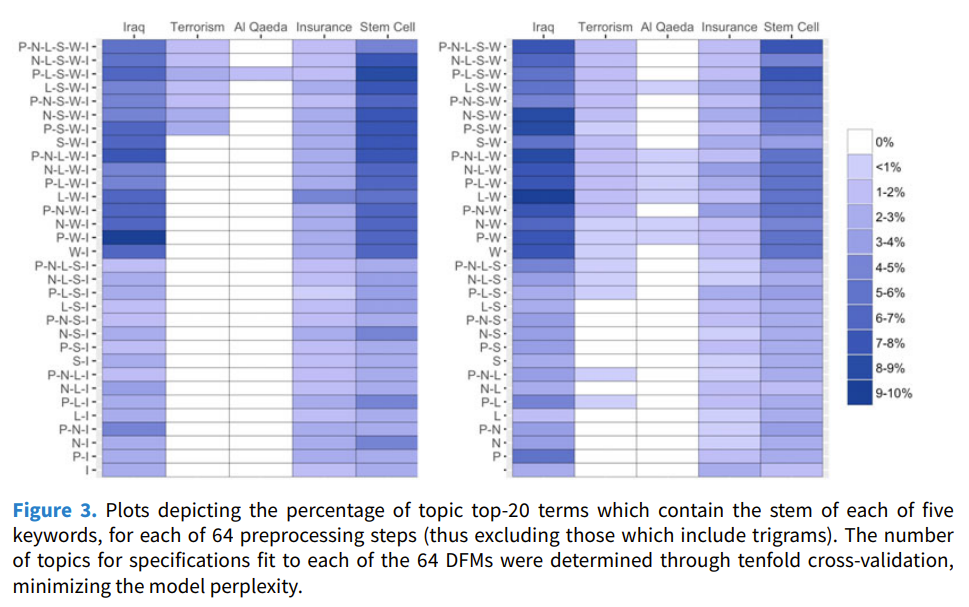

<font size=12>STV2022 -- Store tekstdata</font></br></br>
<p style='font-size:10;color:#79B47C'>[04] Forbehandling av tekst 2</p></br>
{width=50%} 

Solveig Bjørkholt
<font size=6>\<solveig.bjorkholt@stv.uio.no\></font></br>


```{r setup, include=FALSE}
knitr::opts_chunk$set(echo = TRUE, warning = FALSE, error = FALSE, message = FALSE)
```


# Plan for i dag:

 - Litt repetisjon på anskaffelse av tekst
 - Rydde og strukturere data (`stringr` og *regex*)
 - Forbehandling - hvilke valg bør man ta?
 - Tokenisering av tekst
 - Vektorisering av tekst og word embeddings

## Pakker vi skal jobbe med i dag

```{r}
library(tidyverse) # Grunnleggende R-funksjoner
library(broom) # For å rydde opp i modell-output
library(rvest) # For å skrape informasjon fra nettet
library(tidytext) # Grunnleggende R-funksjoner for å jobbe med tekst
library(quanteda) # Mange metodiske verktøy for å jobbe med tekst
library(quanteda.textstats) # Brukes for å beregne distanse-mål
library(fastTextR) # For å jobbe med word embeddings
```

<br>
<br>

```{r, out.width="100%", echo = FALSE}
knitr::include_graphics("./figurer/libraries.png")
```


# Laste inn data{data-background=./figurer/virksommeord.png data-background-position="bottom" data-background-size=70%}

Vi bruker data fra Martin sin kravling på http://virksommeord.no/
 
---

**Martin lastet ned alle `.html`-filene med *tale* i URL-en.**

```{r en_kravler, eval=FALSE, echo=TRUE}

# Laster inn pakke for kravling
library(Rcrawler)


Rcrawler("http://virksommeord.no/", # Nettsiden vi skal kravle
         DIR = "./crawl",           # mappen vi lagrer filene i
         no_cores = 4,              # kjerner for å prosessere data
         dataUrlfilter = "/tale/",  # subset filter for kravling
         RequestsDelay = 2 + abs(rnorm(1)))


```

 - Gå inn på Canvas
 - Last ned `virksommeord.zip` og legg i en mappe på din PC
 - Unzip filen
 - Gå inn i R og sett working directory til mappen der du unzippet filen

. . .

```{r, eval = FALSE}
setwd("C:/MinPC/Dokumenter/STV2022/forelesning04/")
```

---

### Å laste ned data fra en `.html`-fil

```{r}

library(rvest) # Pakken som gjør at man kan jobbe med html-filer i R

html_fil <- read_html("./data/virksommeord/1 .html")

overskrift <- html_fil %>% 
  # Les inn den første filen fra mappen
  html_node("h1") %>% 
  # Finn alle nodene som inneholder "h1" (h1 for "heading 1")
  html_text() 
  # Hent ut teksten fra disse nodene

metadata <- html_fil %>%
  html_node("#left-of-sidebar > div.main-content > div.tale-header > ul") %>%
  html_text()

tale <- html_fil %>%
  html_nodes("p") %>%
  # Finn alle nodene som inneholder "p" (p for "paragraph")
  html_text()

```

---

```{r}
overskrift
metadata
tale
```

---

### For-løkke: Laster inn data fra *alle* .html-filene i mappen

```{r}

filer <- list.files("./data/virksommeord/", full.names = TRUE)
# List opp alle filene i mappen virksommeord, med full filsti

overskrifter <- list() # Lag en tom liste som vi kan fylle opp
metadata <- list()
taler <- list()

for (i in seq_along(filer)) { # For hver enhet (i) i objektet filer...
  
  html_fil <- read_html(filer[i]) # ... les inn nr. i av filene med read_html()
  
  overskrifter[i] <- html_fil %>% # ... og i overskrift-listen, fyll opp plass nr. i med ...
    html_node("h1") %>% # ... den første noden som har tag "h1"
    html_text() # ... sin tekst
  
  metadata[i] <- html_fil %>%
    html_node("#left-of-sidebar > div.main-content > div.tale-header > ul") %>%
    html_text()
  
  taler[i] <- read_html(filer[i]) %>%
    html_nodes("p") %>% 
    html_text() %>%
    str_c(., collapse = " ") # Her limer vi sammen alle avsnittene til en tekst med " " som mellomrom
  
}

```

---

```{r}

taler_df <- tibble(overskrift = overskrifter, # Lag en variabel kalt "overskrift" med innholdet fra "overskrifter"-objektet
                   metadata = metadata,
                   tekst = taler) %>% # Lag en variabel kalt "tekst" med innholdet fra "taler"-objektet
  unnest(cols = c(overskrift, metadata, tekst)) # Gjør dem om fra liste til vanlige vektorer

# write.table(taler_df, file = "./data/taler_df.txt", fileEncoding = "UTF-8") # For å lagre lokalt

```

---

Om du ikke får til for-løkken, bruk:

```{r, eval = FALSE}

taler_df <- read.table("https://www.dropbox.com/s/2dkmn0z64z1b4rt/taler_df.txt?dl=1", 
                       fileEncoding = "UTF-8") %>%
  as_tibble()

```

OBS: kan ta litt tid + krever internett.


## Det endelige datasettet

 - Hva er analyseenheten her?

```{r}
taler_df
```


# Forbehandling av tekst

<div class='left' style='float:left;width:65%'>

- Del 1: Rydde og strukturere
  - tidyverse-funksjoner + *regex*


- Del 2: Preprosesseringsvalg
  - Tokenisering
  - Sette til liten bokstav
  - Fjerne punktsetting og symboler
  - Fjerne tall
  - Fjerne stoppord
  - Stemming og lemmatisering
  - Fjerne svært sjeldne ord
  

 - Del 3: Vektorisering (fra tekst til tall)
   - Sekk med ord
   - TF-IDF
   - Word embeddings

</div>

<div class='right' style='float:right;width:35%'>

```{r, out.width="100%", fig.align="center", echo = FALSE}
knitr::include_graphics("./figurer/text_preprocessing.png")
```

</div>


## Rydde og strukturere

 - Vi må ofte rydde og strukturere i tekst for å få det datasettet vi trenger
 - *regex* er spesielt nyttig i slike tilfeller

. . .

**Spesielle tegn i regex**

| **Tegn** | **Betydning**                                                |
|----------|--------------------------------------------------------------|
| \        | Brukes for å omgå et tegn som betyr noe i regex              |
| ^        | Starten på en streng                                         |
| $        | Slutten på en streng                                         |
| .        | Passer til et hvilket som helst tegn                         |
| \|       | Passer til forrige ELLER neste tegn/gruppe                   |
| ?        | Passer null eller én av de forrige                           |
| *        | Passer til null, én eller flere av de forrige                |
| +        | Passer til en eller fler av det forrige                      |
| ( )      | En gruppe tegn                                               |
| [ ]      | Passer til et sett av tegn                                   |
| { }      | Passer til et spesifikt antall av forekomster av det forrige |


---

 - Bruker en blanding av `stringr`-pakken og *regex* for å opprette nye variabler.

. . .

```{r}

taler_df <- taler_df %>%
  
  mutate(taler = str_extract(metadata, "[A-ZÆØÅa-zæøå]+\\s+[A-ZÆØÅa-zæøå]+"), 
         # To ord med først stor bokstav så små boksaver og whitespace (mellomrom) mellom
         
         dato = str_extract(metadata, "([0-9]+\\. [a-z]+)? [0-9]{4}"), 
         # Henter ut tall fulgt av punktum, så bokstaver, så fire tall (f. eks. 1. desember 2020)
         
         aar = str_extract(dato, "[0-9]{4}"), 
         # Henter ut fra variabelen "dato" første segment med fire tall etter hverandre
        
         tekst = str_remove(tekst, "Kilde: "), 
         # Overskriver tekst-variabelen, og fjerner første gang "Kilde: " dukker opp fra alle tekstene.
         
         tekst = str_squish(tekst),
         overskrift = str_squish(overskrift)) 
         # Fjerner all "støy" fra teksten (f. eks. linjeskift \n)

```

## Noen `stringr` funksjoner

```{r, eval = FALSE}

eksempel <- "  Pakken stringr har mange nyttige funksjoner.   \n De kan brukes for å rydde og strukturere tekst."

substr(eksempel, 1, 5) # Hent ut deler av en streng (her fra posisjon 1 til posisjon 5)

str_length(eksempel) # Sjekk hvor mange tegn som finnes i en streng

str_c(eksempel, " Blant annet.") # Putt sammen to strenger. (Samme funksjon som paste og paste0)

str_to_upper(eksempel) # Gjør alle bokstaver til store bokstaver
str_to_lower(eksempel) # Gjør alle bokstaver til små bokstaver
str_to_title(eksempel) # Gi alle ord en stor forbokstav og deretter små bokstaver
str_to_sentence(eksempel) # Gi alle setninger en stor forbokstav og deretter små bokstaver

str_detect(eksempel, "nyttige") # Sjekk om mønsteret er en del av strengen

str_subset(eksempel, "nyttige") # Hent ut de strengene fra listen som har et spesifikt mønster

str_locate(eksempel, "nyttige") # Undersøk hvor i en streng et spesifikt mønster er

str_extract(eksempel, "nyttige") # Hent ut kun deler av strengen som passer til et spesifikt mønster

str_remove(eksempel, "nyttige") # Fjern fra en streng alle steder som passer til et spesifikt mønster

str_replace(eksempel, "nyttige", "vanskelige") # Erstatt deler av en streng med noe annet

str_trim(eksempel) # Fjern whitespace fra foran og bak en streng

str_squish(eksempel) # Fjern whitespace fra foran, bak og inni en streng

str_split(eksempel, "\n") # Lag en liste av strenger ved å splitte dem på et spesifikt mønster (her linjeskift, \n)

```


# Preprosesseringsvalg

Hvilke av disse burde vi gjøre? `r emo::ji("thinking")`

- Sette til liten bokstav
- Fjerne punktsetting og symboler
- Fjerne tall
- Fjerne stoppord
- Stemming og lemmatisering
- Fjerne svært sjeldne ord


## Analysen kan være sensitiv til forbehandlingsvalg

```{r,  out.width="60%", fig.align="center", echo = FALSE, fig.show="hold"}

```

<br>

Denny & Spirling (2018) foreslår en framgangsmåte for å teste sensitivitet til forbehandlingsvalg:


## `preText`

Finner "outliers" - hvor ulik blir en tekst de andre tekstene med en viss preprosessering?

- Bruker en "distance metric" (som vi skal se mer på senere i emnet)
- Rangerer dokumentparene som er mest ulike og genererer *preText scores* utfra dette.
- Kan dermed lage en regresjonslikning for å måle hvilket preprosesseringssteg som har mest innvirkning på tekstene.

<!-- $preText score_i = β_0 + β_1Punctuation_i + β_2Numbers_i$ -->
<!--   $+ β_3Lowercase_i + β_4Stem_i + β_5Stop Words_i +$ -->
<!--   $β_6N-Grams_i + β_7Infrequent Terms_i + ε_i$ -->

. . .

Dessverre er ikke `preText` tilgjengelig lenger, men vi kan bruke intuisjonen videre:

 - Hvor mye endrer analysen seg når man gjør et visst preprosesseringssteg?


## To ulike preprosesseringssteg:

<div class='left' style='float:left;width:49%'>

<small>

 - Liten bokstav: Ja
 - Fjerne punktsetting og symboler: Ja
 - Fjerne tall: Ja
 - Fjerne stoppord: Ja
 - Stemming: Ja
 - Fjerne sjeldne ord: Ja (minst 15 %)

</small>

```{r}

taler_dfm1 <- taler_df %>% 
  group_by(overskrift, aar) %>% # Grupperer på overskrift og aar (sistnevnte fordi vi skal bruke aar senere)
  unnest_tokens(., # Fra det gjeldende datasettet...
                output = token, # ... lag tokens kalt "token"
                input = tekst, # ... fra variabelen kalt "tekst"
                token = "words", # ... og la dette være unigram 
                to_lower = TRUE, # Sett alle bokstaver til små
                stopwords = quanteda::stopwords("no"), # Fjern stoppordene i denne stoppord-lista
                strip_punct = TRUE, # Fjern punktsetting
                strip_numeric = TRUE) %>% # Fjern tall
  mutate(token = quanteda::char_wordstem(token, language = "norwegian")) %>% # Lag ord-stammer
  count(token) %>% # Tell opp frekvens av token per dokument
  cast_dfm(., document = overskrift, term = token, value = n) # Lag en document feature matrix

taler_dfm1 <- dfm_trim(taler_dfm1, min_docfreq = 0.15, docfreq_type = "prop") # Fjern ord som dukker opp svært sjelden

```

</div>

<div class='right' style='float:right;width:49%'>

<small>

 - Liten bokstav: Ja
 - Fjerne punktsetting og symboler: Ja
 - Fjerne tall: Ja
 - <font style='color:#FFAF00;font-weight:bold'>Fjerne stoppord: Nei</font>
 - Stemming: Ja
 - Fjerne sjeldne ord: Ja (minst 15 %)
 
</small>


```{r}

taler_dfm2 <- taler_df %>% 
  group_by(overskrift, aar) %>% 
  unnest_tokens(., 
                output = token, 
                input = tekst,
                token = "words",
                to_lower = TRUE,
                #stopwords = quanteda::stopwords("no"),
                strip_punct = TRUE,
                strip_numeric = TRUE) %>% 
  mutate(token = quanteda::char_wordstem(token, language = "norwegian")) %>% 
  count(token) %>% 
  cast_dfm(., document = overskrift, term = token, value = n)

taler_dfm2 <- dfm_trim(taler_dfm2, min_docfreq = 0.15, docfreq_type = "prop")

```

</div>

---

```{r, eval = FALSE}

# Lag to dataframes med informasjon om distanse mellom dokumenter og gi distanse-variabelen nye navn i hvert objekt for å kunne sette dem sammen
dist1 <- as.dist(textstat_dist(taler_dfm1)) %>% tidy() %>% rename(distance1 = distance)
dist2 <- as.dist(textstat_dist(taler_dfm2)) %>% tidy() %>% rename(distance2 = distance)

diff_data <- left_join(dist1, dist2, by = c("item1", "item2")) # Sett sammen de to dataframene

diff_data %>%
  mutate(differanse = distance1 - distance2) %>% # Lag en variabel med differansen mellom distansemålet i det første datasettet og i det andre
  group_by(item1) %>% # Grupper på første dokument
  summarise(gjennomsnittlig_differanse = mean(differanse)) %>% # Finn gjennomsnittlig differanse til de andre dokumentene
  mutate(item1 = fct_reorder(item1, desc(gjennomsnittlig_differanse))) %>% # Ranger slik at den med høyest differanse kommer øverst
  ggplot(aes(x = item1, y = gjennomsnittlig_differanse)) + # Plot dokument mot gjennomsnittlig differanse
  geom_segment(aes(x = item1, xend = item1,  # Lag et "lollipop"-diagram
                   y = 0, yend = gjennomsnittlig_differanse),  
               color="black") +
  geom_point(color = "blue", size = 2) +
  coord_flip() + 
  theme_bw()

```

## Gjennomsnittlig endring i distanse-mål med og uten stoppord {data-background=white}

```{r, echo = FALSE, fig.height=6.5, fig.width=7}

dist1 <- as.dist(textstat_dist(taler_dfm1)) %>% tidy() %>% rename(distance1 = distance)
dist2 <- as.dist(textstat_dist(taler_dfm2)) %>% tidy() %>% rename(distance2 = distance)

diff_data <- left_join(dist1, dist2, by = c("item1", "item2"))

diff_data %>%
  mutate(differanse = distance1 - distance2) %>%
  group_by(item1) %>%
  summarise(gjennomsnittlig_differanse = mean(differanse)) %>%
  mutate(item1 = fct_reorder(item1, desc(gjennomsnittlig_differanse))) %>%
  ggplot(aes(x = item1, y = gjennomsnittlig_differanse)) +
  geom_segment(aes(x=item1, xend=item1, y=0, yend=gjennomsnittlig_differanse), color="black") +
  geom_point(color = "blue", size=3 ) +
  labs(x = "", y = "Gjennomsnittlig endring") +
  coord_flip() + 
  theme_bw()

```

## Problemstillingsspesifikk sjekk

 - Hvor mye forskjellen ligger på, kommer også an på problemstillingen / forskningsspørsmålet og hypotesene
 - For eksempel:
 
. . .

"Hvor forskjellige er taler fra hverandre i ulike år?"

 - H1: Taler fra da Norge var nytt og selvstendig vil ha større forskjeller fra hverandre enn Norge som etablert nasjon.

. . .

```{r, eval = FALSE}

ant_taler <- taler_df %>%
  group_by(aar) %>%
  count() # Tell opp hvor mange dokumenter som opptrer innenfor hvert år

diff_data  %>% # Plot dette i et søylediagram
  left_join(taler_df, by = c("item1" = "overskrift")) %>%
  mutate(differanse = distance1 - distance2) %>%
  group_by(aar) %>% # Grupper på år og ...
  summarise(gjennomsnittlig_differanse = mean(differanse)) %>% # ... finn gjennomsnittlig differanse per år
  left_join(ant_taler, by = "aar") %>% # Få med informasjon om hvor mange taler det var det året
  ggplot(aes(gjennomsnittlig_differanse, aar)) +  
  geom_bar(stat = "identity") + 
  geom_text(aes(label = n, x = -10), color = "white") + # Plasser informasjonen om antall taler i søylen på søylediagrammet
  labs(x = "Gjennomsnittlig endring", y = "") +
  theme_bw()

```

## Gjennomsnittlig endring i distanse-mål med og uten stoppord per år {data-background=white}

```{r, echo = FALSE}

ant_taler <- taler_df %>%
  group_by(aar) %>%
  count()

diff_data  %>%
  left_join(taler_df, by = c("item1" = "overskrift")) %>%
  mutate(differanse = distance1 - distance2) %>%
  group_by(aar) %>%
  summarise(gjennomsnittlig_differanse = mean(differanse)) %>%
  left_join(ant_taler, by = "aar") %>%
  ggplot(aes(gjennomsnittlig_differanse, aar)) + 
  geom_bar(stat = "identity") + 
  geom_text(aes(label = n, x = -10), color = "white") +
  labs(x = "Gjennomsnittlig endring", y = "") +
  theme_bw()

```

# Tokensiering

```{r, out.width="100%", echo = FALSE}
knitr::include_graphics("./figurer/tokenizing.jpeg")
```

---

- Enhetene: Dokumenter (bøker, rapporter, tweeter, setninger...)
- Variablene: Tokens (ord, bokstaver, setninger...)

<br>

. . . 

**Eksempel med setninger som dokument og ord som variabler:**
  
| **Dokument**                          | vi | har | sett | havet | er | enormt | større | enn | begriper |
|---------------------------------------|----|-----|------|-------|----|--------|--------|-----|----------|
| vi har sett havet vi                  |    |     |      |       |    |        |        |     |          |
| havet er enormt                       |    |     |      |       |    |        |        |     |          |
| større enn vi begriper                |    |     |      |       |    |        |        |     |          | 

---

### Fjerning av stoppord med bigram

```{r}

bigrams_separated <- taler_df %>%
  ungroup() %>%
  unnest_tokens(input = tekst,
                output = bigram,
                token = "ngrams",
                n = 2) %>%
  separate(bigram, c("ord1", "ord2"), 
           # Separer variabel "bigram" inn i to variabler, "ord1" og "ord2"
           sep = " ") # Separerer på mellomrom

stoppord <- stopwords::stopwords("no") 
# Finner norske stoppord fra "stopwords" pakken

bigrams_filtered <- bigrams_separated %>%
  filter(!ord1 %in% stoppord) %>% 
  # Filtrerer ut stoppord fra variabel "ord1" (utropstegn betyr "ikke")
  filter(!ord2 %in% stoppord) 
# Filtrerer ut stoppord fra variabel "ord2"

bigrams_filtered %>%
  select(overskrift, ord1, ord2) %>%
  head(3)

```

# Vektorisering
  
 - Enhetene er dokumenter, variablene er tokens. Hva er verdiene?
 - Kan være for eksempel:
   - sekk med ord (bag of words)
   - TF-IDF
   - **word embeddings**

---

### Eksempel på vektorisering med sekk med ord:

Sekk med ord (bag of words, BoW)

Frekvensen av ord per dokument, dvs. antall ganger et ord forekommer per dokument.

<br>

| **Dokument**                          | vi | har | sett | havet | er | enormt | større | enn | begriper |
|---------------------------------------|----|-----|------|-------|----|--------|--------|-----|----------|
| vi har sett havet vi                  |  2 |  1  |   1  |   1   | 0  |    0   |   0    |  0  |    0     |
| havet er enormt                       |  0 |  0  |   0  |   1   | 1  |    1   |   0    |  0  |    0     |
| havet er større enn vi begriper       |  1 |  0  |   0  |   1   | 1  |    0   |   1    |  1  |    1     | 

```{r, echo = FALSE, eval = FALSE}
# kode for å finne antallet som vises manuelt i tabellen over
tibble(tekst = c("vi har sett havet vi", "havet er enormt", "havet er større enn vi begriper"),
       doc = c(1, 2, 3)) %>%
  group_by(doc) %>%
  unnest_tokens(input = tekst, output = ord, token = "words") %>%
  count(ord) 

```

---

### Eksempel på vektorisering med TF-IDF:

TF-IDF: (Term Frequency Inverse Document Frequency): 

Et vektet antall ganger ord forekommer per dokument.

<br>
  
| **Dokument**                          | vi   | har    | sett    | havet   | er       | enormt     | større    | enn    | begriper    |
|---------------------------------------|------|--------|---------|---------|----------|------------|-----------|--------|-------------|
| vi har sett havet vi                  |  0   |  0.16  |   0.16  |   0     | 0        |    0       |   0       |  0     |    0        |
| havet er enormt                       |  0   |  0     |   0     |   0     | 0.14     |    0.37    |   0       |  0     |    0        |
| havet er større enn vi begriper       |  0   |  0     |   0     |   0     | 0.07     |    0       |   0.18    |  0.18  |    0.18     | 


```{r, echo = FALSE, eval = FALSE}
# kode for å finne tf-idf som vises manuelt i tabellen over
tibble(tekst = c("vi har sett havet vi", "havet er enormt", "havet er større enn vi begriper"),
       doc = c(1, 2, 3)) %>%
  unnest_tokens(input = tekst, output = ord, token = "words") %>%
  group_by(doc) %>%
  add_count(ord) %>%
  ungroup() %>%
  bind_tf_idf(term = ord, document = doc, n = n)

```


## Word embeddings
  
Grimmer, Roberts & Stewart (2022, p. 79): "The core insight of *distributional representations* is to represent a word as a *dense* vector in a low-dimensional space learned from unlabeled data."

Med andre ord: 
  
 - Vi unngår å måtte lage datasett med ekstremt mange variabler (også kalt "dimensjoner") (low-dimensional space).
 - Fordi vi representerer ord annerledes slik at vi unngår mange nuller i kolonnene (dense vector).
 - Siden algoritmen er ikke-veiledet ("unsupervised"), så trenger vi ikke ferdig-klassifisert data (labeled data).
 - Algoritmen lærer utfra tanken om at et ords verdi kan representeres utfra ordfordelingen den opptrer i (distributional representations).


## Word embeddings

Fordelingshypotesen: Ord som opptrer i samme kontekst har samme mening. 

- "You shall know a word by the company it keeps" (Firth, 1957)

 - Ordene plasseres i et vektorrom (*vector space*) med like mange dimensjoner som vi har "kontekster", og måler ordenes retning etter hvor hyppig de opptrer i samme kontekst.

## {data-background="./figurer/vectorspace.jpg"}


## Tre fordeler med word embeddings

**1. De gir et estimat på likhet.**
  
I en vektorrommet vil ord med liknende mening peke i samme retning, og stå i forhold til nabo-ord.

```{r,  out.width="60%", fig.align="center", echo = FALSE, fig.show="hold"}
knitr::include_graphics("./figurer/king_queen.png")
```

---

**2. De muliggjør automatisk generalisering.**
  
  Vi trenger ikke ha alle ordene i vårt datasett, siden word embeddings gjør at vi automatisk vet hvilke ord som likner.

For eksempel: 
  
  - Vi ønkser å bruke et datasett på twitterutsagn under koronapandemien for å hvordan positivitet og negativitet endrer seg mellom kommuner.
- Datasettet har 1000 rader (dvs. observasjoner, altså dokumenter, som i vårt tilfelle er tweeter).
- Ordet "fantastisk" dukker aldri opp i tweetene, men det gjør ordet "bra".
- Vi trener word embeddings på hele den norske Wikipedia. Modellen skjønnet at ordene "bra" og "fantastisk" likner hverandre.
- Vi kan trekke linjen at når ordet "bra" regnes som positivt, så gjør også ordet "fantastisk" det.

---

**3. De kan (til dels) måle et ords mening.**
  
  - Mening i dette tilfellet betyr at ordene dukker opp i samme kontekst.
- Slik kan vi vurdere variasjon i mening (f. eks. mellom land eller over tid).

<br>

. . .

State of the Union taler (Grimmer et al., 2022):
  
 - *Manifacturing* før 1960: exportation, oil-related, energy-intensive, import/export, defense-related
 - *Manifacturing* etter 1960: retooling, jobs, offshoring, outsources, globalized, low-skilled, retraining


## Word embeddings - datasett

<div class='left' style='float:left;width:45%'>

- Vi kan lage egne datasett med word embeddings.
- Disse er gjerne trent på veldig store mengder tekst.
- Vi kan enten lage egne datasett med word embeddings, eller bruke allerede eksisterende data.

</div>

<div class='right' style='float:right;width:45%'>

```{r,  out.width="80%", fig.align="center", echo = FALSE}
knitr::include_graphics("./figurer/large_archive.jpg")
```

</div>

## Word embeddings - datasett
  
Designvalg i word embeddings:
  
1. **Datakilde:** Word embeddings bør være trent på tekst som er innenfor samme "domenefelt".
2. **Størrelse på kontekstvindu:** Hva som menes med "nærliggende" ord må defineres.
3. **Dimensjonalitet:** Flere dimensjoner gir mer kompleksitet, typisk har vi et sted mellom 50 og 500.
4. **Valg av algoritme:**
    - Latent semantisk analyse
    - Nevrale ord-embeddings (continous bag of words (*CBOW*) og skipgram-modellen)
    - Ferdigtrente embeddings (`word2vec`, `GloVe`, `fastText`)


## Lager word embeddings med `fastTextR`

Flere pakker for å lage word embeddings, f. eks. `word2vec`, `GloVe` og `fastTextR`

 - Eksempel med `fastTextR`
 - Obs: krever en spesiell form for preprosessering, se script fra forelesning for å se hvordan

```{r, echo = FALSE}

# Litt preprosessering

stoppord <- stopwords::stopwords("no") 
stoppord_boundary <- str_c("\\b", stoppord, "\\b", 
                           collapse = "|") 

prepp_tekst <- function(data, tekstvar){
  
  data <- data %>%
    mutate(tekst = str_to_lower(tekst),
           tekst = str_replace_all(tekst, "[0-9]+", ""),
           tekst = str_replace_all(tekst, ",", " "),
           tekst = str_replace_all(tekst, "\\.", " "),
           tekst = str_squish(tekst),
           tekst = str_replace_all(tekst, "\\b\\w{1,1}\\b", ""),
           tekst = str_replace_all(tekst, stoppord_boundary, ""),
           tekst = str_replace_all(tekst, "[:punct:]", "")) %>%
    return(data)
  
}

talerprepp <- prepp_tekst(data = taler_df, tekstvar = tekst)

taletekster <- tempfile()
writeLines(text = talerprepp %>% mutate(tekst = str_c(overskrift, tekst)) %>% pull(tekst), con = taletekster)

```

```{r}

ft_cbow <- ft_train(taletekster, 
                    min_count = 1L,
                    type = "cbow", # Finn word embedding med CBOW
                    control = ft_control(window_size = 10L)) # La modellen lære fra de fem nærmeste ordene

ft_skipgram <- ft_train(taletekster, 
                        type = "skipgram", # Finn word embeddings med skipgram
                        control = ft_control(window_size = 10L)) # La modellen lære fra de fem nærmeste ordene

```


## Lager word embeddings med `fastTextR`

 - Bruker `ft_word_vectors` for å finne målet på ordene.
 - Her for ordene "godt" og "norge" på dimensjon 1, 2, 3, 4, og 5.

. . .

```{r}

ft_word_vectors(ft_cbow, c("godt", "fint"))[,1:5]

```

## Lager word embeddings med `fastTextR`

 - Bruker `ft_nearest_neighbors` for å finne hvilke ord som likner mest.

. . .

```{r}
tibble(ord = names(ft_nearest_neighbors(ft_cbow, "fint", k = 5L)),
       score = ft_nearest_neighbors(ft_cbow, "fint", k = 5L))
```

. . .

Synes du dette virker som en god modell?

## Word embeddings med ferdigtrent data fra FastText

```{r,  out.width="90%", fig.align="center", echo = FALSE}
knitr::include_graphics("./figurer/fasttext_wordembed.PNG")
```

## Word embeddings med ferdigtrent data fra FastText

```{r}

pretrained <- ft_load("./data/cc.no.300.bin") 
# Hvis du ønsker å laste ned ferdigtrente word embeddings til din PC, kan du finne Fasttext sine her: https://fasttext.cc/docs/en/crawl-vectors.html

tibble(ord = names(ft_nearest_neighbors(pretrained, "norge", k = 5L)),
       score = ft_nearest_neighbors(pretrained, "norge", k = 5L))

```

<!-- ## Hvordan aggreggere opp fra ord til dokument? -->

<!-- - Smooth Inverse Frequency (SIF): Ta gjennomsnittet av word embeddings for hvert ord i dokumentet. -->
<!-- - `doc2vec`: Finner representasjoner på avsnittsnivå. -->
<!-- - Dyplæringsalgoritmer, f. eks. RNN (tilbakevendende nevralt nettverk, *recurrent neural network*) -->


## Validering av word embeddings

- Vurder utfra din egen problemstilling - hvor god er tekstrepresentasjonen for *din* analyse?

<br>

- Kan vurdere hvor mye ordene likner på hverandre utfra dokumentmassen med ordlikhetsanalyser, f. eks. *cosine*.
  
<br>

- Kan bruke menneskekodere for å validere hvor vidt de helst velger maskin- eller menneskevalgte ord som mest likt et gitt ord.

## Det nyeste innen word embeddings

**Kontekstualisert word embedding**
  
 - BERT (Bidirectional Encoder Representations from Transformers)
 - GPT-3 (Generative Pre-trained Transformer)

. . .

**Men:** Krever enormt mye prosessorkraft, og kan både være dyrt (kjører gjerne modellen i skyen) og tidkrevende (dager, uker eller til og med måneder).


# Takk for i dag :)

```{r, out.width="80%", fig.pos="bottom", echo = FALSE}

```
  