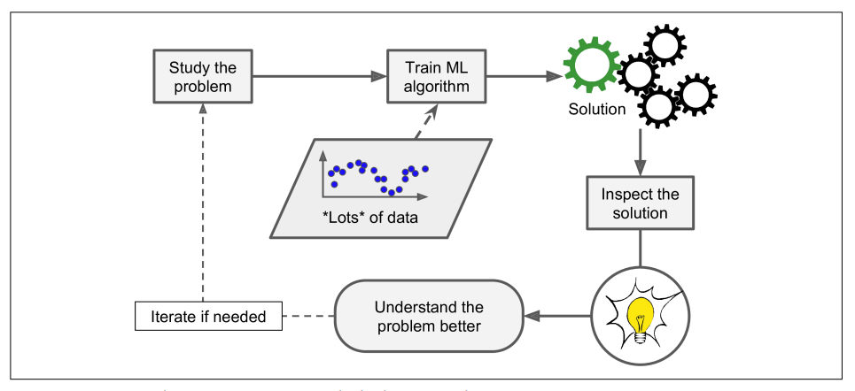
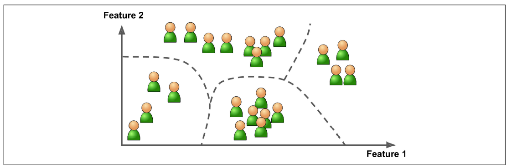
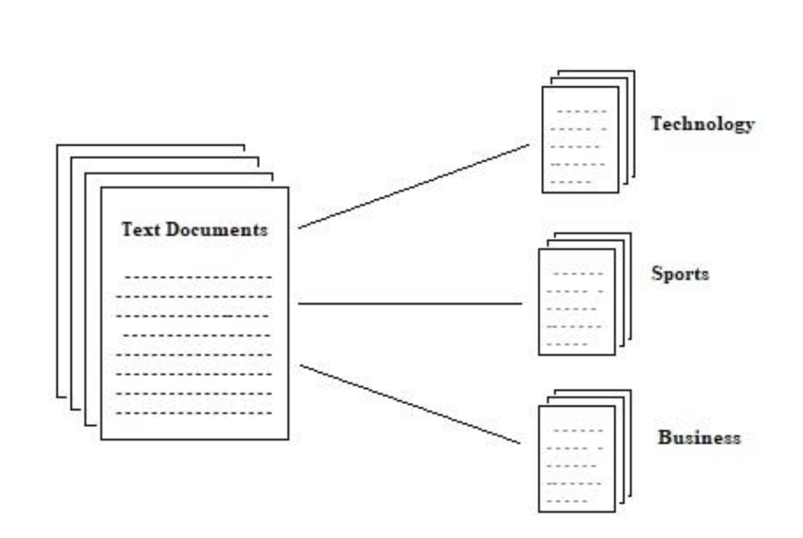
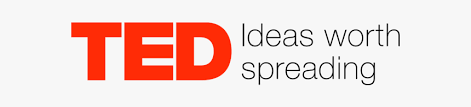
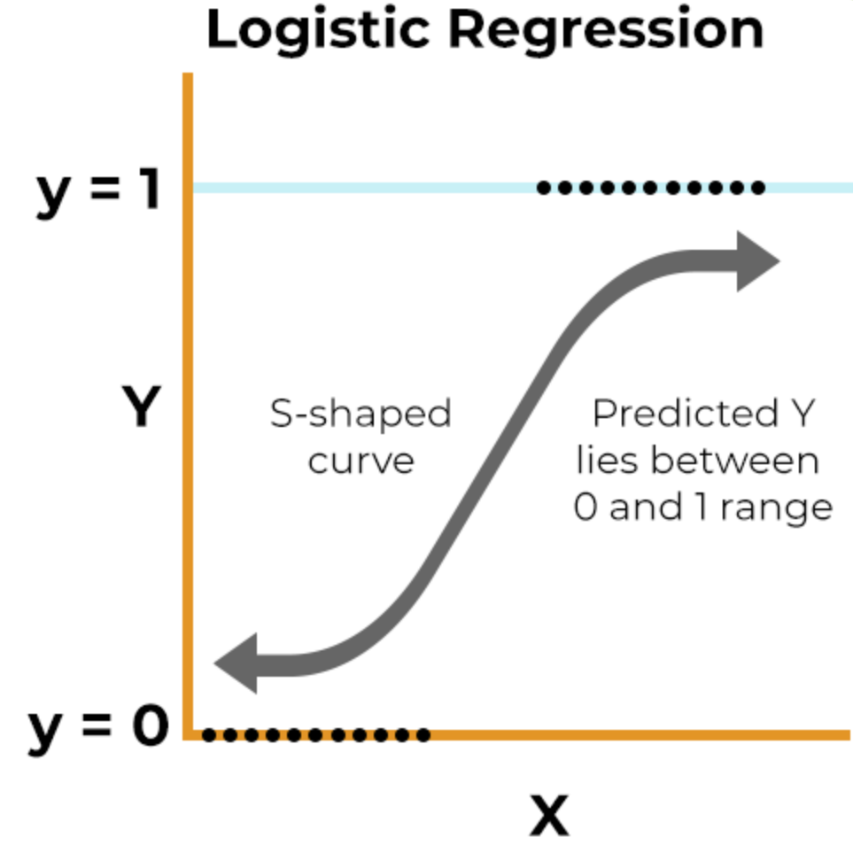
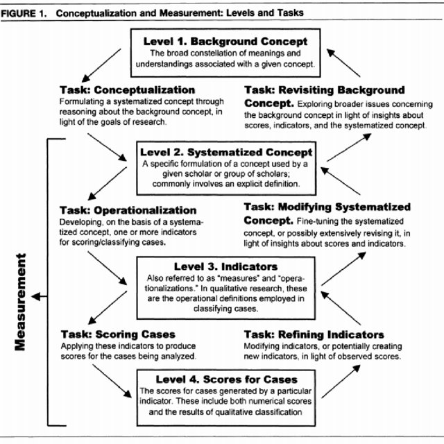
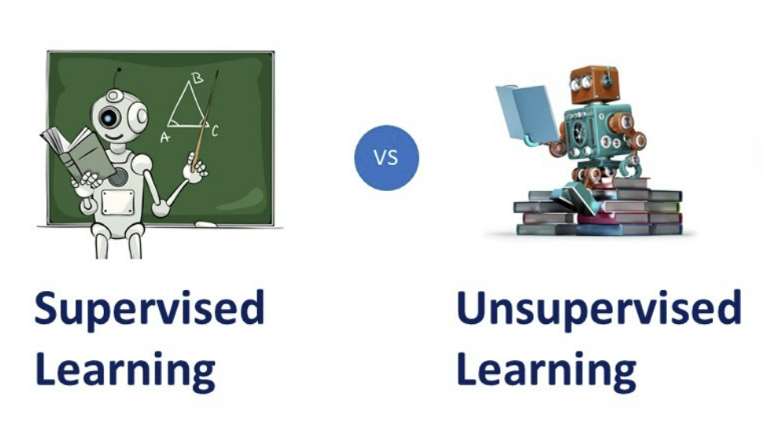

<font size=12>STV2022 -- Store tekstdata</font></br></br>
<p style='font-size:10;color:#D13F11'>[06] Veiledet og ikke-veiledet læring</p></br>
{width=50%}

Solveig Bjørkholt
<font size=6>\<solveig.bjorkholt@stv.uio.no\></font></br>


```{r setup, include=FALSE,warning=FALSE,message=FALSE}
knitr::opts_chunk$set(echo = FALSE)
knitr::opts_chunk$set(class.source = "code-bg")

library(rvest)
library(tidyverse)
library(tidytext)
library(quanteda)
library(jsonlite)
library(plotly)

```

# Disposisjon

 - Hva betyr "læring"?
    - Læring vs. regelbasert fremgangsmåte.
 
 - Veiledet læring
    - Treningsdatasett
    - Å trene modeller
    - Å validere modeller
 
 - Ikke-veiledet læring
    - Konseptualisering
 
 - Oppsummering


# Hva betyr "læring"?

<div class='left' style='float:left;width:45%'>

<br>

 - Maskinen forstår mønstre og sammenhenger selv
 - Skiller seg fra regelbasert framgangsmåte


</div>


<div class='right' style='float:right;width:45%'>

{width=55%} </br>

</div>

. . .

{width=60%} </br>


## Eksempel på regelbasert framgangsmåte vs. læring

Hvilken e-post er spam?

> "Hallo, jeg er Mr. Charles W. Jackson Jr., MEGAVINNEREN av $344,6 millioner i Mega Millions Jackpot, jeg donerer til 5 tilfeldige individer."

> "Hei. Hvordan gjør vi det med STV2022 framover, skal vi ta mesteparten av diskusjonen på Discord eller fortsette på mail?"


##

```{r, echo = TRUE}

tekst1 <- "Hallo, jeg er Mr. Charles W. Jackson Jr., MEGAVINNEREN av $344,6 millioner i Mega Millions Jackpot, jeg donerer til 5 tilfeldige individer."

tekst2 <- "Hei. Hvordan gjør vi det med STV2022 framover, skal vi ta mesteparten av diskusjonen på Discord eller fortsette på mail?"

emails <- tibble(email_nr = c(1, 2),
                 tekst = c(tekst1, tekst2),
                 klasse = c("", ""))

emails

```


## Regelbasert framgangsmåte

 - Mennesker må prøve å forstå mønstre og sammenhenger selv.
 - Lag et sett med regler for når noe er det ene og det andre utfra det du observerer.

    - **Regel: Hvis tekst inneholder ord i store bokstaver, så er det spam.**

. . . 

```{r, echo = TRUE}

emails %>%
  mutate(klasse = ifelse(str_detect(tekst, "[A-Z]{2,}"), # # Hvis teksten inneholder to eller flere store bokstaver etter hverandre
                        "spam", # så gi variabel "klasse" verdi "spam"
                        "legit")) %>% # hvis ikke, gi den verdi "legit"
  select(email_nr, klasse, tekst) # Hent ut variabler email_nr, klasse og tekst i denne rekkefølgen

```

---

{width=100%}

. . . 

{width=30%}


## Læringsframgangsmåte

 - La maskinen lære mønstrene selv

{width=100%}

--- 

**Kan automatisere prosesser**
{width=70%}

**Kan hjelpe mennesker i beslutningsprosesser**
{width=70%}


---


<div class='left' style='float:left;width:45%'>

**Veiledet læring** <br>

<br>
 
{width=110%}

 - Vi har et utvalg eposter som vi vet er spam/legit.
 - Maskinen bruker denne informasjonen for å klassifisere nye eposter som spam/legit.
 
</div>

<div class='right' style='float:right;width:45%'>

**Ikke-veiledet læring**

<br>

{width=110%}

 - Vi har en mengde besøkende til en blogg med litt informasjon om alder, kjønn, etc.
 - Maskinen bruker denne informasjonen til å finne grupper som likner hverandre.
 
 
</div>

---

{width=70%}


# Veiledet læring

Brukes når vi har data der vi allerede vet `Y` for et sett av data.

$Y = \alpha + \beta_1X_1 + \beta_2X_2 + e$

 - Hvis målenivå er *kategorisk*: Klassifisering
 - Hvis målenivå er *kontinuerlig*: Regresjon

 - Klassifisering er mest vanlig i tekst
 - Y kalles da også for "label" (merkelapp / "klasse")

{width=30%}


## Framgangsmåte ved veiledet læring:

 - Steg 1: Lag et treningsdatasett der du gir en merkelapp til et utvalg av dokumentene
 - Steg 2: Bruk treningsdatasettet for å trene opp en modell som kan klassifisere resten av dokumentene 
 - Steg 3: Sjekk hvor bra modellen gjorde det på å klassifisere dokumentene
 - Steg 4: Bruk de klassifiserte dokumentene i analyse

<br>
<br>

. . .

### Tre ledd i forskningsprosessen:

 - Oppdagelse, **Måling**, Slutning


## Eksempel fra SSB

{width=100%}

 - En manuell prosess med å klassifisere personer sitt yrke (fra tekst til en yrkeskode)

---

```{r, echo = FALSE}

read_rds("https://www.dropbox.com/s/gsc2rsreixt9r4d/aku_labels.rds?dl=1") %>%
  head(n = 15)

```

 - En automatisert prosess ved å bruke maskinlæring for å klassifisere personer sitt yrke

---


## Eksempel for i dag

{width=80%}

$politikk_D = \alpha + \beta_1person + \beta_2bil + \beta_3hus + \beta_4forventning ... $

```{r, warning = FALSE, message = FALSE, error = FALSE}

tedtalks <- read_csv("./data/talks_info.csv") %>%
  janitor::clean_names()

tedtalks_subset <- tedtalks %>%
  select(id, title, summary, transcript, topics, duration, likes, recorded_date, speakers) %>%
  mutate(topics = map(topics, ~ fromJSON(.) %>% 
                        as_tibble())) %>%
  mutate(speakers = map(speakers, ~ fromJSON(.) %>% 
                          as_tibble()))

glimpse(tedtalks_subset)

```

---

## Steg 1: Merkelapp på et utvalg av dokumentene

 - Kan eksistere fra før, eller kan måtte merkes fra start av.
 - Blir mer og mer relevant desto flere dokumenter vi har.

. . .

```{r, echo = FALSE}

ted <- tedtalks_subset %>%
  rename(doc_id = id) %>%
  select(doc_id, transcript, topics) %>%
  unnest(cols = c(topics)) %>%
  select(-id)

ted %>%
  count(name) %>%
  arrange(desc(n)) %>%
  plot_ly(x = ~n,
          y = ~name,
          text = ~name, 
          type = "bar")  %>% 
  layout(xaxis = list(title = "", categoryorder = "total ascending"), 
         yaxis = list(title = "", categoryorder = "total ascending"))

```


## Steg 2: Trene modell for å klassifisere de resterende dokumentene

### 2.1 Splitter datasettet inn i et treningssett, et testsett og et valideringssett.

 - **Treningssett:** De dataene modellen bruker for å lære mønstre og sammenhenger.
 - **Valideringssett:** Del av data som modellen sjekker at den har lært godt mot.
 - **Testsett:** Endelig data som brukes for å sjekke at modellen er god nok.

. . .

{width=30%}

---

{width=60%}

---

*Hvorfor splitter vi opp i så mange sett?* <br>
Fordi vi må sjekke at modellen gjør det godt nok på out-of-sample data (data som ikke har blitt brukt for å beregne modellen).

{width=100%}

---


### 2.2 Preprosesserer teksten

{width=80%}

---

### 2.3 Velger modell

Hvor mange husker lineær regresjon?

 - Det finnes mange ulike modeller.

<br>

. . . 

{width=80%}

---

I pensum nevner de disse modellene for klassifikasjon: 

 - Support vector machine (SVM)
 - Logistisk regresjon
 - Random forest

. . .

{width=30%}
{width=30%}
{width=45%}


## Steg 3: Sjekk hvor bra modellen gjorde det

 - Accuracy: Hvor mange observasjoner klarte modellen å klassifisere riktig?
 - Recall (sensitivity): Hvor godt modellen klassifiserer sanne positive.
 - Precision: Hvor mange positive utfall som var sanne positive.
 - Specificity: Hvor mange negative utfall som var sanne negative.
 - F1: En vektet form for "accuracy", som gir høyere vekt til falske negative og positive.

---

{width=50%}
{width=50%}


---

### Andre metoder:

 - Forvirringsmatrise (confusion matrix)

 - ROC-kurve and AUC (area under the curve)

. . .

```{r, echo = FALSE, warning = FALSE, message = FALSE, error = FALSE, fig.height=5}

library(tidymodels)

load("./data/glm_rs.rda")
load("./data/ranger_rs.rda")
load("./data/svm_rs.rda")

preds_df <- bind_rows( 
  collect_predictions(glm_rs) %>%
    mutate(mod = "Logistisk"),
  collect_predictions(svm_rs) %>%
      mutate(mod = "SVM"),
  collect_predictions(ranger_rs) %>%
      mutate(mod = "Random forest")
  )

preds_df %>%
  mutate(correct = as.factor(ifelse(.pred_class == tema, 1, 0))) %>% 
  count(mod, tema, .pred_class, correct) %>% 
  ggplot(aes(.pred_class, tema, fill = n)) + 
  geom_tile() + 
  facet_wrap(~mod) + 
  geom_text(aes(label=n), color = "white") + 
  labs(x = "Predikert klasse", y = "Faktisk klasse") +
  ggtitle("Forvirringsmatrise for tre modeller - klassifisering av om TED talks handler om politikk")

```


## Steg 4: Bruk de klassifiserte dokumentene i analyse

Hva er *din* problemstilling?

{width=30%}


# Ikke-veiledet læring

Brukes når vi har data der vi ikke vet `Y`.

{width=60%}

---

**Eksempler**

| **Modell**                    | **Beskrivelse**                                                       | **Formål**          |
|-------------------------------|-----------------------------------------------------------------------|---------------------|
| Diskriminerende ord           | Måler hvilke ord som brukes svært ofte i forskjellige tekster.        | Anormalitet         |
| Klustring                     | Grupperer tekster inn i "klustre" etter hvor mye de likner hverandre. | Gruppering          |
| Temamodeller                  | Måler i hvor stor grad tekstene tilhører hvert av K ulike tema.       | Gruppering          |
| Lav-dimensjonal ord-embedding | Finner ord som hører sammen i et lav-dimensjonalt rom.                | Dimensjonsreduksjon |

<br>

   - **Oppdagelse**, Måling, Slutning

---

## Hva mener vi med "oppdagelse"?

<div class='left' style='float:left;width:45%'>

 - Oppdagelse handler om å avdekke og forstå konsepter, f. eks:
 
    - "Staten"
    - "Velferd"
    - "Nasjonalisme"


</div>

<div class='right' style='float:right;width:45%'>

<br>
<br>

{width=80%}

</div>

---

{width=70%}

## Prinsipper når man jobber med ikke-veiledet læring

 - Kontekstrelevans: Substanskunnskap er viktig for å forstå output fra en modell.
 
 - Ingen grunnleggende sannhet: Konseptualiseringer er som modeller - enten nyttige eller unyttige, men aldri fulle representasjoner av virkeligheten.
 
 - Vurder konseptet, ikke metoden: Det finnes ingen *go-to*-metode, konseptet må vurderes utfra nyttigheten av det.
 
 - Det er best å bruke et trenings- og testdatasett: Også her kan det være lurt å teste konseptets gyldighet på et datasett som ikke er brukt for å konstruere konseptet.


# Takk for i dag!

{width=100%}
