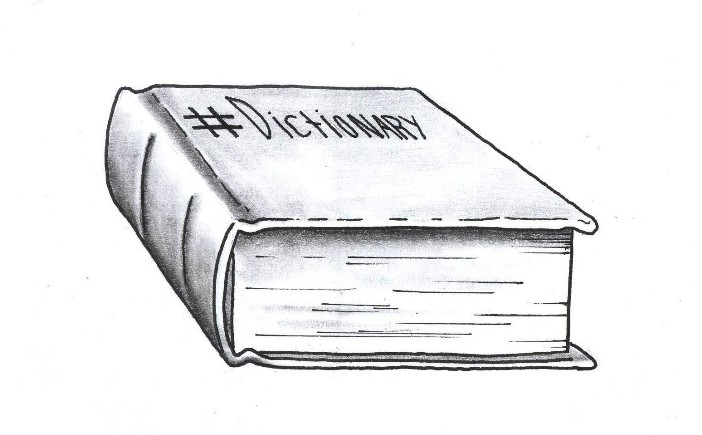

<font size=12>STV2022 -- Store tekstdata</font></br></br>
<p style='font-size:10;color:#D13F11'>[07] Ordbøker, tekstlikhet og sentiment</p></br>
{width=50%}

Solveig Bjørkholt
<font size=6>\<solveig.bjorkholt@stv.uio.no\></font></br>

```{r setup, include=FALSE,warning=FALSE,message=FALSE}
knitr::opts_chunk$set(echo = FALSE)
knitr::opts_chunk$set(class.source = "code-bg")

library(tidyverse)
library(tidytext)
library(quanteda.textstats)
library(tidymodels)
library(textrecipes)
library(tm)

# probrexit <- read_csv("../../data/TweetDataset_ProBrexit_Jan-Mar2022.csv") %>%
#   select(Date, URL, `Hit Sentence`, AVE, Sentiment, `Key Phrases`, `Influencer`, `Twitter Bio`, Country, `Twitter Followers`, `Twitter Following`) %>%
#   janitor::clean_names()
# antibrexit <- read_csv("../../data/TweetDataset_AntiBrexit_Jan-Mar2022.csv") %>%
#   select(Date, URL, `Hit Sentence`, AVE, Sentiment, `Key Phrases`, `Influencer`, `Twitter Bio`, Country, `Twitter Followers`, `Twitter Following`) %>%
#   janitor::clean_names()
# 
# brexit <- bind_rows(probrexit, antibrexit) %>%
#   mutate(date = as.Date(date, format = "%d-%b-%Y"))
#
# saveRDS(brexit, file = "../../data/brexit.rds")

brexit <- readRDS("../../data/brexit.rds")# %>%
 # sample_n(1000) 

```


# Disposisjon

 - Ordfrekvens og ordbøker
   - Hva ordfrekvens kan brukes til
   - Hva en ordbok er
   - Hvordan bruke ordbøker

 - Tekstlikhet
   - Cosinelikhet
   - Hvordan vektorisere ved likhetsanalyser
   - Distansemål

 - Sentiment
   - Hva er sentiment
   - Hvordan gjennomføre en sentimentanalyse

# Ordbøker

```{r,  out.width="70%", fig.align="center", echo = FALSE}
knitr::include_graphics("./figurer/regular_expressions.png")
```

## Ordfrekvens

 - Noen ganger kan det være nok å telle ord
 - Må ofte kobles med kvalitativ analyse
 
. . .

```{r,  out.width="50%", fig.align="center", echo = FALSE}
knitr::include_graphics("./figurer/count_words.PNG")
```

Mitchell Duneier (2016) *Ghetto: The Invention of a Place, the History of an Idea*


## Datasett: Tweeter om Brexit

 - Tweeter om Brexit fra januar til mars 2022
 - Samlet inn til i en masteroppgave om polarisering rundt Brexit
 - Utvalg hentet basert på Twitter bio (indikasjoner på om personen er for eller mot Brexit)
. . .

```{r,  out.width="50%", fig.align="center", echo = FALSE}
knitr::include_graphics("./figurer/brexit_picture.jpg")
```

. . .

https://www.kaggle.com/datasets/visalakshiiyer/twitter-data-brexit?select=TweetDataset_AntiBrexit_Jan-Mar2022.csv

---

Hva forteller dette plottet oss om Brexit?

```{r, eval = FALSE}

brexit %>% 
  group_by(date) %>%
  mutate(hit_sentence = str_squish(hit_sentence)) %>%
  unnest_tokens(output = ord, 
                input = hit_sentence,
                to_lower = TRUE, 
                stopwords = quanteda::stopwords("en"), 
                strip_punct = TRUE, 
                strip_numeric = TRUE) %>%
    mutate(token = quanteda::char_wordstem(ord, language = "en")) %>% 
  count(token) %>%
  filter(token %in% c("brexit")) %>%
  ggplot(aes(date, n)) +
  geom_line() + 
  ggtitle("Tweeter fra tilhengere og motstandere av Brexit, som inneholder order 'brexit', januar-mars 2022") +
  theme_bw()

```

```{r, out.width="100%", fig.align="center", echo = FALSE}
knitr::include_graphics("./figurer/brexit_overtime.png")
```

## Ordbøker 

*En systematisert ordtelling*

1. Lag en liste med ord som deler inn kategorier innenfor et konsept, f. eks. "positiv" og "negativ" tone
  
2. Tell opp hvor ofte hvert ord dukker opp i tekstene

3. Lag et vektet (sammenliknbart) mål, f. eks. andel av ord som er X og andel som er Y

{width=40%}


## Ordbøker 

Ordbok for å klassifisere de som er positive og negative til brexit utfra deres twitter-bio.

```{r, echo = TRUE}

ordbok <- tibble(positiv = c("anti eu", "pro brexit", "brexit support"),
                 negativ = c("pro eu", "anti brexit", "rejoin eu"))

ordbok

```

---

```{r, echo = TRUE}

brexit %>%
  select(influencer, twitter_bio) %>%
  unique() %>%
  group_by(influencer) %>%
  unnest_tokens(input = twitter_bio,
                output = ord,
                token = "ngrams",
                n = 2) %>%
  mutate(brexitanti = ifelse(ord %in% ordbok$negativ, 1, 0),
         brexitpro = ifelse(ord %in% ordbok$positiv, 1, 0)) %>%
  group_by(influencer) %>% 
  summarize(brexit_anti = sum(brexitanti),
            brexit_pro = sum(brexitpro))

```


---

{width=100%}

 - Hvis disse og disse ordene dukker opp i teksten
 - Så er det tegn på at teksten passer innenfor kategori X

## Eksempler på ferdiglagde ordbøker

<br>

 - **General Inquirer** - `SentimentAnalysis`
 - **Bing** - `tidytext`
 - **MPQA Subjectivity Lexicon** - `abhy/sentiment`
 - **Loughran** - `quanteda`
 - **Vader** - `vader`
 - **Norwegian sentiment lexicon** - `martigso/NorSentLex`

<br>

. . .

https://journodev.tech/blog-12-main-dictionaries-for-sentiment-analysis/ 

## Fordeler og ulemper med ordbok-baserte metoder

<div class='left' style='float:left;width:49%'>

**Fordeler**

 - Enkelt å sette opp
 - Billig å anvende
 - Mange eksisterende ordbøker man kan bruke

</div>

<div class='right' style='float:right;width:49%'>

**Ulemper**

 - Kontekstavhengig
 - Krever svært mye validering
 - Utarbeiding av egne ordbøker er tidkrevende
 
</div>


## Diskusjonsspørsmål

 - Hva er egenskaper ved en god ordbok?
 - Hvilke ord tenker du bør befinne seg i en ordbok som forsøker å måle teknisk språk vs. allment språk?
 - Kan vi måle ordfrekvens når vi har tokenisert inn i bigrams?

<br>

```{r, out.width="50%", fig.align="center"}
knitr::include_graphics("./figurer/qs.png")
```

# Tekstlikhet

```{r,  out.width="100%", fig.align="center", echo = FALSE}
knitr::include_graphics("./figurer/simil.png")
```

## Hvorfor tekstlikhet?

 - Startet med informasjonsinnhenting innenfor informasjonskunnskap
 - *Hvordan vite at vi har funnet alle dokumenter som er relevante for et søk?*

. . .

```{r, out.width="15%", fig.align="center", echo = FALSE}

```

. . .

 - Men svært relevant også i samfunnsfaglig forskning
 - F. eks. *Hvor like er to talere hverandre?*

## Likhetsmål

Et likhetsmål har visse egenskaper: 

1. Maksimal likhet oppstår når man sammenlikner et dokument med seg selv

2. Dokumenter som ikke deler noen ord har ingen likhet

3. Likhet øker ettersom flere av de samme ordene brukes

4. Symmetri - dokument A likner like mye på dokument B som B likner på A


## Cosinelikhet

```{r, out.width="40%", fig.align="center"}
knitr::include_graphics("./figurer/cosine.PNG")
```

 - Sammenlikn hvor mange ord som er like mellom to dokumenter
 - Mål cosine (grad) for å unngå at antall ord påvirker estimatet
 - Varierer mellom 0 og 1 (vanligvis -1, men vi kan ikke ha negativt antall ord)

## Hvordan bør ord vektoriseres ved likhetsmål?

**Eksempel: Sammenlikne tre forskjellige tweetere**
 
<br>

```{r}
brexit %>%
  filter(influencer %in% c("@UKBreturn", "@BreamoreBoy", "@mrkwilkinson1")) %>%
  group_by(influencer) %>%
  add_count(name = "antall_tweets") %>%
  ungroup() %>%
  select(influencer, twitter_bio, country, antall_tweets) %>%
  unique() %>%
  knitr::kable() %>%
  kableExtra::kable_styling()
```

## Hvordan bør ord vektoriseres ved likhetsmål?

### Sekk med ord

```{r, echo = FALSE, message = FALSE, error = FALSE, warning = FALSE}

brexit_dfm <- brexit %>% 
  filter(influencer %in% c("@UKBreturn", "@BreamoreBoy", "@mrkwilkinson1")) %>%
  group_by(influencer) %>% 
  unnest_tokens(input = hit_sentence, 
                output = token,
                token = "words",
                to_lower = TRUE,
                stopwords = quanteda::stopwords("en"),
                strip_punct = TRUE,
                strip_numeric = TRUE) %>%
  mutate(token = quanteda::char_wordstem(token, language = "english")) %>% 
  count(token) %>% 
  cast_dfm(., 
           document = influencer, 
           term = token, 
           value = n)

```

```{r, echo = FALSE}

brexit_simil <- textstat_simil(brexit_dfm, method = "cosine") %>% 
  as.matrix()

diag(brexit_simil) <- 0

brexit_simil <- brexit_simil %>% 
  as_tibble() %>%
  mutate(influencer = names(.)) %>%
  pivot_longer(cols = 1:3)

ggplot(brexit_simil, aes(x = influencer, y = name, fill = value)) +
  geom_tile(stat = "identity") +
  geom_text(aes(label = ifelse(value > .001, round(value, 2), ""))) +
  scale_fill_gradient2(low = "green", mid = "white", high = "blue", midpoint = 0) +
  labs(x = NULL, y = NULL, color = NULL, fill = NULL) +
  theme(axis.text.x = element_text(angle = 90, hjust = 1, vjust = 0.5))

```

## Hvordan bør ord vektoriseres ved likhetsmål?

### TF-IDF

```{r, echo = FALSE, message = FALSE, error = FALSE, warning = FALSE}

brexit_dfm_tfidf <- brexit %>% 
  filter(influencer %in% c("@UKBreturn", "@BreamoreBoy", "@mrkwilkinson1")) %>%
  group_by(influencer) %>% 
  unnest_tokens(input = hit_sentence, 
                output = token,
                token = "words",
                to_lower = TRUE,
                stopwords = quanteda::stopwords("en"),
                strip_punct = TRUE,
                strip_numeric = TRUE) %>%
  mutate(token = quanteda::char_wordstem(token, language = "english")) %>% 
  count(token) %>% 
  bind_tf_idf(term = token, document = influencer, n = n) %>%
  cast_dfm(., 
           document = influencer, 
           term = token, 
           value = tf_idf)

```

```{r, echo = FALSE}

library(quanteda.textstats)

brexit_simil_tf_idf <- textstat_simil(brexit_dfm_tfidf, method = "cosine") %>% 
  as.matrix()

diag(brexit_simil_tf_idf) <- 0

brexit_simil_tf_idf <- brexit_simil_tf_idf %>% 
  as_tibble() %>%
  mutate(influencer = names(.)) %>% 
  pivot_longer(cols = 1:3)

ggplot(brexit_simil_tf_idf, aes(x = influencer, y = name, fill = value)) +
  geom_tile(stat = "identity") +
  geom_text(aes(label = ifelse(value > .000001, round(value, 4), ""))) +
  scale_fill_gradient2(low = "green", mid = "white", high = "blue", midpoint = 0) +
  labs(x = NULL, y = NULL, color = NULL, fill = NULL) +
  theme(axis.text.x = element_text(angle = 90, hjust = 1, vjust = 0.5))

```

## Avstandsmål

Finner avstand mellom tekster.

 - Euclidean distanse = den vanligste

. . .

```{r, out.width="80%", fig.align="center", echo = FALSE}
knitr::include_graphics("./figurer/euclidean.PNG")
```

## Avstandsmål

Men det finnes andre, f. eks.:

 - Minkowski distanse
 - Manhattan distanse
 - 1 - cosine

. . .

*Hvilken man bruker avhenger av analyseformålet.*

```{r, echo = TRUE}
textstat_dist(brexit_dfm_tfidf, method = "euclidean") %>% 
  as.dist() %>%
  tidy()
```


## Utfordringer med likhetanalyser

 - Dokumenter må være samme språk
 
 - Hva som er likhet kan variere
    - Hva er likest? To anmeldelser av filmer der begge er positive eller begge er av samme film?
    
 - Dokumenter kan snakke om det samme med på forskjellige måter
    - Ord-embedding kan hjelpe her (kontekst heller enn ord)

## Diskusjonsspørsmål

 - Hvordan tror du det å sette alle ord til liten bokstav kan påvirke likhetsmål?
 - Hvordan tror du det å ta ut stoppord kan påvirke likhetsmål?
 - Kan du tenke deg noen analyseformål der det er bedre å bruke sekk med ord enn TF-IDF som tekst-vektorisering for å måle cosine-likhet?
 
<br>

```{r, out.width="50%", fig.align="center"}
knitr::include_graphics("./figurer/qs.png")
```

# Sentiment

```{r,  out.width="60%", fig.align="center", echo = FALSE}
knitr::include_graphics("./figurer/sentiment.png")
```

## Hva er sentiment?

```{r, out.width="60%", fig.align="center"}
knitr::include_graphics("./figurer/imitation.jpeg")
```

 - Sentiment: Mening, følelse, emosjon, subjektivitet, affekt, anmeldelse... 

 - Også iblant kalt "meningsuthenting" (opinion mining)

 - Det vi forsøker å få frem gjennom språket


## Enheter og variabler i sentimentanalyse

<div class='left' style='float:left;width:49%'>

**Enhet**

 - Dokument 
    - F. eks. en anmeldelse, en kommentar, en tweet, et avisinnlegg...
 
 - Setning
    - Relatert til subjektivitetsestimering
    
 - Enhet eller aspekt
    - Finner gjenstand og sentiment tilknyttet gjenstand (eks. "bilen er komfortabel men har stygg farge")

</div>

<div class='right' style='float:right;width:49%'>

**Variabel**

 - Positiv, nøytral eller negativ
 - 2, 1, 0, -1, -2
 - 1-5 stjerner
 
</div>


## Formell definisjon av sentiment

Formell definisjon av "mening":

$(e{_i}, a_{ij}, s_{ijkl}, h_{k}, t_{l})$

. . .

"Allokeringen av midler i statsbudsjettet har ikke vært tilferdsstillende."
*Jensen, 5. oktober 2022*

<br>

 - $e{_i}$: Enhet - statsbudsjettet
 - $a_{ij}$: Aspekt - allokeringen av midler
 - $s_{ijkl}$: Mening - ikke tilfredsstillende
 - $h_{k}$: Meningsholder - Jensen
 - $t_{l}$: Tidspunkt - 5. oktober 2022

. . . 

**Sentimentanalyse**: Gitt dokument X, finn alle meningssammensetninger $(e{_i}, a_{ij}, s_{ijkl}, h_{k}, t_{l})$.

## Eksempel på anvendelse

 - Kunders anmeldelse av produkter
 
 - Polarisering knyttet til politisk tilhørighet
 
 - Tilbakemeldinger i spørreskjema
 
<br>

```{r, out.width="60%", fig.align="center"}
knitr::include_graphics("./figurer/sentimentfaces.jpg")
```


## Hvordan gjennomføre en sentimentanalyse?

*It all comes together...*

 - Trenger du å hente ut enheter? 
    - Finn navngitte enheter (se forelesning 3)
 - Trenger du å hente ut aspekter? 
    - Finn taledeler (se forelesning 3)
 - Trenger du å finne sentiment? 
    - Bruk en sentimentordbok (se denne forelesningen)
    - Eller klassifiser utfra et treningsdatasett (se forelesning 6)


## Eksempler med sentimentordbok

### Egenlagd sentimentordbok

```{r, message = FALSE, error = FALSE, warning = FALSE, echo = TRUE}

ordbok <- tibble(sentiment = c("positive", "positive", "negative", "negative"),
                 ord = c("happy", "beautiful", "impossible", "ugly"))

ordbok

```

---

### Ferdiglagd ordbok (fra tidytext kapittel 2)

```{r, echo = TRUE}

tidytext_ordbok <- get_sentiments("bing")

sentiment <- brexit %>%
  select(influencer, date, hit_sentence) %>%
  unnest_tokens(input = hit_sentence,
                output = ord) %>%
  inner_join(tidytext_ordbok, by = c("ord" = "word"))

sentiment

```

---

```{r, echo = FALSE}

sentiment %>%
  group_by(date, sentiment) %>%
  count() %>%
  ggplot(aes(date, n, color = sentiment)) + 
  geom_line() + 
  theme_minimal()

```

---

### Ordbok spesielt for sosiale medier

```{r, message = FALSE, error = FALSE, warning = FALSE, echo = TRUE}
library(vader)

set.seed(193)

brexit_subset <- brexit %>%
  sample_n(10)

brexit_subset %>%
  mutate(hit_sentence = str_to_lower(hit_sentence)) %>%
  mutate(sentiment = vader_df(hit_sentence)) %>%
  select(influencer, sentiment) %>% 
  unnest(cols = c(sentiment))

```

---

### Norsk ordbok

```{r, echo = TRUE}
#devtools::install_github("martigso/NorSentLex")

library(NorSentLex)

nor_fullform_sent$positive %>% head()
nor_fullform_sent$negative %>% head()

```

---


## Eksempel med treningsdata

Gitt at vi har ferdigmerket data...

```{r, echo = FALSE}

set.seed(201)

brexit_classify <- brexit %>%
  filter(sentiment != "Not Rated") %>%
  drop_na(influencer) %>%
  select(influencer, hit_sentence, sentiment) %>%
  rename(text = hit_sentence) %>%
  sample_n(1000)

brexit_classify

```

---

... så kan vi kjøre en veiledet læringsmodell for å predikere sentiment

```{r, echo = FALSE, warning = FALSE, message = FALSE, error = FALSE}

brexit_classify_split <- initial_split(brexit_classify, prop = 0.8)

brexit_trening <- training(brexit_classify_split)
brexit_validering <- vfold_cv(brexit_trening, v = 5)

brexit_testing <- testing(brexit_classify_split)

brexit_oppskrift <- recipe(sentiment ~ text + influencer, data = brexit_trening) %>% 
  update_role(influencer, new_role = "id variable") %>% 
  step_mutate(text = str_to_lower(text)) %>% 
  step_mutate(text = removeNumbers(text)) %>%  
  step_mutate(text = removePunctuation(text)) %>% 
  step_text_normalization(text) %>%
  step_tokenize(text) %>% 
  step_tokenfilter(text, max_tokens = tune()) %>%
  step_stem(text) %>% 
  step_stopwords(text, custom_stopword_source = stopwords("en")) %>% 
  step_tfidf(text)

brexit_modell <- svm_rbf(cost = tune(), 
                         rbf_sigma = tune()) %>%
  set_engine("kernlab") %>%
  set_mode("classification")


brexit_wf <- workflow() %>%
  add_recipe(brexit_oppskrift) %>%
  add_model(brexit_modell)

tune_res <- tune_grid(
  brexit_wf,
  resamples = brexit_validering,
  grid = 5,
  metrics = metric_set(accuracy, sens, spec),
  control = control_grid(verbose = FALSE, save_pred = TRUE)
)

# tune_res %>%
#   autoplot(type = "marginals")
# 
# collect_metrics(tune_res)

best_accuracy <- select_best(tune_res, "accuracy")

final_wf <- finalize_workflow(
  brexit_wf,
  best_accuracy
)

# final_wf
# 
# show_best(tune_res, "accuracy")

final_res <- final_wf %>%
  last_fit(brexit_classify_split) 

final_res %>%
  collect_predictions() %>%
  conf_mat(truth = sentiment, 
           estimate = .pred_class) %>%
  autoplot("heatmap")

```


## Hvordan få merket data til sentimentanalyse?

*Hvordan vet en algoritme at en tekst er positiv eller negativ?*

 - Steg 1: Få mennesker til å merke et utvalg av tekstene.
 - Steg 2: Tren opp en algoritme til å forstå sammenhengene og gjøre samme kategorisering
 - Steg 3: Anvend algoritmen på resten av tekstene.
 

## Utfordringer

 - Sarkasme og ironi (*snakker om "krisetider"...*)
 - Negasjoner (*jeg liker ikke melk*)
 - Indirekte meninger (*da jeg måtte på sykehus var det ingen trafikk*)
 - Subjektivitet vs. sentiment (*denne laptopen er helt genial!!!* vs. *denne laptopen har lang levetid*)
 - Uttrykker dokumentet sentiment over samme tema hele tiden? (*økonomien er bra, men helsetilstanden min har forverret seg*)
 - Språk
 - Behov for treningsdata

## Diskusjonsspørsmål

 - Hvilke forskjeller i uttrykk for sentiment tror du det er mellom en 10-åring og en 60-åring?
 - Tror du sentiment kan si oss noe om hva folk vil stemme i valg?
 - Hva tenker du om å bruke metoder fra markedsanalyse på statsvitenskapelige spørsmål?

<br>

```{r, out.width="50%", fig.align="center"}
knitr::include_graphics("./figurer/qs.png")
```

# Takk for i dag!

```{r, out.width="60%", fig.align="center"}

```

