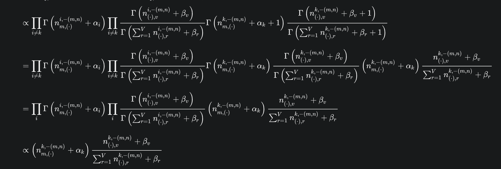
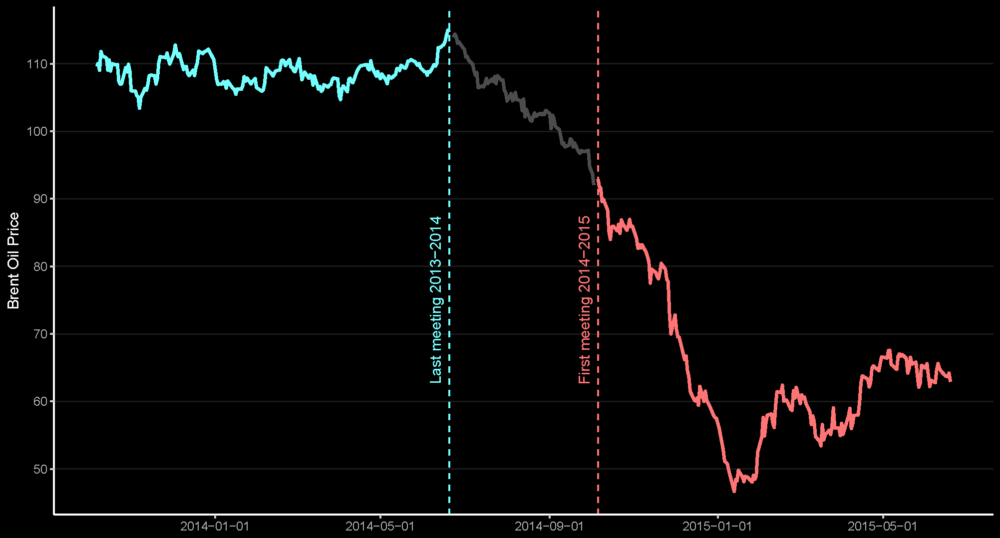

<font size=12>STV2022 -- Store tekstdata</font></br></br>
<p style='font-size:10;color:#42D225'>[08] Klassifisering av tekst -- temamodellering</p></br>
{width=50%} 

Martin Søyland 
<font size=6>\<martin.soyland@stv.uio.no\></font></br>

```{r setup, include=FALSE,warning=FALSE,message=FALSE}
# setwd("./undervisningsmateriell/forelesninger/uke_08/")
knitr::opts_chunk$set(echo = FALSE)
knitr::opts_chunk$set(class.source = "code-bg")
refs <- bibtex::read.bib("../../../referanser/stv2022.bib")

# Loading packages
library(readr)      # Read data through C++
library(dplyr)      # Parse manipulation of data through C++
library(pbmcapply)  # Parallelization with progress bar
library(quanteda)
library(tidyverse)
library(tidytext)
library(rvest)
library(stm)

str_break <- function(x, width = 7L) {
  x <- unlist(quanteda::tokenize_fastestword(x))
  n <- length(x)
  if (n <= width) return(x)
  n1 <- seq(1L, n, by = width)
  n2 <- seq(width, n, by = width)
  if (n %% width != 0) n2 = c(n2, n)
  
  lines <- character()
  for(i in 1:length(n1)){
    lines[i] <- paste(x[n1[i]:n2[i]], collapse = " ")
  }
 return(lines) 
}

```


# Disposisjon

1. En øvelse i kategorisering
1. Om emnemodellering
1. Latent Dirichlet allocation (LDA)
1. Structural Topic Models (STM)
1. Emnemodeller i praksis
    - <font style='color:#546DFB'>Climate Politics in Hard Times</font> 
    
# En øvelse i kategorisering

- Bruk 2 minutter på å diskutere hvilken kategori (emne) teksten kan klassifiseres som:

. . .

> <font size="5">I Norge har vi mer enn nok plass, vi har folk som vil kjøpe hus og bygge hus som har fått lån, vi har bygningsarbeidere og entreprenører, vi har materialer og redskap. Hva er flaskehalsen? Den eneste ting politikere og byråkrater må sørge for, nemlig tillatelse til å bygge. Det er ikke regulert eller planlagt nok områder til boligbygging, selv om grunneiere står i kø for å selge. Det vi har nok av fra naturens side, nemlig plass, har politikere og byråkrater greid å gjøre til mangelvare.</font>

. . .

<font size="4">Carl I. Hagen, FrPs landsmøte 1988</font>

# Hva er emnemodellering

Emnemodellering er <font style='color:cyan'>klassifisering</font> av tekst </br> 
________________________________________________<br>
Vi bruker <font style='color:cyan'>klassifisering</font> til alt mulig rart! `r emo::ji("mag_right")`

. . .

{width=50%}

. . .

{width=50%}

. . .

{width=50%}


---

Emnemodellering bruker <font style='color:#842948'>sameksisterende</font> ord til å estimere emner (*topics*)


<div style="text-align: left">Hentet fra: @Blei2012 </div>

---

> <font size="4">I <font style='color:red'>Norge</font> har vi mer enn nok <font style='color:red'>plass</font>, vi har folk som vil <font style='color:blue'>kjøpe hus</font> og <font style='color:green'>bygge hus</font> som har fått <font style='color:blue'>lån</font>, vi har <font style='color:green'>bygningsarbeidere</font> og <font style='color:green'>entreprenører</font>, vi har <font style='color:green'>materialer</font> og <font style='color:green'>redskap</font>. Hva er flaskehalsen? Den eneste ting <font style='color:orange'>politikere</font> og <font style='color:orange'>byråkrater</font> må sørge for, nemlig <font style='color:orange'>tillatelse til å bygge</font>. Det er ikke <font style='color:orange'>regulert</font> eller <font style='color:orange'>planlagt</font> nok <font style='color:red'>områder</font> til <font style='color:green'>boligbygging</font>, selv om <font style='color:blue'>grunneiere</font> står i kø for å <font style='color:blue'>selge</font>. Det vi har nok av fra <font style='color:red'>naturens</font> side, nemlig <font style='color:red'>plass</font>, har <font style='color:orange'>politikere</font> og <font style='color:orange'>byråkrater</font> greid å gjøre til <font style='color:blue'>mangelvare.</font></font>

. . .

| Emne                                                     | Nøkkelord              | Andel av tekst|
|:---------------------------------------------------------|:-----------------------|:--------------|
|<font style='color:red'>Areal</font>                      | Norge, plass, områder  | 0.06          |
|<font style='color:blue'>Økonomi og eiendom </font>       | kjøpe, lån, mangelvare | 0.07          |
|<font style='color:green'>Eiendomsutvikling</font>        | bygge, hus, redskap    | 0.07          |
|<font style='color:orange'>Politikk of forvaltning</font> | politikere, byråkrater | 0.08          |
| Stoppord                                                 | har, vi, enn, som      | 0.72          |

# Latent Dirichlet allocation (LDA)

- LDA er den en _enkleste_ emnemodellen:
  - En tekst kan bestå av mange emner (multi-membership)
  - Emner er definert som å være en fordeling over et satt vokabular
  - Emnene antas å ha eksistert før data ble generert
  - Vi vet ikke innholdet i emnene før vi kjører modellen (sjult struktur)

. . .

{width=30%}

. . .

- HUSK! Fokuser på å forstå det som kommer ut av modellen og hvordan vi kan validere det!

## Antagelser

1. Rekkefølgen på ord betyr ingenting (sekk med ord)

2. Rekkefølgen på dokumentene betyr ingenting

3. Vi vet antall emner og det antallet er satt


## Fremgangsmåte


{width=30%}

- Vi starter med noe og oppdaterer (iterasjoner) til bra endringer forsvinner 


## Hvordan velge antall emner?

1. Prøv noe
2. Validere
3. Prøv igjen
4. Validere
5. ...

# Structural Topic Models

- Veldig lik LDA bortsett fra:
  1. "Prevalence" parameteret
      - ca som uavhengige variabler i en regresjon
  2. "Spectral" initialisering
      - bedre på store corpus 
      - kan finne antall topics for deg

---

`r emo::ji("rotating_light")` `r emo::ji("rotating_light")` `r emo::ji("rotating_light")`

> When init.type='Spectral' and K=0 the number of topics is set [...] 
  this does not estimate the 'true' number of topics and does not necessarily 
  have any particular statistical properties for consistently estimating the 
  number of topics. It can however provide a useful starting point.

`r emo::ji("rotating_light")` `r emo::ji("rotating_light")` `r emo::ji("rotating_light")`

# Emnemodeller i praksis

<p style='font-size:36;color:#546DFB'>Climate Politics in Hard Times</p> 


{width=80%}

---


<font style='color:#4641DF'>Metadata</font>

```{r load_data, eval=TRUE}
load("./data/reps_preproc_bigram_pos.rda")
```

```{r show_data, eval=TRUE}
# Metadata
meta[2:5, c("id", "rep_id", "text")]
```

. . .

==================================

<font style='color:#5641DF'>DFM</font>

```{r show_dfm, eval=TRUE}
# DFM
lemma_counts[2:5, 110:113]
```

## Estimere LDA

```{r LDA_est, eval=FALSE, echo=-12}
# Estimerer LDA emnemodel med 20 emner 
oil_lda <- stm(lemma_counts, 
               K = 20, 
               data = meta, 
               init.type = "LDA", 
               max.em.its = 50)
# OBS: "max.em.its" Skal være mye høyere, men det tar lang tid å kjøre
# Bruk "default value" fra ?stm

save(oil_lda, file = "./data/oil_lda.rda")
```

```{r load_LDA, echo=FALSE, eval=TRUE}
load("./data/oil_lda.rda")
```

. . .


```txt
....................................................................................................
Completed E-Step (6 seconds). 
Completed M-Step. 
Completing Iteration 38 (approx. per word bound = -7.825, relative change = 1.931e-04) 
....................................................................................................
Completed E-Step (6 seconds). 
Completed M-Step. 
Completing Iteration 39 (approx. per word bound = -7.823, relative change = 1.845e-04) 
....................................................................................................

```

## LDA-resultater


### Viktigste emner

. . .

```{r, echo=TRUE, eval=FALSE}
# ?plot.STM
plot(oil_lda, labeltype = "frex")
```

```{r check_LDA, eval=TRUE, message=FALSE,warning=FALSE, echo=FALSE, fig.width=10, fig.height=4}
top_ord <- stm::labelTopics(oil_lda, n = 2)


tibble(exp_prop = apply(oil_lda$theta, 2, mean), 
       topic = paste("Emne: ", 1:20),
       top_ord = apply(top_ord$frex, 1, function(x) str_c(x, collapse = " og "))) %>% 
  ggplot(., aes(x = fct_reorder(topic, exp_prop), y = exp_prop)) +
  geom_col(fill = "darkcyan") +
  geom_text(aes(label = top_ord),
            color = c(rep("gray50", 6), "orange", rep("gray50", 13))) +
  coord_flip() +
  labs(x = "", y = "Forventet proporsjon") +
  scale_y_continuous(expand = c(0,0), limits = c(0, 0.10))+
  ggdark::dark_mode() +
  theme(axis.text.y = element_text(hjust = 0))

```

---

### Viktigste ord

```{r, echo=TRUE, eval=TRUE}
top_ord <- labelTopics(oil_lda, n = 2)

top_ord

```

---

### Søke etter ord i emner

```{r, echo=TRUE, eval=TRUE}

findTopic(oil_lda, "utslipp:subst", type = "frex")

labelTopics(oil_lda, topics = 7, n = 5)

```

---

### Lese topptekster i emner

```{r, echo=TRUE, eval=TRUE}

findThoughts(oil_lda, texts = meta$text, topics = 7)

```


# Structural Topic Model (stm)

</br></br>

```{r STM_setK, eval=FALSE, echo=-8}
#### STM with satt antall emner
oil_stm <- stm(lemma_counts, 
               K = 20, 
               prevalence = ~ factor(party_id), 
               data = meta, 
               init.type = "Spectral", 
               max.em.its = 50)
save(oil_stm, file = "./data/oil_stm.rda")
```


```{r STM_setK_load, echo=FALSE, eval=TRUE}
load("./data/oil_stm.rda")
```

---

## STM-resultater

### Viktigste emner

. . .

```{r STM_setK_check, eval=FALSE, echo=TRUE}
plot(oil_stm, labeltype = "frex")
```

```{r STM_setK_check2, eval=TRUE, echo=FALSE, fig.width=10, fig.height=4}
top_ord <- stm::labelTopics(oil_stm, n = 2)

data.frame(exp_prop = apply(oil_stm$theta, 2, mean), 
           topic = paste("Emne: ", 1:20),
           top_ord = apply(top_ord$frex, 1, function(x) str_c(x, collapse = " og "))) %>% 
  ggplot(., aes(x = fct_reorder(topic, exp_prop), y = exp_prop)) +
  geom_col(fill = "darkcyan") +
  geom_text(aes(y = 0.05, label = top_ord),
            color = c(rep("white", 10), "darkorange", rep("white", 9)))  +
  coord_flip() +
  labs(x = "", y = "Forventet proporsjon") +
  scale_y_continuous(expand = c(0,0), limits = c(0, 0.16))+
  ggdark::dark_mode() +
  theme(axis.text.y = element_text(hjust = 0))

```

---

`r emo::ji("angry")` <font style='color:#987654;font-size:40'>Hva er emne 10???</font> `r emo::ji("angry")`

```{r nynorsk_check, eval=TRUE, echo=TRUE}

labelTopics(oil_stm, n = 30)$frex[10, ]

```

---

### Partiforskjeller i klimaemne

```{r, echo = TRUE, eval=-4}
# Lager plot av forventet emneandel på et tilfeldig innlegg fra hvert parti
oil_eff <- estimateEffect(~ factor(party_id), oil_stm, metadata = meta)

plot(oil_eff, covariate = "party_id", topics = 11)
```

. . .

```{r, echo=FALSE, eval=TRUE, fig.width=10, fig.height=4}
eff_plot_data <- plot(oil_eff, covariate = "party_id", topics = 11, omit.plot = TRUE)

tibble(p = eff_plot_data$uvals,
       topic = eff_plot_data$topics,
       m = eff_plot_data$means[[1]],
       upr = eff_plot_data$cis[[1]][1,],
       lwr = eff_plot_data$cis[[1]][2,]) %>% 
  ggplot(., aes(x = fct_reorder(p, m), y = m)) +
  geom_pointrange(aes(ymin = lwr, ymax = upr)) +
  coord_flip() +
  labs(y = "Forventet andel av innlegg", x = "Parti") +
  ggdark::dark_mode()


```

# STM med "optimal" K

```{r STM_optimalK_estimate, eval=FALSE, echo=-8}
oil_stm_optimal <- stm(lemma_counts, 
                       K = 0, 
                       prevalence = ~ factor(party_id), 
                       data = meta, 
                       init.type = "Spectral", 
                       max.em.its = 50)

save(oil_stm_optimal, file = "./data/oil_stm_optimal.rda")
```

```{r STM_optimalK_load, echo=FALSE, eval=TRUE}
load("./data/oil_stm_optimal.rda")
```

---

### Evaluerer "optimal" STM

. . .

```{r STM_optimalK_check, eval=TRUE, echo=TRUE}
# Sjekke antall topics
oil_stm_optimal$settings$dim$K

```

. . .

```{r STM_optimalK_oilfind, eval=TRUE, echo=TRUE}

klima <- findTopic(oil_stm_optimal, 
                   list = c("klima:subst"), 
                   type = "frex", 
                   n = 50)

```

---

```{r STM_optimalK_oilfind2, eval=TRUE, echo=TRUE}
labelTopics(oil_stm_optimal, n = 5,
            topics = klima)$frex[klima, ] %>% 
  t() # (Denne er bare for å få mer forståelig output)

```

---

```{r, echo = TRUE, eval=-4}
# Lager plot av forventet emneandel på et tilfeldig innlegg fra hvert parti
oil_eff <- estimateEffect(~ factor(party_id), oil_stm_optimal, metadata = meta)

plot(oil_eff, covariate = "party_id", topics = klima)
```

```{r, eval=TRUE, fig.width=10, fig.height=4}
eff_plot_data <- plot(oil_eff, covariate = "party_id", topics = klima, omit.plot = TRUE)

tibble(p = rep(eff_plot_data$uvals, 2),
       t = rep(c("Grønne skiftet (49)", "Klimamål (77)"), each = length(eff_plot_data$uvals)),
       m = unlist(eff_plot_data$means),
       upr = unlist(lapply(eff_plot_data$cis, function(x) x[2, ])),
       lwr = unlist(lapply(eff_plot_data$cis, function(x) x[1, ]))) %>% 
  ggplot(., aes(x = fct_reorder(p, m), y = m, color = factor(t))) +
  geom_pointrange(aes(ymin = lwr, ymax = upr), position = position_dodge(width = 0.2)) +
  coord_flip() +
  labs(y = "Forventet andel av innlegg", x = "Parti", color = "Emne") +
  ggdark::dark_mode()
```


# Statistisk validering av STM

. . .

- Semantisk tolkbare emner kjennetegnes av:
    1. Det er sammenhengende; ordene med høy sannsynlighet i et emne opptrer sammen innad i dokumenter
        - Maksismeres når de mest sannsynlige ordene dukker opp sammen
    2. Det er eksklusivt; de høyest ladende ordene i et emne, vil ikke være toppord i andre emner
        - Maksimeres når ord bare tilhører ett emne

. . .

<font style='color:#8421DF'>*Selv om disse målene er effektive og tolkbare, kan de ikke erstatte mennesklig tolkning!*</font>

---

```{r excl_semCoher, echo=c(1:3), eval=TRUE, fig.width=8, fig.height=5, message=FALSE, error=FALSE, warning=FALSE}
stm_counts <- convert(lemma_counts, "stm")

oil_sem_coh <- tibble(
  sem_coh = semanticCoherence(model = oil_stm_optimal, documents = stm_counts$documents),
  exclu = exclusivity(oil_stm_optimal),
  emne = str_c("Emne: ", 1:98)
)

oil_sem_coh$lab <- ifelse(str_detect(oil_sem_coh$emne, "49|77"), oil_sem_coh$emne, "")

ggplot(oil_sem_coh, aes(x = sem_coh, y = exclu)) +
  geom_point() +
  ggrepel::geom_label_repel(aes(label = lab), max.overlaps = 10) +
  stat_density2d() +
  labs(x = "Semantisk sammenheng", y = "Eksklusivitet") +
  ggdark::dark_mode()

```


## Søk etter K

- `searchK()` kan vise oss (statistisk) hvordan STM ser ut med forskjellig antall `K`

```{r searchK, eval=FALSE, echo=-9}
K <- c(2, 5, 10, 30, 50, 70, 100, 150, 200)

set.seed(4685)

k_results <- searchK(documents = stm_counts$documents,
                     vocab = stm_counts$vocab, K = K,
                     data = stm_counts$meta)

save(k_results, file = "./data/search_k_results.rda")
```

---

```{r loadsearchK, tidy=FALSE, eval=TRUE}

load("./data/search_k_results.rda")
```

```{r plotsearchK, tidy=FALSE, eval=TRUE,echo=TRUE}
plot(k_results)
```

---

```{r plotsearchK2, tidy=FALSE, eval=TRUE, echo=FALSE}
# Et annet alternativ
k_result_plotdata <- tibble(Exclusivity = unlist(k_results$results$exclus),
                            Coherence = unlist(k_results$results$semcoh),
                            Heldout = unlist(k_results$results$heldout),
                            Residual = unlist(k_results$results$residual),
                            K = unlist(k_results$results$K)) %>% 
  pivot_longer(., cols = c("Exclusivity", "Coherence", "Heldout", "Residual"))


ggplot(k_result_plotdata, aes(x = K, y = value)) +
  facet_wrap(~name, scales = "free_y") +
  geom_point() +
  geom_line() +
  theme_classic() +
  labs(y = NULL, x = "Antall emner") +
  ggdark::dark_mode()

```


## Hva med eksempelet fra starten?

```{r, eval=TRUE, echo=FALSE}

cih <- stortingscrape::read_obt("./cih_obt.txt")

lemmas_all <- cih %>% 
  filter(grepl("[[:punct:]]|\\–|^AV$", lemma) == FALSE) %>%
  group_by(sentence) %>% 
  mutate(lemma = tolower(lemma),                                        # Lowercasing all lemma
         lemma = ifelse(lemma %in% stopwords("norwegian"), NA, lemma),  # Removing stopwords
         lemma_pos = paste(lemma, pos, sep = ":"),
         next_lemma_pos = lead(lemma_pos),                                      # Leading lemma for bigram construction
         lemma_pos_bigram = ifelse(grepl("^NA\\:|\\:NA$", lemma_pos) | grepl("^NA\\:|\\:NA$", next_lemma_pos),        # Constructing bibrams
                                   NA, paste(lemma_pos, next_lemma_pos)),
         lemma_pos = ifelse(grepl("^NA\\:|\\:NA$", lemma_pos), NA, lemma_pos)) %>%
  filter((is.na(lemma_pos) == FALSE | is.na(lemma_pos_bigram) == FALSE))

lemmas_all <- lemmas_all %>% 
  mutate(lemma_pos_bigram = ifelse(grepl("\\sNA$", lemma_pos_bigram) == FALSE, lemma_pos_bigram, NA)) %>% 
  filter(is.na(lemma_pos) == FALSE | is.na(lemma_pos_bigram) == FALSE)

# Counting lemma bigrams
lemma_unigrams_pos <- lemmas_all %>%
  filter(is.na(lemma_pos) == FALSE) %>%
  count(lemma_pos)

# Counting lemma bigrams
lemma_bigrams_pos <- lemmas_all %>%
  filter(is.na(lemma_pos_bigram) == FALSE) %>%
  count(lemma_pos_bigram)

names(lemma_bigrams_pos)[2] <- "lemma_pos"

lemma_counts <- bind_rows(lemma_unigrams_pos, lemma_bigrams_pos) %>%
  mutate(id = "cih") %>% 
  group_by(id) %>% 
  filter(is.na(lemma_pos) == FALSE) %>%                              
  count(lemma_pos) %>%                                               
  cast_dfm(document = id, term = lemma_pos, n)

cih_counts <- convert(lemma_counts, "stm")


cih_pred <- fitNewDocuments(oil_stm_optimal, 
                            documents = cih_counts$documents,
                            newData = tibble(party_id = "FrP"),
                            origData = meta)


cih_theta <- cih_pred$theta[1, ] %>% round(., 3) 
names(cih_theta) <- str_c("Emne: ", 1:oil_stm_optimal$settings$dim$K)

cih_theta %>% sort(., decreasing = TRUE) %>% .[1:5]

labelTopics(oil_stm_optimal, topics = c(6, 18, 59, 47, 1), n = 4)

```

# Referanser