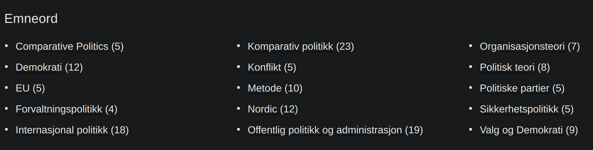
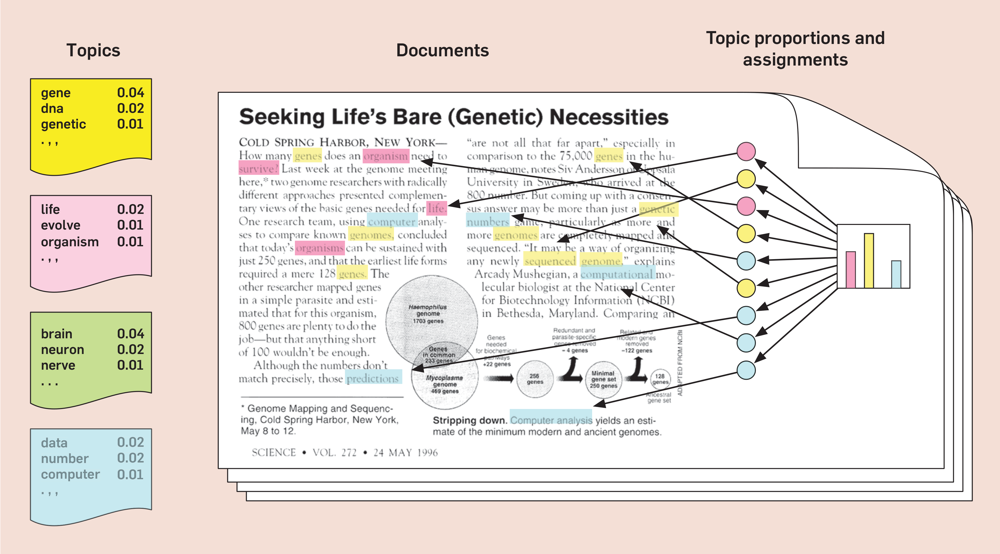

<font size=12>STV2022 -- Store tekstdata</font></br></br>
<p style='font-size:10;color:#42D225'>[08] Klassifisering av tekst -- temamodellering</p></br>
{width=50%} 

Martin Søyland 
<font size=6>\<martin.soyland@stv.uio.no\></font></br>

```{r setup, include=FALSE,warning=FALSE,message=FALSE}
# setwd("./undervisningsmateriell/forelesninger/uke_08/")
knitr::opts_chunk$set(echo = FALSE)
knitr::opts_chunk$set(class.source = "code-bg")
refs <- bibtex::read.bib("../../../referanser/stv2022.bib")

library(tidytext);library(quanteda);library(tidyverse);library(tidytext);library(rvest)

str_break <- function(x, width = 7L) {
  x <- unlist(quanteda::tokenize_fastestword(x))
  n <- length(x)
  if (n <= width) return(x)
  n1 <- seq(1L, n, by = width)
  n2 <- seq(width, n, by = width)
  if (n %% width != 0) n2 = c(n2, n)
  
  lines <- character()
  for(i in 1:length(n1)){
    lines[i] <- paste(x[n1[i]:n2[i]], collapse = " ")
  }
 return(lines) 
}

```


# Disposisjon

- En øvelse i kategorisering
- Om emnemodeller
- ?
- ?

# En øvelse i kategorisering

- Bruk 2 minutter på å diskutere hvordan følgende tekst kan kategoriseres (gis et emne):

. . .

> <font size="5">I Norge har vi mer enn nok plass, vi har folk som vil kjøpe hus og bygge hus som har fått lån, vi har bygningsarbeidere og entreprenører, vi har materialer og redskap. Hva er flaskehalsen? Den eneste ting politikere og byråkrater må sørge for, nemlig tillatelse til å bygge. Det er ikke regulert eller planlagt nok områder til boligbygging, selv om grunneiere står i kø for å selge. Det vi har nok av fra naturens side, nemlig plass, har politikere og byråkrater greid å gjøre til mangelvare.</font>

<font size="4">Carl I. Hagen, FrPs landsmøte 1988</font>


# Hva er emnemodellering

Emnemodellering er <font style='color:cyan'>klassifisering</font> av tekst </br> 
________________________________________________<br>
Vi bruker <font style='color:cyan'>klassifisering</font> til alt mulig rart! `r emo::ji("mag_right")`

. . .

{width=50%}

. . .

{width=50%}

. . .

{width=50%}


---

Emnemodellering bruker <font style='color:#842948'>sameksisterende</font> ord til å estimere emner (*topics*)


<div style="text-align: left">Hentet fra: @Blei2012 </div>

---

> <font size="5">I <font style='color:red'>Norge</font> har vi mer enn nok <font style='color:red'>plass</font>, vi har folk som vil <font style='color:blue'>kjøpe hus</font> og <font style='color:green'>bygge hus</font> som har fått <font style='color:blue'>lån</font>, vi har <font style='color:green'>bygningsarbeidere</font> og <font style='color:green'>entreprenører</font>, vi har <font style='color:green'>materialer</font> og <font style='color:green'>redskap</font>. Hva er flaskehalsen? Den eneste ting <font style='color:orange'>politikere</font> og <font style='color:orange'>byråkrater</font> må sørge for, nemlig <font style='color:orange'>tillatelse til å bygge</font>. Det er ikke <font style='color:orange'>regulert</font> eller <font style='color:orange'>planlagt</font> nok <font style='color:red'>områder</font> til <font style='color:green'>boligbygging</font>, selv om <font style='color:blue'>grunneiere</font> står i kø for å <font style='color:blue'>selge</font>. Det vi har nok av fra <font style='color:red'>naturens</font> side, nemlig <font style='color:red'>plass</font>, har <font style='color:orange'>politikere</font> og <font style='color:orange'>byråkrater</font> greid å gjøre til <font style='color:blue'>mangelvare.</font></font>

. . .

| Emne                                                     | Nøkkelord              | Andel av tekst|
|:---------------------------------------------------------|:-----------------------|:--------------|
|<font style='color:red'>Areal</font>                      | Norge, plass, områder  | 0.06          |
|<font style='color:blue'>Økonomi og eiendom </font>       | kjøpe, lån, mangelvare | 0.07          |
|<font style='color:green'>Eiendomsutvikling</font>        | bygge, hus, redskap    | 0.07          |
|<font style='color:orange'>Politikk of forvaltning</font> | politikere, byråkrater | 0.08          |
| Stoppord                                                 | har, vi, enn, som      | 0.49          |

# Latent Dirichlet allocation (LDA)

- LDA er den en _enkleste_ emnemodellen:
  - En tekst kan bestå av mange emner (multi-membership)
  - Emner er definert som å være en fordeling over et satt vokabular
  - Emnene antas å ha eksistert før data ble generert
  - Vi vet ikke innholdet i emnene før vi kjører modellen (sjult struktur)

- HUSK! Fokuser på å forstå det som kommer ut av modellen og hvordan vi kan validere det!

## Antagelser

1. Rekkefølgen på ord betyr ingenting (sekk med ord)

2. Rekkefølgen på dokumentene betyr ingenting

3. Vi vet antall emner og det antallet er satt


## Fremgangsmåte


- Vi starter med noe og oppdaterer (iterasjoner) til bra endringer forsvinner 


## Hvordan velge antall emner?

1. Prøv noe
2. Validere
3. Prøv igjen
4. Validere
5. ...

# Structural Topic Models

- Veldig lik LDA bortsett fra:
  1. "Prevalence" parameteret
      - ca som uavhengige variabler i en regresjon
  2. "Spectral" initialisering
      - finner antall topics for deg

. . .

OBS! 

> When init.type='Spectral' and K=0 the number of topics is set [...] 
  this does not estimate the 'true' number of topics and does not necessarily 
  have any particular statistical properties for consistently estimating the 
  number of topics. It can however provide a useful starting point.


# Topic Models in practice

. . .

```{r load_data, eval=FALSE}

# Loading SOTU data (should be easy by now)
sotu <- data_corpus_sotu %>% 
  corpus_subset(Date > as.Date("1946-01-01") & type == "SOTU")

# Because the party variable is a factor, and we have more than two parties listed in this factor
table(sotu$documents$party)

# We need to drop the unused parties in our corpus
sotu$documents$party <- droplevels(sotu$documents$party)
table(sotu$documents$party)

# Making a (sloppy) dfm
sotu_dfm <- dfm(sotu,
                remove_punct = TRUE,
                remove_numbers = TRUE,
                stem = TRUE, 
                remove = stopwords("en"), 
                tolower = TRUE,
                verbose = TRUE)

```

---

# Estimating LDA

```{r LDA_est, eval=FALSE}
#### LDA
# Estimating LDA topic model with 20 topics NOTE: 
# "max.em.its" should be way higher. It is set low here for quick convergence
# use default value from ?stm
sotu_lda <- stm(sotu_dfm, K = 20, data = sotu$documents, init.type = "LDA", max.em.its = 5)
save(sotu_lda, file = "./presentations/topic_models/data/sotu_lda.rda")
```

```{r load_LDA, echo=FALSE, eval=FALSE}
load("./presentations/topic_models/data/sotu_lda.rda")
```

---

# Checking LDA results

. . .

```{r check_LDA, eval=FALSE}
# Plotting expected topic proportions
plot(sotu_lda)

# Looking up which topics have "congress" as a high loading term
findTopic(sotu_lda, "congress")

# Checking the highest loading words for topic 5 and 15
labelTopics(sotu_lda, topics = c(5, 15))

# Finding the 2 highest loading texts for topic 12
top12 <- findThoughts(sotu_lda, texts = sotu$documents$texts, n = 2, topics = 12)

# Printing only the first 200 words -- this is a long document, 
# and will clog the console if printed in its entirety
str_sub(top12$docs$`Topic 12`, 1, 200)

# A small dirty solution to finding other meta data
findThoughts(sotu_lda, texts = sotu$documents$President, n = 2, topics = 12)
findThoughts(sotu_lda, texts = as.character(sotu$documents$party), n = 2, topics = 12)

```

---

# STM with set K

```{r STM_setK, eval=FALSE}
#### STM with set amounts of topics and prevalence
# Estimating an STM with K = 20, "Spectral" initialization, and party as independent variable
sotu_stm <- stm(sotu_dfm, K = 20, prevalence = ~ factor(party), data = sotu$documents, init.type = "Spectral", max.em.its = 5)

# save(sotu_stm, file = "./presentations/topic_models/data/sotu_stm.rda")
```


```{r STM_setK_load, echo=FALSE, eval=FALSE}
load("./presentations/topic_models/data/sotu_stm.rda")
```

---

# Checking STM results

. . .

```{r STM_setK_check, eval=FALSE}
# Plotting expected topic proportions
plot(sotu_stm)

# Finding topics related to the word "fiscal"
findTopic(sotu_stm, "fiscal")

# Finding 11 most top loading woirds for topic 3
labelTopics(sotu_lda, topics = 3, n = 11)

# Finding 2 most top loading texts for topic 3
top3_stm <- findThoughts(sotu_stm, texts = sotu$documents$texts, n = 2, topics = 3)

# Printing first 100 characters of the top loading texts
str_sub(top3_stm$docs$`Topic 3`, 1, 100)

# Estimating effect of party on all topics
est_stm <- estimateEffect(~ factor(party), sotu_stm, metadata = sotu$documents)

# Plotting effect of party for topics 1 through 4
plot(est_stm, covariate = "party", topics = 1:4)
```

---

# Estimating STM with "optimal" K

```{r STM_optimalK_estimate, eval=FALSE}
#### STM "optimal" K

# Estimating STM where the model finds the "optimal" amount of topics
sotu_stm_optimal <- stm(sotu_dfm, K = 0, prevalence = ~ factor(party), data = sotu$documents, init.type = "Spectral", max.em.its = 5)

# save(sotu_stm_optimal, file = "./presentations/topic_models/data/sotu_stm_optimal.rda")
```

```{r STM_optimalK_load, echo=FALSE, eval=FALSE}
load("./presentations/topic_models/data/sotu_stm_optimal.rda")
```

---

. . .

```{r STM_optimalK_check, eval=FALSE}
# Checking number of topics
sotu_stm_optimal$settings$dim$K

# Finding topics with high load for the word "democrat", using frequent and exclusive terms only
war <- findTopic(sotu_stm_optimal, "war", type = "frex")

# Plotting expected topic proportions
plot(sotu_stm_optimal, topics = war, labeltype = "lift")

# Estimating effect for all topics
est_stm_optimal <- estimateEffect(~ factor(party), sotu_stm_optimal, metadata = sotu$documents)

# Plotting effect of the "democrat" associated topics 
plot(est_stm_optimal, covariate = "party", topics = war)

plot(est_stm_optimal, covariate = "party", 
     topics = war, method = "difference", 
     cov.value1 = "Democratic", cov.value2 = "Republican")

```

---

# Do MPs in Party-Centered Systems Respond to Constituency Economic Shocks

- Early June 2014, the oil price was well above 100 dollars. 
- During the autumn of 2014, the price fell week by week 
- Below 50 dollars by January 1, 2015

. . .

```{r oilprice, echo=FALSE, fig.height=9, fig.width=15, eval=FALSE}
img <- readPNG("./presentations/topic_models2/oilprice_alternative.png")
grid.raster(img)
rm(img)
```


# STM model

. . .

```{r estimating_oil, eval=FALSE}

load("./presentations/topic_models2/data/reps_preproc_unigram.rda")

meta[1:10, 1:10]
convert(lemma_counts, "matrix")[1:10, 1:10]
```


. . .


```{r estimating_oil2, eval=FALSE, tidy=FALSE}

# Running the STM model (15-20 min runtime)
st_stm <- stm(lemma_counts,                                    # Object containing the document frequency matrix
              K = 0,                                           # Setting the amount of topics to zero (for "spectral" setting)
              seed = 4685,                                     # Setting seed for replication purposes
              max.em.its = 10000,                              # Setting maximum iterations
              prevalence = ~ factor(session) * factor(county), # Setting regression formula
              data = meta,                                     # Setting matching meta data
              init.type = "Spectral")                          # Setting the method of initialization to "spectral

# Saving the environmet
# save.image("./presentations/topic_models2/data/reps_unigram_stm.rda")

```


# Investigating the model


. . .


```{r model_investigation, tidy=FALSE, eval=FALSE}

load("./presentations/topic_models2/data/reps_unigram_stm.rda")

# Checking how many topics we got
st_stm$settings$dim$K

# The lazy way
plot(st_stm, labeltype = "frex")

# The "slightly" more complex way -- stm$theta contains proportions for each document in each topic
top_prop <- data.frame(topic = paste0("Topic ", 1:ncol(st_stm$theta)),
                       m_prop = apply(st_stm$theta, 2, mean),
                       top_frex = apply(labelTopics(st_stm, n = 4)$frex, 1, 
                                        function(x) paste(x, collapse = ", ")))

top_prop$topic <- factor(top_prop$topic, levels = top_prop$topic[order(top_prop$m_prop)])

head(top_prop)

# Lowest topics
top_prop %>% 
  arrange(desc(topic)) %>% 
  tail(n = 20) %>% 
  ggplot(aes(x = topic, y = m_prop * 100)) +
  geom_bar(stat = "identity", fill = rep(c("darkcyan", "#d8b365"), 10)) +
  geom_text(aes(label = top_frex), vjust = 0, hjust = 1.1) +
  coord_flip() +
  scale_y_continuous(expand = c(0, 0), breaks = seq(0, 0.1, 0.001) * 100) +
  labs(x = NULL, y = "Expected topic proportion")

# Topics containing "næring"
top_prop %>% 
  arrange(desc(topic)) %>% 
  filter(str_detect(top_frex, "næring")) %>% 
  ggplot(aes(x = topic, y = m_prop * 100)) +
  geom_bar(stat = "identity", fill = rep(c("darkcyan", "#d8b365"), 2)) +
  geom_text(aes(label = top_frex), vjust = 0, hjust = 1.1) +
  coord_flip() +
  scale_y_continuous(expand = c(0, 0), breaks = seq(0, 0.1, 0.001) * 100) +
  labs(x = NULL, y = "Expected topic proportion")


```


# Finding topics on oil

. . .


- Let's get back on track; we want oil!

```{r top_terms_oil, eval=FALSE}

terms <- labelTopics(st_stm, c(1:st_stm$settings$dim$K))


head(terms$frex)[1:4, ]

head(t(terms$frex))[, 1:4]

findTopic(st_stm, "olje", n = 20)
findTopic(st_stm, "grønn", n = 20)

t(terms$frex)[, 28]

```


. . .


```{r top_texts_oil, tidy = FALSE, eval=FALSE}

# Remember to read the top texts! Bump up n to read more texts (it's low here because it's very verbose)
findThoughts(st_stm, meta$text, topics = 28, n = 1) 

# You can simplify this with str_sub(), for presentational purposes
top_oil_texts <- findThoughts(st_stm, meta$text, topics = 28, n = 10) 

top_oil_texts <- str_sub(meta$text[top_oil_texts$index$`Topic 28`], 1, 100)

top_oil_texts

ggplot(NULL, aes(x = 0, y = 1:10)) +
  geom_text(aes(label = rev(top_oil_texts))) +
  theme(axis.text = element_blank(),
        axis.ticks = element_blank(),
        axis.title = element_blank(),
        axis.line = element_blank())
```


# Estimate effect

. . .


```{r est_eff, eval=FALSE}
# Estimating effect (also here, bump up nsims to 200 or something)
oil_effect <- estimateEffect(~ factor(session) * factor(county), stmobj = st_stm, metadata = meta, nsims = 200)

# save(oil_effect, file = "./presentations/topic_models2/data/oil_effect.rda")
```

# Visualize the effect

. . .


```{r plot_eff, tidy=FALSE, eval=FALSE}

load("./presentations/topic_models2/data/oil_effect.rda")

# Lazy plotting
plot(oil_effect, covariate = "county", topic = 28)

# Also lazy plotting
plot(oil_effect, 
     covariate = "county", 
     moderator = "session", moderator.value = "2013-2014",
     topic = 28)

# Again, lazy
plot(oil_effect, 
     covariate = "county", 
     moderator = "session", moderator.value = "2014-2015",
     topic = 28)


# But we can use the numbers used to produce the plot in a hacky manner
oil_pred2013 <- plot(oil_effect, 
                     covariate = "county", 
                     moderator = "session", moderator.value = "2013-2014",
                     topic = 28)

oil_pred2014 <- plot(oil_effect, 
                     covariate = "county", 
                     moderator = "session", moderator.value = "2014-2015",
                     topic = 28)


# Combining to a data frame
plot_data <- data.frame(fylke = oil_pred2013$uvals,
                        y_hat_before = oil_pred2013$means[[1]],
                        y_hat_after = oil_pred2014$means[[1]],
                        y_hat_before_lwr_95 = oil_pred2013$cis[[1]][1, ],
                        y_hat_before_upr_95 = oil_pred2013$cis[[1]][2, ],
                        y_hat_after_lwr_95 = oil_pred2014$cis[[1]][1, ],
                        y_hat_after_upr_95 = oil_pred2014$cis[[1]][2, ])

# Calculating difference between moderator value 1 and 2
plot_data$diff <- plot_data$y_hat_after - plot_data$y_hat_before


plot_data$fylke


library(ggplot2)

plot_data$fylke <- factor(plot_data$fylke, levels = rev(levels(plot_data$fylke)))

ggplot(plot_data, aes(x = fylke, y = diff)) +
  geom_pointrange(aes(ymin = y_hat_after_lwr_95 - y_hat_after_upr_95, 
                      ymax = y_hat_after_upr_95 - y_hat_before_lwr_95)) +
  coord_flip() +
  geom_hline(yintercept = 0, linetype = "dashed", color = "gray50") +
  labs(y = "Difference", x = NULL) +
  theme_classic() +
  theme(panel.grid.minor = element_blank(),
        panel.grid.major.y = element_blank())

# :(

# NOTE: The diff in diff results from the paper (based on more simulations and more complex preprocessing are "significant")

```


# Model fit

. . .

- Semantically interpretable topic has two qualities: 
1. It is cohesive in the sense that high-probability words for the topic tend to co-occur within documents 
2. It is exclusive in the sense that the top words for that topic are unlikely to appear within top words of other topics

- Semantic coherence:
- Is maximized when the most probable words in a given topic frequently co-occur together
- Semantically coherent models words which are most probable under a topic should co-occur within the same document.
- `semanticCoherence(stm_model, documents = dfm_object, M = n_top_words)` -- default: M = 10

- Exclusivity:
- Includes some information on word frequency as well. 
- It is based on the FREX labeling metric with the weight set to .7 in favor of exclusivity by default.
- `exclusivity(stm_model, M = n_top_words, frexw = weight)` -- default: M = 10, frexw = 0.7

- *While these measures are computationally efficient and interpretable, they cannot replace human judgment!*

# Search K

. . .

- `searchK()` can help understand which models using different K are the most exclusive and cohesive models

```{r searchK, eval=FALSE}
stm_counts <- convert(lemma_counts, "stm")

K <- c(2, 5, 10, 30, 50, 70, 100, 150, 200)

set.seed(4685)

k_results <- searchK(documents = stm_counts$documents,
                     vocab = stm_counts$vocab, K = K,
                     data = stm_counts$meta)

save(k_results, file = "./presentations/topic_models2/data/k_results.rda")

```

. . .


```{r plotsearchK, tidy=FALSE, eval=FALSE}

load("./presentations/topic_models2/data/k_results.rda")

# One alternative
plot(k_results)

# Another alternative
k_result_plotdata <- data.frame(Exclusivity = k_results$results$exclus,
                                Coherence = k_results$results$semcoh,
                                Heldout = k_results$results$heldout,
                                Residual = k_results$results$residual,
                                K = k_results$results$K)


library(reshape2)

k_result_plotdata <- melt(k_result_plotdata, measure.vars = c("Exclusivity", "Coherence",
                                                              "Heldout", "Residual"))

ggplot(k_result_plotdata, aes(x = K, y = value)) +
  facet_wrap(~variable, scales = "free_y") +
  geom_point() +
  geom_line() +
  theme_classic() +
  labs(y = NULL, x = "Number of topics")

# Again, our question is not a set K model problem. But the assignment is!

```


