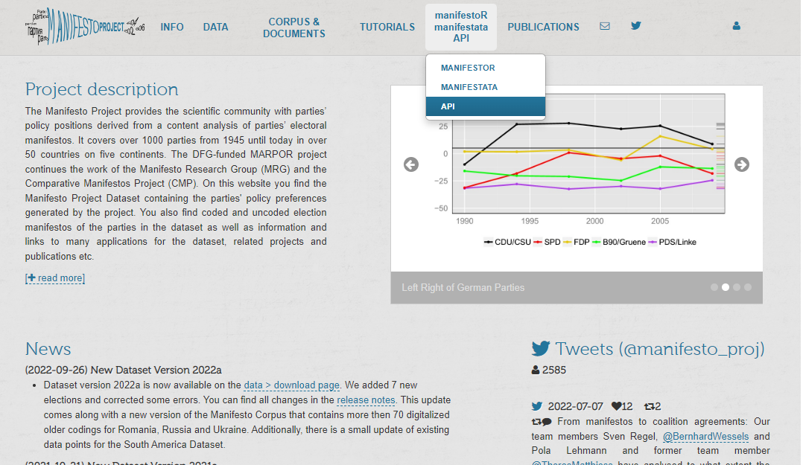
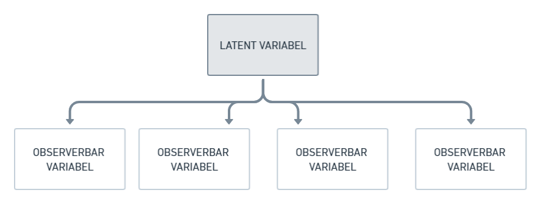
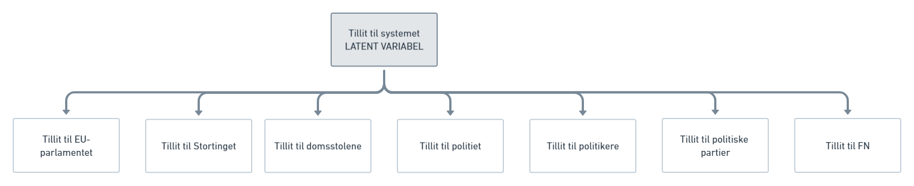
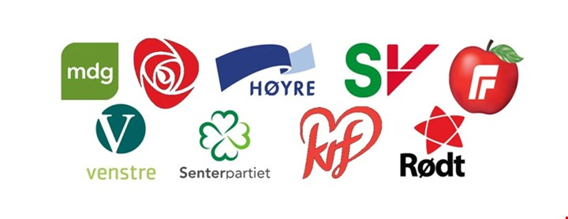
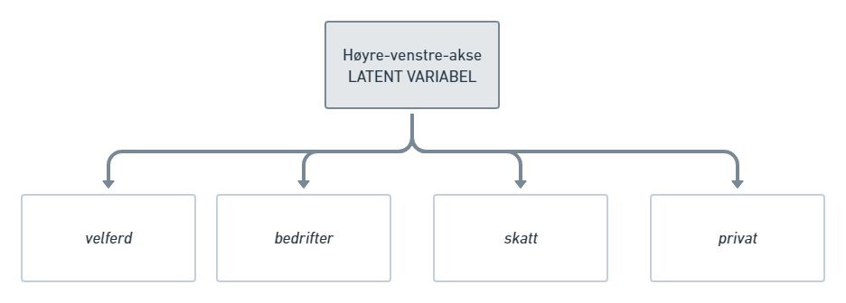
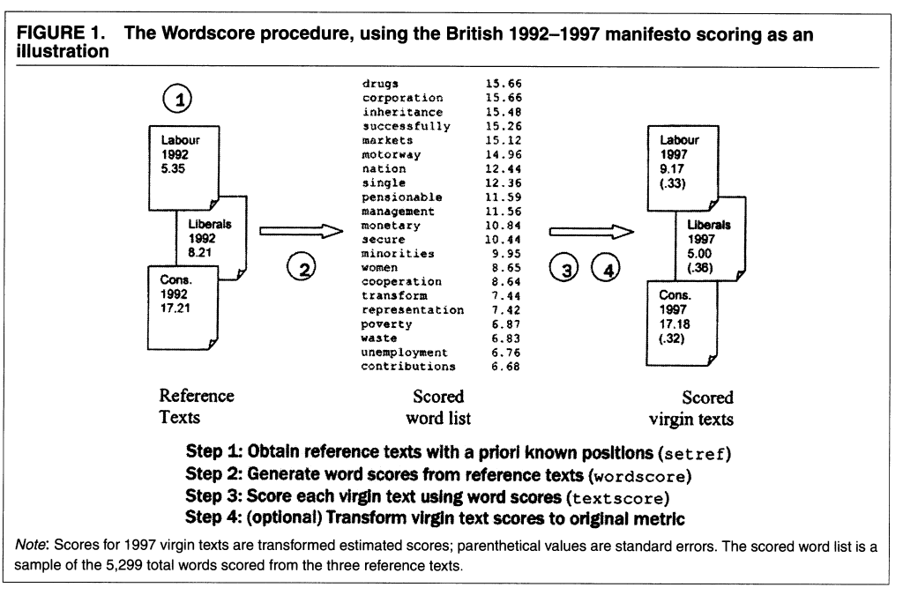
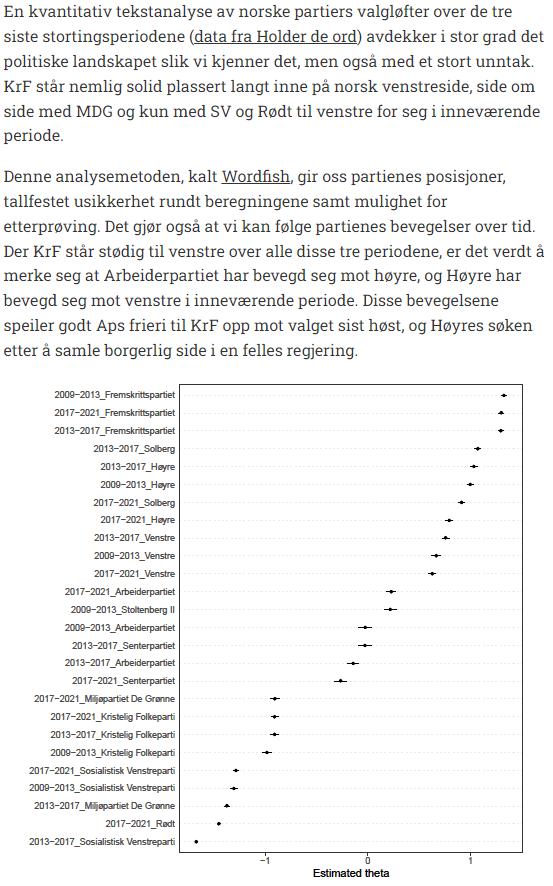
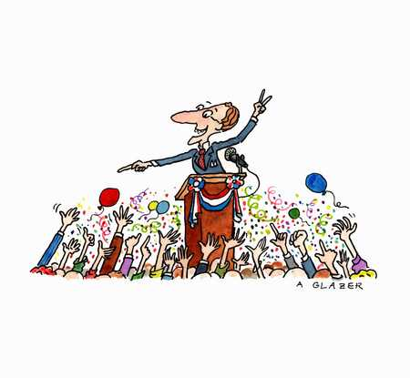

<font size=12>STV2022 -- Store tekstdata</font></br></br>
<p style='font-size:10;color:#D13F11'>[09] Estimere latent posisjon fra tekst</p></br>
{width=50%}

Solveig Bjørkholt
<font size=6>\<solveig.bjorkholt@stv.uio.no\></font></br>

```{r setup, include=FALSE}
knitr::opts_chunk$set(echo = FALSE, warning=FALSE, message=FALSE, error = FALSE)
knitr::opts_chunk$set(class.source = "code-bg")

library(tidyverse)
library(tidytext)

```


# Disposisjon

 - Repetisjon på APIer
    - Å hente data manuelt
    - Å hente data direkte via API
    - Å hente data indirekte via R-pakke for API
    
 - Latent variabel
 - Tekstskalering med `manifestoR`
 - Tekstskalering med `wordscores`
 - Tekstskalering med `wordfish`
 - Å estimere polarisering

# Repetisjon på APIer

## Data for i dag: Comparative Manifesto Project

 - Et svært prosjekt som går ut på å samle partiprogrammer fra alle land og kode dem etter posisjon på ulike politiske saker.

 - Dataene kan dere finne her: 
 
. . .

https://manifesto-project.wzb.eu/ 


## Comparative Manifesto Project

```{r, fig.height=4}

library(manifestoR) # Last inn R-pakken

mp_setapikey("manifesto_api_key_sb.txt") # Sett API-nøkkel

mp_codebook() %>%
  filter(domain_code != 0) %>%
  group_by(domain_code) %>% 
  add_count() %>%
  ggplot(aes(domain_name, n, fill = title)) + 
  geom_bar(stat = "identity") + 
  guides(fill = "none") + 
  coord_flip() +
  labs(x = "", y = "Antall ulike saker innenfor dimensjon") +
  theme_bw()

```

 - Håndkodet datasett: 142 politiske saker innenfor 7 politiske dimensjoner
 - Personer koder leddsetninger i partiprogrammer
 - F. eks. en setning "We strive for good relations and non-conflict with our neighbors" kunne blitt kodet "Peace"

## Hvordan få disse dataene inn i R?

### Mulighet 1: Manuell nedlasting

1. Under *CORPUS & DOCUMENTS*, velg download.

2. Velg hvilke variabler og enheter du vil ha fra menyen.

3. Last ned hvert tekstdokument fra oversikten og lagre i en egen mappe.

4. Les inn tesktdokumentene til `R` med f. eks. `readtext`.

```{r, out.width="40%", fig.align="center", echo = FALSE}
knitr::include_graphics("./figurer/manifesto_manual_download.png")
```

---

### Mulighet 2: API

1. Under *manifestoR manifestata API*, velg API.

2. Se på dokumentasjonen til APIet. 

3. Konstruer en API-spørring for de variablene og enhetene vi er interessert i.

```{r, out.width="50%", fig.align="center", echo = FALSE}

```

---

```{r, echo = TRUE}
library(httr) # API-pakke for R
library(readtext) # Pakke for å lese inn txt-filer (her har jeg min API-nøkkel)
library(jsonlite) # Pakke for å jobbe med json-format

my_api_key <- readtext("manifesto_api_key_sb.txt") %>% pull(text)

api_sporring <- str_c("https://manifesto-project.wzb.eu/api/v1/texts_and_annotations?api_key=", my_api_key, "&keys[]=12620_201709&version=2022-1")

api_sporring

```

 - *https://manifesto-project.wzb.eu/api/v1/texts_and_annotations* -- fast del av API-spørringen
 - *?api_key=* -- spør etter en API-nøkkel som man får hvis man lager en profil på nettsiden
 - *keys[]=12620_2017_09* -- vi ønsker oss Norges (12) konservative parti (620) i valget september 2017 (2017_09)
 - *&version=2022-1* -- og fra manifesto-versjonen i 2022

---

**Partiprogramtekst (leddsetninger) for Høyre**

```{r, echo = TRUE}

manifesto_query <- GET(api_sporring) %>% # GET henter ut data fra spørringen
  httr::content(as = "text") %>% # Denne funksjonen gir oss infoen i JSON-tekst
  jsonlite::fromJSON() # Leser inn i R fra JSON-formatet

manifesto_df <- manifesto_query$items$items %>% # Nøstet langt inne i spørringen er dataframen vår
  tibble(tekst = .) %>% # Gjør om dette til en tibble med variabelnavn "tekst"
  unnest(cols = c(tekst)) # Og flett ut dataframen

manifesto_df %>%
  slice_head(n = 4) # Print de fire første radene i datasettet

```


---

**Partiprogramtekst (leddsetninger) for Arbeiderspartiet og Høyre**

```{r, echo = TRUE}

api_sporring2 <- str_c("https://manifesto-project.wzb.eu/api/v1/texts_and_annotations?api_key=", my_api_key, "&keys[]=12620_201709&keys[]=12320_201709&version=2022-1")

manifesto_query <- GET(api_sporring2) %>%
  httr::content(as = "text") %>%
  jsonlite::fromJSON()

manifesto_df <- manifesto_query$items$items %>%
  tibble(tekst = .) %>%
  mutate(parti = manifesto_query$items$key) %>%
  unnest(cols = c(tekst))

manifesto_df %>%
  group_by(parti) %>%
  slice_head(n = 3)

```

---

### Mulighet 3: R-pakke for API

 - Kan bruke API-et gjennom `R` med vanlige `R`-funksjoner
 
. . .

```{r, echo = TRUE}

library(manifestoR) # Last inn R-pakken

mp_setapikey("manifesto_api_key_sb.txt") # Sett API-nøkkel

mp_metadata(countryname == "Norway") %>% # Hent ut informasjon til spørringen (f. eks. hvis vi er interessert i Norge)
  slice_head(n = 6)

```

---

**De hele partiprogramtekstene**

```{r, echo = TRUE}

valgprogram_corpus <- mp_corpus(countryname == "Norway" & # Ønsker Norge 
                                  edate > as.Date("2017-01-01") & # Alle partiprogrammer fra etter 2017
                                  partyname %in% c("Conservative Party", # For Høyre
                                                   "Labour Party")) # Og for Arbeiderpartiet


valgprogram_tekst <- valgprogram_corpus %>%
  tidy() %>% # Gjør om fra "corpus"-objekt til vanlig dataframe
  select(party, date, title, text) # Hent ut disse variablene

valgprogram_tekst

```

---

**Leddsetningene fra partiprogrammene med cmp_code**

```{r, echo = TRUE}

valgprogram_annotert <- valgprogram_corpus %>%
    as.data.frame(with.meta = TRUE) 

valgprogram_annotert %>%
  select(party, date, title, cmp_code, text) %>%
  slice_head(n = 6)

```

---

```{r, echo = TRUE}
mp_codebook()
```

---

```{r, echo = TRUE}
mp_describe_code("503")
```


# Latent variabel

## Hva er en "latent variabel"?

 - Et underliggende konsept
 - Kan ikke observeres direkte, bare gjennom flere andre variabler

. . .

```{r, out.width="60%", fig.align="center"}

```

. . .

```{r, out.width="60%", fig.align="center"}
knitr::include_graphics("./figurer/latent_variabel.png")
```

---

```{r, out.width="120%", fig.align="center"}

```

<br>

```{r, out.width="65%", fig.align="center"}
knitr::include_graphics("./figurer/ess_sporring.PNG")
```


## Politisk posisjon - et latent konsept

```{r, out.width="70%", fig.align="center"}

```

<br>

 - Vi kan ikke observere partiers politiske posisjon direkte
 - Men vi kan observere andre ting: 
    - Taler
    - Uttalelser i media
    - Partiprogram

## Høyre-venstre-aksen

<br>

```{r, out.width="50%", fig.align="center"}
knitr::include_graphics("./figurer/hoyre_venstre_akse.jpg")
```

```{r, out.width="70%", fig.align="center"}

```

## Andre skillelinjer

```{r, out.width="40%", fig.align="center"}
knitr::include_graphics("./figurer/skillelinjer2.png")
```

## Tekstskalering

 - **Tekstskalering:** Å estimere posisjoner for tekster på en dimensjon. 
 - Skala: En kontinuerlig variabel mellom to ekstremer, f. eks. lav-høy, liten-stor, billig-dyr.
 - Tekster er observerte data for en aktør, f. eks. partiprogrammer for politiske partier.
 - Data er ordene som blir brukt i tekstene.
 
<br>

 - *Antakelse:* At alle tekstene i utvalget befinner seg på den skalaen vi forsøker å måle.

## Diskusjon

 > Kan du komme på flere latente variabler? Lar disse seg måle gjennom tekst, tror du?


# Tekstskalering med `manifestoR`

 - Vi kan anta at venstrepartier snakker mer om "venstre"-saker, og høyrepartier snakker mer om "høyre"-saker
 
 - I Comparative Manifesto Project har man kodet hva slags sak partiene snakker om i partiprogrammene
 
 - Vi kan gruppere disse sakene inn i venstre- og høyre-politikk

## Venstre-høyre-aksen i Comparative Manifesto Project

```{r}

tibble(left = c("103 Anti-Imperialism", "105 Military: Negative", "106 Peace", "107 Internationalism: Positive", "202 Democracy", "403 Market Regulation", "404 Economic Planning", "406 Protectionism: Positive",
                "412 Controlled Economy", "413 Nationalisation", "504 Welfare State Expansion", "506 Education Expansion", "701 Labour Groups: Positive"),
       right = c("104 Military: Positive", "201 Freedom and Human Rights", "203 Constitutionalism: Positive", "305 Political Authority", "401 Free Market Economy", "402 Incentives: Positive",
                 "407 Protectionism: Negative", "414 Economic Orthodoxy", "505 Welfare State Limitation", "601 National Way of Life: Positive", "603 Traditional Morality: Positive", "605 Law and Order: Positive", "606 Civic Mindedness: Positive")) %>%
  DT::datatable() %>%
  DT::formatStyle(columns = colnames(1, 2), fontSize = '5%')


```

---

 1. Finn prosentandel av partiprogrammet som brukes på sak X
 2. Summer opp prosentandelen som brukes på høyre-saker (H) og prosentandelen som brukes på venstre-saker (V)
 3. Trekk prosentandelen for høyresaker (H) fra prosentandelen på venstresaker (V)

. . .

**Rile index** : Indeks for venstre-høyre akse (left-right = *rile*)

`rile = H - V`

. . . 

**Slik finner man rile ved å bruke R:**

```{r, echo = TRUE}

valgprogram_corpus <- mp_corpus(countryname == "Norway" & # Bruker manifestoR-pakken for å hente ut norske partiprogram
                                  edate > as.Date("2013-01-01")) # Velger alle partiprogram som kom etter 1. januar 2013

rile_skalering <- mp_scale(valgprogram_corpus, scalingfun = rile) # Finner rile for norske partiprogram i 2013 og 2017

```

---

### Rile for norske partiprogram 2013-2017 ifølge `manifestoR`

*Rile er -100 hvis et parti kun snakker om venstre-saker og +100 hvis et parti kun snakker om høyre-saker.*

```{r}

rile_skalering <- rile_skalering %>%
  mutate(aar = str_sub(date, 1, 4)) %>%
  mutate(parti = case_when(party == "12110" ~ "MDG",
                           party == "12221" ~ "SV",
                           party == "12230" ~ "Rødt",
                           party == "12320" ~ "AP",
                           party == "12420" ~ "Venstre",
                           party == "12520" ~ "KrF",
                           party == "12620" ~ "Høyre",
                           party == "12810" ~ "SP",
                           party == "12951" ~ "FrP")) %>%
  select(parti, aar, rile)

rile_skalering
```

---

```{r}

manifesto_plot <- rile_skalering %>%
  mutate(parti_aar = str_c(parti, "_", aar)) %>%
  ggplot(aes(fct_reorder(parti_aar, rile), rile)) + 
  geom_point() + 
  labs(x = "", y = "rile (venstre-høyre akse)") +
  coord_flip() + 
  theme_minimal()

manifesto_plot

```


## Egenlagde skaleringsfunksjoner

**Hva med vekst-vern dimensjonen?**

```{r, echo = TRUE}

# mp_codebook() - sjekk hva de ulike kodene betyr med kodeboken

custom_scale <- function(data) {
    scale_ratio_1(data, 
                  pos = c("per501"), # Environmental Protection
                  neg = c("per410")) # Economic Growth: Positive
}

custome_scale <- mp_scale(valgprogram_corpus, scalingfun = custom_scale)

```

```{r, echo = FALSE}

custome_scale %>%
  mutate(aar = str_sub(date, 1, 4)) %>%
  mutate(parti = case_when(party == "12110" ~ "MDG",
                           party == "12221" ~ "SV",
                           party == "12230" ~ "Rødt",
                           party == "12320" ~ "AP",
                           party == "12420" ~ "Venstre",
                           party == "12520" ~ "KrF",
                           party == "12620" ~ "Høyre",
                           party == "12810" ~ "SP",
                           party == "12951" ~ "FrP")) %>%
  select(parti, aar, custom_scale) %>%
  arrange(desc(custom_scale))

```


## Utfordringer med hånd-kodet skalering

 - Ikke sikkert at man klarer å fange opp alle saker innenfor en dimensjon.
 - Hvilke saker som faller innenfor en dimensjon kan variere over tid og mellom land.
 - Ikke alle saker veier like tungt i hvorvidt de reflekterer en dimensjon.
 - Det finnes ingen usikkerhetsmål ettersom kodingen har skjedd kun én gang.


# Tekstskalering med `wordscores`


## Tanken bak `wordscores`

 - Hvis vi allerede vet (*a priori*) hvor på en dimensjon enkelte av tekstene er
 - Så kan vi bruke disse tekstene som *referansetekster*
 - Og gi en score til ordene basert på ordfrekvensen
 - Som kan si noe om hvor de andre tekstene (*jomfrutekster*) befinner seg i forhold til dem

. . .

```{r, out.width="55%", fig.align="center"}

```

## Referansetekster og jomfrutekster

`wordscores` er en form for veiledet læring.

 - Referansetekster = treningsdata
 - Jomfrutekster = testdata
 
 - Referansetekster må være en god og valid *benchmark* for å skalere jomfrutekstene.

## Referansetekster

 > Selecting reference texts thus involves crucial substantive and qualitative decisions by the researcher, equivalent to the decisions made in the design or choice of either a substantive coding scheme for hand-coded content analysis or a coding dictionary for traditional computer-coding.

1. Referansetekster må ha samme ordbruk (partiprogram, stortingstaler, etc.)
2. Bør være representative, dvs. illustrere både ekstremposisjoner på en skala i tillegg til sentrum
3. Bør være nokså lange, slik at de inneholder så mange ord som mulig (som også dukker opp i jomfrutekstene)

## `wordscore` eksempel

La oss bruke ekspersurvey kalt `V-Party dataset`: https://www.v-dem.net/vpartyds.html 

 - Filtrerer ut Norge i 2013
 - Henter ut variabel for partinavn (v2paenname) og variabel for *economic left-right scale* (v2pariglef)

. . .

<br> 

| **Partinavn**                         | **Posisjon på økonomisk høyre-venstre-akse** |
|---------------------------------------|----------------------------------------------|
| Progress Party [Anders Lange’s Party] | 2.292                                        |
| Norwegian Labour Party                | -1.071                                       |
| Conservative Party                    | 1.725                                        |
| Christian Democratic Party            | 0.349                                        |
| Centre [Agrarian] Party               | -0.189                                       |
| Liberal Party of Norway               | 0.626                                        |


---

```{r, echo = FALSE}

valgprogram_tekst <- valgprogram_corpus %>%
  tidy() %>% 
  mutate(aar = str_sub(date, 1, 4)) %>%
  mutate(parti = case_when(party == "12110" ~ "MDG",
                           party == "12221" ~ "SV",
                           party == "12230" ~ "Rødt",
                           party == "12320" ~ "AP",
                           party == "12420" ~ "Venstre",
                           party == "12520" ~ "KrF",
                           party == "12620" ~ "Høyre",
                           party == "12810" ~ "SP",
                           party == "12951" ~ "FrP")) %>%
  mutate(parti_aar = str_c(parti, "_", aar)) %>%
  mutate(pos = ifelse(parti %in% c("MDG", "SV", "Rødt", "AP", "SP"), "venstre",
                      "høyre"))

```


```{r, echo = FALSE}

library(quanteda)
library(quanteda.textmodels)
library(quanteda.textplots)

valgprogram_tekst <- valgprogram_tekst %>%
  mutate(ref_score = ifelse(parti_aar == "FrP_2013", 2.292 ,
                            ifelse(parti_aar == "AP_2013", -1.071,
                                   ifelse(parti_aar == "Høyre_2013", 1.725,
                                          ifelse(parti_aar == "KrF_2013", 0.349,
                                                 ifelse(parti_aar == "SP_2013", -0.189,
                                                        ifelse(parti_aar == "Venstre_2013", 0.626, NA))))))) %>%
  select(parti_aar, pos, text, ref_score)

wordscore_corpus <- corpus(valgprogram_tekst)
#docnames(wordscore_corpus) <- valgprogram_tekst %>% pull(parti_aar)
docvars(wordscore_corpus, field = "pos") <- valgprogram_tekst %>% pull(pos)
docvars(wordscore_corpus, field = "parti_aar") <- valgprogram_tekst %>% pull(parti_aar)
docvars(wordscore_corpus, field = "ref_score") <- valgprogram_tekst %>% pull(ref_score)

summary(wordscore_corpus)

```

---

```{r, echo = FALSE}

# toks_ger <- tokens(wordscore_corpus, remove_punct = TRUE)
# 
# dfmat_ger <- dfm(toks_ger) %>%
#              dfm_remove(pattern = stopwords("no"))
# 
# docnames(valgprogram_dfm)
# 
# tmod_ws <- textmodel_wordscores(dfmat_ger, y = wordscore_corpus$ref_score, smooth = 1)
# summary(tmod_ws)

valgprogram_tokens <- wordscore_corpus %>%
  tidy() %>%
  rowid_to_column() %>%
  mutate(text = str_remove_all(text, "[0-9]+")) %>%
  select(rowid, parti_aar, text) %>%
  unnest_tokens(input = text,
                output = token,
                token = "words",
                strip_punct = TRUE,
                strip_numeric = TRUE) %>% 
  filter(!token %in% quanteda::stopwords("no")) %>%
  mutate(token = quanteda::char_wordstem(token, language = "no")) %>%
  group_by(rowid, parti_aar, token) %>%
  count() %>%
  ungroup()

valgprogram_dfm <- valgprogram_tokens %>%
  cast_dfm(document = parti_aar,
           term = token,
           value = n)

valgprogram_dfm$pos <- docvars(wordscore_corpus, field = "pos")
valgprogram_dfm$parti_aar <- docvars(wordscore_corpus, field = "parti_aar")
valgprogram_dfm$ref_score <- docvars(wordscore_corpus, field = "ref_score")

valgprogram_ws <- textmodel_wordscores(x = valgprogram_dfm, # Dokument-trekk-matrise for tekstene
                                       y = valgprogram_tekst$ref_score, # Referansescore på referansetekstene
                                       smooth = 0) # Denne må være 0 for å kjøre Laver, Benoit og Garry (2003) sin skaleringsmetode

valgprogram_pred <- predict(valgprogram_ws, 
                            se.fit = TRUE, # TRUE for å få usikkerhetsmål på estimatene
                            rescaling = "none", # Sett denne til "lbg" for å transformere jomfrutekstene i takt med Laver, Benoit & Garry (2003)
                            newdata = valgprogram_dfm)

wordscore_plot <- textplot_scale1d(valgprogram_pred)

```

## Ord som bidrar til skaleringen

```{r, echo = FALSE}

ord <- attributes(valgprogram_ws$wordscores) %>% unlist() %>% as.character()

tibble(ord = ord,
       wordscore = round(valgprogram_ws$wordscores, 2)) %>%
  arrange(desc(wordscore)) %>%
  DT::datatable(rownames = FALSE)

```


## Utfordringer med `wordscores`

 - Må ha tilgang på en god og valid benchmark (f. eks. ekspersurvey)
 - Sårbar ift. at score på referansetekster må være riktig (selv eksperter kan være uenig)
 - Trenger tekster som dekker hele spekteret av skalaen
 - Trenger tekster som inneholder alle relevante ord for å skalere jomfrutekstene (ellers får vi systematisk bias)
 - Ikke tydelig hvilke antakelser vi gjør om tekstene på forhånd (kan de f. eks. brukes i tidsserier?)
 - Reskalering har vist seg å være sensitiv til analysevalg (Lowe 2008)
 - Skiller ikke mellom informative ord og hyppige ord 


## Diskusjon

 > Kan vi bruke `wordscores` for å skalere tekster på noe annet enn den "økonomiske høyre-venstre-aksen", for eksempel på "vekst-vern-aksen" eller "religiøs-sekulær-aksen"? Hvordan ville du gått fram for å gjøre dette i så fall?


# Tekstskalering med `wordfish`


## Likheter og forskjeller til `wordscore`

<div class='left' style='float:left;width:49%'>

**Likheter**

 - Skalerer tekster på en dimensjon
 - Krever at ords mening er stabil over tid
 - Gir usikkerhetsestimater

</div>

<div class='right' style='float:right;width:49%'>

**Forskjeller**

 - Krever ingen referansetekster (treningsdata)
 - Antar en underliggende fordeling på ordene
 - Tekster må i helhet handle om den dimensjonen man forsøker å skalere (f. eks. alle tekster handler om utenrikspolitikk)

</div>


---

```{r, echo = FALSE}

valgprogram_wf <- textmodel_wordfish(valgprogram_dfm)
#summary(valgprogram_wf)
wordfish_plot <- textplot_scale1d(valgprogram_wf)

```

## Ord som bidrar til skaleringen

```{r, echo = FALSE}

ord <- valgprogram_wf$features

tibble(ord = ord,
       wordfish = round(valgprogram_wf$beta, 2)) %>%
  arrange(desc(wordfish)) %>%
  DT::datatable(rownames = FALSE)

```


## Hvilke ord bidrar mest til å plassere tekstene?

```{r}

textplot_scale1d(valgprogram_wf, 
                 margin = "features", 
                 highlighted = c("kultur", "skole", "barn", "hus", "pris",
                                 "asyl", "skatt", "konkurs", "lån"))

```


## [Fra en analyse med `wordfish`](https://blog.holderdeord.no/2018/06/17/krfs-spagat-i-det-politiske-landskap/)

```{r, out.width="45%", fig.align="center"}

```


## Utfordringer med `wordfish`

## Diskusjonsspørsmål

> Hvordan ville du gått fram for å skalere vekst-vern-aksen på partiprogrammene med `wordfish`? Kunne du brukt hele dokumentet, eller måtte du hentet ut deler av det?


# Korrespondanseanalyse

## Hva er korrespondanseanalyse?

 - 
 - 
 - Lowe (2008) argumenterte for at `wordscores` er en form for korrespondanseanalyse

--- 

```{r, echo = FALSE}

valgprogram_ca <- textmodel_ca(valgprogram_dfm)
korrespondanse_plot <- textplot_scale1d(valgprogram_ca)

korrespondanse_plot

```

---

```{r, echo = FALSE}

valgprogram_todim <- tibble(parti_aar = valgprogram_ca$rownames,
                            dim1 = coef(valgprogram_ca, doc_dim = 1)$coef_document,
                            dim2 = coef(valgprogram_ca, doc_dim = 2)$coef_document, 
                            dim3 = coef(valgprogram_ca, doc_dim = 3)$coef_document)

valgprogram_todim %>%
  ggplot(aes(x = dim2, y = dim3, color = dim1)) +
  geom_point() + 
  ggrepel::geom_text_repel(aes(label = parti_aar)) + 
  theme_minimal()

```

# Sammenlike metodene

```{r, fig.height=6}

gridExtra::grid.arrange(manifesto_plot + ggtitle("Comparative Manifesto Project (CMP)"), 
                        wordscore_plot + ggtitle("Wordscores"), 
                        wordfish_plot + ggtitle("Wordfish"),
                        korrespondanse_plot + ggtitle("Korrespondanseanalyse"))

```

# Polarisering

## Hva er polarisering

 - *Variasjon* i språk. 
 - Men variasjon kan komme av flere ting:
 
    1. Språk
    2. Stil
    3. Tema
    4. Posisjon, preferanser og sentiment

 - Anvendes typisk på fora der det er mange meningsutvekslinger.

 - Lauderdale & Herzog (2016): Hvordan måle polarisering *innad i samme debatt*?

---

```{r}

# devtools::install_github("kbenoit/wordshoal") 

valgprogram_wsh <- wordshoal::textmodel_wordshoal(valgprogram_dfm,
                                                  groups = valgprogram_dfm$pos,
                                                  authors = valgprogram_dfm$parti_aar,
                                                  dir = c(1, 2), tol = 0.001) 

#summary(valgprogram_wsh)

tibble(parti_aar = valgprogram_wsh$authors,
       score = valgprogram_wsh$theta,
       ci_hoy = valgprogram_wsh$theta+(1.96*valgprogram_wsh$se.theta),      
       ci_lav = valgprogram_wsh$theta-(1.96*valgprogram_wsh$se.theta)) %>%
  ggplot(aes(fct_reorder(parti_aar, score), score)) +
  geom_point() + 
  geom_errorbar(aes(ymin=ci_lav, ymax=ci_hoy, width=0.2)) + 
  coord_flip() +
  labs(x = "") +
  theme_minimal()

```


## Maskinlæring med polarisering

 - Peterson & Spirling (2018) har foreslått å bruke en maskinlæringsmodell for å måle polarisering
 - Deres framgangsmåte:
     - Kjører en maskinlæringsmodell på tekstene
     - Klassifiserer (predikerer) hvor vidt en tekst tilhører aktør A eller aktør B
     - Hvor god modellen er til å skille aktør A og aktør B avgjør polariseringsgraden
     - Hvor god modeller er måles i *accuracy*

. . .

```{r, out.width="70%", fig.align="center"}
knitr::include_graphics("./figurer/accuracy.PNG")
```

---

<br>

```{r, out.width="100%", fig.align="center"}
knitr::include_graphics("./figurer/polarization_plot.PNG")
```


# Takk for i dag!

```{r, out.width="50%", fig.align="center"}

```
