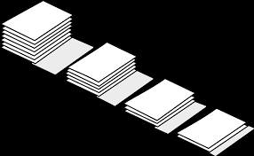
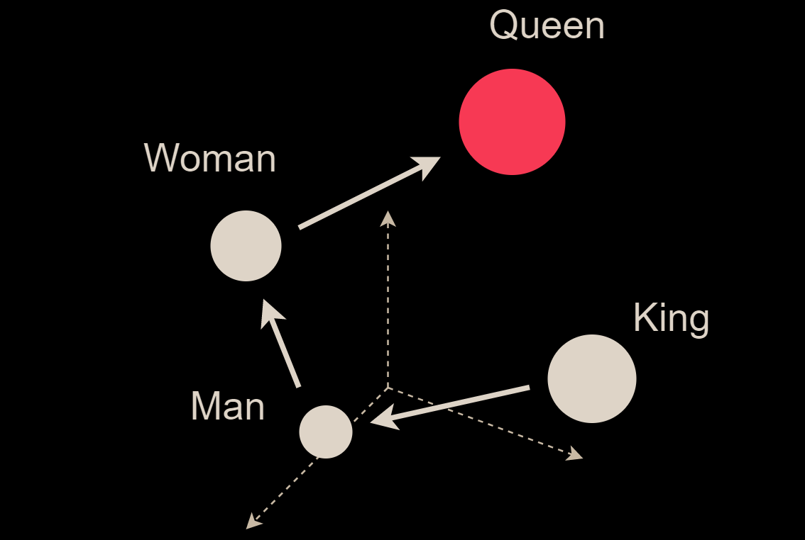
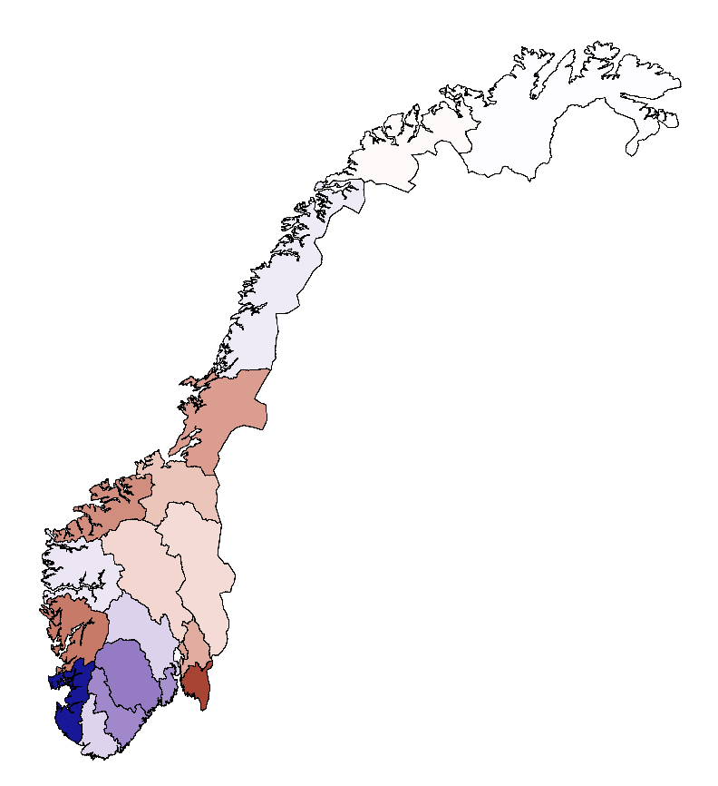
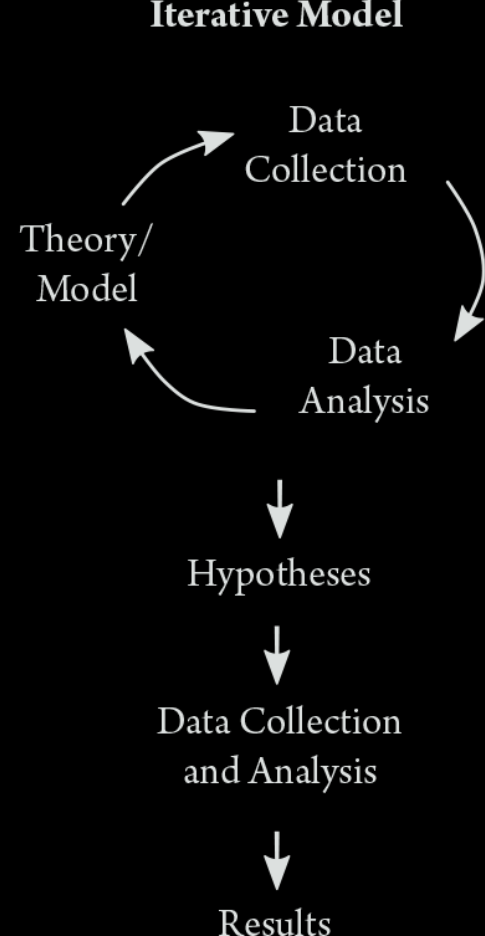
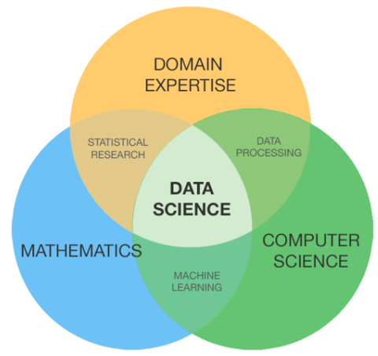
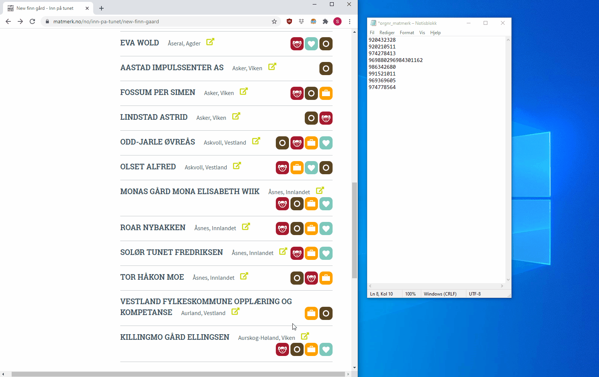
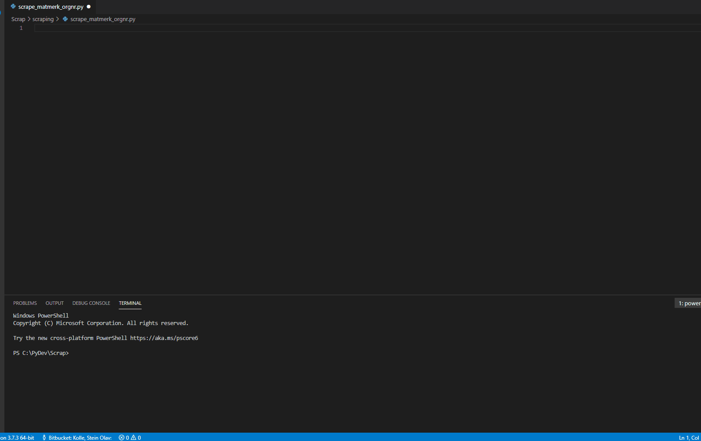

<font size=12>STV2022 -- Store tekstdata</font></br>
<p style='font-size:10;color:#24D4A7'>[10] Oppsummering</p></br>
{width=50%} 
  
Solveig Bjørkholt\ \ \ \ |\ \ \ \ Martin Søyland 
<font size=6>\<solveig.bjorkholt@stv.uio.no\>\ \ |\ \ \<martin.soyland@stv.uio.no\></font>

```{r setup, include=FALSE,warning=FALSE,message=FALSE}
knitr::opts_chunk$set(echo = FALSE)
knitr::opts_chunk$set(class.source = "code-bg")
refs <- bibtex::read.bib("../../../referanser/stv2022.bib")

library(rvest)
library(tidyverse)


```


# {data-background=tv_debatt_blur.png}

</br></br></br>

<p style='font-size:90pt; color:#00f398; font-weight:bold'>
Hva, hvorfor og hvordan?
</p>

## Hva?

- Finne, struktuerer og analysere store (politiske) tekstdata

. . .

<p float="left">
  
   
  
</p>

## Hvorfor?

- Avdekke mønster (likhet/ulikhet/tema)

. . .

{width=50%}
<!-- convert bigram_pos_com_stm_topic28.pdf -gravity South -chop 0x70 arb_led.png -->

## Hvordan?

- R

. . .

```{r swapi_ex, file="../../seminarer/r/swapi_ex.R", eval=FALSE, echo=TRUE}

```

<!-- # {data-background=st_debatt.jpg} -->

<!-- # {data-background=horing.png} -->

## Prosessen

```{r convert, echo=FALSE, eval=FALSE}
system("convert -crop 250x700+0+0 text_models2.png deductive.png")
system("convert -crop 1000x1300+425+0 text_models2.png iterative.png")

```


<font size="2">@Grimmer2022[p.15]</font>

. . .

<div class='left' style='float:left;width:50%'>

{width=35%}


</div> 

. . .

<div class='right' style='float:right;width:50%'>

{width=50%}

</div>

----

> Rather than continue entertaining the fiction of the
standard deductive model of social science research,
in this book we emphasize the recursive nature of the research
process and explain how thinking iteratively is the best
approach for analyzing text as data


# {data-background=tv_debatt_blur.png}

</br></br></br>

<p style='font-size:90pt; color:#00f398; font-weight:bold'>
Videre læring
</p>

## Hva vi har vært gjennom

1. Innhente data: Filformater, skraping, kravling, APIer

2. Strukturere data: Regex, datamanipulering og streng-operasjoner

3. Preprosessere data: Stoppord, liten bokstav, punktsetting, symboler, etc.

4. Tokenisering: Unigram, bigram, trigram, etc.

5. Vektorisering: Sekk med ord, TF-IDF, ord-embeddings

6. Analyser: Ordbøker, likhetsanalyse, sentimentanalyse, temamodellering, tekstskalering


## Hvorfor er denne kunnskapen nyttig?

 - Vi har tilgang på ekstermt mye data i disse dager, men ...
 - Denne dataen er gjerne ustrukturert, ofte i tekstformat
 - Det er stor etterspørsel etter folk som kan håndtere disse dataene
 - Da må man kunne: (1) substans (f. eks. statsvitenskap), (2) *et programmeringsspråk* (f. eks. `R`) og (3) statistiske analysemetoder

{width=35%}


## Hvordan bli bedre?{data-background=eq.png}

</br></br></br>

<p style='font-size:40pt; color:#f0f396; font-weight:bold'>
 Øvelse \ \ \ 
 Nysjerrighet \ \ \ 
 Egne prosjekter \ \ \ 
</p>

Husk å google :) 


## Eksempler på prosjekter

 - Estimere hvor mye selskaper fokuserer på AI i årsrapportene sine ("buzzwords in business")
 
 - Kravling av E24 for å finne artikler om eierskifte i selskap
 
 - Temamodellering for å finne ut om søknader til innovasjonsprosjekter som fokuserer på miljø oftere blir innvilget
 
 - Sentimentanalyse for å måle partikonflikt i spørsmål fra Stortinget

## Digitalisere årsrapporter til kvalitetssikring av statistikk

<video width="1000" height="600" controls>
  <source src="Arsrapporter.mp4" type="video/mp4">
</video>


## Webscraping for å effektivisere informasjonsinnhenting

{width=100%}

---

{width=100%}


## {data-background=questionmark.png}


# {data-background=tv_debatt_blur.png}

</br></br></br>

<p style='font-size:120pt; color:#00f398; font-weight:bold'>
Lykke til videre!
</p>


