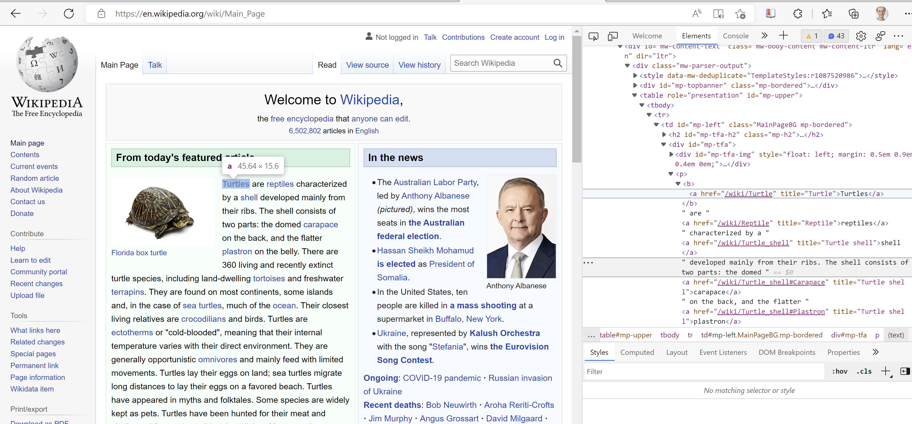
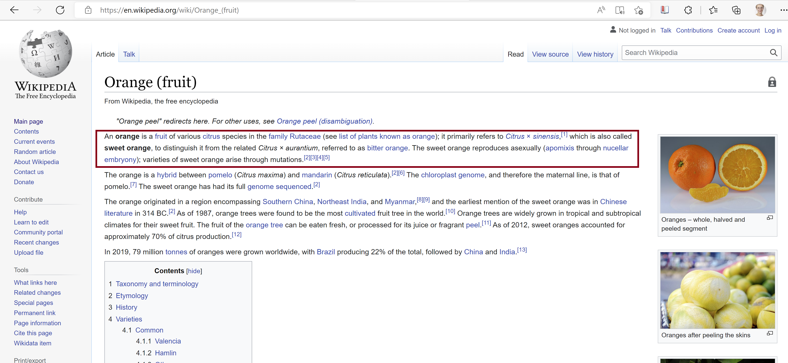
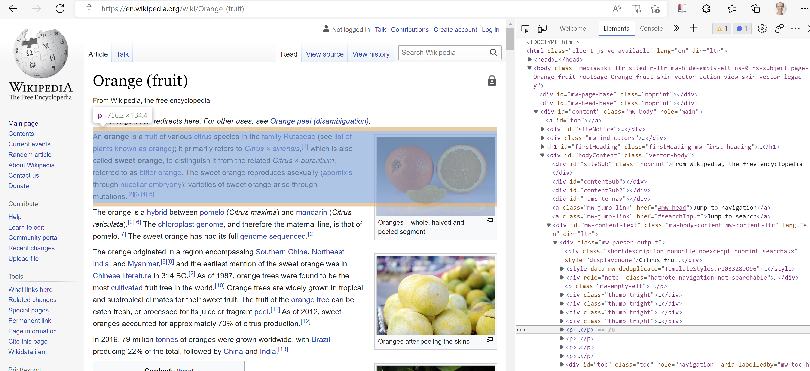

```{r setup, echo=FALSE, message=FALSE, error=FALSE}

# setwd("./undervisningsmateriell/seminarer")
library(knitr)
library(formatR)
library(rmdformats)

## Global options
# options(max.print = "75")
knitr::opts_chunk$set(
  message = FALSE, warning = FALSE, highlight = TRUE
)
#opts_knit$set(width = 75)

library(stringr)
library(dplyr) 
library(ggplot2)
# if("tidytext" %in% installed.packages() == FALSE) install.packages("tidytext")

load("./data/saker.rda")
```

# Introduksjon {#introduksjon}

Velkommen til STV2022 -- Store teksdata!

Dette er en arbeidsbok som går gjennom de forskjellige delene i kurset, med tilhørende R-kode. Meningen med arbeidsboken, er at den kan brukes som forslag til implementering av metoder i semesteroppgaven. Merk likevel at dette ikke er en fasit! 

Om du skulle finne feil i dokumentet, legg gjerne inn en [issue på github](https://github.com/martigso/stv2022/issues/) så får vi fikset det i en fei.


## Kort om kurset

I kurset skal vi bli kjent med analyseprosessen av store tekstdata: Hvordan samler man effektivt og redelig store mengder politiske tekster? Hva må til for å gjøre slike tekster klare for analyse? Og hvordan kan vi analysere tekstene?

Politikere og politiske partier produserer store mengder tekst hver dag. Om det er gjennom debatter, taler på Stortinget, lovforslag fra regjeringen, høringer, offentlige utredninger med mer, er digitaliserte politiske tekster i det offentlige blitt mer tilgjengelig de siste tiårene. Dette har åpnet et mulighetsrom for tekstanalyse som ikke var mulig/veldig vanskelig og tidkrevende før.

Det kan ofte være vanskelig å finne mønster som kan svare på spørsmål og teorier vi har i statsvitenskap i disse store tekstsamlingene. Derfor kan vi se til metoder innenfor maskinlæring for å analysere store samlinger av tekst systematisk. Samtidig er ikke alltid digitaliserte politiske tekster tilrettelagt for å analysers direkte. I disse tilfellene er god strukturering av rådata viktig.

Gjennom å delta i dette kurset vil du lære å søke i store mengder dokumenter, oppsummere disse på meningsfulle måter og indentifisere riktige analysemetoder for å teste statsvitenskaplige teorier med store tekstdata. Kurset vil dekke samling av store volum tekst fra offentlige kilder, strukturering og klargjøring av tekst for analyse og kvantitative tekstanalysemetoder.

## Oppbygging av arbeidsboken

Denne arbeidsboken er ment som supplement til pensum i kurset forøvrig. Her vil vi gå gjennom de ulike delene av kurset, og spesielt legge oss tett opp til seminarundervisningen.

Under vil vi gå gjennom undervisningsopplegget, som arbeidsboken er lagt opp etter. Delene av boken er strukturert som følgende:

1.  [Anskaffelse av tekst](#anskaff)
2.  [Laste inn eksisterende tekstkilder](#lastetekst)
3.  [Forbehandling av tekst (preprosessering)](#prepros)
4.  [Veiledet læring (supervised)](#sup)
5.  [Ikke-veiledet læring (unsupervised)](#unsup)
6.  [Ordbøker](#ordboker)
7.  [Tekstsatistikk](#tekststats)
8.  [Sentiment](#sentiment)
9.  [Temamodellering](#topicmod)
10. [Latente posisjoner i tekst](#posisjon)

### Nødvendige pakker

Vi kommer til å bruke noen pakker gjennom kurset, som det kan være lurt å lære seg litt ekstra godt. Disse pakkene er:

| Pakkenavn              | Beskrivelse                                                                      |
|:-----------------------|:---------------------------------------------------------------------------------|
| [tidyverse]()          | Inneholder pakker som `dplyr`, `ggplot2`, `stringr`, med mer. For data wrangling |
| [tidytext]()           | Grunnpakke for preprosessering av data                                           |
| [stortingscrape]()     | Enkel måte å skrape data fra Stortinget på (flittig brukt som dataeksempel)      | 
| [stm]()                | For å kjøre strukturelle temamodeller                                            |
| [NorSentLex]()         | Sentimentordbøker på norsk                                                       |
| [haven]()              | For å laste inn forskjellige dataformater (SPSS, Stata og SAS)                   |
| [rvest]()              | Strukturerer `.html/.xml`                                                        |
| [rvest]()              | Strukturerer `.html/.xml`                                                        |
| &hellip;               |             

## Anbefalte forberedelser

Siden kurset krever noe forkunnskap om R og generell metodisk kompetanse, anbefaler vi å se over følgende materiale før kurset starter:

- [Arbeidsbøker for R ved UiO](https://shinyibv02.uio.no/connect/#/apps/55/access)
- [R materiale for STV1020](https://github.com/liserodland/STV1020)
- [Bli med på discord!](https://discord.com/invite/CAP9TbdWFa) 
- [Eller facebook](https://www.facebook.com/groups/427792970608618)

# Undervisning

Undervisningen i STV2022 består av 10 forelesninger og 5 seminarer. Vi vil bruke forelesningene til å oppsummere hovedkonseptene i hver ukes tema, både metodisk og anvendt. Seminarene vil ha hovedfokus på teknisk gjennomføring av tekstanalyse i R. Hvert seminar vil være delt i to med én del der seminarleder går gjennom ekstempler på kodeimplementering og én del der studentene kan jobbe med semesteroppgaven. Det er også verdt å merke seg at mange av implementeringene i kurset krever en del prøving og feiling.

Merk at det etter hvert seminar skal leveres inn et utkast av oppgaven for temaet man har gått gjennom i seminaret. Disse delene må bestås for å få vurdert semesteroppgave.

## Forelesninger

De ti forelesningene har følgende timeplan (høsten 2022):

| Dato         | Tid         | Aktivitet                          | Sted       | Foreleser                  | Ressurser/pensum                                                                        |
|:-------------|:------------|:-----------------------------------|:-----------|:---------------------------|:----------------------------------------------------------------------------------------|
| ti. 23. aug. | 10:15–12:00 | Introduksjon                       |	ES, Aud. 5 | S. Bjørkholt og M. Søyland | @Grimmer2022 kap. 1-2 og 22, @Lucas2015, @Silge2017 kap. 1, @Pang2008 kap. 1            |
| ti. 30. aug. | 10:15–12:00 | Anskaffelse og innlasting av tekst | ES, Aud. 5 | M. Søyland                 | @Grimmer2022 kap. 3-4, @Cooksey2014 kap. 1, @Wickham2020, @Hoyland2019                  |
| ti. 6.  sep. | 10:15–12:00 | Forbehandling av tekst 1           | ES, Aud. 5 | M. Søyland                 | @Grimmer2022 kap. 5, @Silge2017 kap. 3, @Joergensen2019, @Barnes2019, @Benoit2020       |
| ti. 13. sep. | 10:15–12:00 | Forbehandling av tekst 2           | ES, Aud. 5 | S. Bjørkholt               | @Grimmer2022 kap. 9, @Silge2017 kap. 4, @Denny2018                                      |
| ti. 20. sep. | 10:15–12:00 | Bruke API – Case: Stortinget	      | ES, Aud. 5 | M. Søyland                 | @datastortinget2022, @Soeyland2022, @Finseraas2021                                      |
| ti. 11. okt. | 10:15–12:00 | Veiledet og ikke-veiledet læring   | ES, Aud. 5 | S. Bjørkholt               | @Grimmer2022 kap. 10 og 17, @DOrazio2014, @Feldman2006a, @Feldman2006b  @Muchlinski2016 |
| ti. 18. okt. | 10:15–12:00 | Ordbøker, tekstlikhet og sentiment | ES, Aud. 5 | S. Bjørkholt               | @Grimmer2022 kap. 7 og 16, @Silge2017 kap. 2, @Pang2008 kap. 3-4, @Liu2015, Liu2015a    | 
| ti. 25. okt. | 10:15–12:00 | Temamodellering	                  | ES, Aud. 5 | M. Søyland                 | @Grimmer2022 kap. 13, @Blei2012, @Silge2017 kap. 6, @Roberts2014                        |
| ti. 1. nov.	 | 10:15–12:00 | Estimere latent posisjon fra tekst | ES, Aud. 5 | S. Bjørkholt               | @Laver2003, @Slapin2008, @Lowe2017, @Lauderdale2016, @Peterson2018                      |
| ti. 15. nov. | 10:15–12:00 | Oppsummering	                      | ES, Aud. 5 | S. Bjørkholt og M. Søyland | @Grimmer2022 kap 28, @Wilkerson2017                                                     |


## Seminarer

| Uke | Aktivitet                                          | 
|:----|:---------------------------------------------------|
| 36  | Seminar 1: Anskaffe tekst og lage dtm i R          |
| 38  | Seminar 2: Preprosessering av tekstdata i R        |
| 42  | Seminar 3: Veiledet og ikke-veiledet læring i R    |
| 44  | Seminar 4: Modelleringsmetoder i R                 |
| 46  | Seminar 5: Fra tekst til funn, Q&A og oppgavehjelp |

Seminarledere:

- Eli Sofie Baltzersen <elibal@student.sv.uio.no>
- Eric Gabo Ekeberg Nilsen <e.g.e.nilsen@stv.uio.no>

```{r child = 'oppgavebygging.Rmd'}
```

## Pensum

Som med alle andre fag, er det sterkt anbefalt at man ser over pensum før forelesning og seminar. Likevel kan pensum i kurset til tider være noe teknisk og uhåndterbart. Det er ikke forventet å _pugge_ formler eller fult ut forstå de matematiske beregninger bak de forskjellige modelleringsmetodene (selv om det åpenbart kan gjøre stoffet lettere å forstå). Hovedfokuset vårt vil være på å forstå hvilke operasjoner man må gjøre for å gå fra tekst til funn, hvilke antagelser man gjør i prosessen og klare å velge de riktige modellene for spørsmålet man vil ha svar på.

Grunnboken i pensum er @Grimmer2022. Vi vil lene oss mye på denne over alle temaene vi gjennomgår. For R har vi valgt å gjøre materialet så standardisert som mulig ved å bruke `tidyverse` så langt det lar seg gjøre. Spesielt bruker vi @Silge2017 for implementeringer via R-pakken `tidytext`.

Vi har også lagt inn noen bidrag som anvender metodene vi går gjennom i løpet av kurset, som @Peterson2018, @Lauderdale2016, @Hoyland2019, @Finseraas2021, for å synliggjøre nytten av metodene i anvendt forskning.


# Laste inn tekstdata {#lastetekst}

I denne delen av arbeidsboken vil vi gå gjennom noen eksempler på hvordan vi kan laste inn tekstdata i R.

Tekstdata kan komme i uendelig mange forskjellige formater, og det er umulig å gå gjennom alle. Vi har likevel noen typer data som er mer vanlig innenfor statsvitenskap enn andre. Under vil vi gå gjennom 1) lasting av ulike to-dimensjonale datasett (.rda/.Rdata, .csv, .sav og .dta), 2) rå tekstfiler (.txt), 3) tekstfiler med overhead (.pdf og .docx).

## To-dimensjonale datasett

Det vanligste formatet på eksisterende data innenfor politisk analyse er to-dimensjonale datasett. Et datasett består av rader (vanligvis observasjoner/enheter) og kolonner (vanligvis variabler). Disse datasettene kommer i mange forskjellige format, men de aller fleste (eller alle) kan leses inn i R om man finner de rette funksjonene.

Under vil vi illustre de forskjellige måtene å laste inn data på med eksempeldata fra pakken `stortingscrape`, som inneholder meta data på alle saker Stortinget behandlet i 2019-2020-sesjonen:

```{r laste_data_data, eval=-1}
 
library(stortingscrape)
#saker <- cases$root

saker %>% 
  select(id, document_group, status, title_short) %>% 
  mutate(title_short = str_sub(title_short, 1, 30)) %>% 
  tail()

```

### .rda og .Rdata

R har sin egen type filformat med filtypene `.rda` og `.Rdata` (`.Rds` finnes også, men vi hopper over det her). Disse to formatene er faktisk akkurat det samme formatet; `.rda` er bare en forkortelse for `.Rdata`. Disse filene er komprimerte versjoner av objekter i *Environment*, som man kan lagre lokalt. Fordi denne filtypen har veldig god kompresjon og selvfølgelig virker sømløst sammen med R, er det et veldig nyttig format å bruke. Dette gjelder særlig når man jobber med store tekstdata. 

Som eksempel på lagring kan jeg trekke ut data fra `stortingscrape`-pakken og lagre disse lokalt med `save()`-funksjonen:

```{r rda_save, eval=FALSE}

save(saker, file = "./data/saker.rda")

```

Om man har flere objekter i *Environment* man vil lagre samtidig som `.rda / .Rdata`, er dette mulig å gjøre med funksjonen `save.image()`.

For å laste inn `.rda / .Rdata` bruker man funksjonen `load()`:

```{r rda_load}

load("./data/saker.rda")

```

En ting som ofte er litt forvirrende, er at filnavnet til `.rda` ikke nødvendigvis samsvarer med navnet man får opp på objektene i R; objektene i *Environment* vil alltid ha samme navn som de hadde i *Environment* når filen ble lagret.

### .csv

Et veldig enkelt og vanlig format for å distribuere data, er kommaseparerte filer (`.csv`). Man kan enkelt lese inn `.csv`-filer med `read.csv()`, eller, som vist under, med funksjonen `read_csv()` fra pakken `readr`.^[Vi bruker `readr` fordi den virker godt sammen med `tidyverse` og er noe raskere enn base-funksjonen `read.csv()`]

```{r csv}

library(readr)

saker <- read_csv("./data/saker.csv", show_col_types = FALSE)

```

Argumentet `show_col_types` fjerner en beskjed om hvordan data blir lastet inn. Dette kan noen ganger være nyttig å se dette, men det blir fort litt *clutter* av det.

### .sav (SPSS) og .dta (Stata)

For å lese inn filer som er lagret i SPSS, bruker vi pakken `haven` som har flere fuksjoner for å lese diverse dataformat (SAS, Stata (se under) og SPSS). Pakken følger standard syntaks for innlesing av data:

```{r sav}
library(haven)
saker <- read_sav("./data/saker.sav")

```

For Stata (`.dta`) er det helt lik syntaks, bare nå med funksjonen `read_dta()`:

```{r dta}

saker <- read_dta("./data/saker.dta")

```

Merk at både SPSS- og Stata-filer kan komme med `labels` på variablene i datasettet. Dette kan noen ganger fungere som en kodebok.

## Rå tekstfiler (.txt)

Rå tekstfiler (`.txt`) er et veldig fint format å jobbe med når man jobber med tekst. Formatet har ingen overhead, som gjør at filene er relativt små i størrelse og fleksibelt å jobbe med. En vanlig måte å strukturere `.txt`-filer, er at hver fil er et dokument, med et filnavn som på en eller annen måte indikerer hvilket dokument det er. Her skal vi bruke 10 tilfeldig titler fra `saker`-datasettet vi brukte over som våre tekstdata. Hver fil er navngitt med tilsvarende `id` fra datasettet.

Vi lister opp filene som er i mappen `data/txt` og leser inn hver fil som et listeelement:

```{r txt}

filer <- list.files("./data/txt", pattern = ".txt", full.names = TRUE)
filer

titler <- lapply(filer, readLines)
class(titler)

# Første tekst
titler[[1]]

```

Hvis man vil gå rett over til et datasett, kan vi navngi listeelementene ved å trekke ut `id` fra filnavnene:

```{r txt2}

names(titler) <- str_extract(filer, "[0-9]+")
names(titler)

```

Deretter kan vi enkelt gjøre om tekstene til en vektor med `unlist()` og putte det inn i en `data.frame()` sammen med en `id` variabel, som vi henter fra navnene i lista:

```{r txt3}
saker_txt <- data.frame(titler = unlist(titler),
                        id = names(titler))
```

For å illustere at dette ble riktig, kan vi merge `saker` med `saker_txt`, og se om variabelen `titler` er den samme som variabelen `title`:

```{r txt4}
saker_merge <- left_join(saker_txt, saker[, c("id", "title")], by = "id")

saker_merge$titler == saker_merge$title

```

Det kan likevel være lurt å jobbe litt med dataene i listeformat før man går over til datasett, om man jobber med veldig store korpus. Lister krever litt mindre minne og kan ofte være litt mer effektivt å jobbe med gjennom funksjoner som `sapply()`, `lapply()` og `mclapply()`

## Tekstfiler med overhead

En `.txt`-fil er som den er; det er ingen sjulte datakilder i slike filer. Det er det derimot i andre filformater. En MS Word-fil, for eksempel, er egentlig bare et komprimert arkiv (.zip) med underliggende `html / xml` som bestemmer hvordan filen skal se ut når du åpner den i MS Word. Vi bruker det siste MS Word-dokumentet Martin skrev (bacheloroppgave fra 2013) som eksempel:

```{r msw_zip}

unzip("data/ba_thesis.docx", exdir = "data/wordfiles")

list.files("data/wordfiles/")

```

Dette gjør at disse filene er mye vanskeligere å lese inn i R enn rå tekstfiler, og vi får veldig rar output når vi bruker `readLines()`:

```{r read_msw_feil, warning=TRUE}

readLines("./data/ba_thesis.docx", n = 2)


```

Derfor vil det kreve andre metoder for å lese inn filer med overhead. Under eksemplifiserer vi med `.docx` og `.pdf`, som er de mest brukte av denne type filer.

### .docx

Heldigvis har andre laget løsninger for oss på dette også. Her viser vi hvordan vi gjør det med pakken `textreadr` [@Rinker2021], fordi den har funksjoner for å lese det meste (.doc, .docx, .pdf, .odt, .pptx, osv):

```{r docx}

library(textreadr)

ba_docx <- read_docx("./data/ba_thesis.docx")

ba_docx[43:46]

```

Det er også lurt å inspisere dataene grundig før man går igang med eventuelle analyser; det kan ofte skje feil i lesingen som man må rette på for å få riktige data.

### .pdf

Det samme gjelder for `.pdf`-filer:

```{r read_pdf}

ba_pdf <- read_pdf("./data/ba_thesis.pdf")

ba_pdf <- ba_pdf$text[4] %>% 
  strsplit("\\n") %>% 
  unlist()

ba_pdf[11:14]

```

Her ble outputen av `read_pdf()` delt inn i sider, i tillegg til at teksten ikke ble delt opp i linjer. Så vi har gått inn og tatt ut side 4, delt opp teksten i linjer og trukket ut tilsvarende linjer som vi gjorde i MS Word-filen.

La oss også nevne at endel (spesielt historiske) dokumenter i `.pdf`-format er scannet og bare inneholder bilder av tekst -- ikke tekst man enkelt kan ta ut av dokumentet. Da må man ty til *Optical Character Recognition* (OCR), noe vi dessverre ikke kommer til å gå gjennom i dette kurset.


# Anskaffelse av tekst {#anskaff}

## .html-skraping

Internett er en fantastisk kilde til informasjon, og derfor også en veldig god måte å anskaffe data på. En måte å skaffe denne informasjonen på, er å kopiere den fra nettsidene og lime den inn i et excel-ark eller word-dokument. Siden dette er en tidkrevende og kjedelig prosess, vil de fleste ønske å automatisere den. Det er dette som er *skraping*. Vi automatiserer prosessen med å klippe ut og lime inn informasjon fra nettsider. Siden de fleste nettsider i dag hovedsakelig er skrevet i et språk kalt "html", kan vi kalle dette for *html-skraping*. 

All html-kode ligger åpent tilgjengelig for alle. For å finne den, åpne en nettside, høyreklikk på siden og velg "Inspect". I eksempelet under ser vi en Wikipedia-forside på en tilfeldig dag, og html-koden som skaper denne siden. 

```{r, out.width="100%", echo = FALSE}

```

All html-kode er hierarkisk. Egentlig likner den veldig på et familietre. I toppen har vi familiens overhode, `<html>`-noden. Her finner vi generell informasjon som hvilket språk nettsiden er på -- engelsk, norsk, fransk, kinesisk... De neste familiemedlemmene er `<head>` og `<body>`.

 - `<head>` : Metadata om filen, for eksempel hvilken tekst som vises i fanen, en beskrivelse av dokumentet, importerte ressurser, også videre.
 - `<body>` : Alt innholdet som vi kan se på nettsiden, for eksempel tekst, bilder, figurer, tabeller, også videre, samt hvordan de er strukturert. 
 
Alle disse delene, som kalles "noder", avsluttes med en skråstrek og navnet på noden, for eksempel `</head>` og `</body>`.

```{r, out.width="100%", echo = FALSE}
knitr::include_graphics("./figurer/wikipedia2.png")
```

`<head>` og `<body>` er barn av noden `<html>`. Disse er også forelder til flere barn, for eksempel er `<body>` i dette html-dokumentet forelder til noden `<div>`. `<div>` angir et spesielt område i dokumentet. Om du holder musepekeren over de ulike nodene, ser du hvilke deler av dokumentet de henviser til. 

```{r, out.width="50%", fig.align="center", echo = FALSE}
knitr::include_graphics("./figurer/wikipedia3.png")
```

Noen eksempler på HTML-noder er:

 - `<div>` : Del av dokumentet 
 - `<section>` : Seksjon av dokumentet
 - `<table>` : En tabell
 - `<p>` : Et avsnitt
 - `<h2>` : Overskrift i størrelse 2
 - `<h6>` : Overskrift i størrelse 6
 - `<a>` : Hyperlenke som refererer til andre nettsider gjennom `href`
 - `` : Et bilde
 - `<br>` : Avstand mellom avsnitt
 

### Hvordan skrape en nettside

Vi bruker R-pakken `rvest` for å skrape. For å laste inn en pakke bruker vi `library`. Om du ikke har installert den før, må du gjøre dette med `install.packages("rvest")` (husk gåsetegnene når man installerer pakker).

```{r}
library(rvest)
```

Når vi skraper en nettside, er det fem steg vi må gjennom:

1. I RStudio, skriv `read_html` og sett som argument addressen eller filstien til nettsiden du vil hente informasjon fra.
2. "Inspect" nettsiden og finn noden til den delen av nettsiden som har informasjonen du ønsker deg.
3. Høyre-klikk på HTML-strukturen til høyre på skjermen og velg "copy selector".
4. Gå tilbake til RStudio. I `html_node` spesifiserer du den relevante noden ved å lime inn det du kopierte i forrige steg. 
5. Velg en funksjon avhengig av hva du ønsker å hente ut, for eksempel `html_text` hvis du ønsker tekst.

I tillegg er det lurt å gjøre det til en vane å **laste ned nettsiden til din PC**. Dette vil hjelpe på flere måter:

 - Det gjør presset på serveren mindre ettersom du bare laster ned nettsiden én gang. 
 - Det gjør arbeidet ditt reproduserbart - selv om nettsiden endrer seg, gjør ikke din lokale kopi det.
 - Det gjør at du kan nå disse filene selv uten at du har internett.

For å laste ned en html-fil kan du bruke `download.file` og sette som argument URL-addressen til nettsiden. Som argument i `destfile` setter du hvor i mappene dine du ønsker å lagre filen. I eksempel under laster jeg ned Wikipedia-artikkelen om appelsiner.

```{r}

download.file("https://en.wikipedia.org/wiki/Orange_(fruit)", # Last ned en html-fil ...
                destfile = "./data/links/Oranges.html") # ... inn i en spesifikk mappe

# Hvis du har mac, må du sette tilde (~) istedenfor punktum (.)
# Husk å være oppmerksom på hvor du har working directory, sjekk med getwd() og sett nytt working directory med setwd()

```

Vi leser inn nettsiden til R med `read_html`. Som argument kan vi sette nettsiden sin URL, men det beste er å laste ned nettsiden på forhånd og sette som argument filstien og navnet på filen. 

```{r, warning=FALSE, error=FALSE, message=FALSE}

library(rvest)

read_html("https://en.wikipedia.org/wiki/Orange_(fruit)") # Les inn direkte fra nettside

read_html("./data/links/Oranges.html") # Les inn fra din nedlastede fil

```

#### Tekst

La oss si vi ønsker oss tekst fra nettsiden. Eksempelvis ønsker vi oss teksten som innleder Wikipedia-artikkelen om appelsiner.

```{r, out.width="100%", echo = FALSE}

```

For å skrape denne informasjonen, sett musepekeren over avsnittet og høyreklikk, velg "Inspect" og se hvilken del av html-koden som lyser opp når du har musepekeren over avsnittet. Vi ser at det er en `<p>`-node som inneholder denne teksen. For å finne den fulle html-noden:

1. Høyreklikk på noden.
2. Velg "Copy".
3. Velg "Copy selector".

```{r, out.width="100%", echo = FALSE}

```

Lim inn dette under `html_node`. Videre, siden vi ønsker oss tekst, velg `html_text`. For å ta ut whitespace kan vi sette `trim = TRUE`.

```{r}

read_html("./data/links/Oranges.html") %>%
  html_node("#mw-content-text > div.mw-parser-output > p:nth-child(9)") %>%
  html_text(trim = TRUE)

```

#### Tabeller

Tabeller er også typisk nokså enkle å hente fra nettsider. De befinner seg gjerne i html-noder kalt `<table>` og `<tbody>`. 

```{r, out.width="100%", echo = FALSE}
knitr::include_graphics("./figurer/oranges3.png")
```

Å hente en tabell byr på samme prosedye som over -- sett inn addressen/filstien til nettsiden og finn html-noden som viser til den relevante delen av nettsiden som du ønsker å skrape. Istedenfor å velge `html_text` velger du da `html_table`. 

```{r}

read_html("./data/links/Oranges.html") %>%
  html_node("#mw-content-text > div.mw-parser-output > table.infobox.nowrap") %>%
  html_table()

```

Vi kan i tillegg rydde litt opp i koden for å få en penere tabell.

```{r}

read_html("./data/links/Oranges.html") %>%
  html_node("#mw-content-text > div.mw-parser-output > table.infobox.nowrap") %>%
  html_table() %>%
  na_if("") %>% # Erstatter "" med NA (missing)
  na.omit() # Fjerner alle NA

```

#### Lenker

Internett er proppfullt av lenker. Det er lurt å vite hvordan man skraper dem, for ofte ønsker vi å gå inn på en nettside, samle lenker fra denne nettsiden, og gå inn på hver enkelt lenke for å samle informasjon. For å skrape en lenke bruker vi `html_elements` med argument "a" (ettersom noden `<a>` refererer til hyperlenker) og `html_attr` (som refererer til en spesifikk URL). Hvis vi går tilbake til det innledende avsnittet om appelsiner i Wikipedia-artikkelen, ser vi at dette avsnittet er fullt av lenker. For å samle disse kan vi bruke koden under:

```{r eval = FALSE}

read_html("./data/links/Oranges.html") %>%
  html_node("#mw-content-text > div.mw-parser-output > p:nth-child(9)") %>%
  html_elements("a") %>%
  html_attr("href")

```

For å få fullstendige lenker, må hente ut de lenkene vi tenker å bruke og lime på første halvdel av URL-en. Dette kan vi gjøre med `str_extract` og `str_c`.

```{r}

links <- read_html("./data/links/Oranges.html") %>%
  html_node("#mw-content-text > div.mw-parser-output > p:nth-child(9)") %>%
  html_elements("a") %>%
  html_attr("href") %>%
  str_extract("/wiki.*") %>% # Samle bare de URL-ene som starter med "/wiki", fulgt av hva som helst (.*)
  na.omit() %>% # Alle andre strenger blir NA, vi fjerner disse
  str_c("https://en.wikipedia.org/", .) # str_c limer sammen to strenger, vi limer på første halvdel av URL-en.

```

Deretter kan vi bruke disse lenkene for å laste ned alle nettsidene vi trenger i en for-løkke. 

```{r}

linkstopic <- str_remove(links, "https://en.wikipedia.org//wiki/")

for(i in 1:length(links)) { # For alle lenkene...
  
  download.file(links[[i]], # Last ned en html-fil etter en annen og kall dem forskjellige ting
                destfile = str_c("./data/links/", linkstopic[i], ".html"))
}

```

Deretter kan vi lage en for-løkke for å skrape alle nettsidene i folderen. 

```{r}

info <- list() # Lag et liste-objekt hvor du kan putte output fra løkken

for (i in 1:length(links)) { # For hver enhet (i) som finnes i links, fra plass 1 til sisteplass i objektet (gitt med length(links))...
  
  page <- read_html(links[[i]]) # ... les html-filen for hver i
  
  page <- page %>% # Bruk denne siden
    html_elements("p") %>% # Og få tak i avsnittene
    html_text() # Deretter, hent ut teksten fra disse avsnittene
  
  info[[i]] <- page # Plasser teksten inn på sin respektive plass i info-objektet
  
}

# Info-objektet inneholder nå blant annet:

info[[1]][3]
info[[2]][3]
info[[3]][2]

```


## Andre formater og APIer {#api}

Selv om nettsider i `.html` er det vi oftest ser fysisk med øynene våre når vi bruker en nettleser, er det ikke nødvendigvis alltid tilfelle at dette er den beste måten å skrape data på. Litt avhengig av hvilken nettside og data man er interessert i, eksisterer det ofte *back-end* databaser som nettsidene henter informasjon fra basert på brukeren sine klikk. Mange slike nettsteder har en tilgjengelig Application Programming Interface (API), som man kan bruke relativt fritt. Og noen nettsider er i seg selv en API. Ta for eksempel [Star Wars API](https://swapi.dev/), som er en database med data på karakterer, verdener, filmer, mm, i Star Wars universet.

Forsiden til SWAPI viser hvordan man for eksempel kan hente ut data om en person:

```{r swapi_intro, echo=1:6, eval=8}

library(curl)

person1_url <- "https://swapi.dev/api/people/1/"

readLines(person1_url)

readLines("./data/swapi/person1.json")

```


### .json

Her ser dataformatet veldig annerledes ut enn en `.html` fordi `.html` er en dårlig måte å lagre data på. De aller fleste APIer bruker heller formater som `.xml` og `.json`. I SWAPI sitt tilfelle, får vi ut data i `.json`-format. Dette formatet egner seg ikke kjempegodt å lese med `readLines()`. Men, som alltid, har noen laget en pakke som parser data i `.json` for oss:

```{r swapi_luke}

library(jsonlite)

person1 <- read_json("./data/swapi/person1.json")

names(person1)
class(person1)

person1$name
person1$starships

```

Elementer som `starships`, `homeworld` og`films` linker videre til andre deler av APIet, som man kan trekke ut videre data fra om det er ønskelig

Under finner du et litt lenger eksempel på en potensiell workflow for SWAPI, som det går an å eksperimentere med:

```{r swapi_long_ex, file="r/swapi_ex.R", eval=FALSE, class.source="fold-hide"}

```

Et lite tips, om man jobber med vedlig uoversiktelige `.json`-filer, er å bruke `listviewer`-pakken. Den gir et veldig oversiktelig visuelt tre av dataene.


### .xml

Det andre dataformatet som er mest vanlig i APIer er `.xml`. Siden vi skal bruke [Stortinget](https://data.stortinget.no) som eksempel i en hel forelesning, bruker vi et annet eksempel her: 


### API-liste


- [Stortinget](https://data.stortinget.no)
- [Helsedirektoratet](https://www.helsedirektoratet.no/om-oss/apne-data-api)
- [Nasjonalbiblioteket](https://api.nb.no/)
- [Wikipedia](https://www.mediawiki.org/wiki/API:Main_page)
- [Kartverket](https://www.kartverket.no/api-og-data)
- [Felles datakatalog](https://data.norge.no/)
- [yr.no](https://developer.yr.no/)
- [Entur](https://developer.entur.org/)
- [SSB](https://www.ssb.no/api)
- [Brønnøysundregistrene](https://www.brreg.no/produkter-og-tjenester/apne-data/)
- [Kystverket](https://data.kystverket.no/)
- [Statens vegvesen](https://dataut.vegvesen.no/)

# Preprosessering {#prepros}

Når vi nå har lært både å laste inn eksisterende tekstdata og strukturere våre egne data via skraping, kan vi begynne å tenke på hvordan vi kan sammenligne tekstene i vårt korpus eller datasett. Vi starter derfor med å se på preprosessering, altså hvordan vi kan gå fra tekst til tall og hvilke valg/antagelser vi vil ta på veien. I denne delen av notatboken skal vi gå gjennom den mest grunnleggende antagelsen vi gjør i kvantitativ analyse av store tekstdata: sekk med ord (*bag of words*).

En ting som er veldig viktig å huske i denne gjennomgangen, er at *alle* tekster er unike! Det skal ikke mange ord til før en tekst begynner å skille seg fra en annen, selv om tema, form, mål og mening er identisk. Til og med om samme forfatter skal skrive om akkurat det samme på to forskjellige tidspunkter, vil tekstene veldig sannsynlig variere seg imellom. Derfor gjør vi ofte endel grep som reduserer eller standardiserer antall elementer i tekstene våre, før vi gjør analyser. Dette er det vi her forstår som preprosessering.

Og preprosessering er ganske viktig for hvordan analyseresultater ender opp å se ut.

## Sekk med ord

Ta for eksempel spor 6 på No.4-albumet vi allerede har jobbet med -- *Regndans i skinnjakke*. Hvis vi skal følge en vanlig antagelse i kvantitativ tekstanalyse -- "sekk med ord" eller *bag of words* -- skal vi kunne forstå innholdet i en tekst hvis vi deler opp teksten i segmenter, putter det i en pose, rister posen og tømmer det på et bord. Da vil denne sangen for eksempel se slik ut:

```{r bow, tidy=TRUE, results='markup'}

regndans <- readLines("./data/regndans.txt")

bow <- regndans %>% str_split("\\s") %>% unlist()

set.seed(984301)

cat(bow[sample(1:length(bow))])

```

De fleste (som ikke kan sangen fra før) vil ha vanskelig å forstå hva den egentlig handler om bare ved å se på dette. Vi kan identifisere meningsbærende ord som "Oslofjorden", "Grille", "trampoline", "dragepust", med mer. Likevel er det vanskelig å skjønne hva låtskriveren egentlig vil formidle med denne teksten. Det er dette som gjør "sekk med ord"-antagelsen veldig streng. Språk er veldig komplekst og ordene i en tekst kan endre mening drastisk bare ved å se på en liten del av konteksten de dukker opp i. Om vi bare ser på linjen som inneholder orded "dragepust", innser vi fort at konteksten rundt ordet gir oss et veldig tydelig bilde av hva låtskriveren mener med akkurat den linjen:

```{r dragepust}

regndans[which(str_detect(regndans, "dragepust"))]

```

Likevel gir det oss ikke et godt bilde på hva teksten handler om i sin helhet. Det får vi bare sett ved å se på hele teksten:

```{r regndans_full, echo=FALSE}
cat(paste(regndans, collapse = "\n"))
```

Nå teksten gir mening! Tolkninger kan selvfølgelig variere fra individ til individ og den "riktige" tolkningen, er det bare forfatteren som vet hva er. Personlig tolker jeg denne teksten som et utløp for frustrasjon under corona-pandemien, og prospektene ved livet når samfunnet gjenåpnes, fordi jeg hørte den for første gang under nedstengningen.

Hovedpoenget med å vise dette er at *sekk med ord*-antagelsen er veldig streng og ofte veldig urealistisk. Tekster (og språk generelt) er ekstremt komplekst. Det kan variere mellom geografiske områder (nasjoner, dialekter, osv), aldersgrupper, arenaer (talestol, dialog, monolog, osv), og individuell stil. Oppi alt dette skal vi prøve å finne mønster som sier noe om likhet/ulikhet mellom tekster. Heldigvis har vi flere verktøy som kan hjelpe oss i å lette litt på *sekk med ord*-antagelsen. Men antagelsen vil likevel alltid være der, i en eller annen form. La oss se litt på hvilke teknikker vi kan bruke for å gjøre modellering av tekst noe mer omgripelig¸ men aller først skal vi se litt på hvilke trekk som muligens ikke gir oss så mye informasjon om det vi er ute etter, eller støy, som vi ofte vil fjerne.

<!-- mange gifte par vs. gifte et par -->

## Fjerne trekk?


<!-- ```{r} -->
<!-- library(tidytext) -->

<!-- load("./data/no4.rda") -->

<!-- no4_tokens <- no4 %>% -->
<!--   group_by(spor, titler) %>%  -->
<!--   unnest_tokens(output = token, -->
<!--                 input = tekst) %>%  -->
<!--   count(token) -->

<!-- no4_tokens %>% slice_max(n, n = 1, with_ties = FALSE) -->

<!-- ``` -->


### Punktsetting

### Stoppord

## Rotform av ord

### Stemming

### Lemmatisering

## ngrams

## Taledeler (parts of speech) {#pos}

# Veildedet læring {#sup}

# Ikke-veiledet læring {#unsup}

# Ordbøker {#ordboker}

# Tekststatistikk {#tekststats}

## Likhet

## Avstand

## Lesbarhet

## Uttrykk

# Sentiment {#sentiment}

## NorSentLex

Det har lenge vært ganske lite ressurser for sentimentanalyse på norsk. @Barnes2019 har ganske nylig satt sammen en stor [ordbok](#ordboker) med positive og negative ord i for både fullform og lemmatisert form med [PoS-tags](#pos)^[se: https://github.com/ltgoslo/norsentlex]. Disse ordbøkene bygger på en en oversatt og manuelt korrigert engelsk korpus av kundetilbakemeldinger [@Hu2004] og er pakket i både rå `.txt`-filer og `.json`-filer. Heldigvis har en tulling også konvertert dette til en pakke i R: [`NorSentLex`](https://github.com/martigso/NorSentLex) (for øyblikket ikke på CRAN). For å laste inn/ned ordbøkene, kan du enten installere R-pakken med `devtools::install_github("martigso/NorSentLex")` eller bruke det du lærte i [skrape-delen](#anskaff) av denne notatboken på [de originale filene](https://github.com/ltgoslo/norsentlex). La oss illustrer med R-pakken:

```{r norsentlex_hidden, echo=FALSE}
load("./data/nor_fullform_sent.rda")
load("./data/nor_lemma_sent.rda")
```

```{r norsentlex_load, eval=FALSE}
# devtools::install_github("martigso/NorSentLex")

# library(NorSentLex)
```

```{r norsentlex_general}

# Ordbøker i fullform
names(nor_fullform_sent)

# Ordbøker for lemma med PoS-tags
names(nor_lemma_sent)

```

Hvis vi vil se på, for eksempel, noen positive ord i fullform, kan vi gå inn i listen `nor_fullform_sent` og listeelementet som heter `$positive`:

```{r pos_fullform, echo=-1}
set.seed(58493)
nor_fullform_sent$positive %>% head()
nor_fullform_sent$positive %>% tail()
nor_fullform_sent$positive %>% sample(., 6)

```

Det er ikke nødvendigvis alt som gir mening som positive og negative ord, med mindre man har i bakhodet at dette er basert på kundeanmeldelser. Så vær varsom!

Om vi videre vil bruke den lemmatiserte ordboken, kan vi også trekke dette ut enkelt fra de forskjellige elementene i `nor_lemma_sent`. Si at vi skal bruke bare positive substantiv:

```{r pos_subst, echo=-1}
set.seed(8943)
nor_lemma_sent$lemma_noun_positive %>% sample(., 6)

```

Nå når vi vet hvordan vi finner ordboken, gjenstår å lære hvordan vi bruker den. La oss bruke fullformord fra No.4-albumet `data`-mappen (`no4.rda`) som eksempel. Først splitter vi opp teksten i ord (*tokens*):

```{r regndans_sent_setup}

library(tidytext)

load("./data/no4.rda")

no4 <- no4 %>% 
  group_by(titler) %>% 
  unnest_tokens(ord, tekst)

```

Så kryss-refererer vi hvert ord med de positive og negative fullformordene i ordboken:

```{r regndans_sent}


no4$pos_sent <- ifelse(no4$ord %in% nor_fullform_sent$positive, 1, 0)
no4$neg_sent <- ifelse(no4$ord %in% nor_fullform_sent$negative, 1, 0)

table(no4$pos_sent, 
      no4$neg_sent, 
      dnn = c("positiv", "negativ"))

```

Som vi ser, er det faktisk noen flere negative ord enn positive i albument. Men overvekten av ord er nøytrale (0 på begge). Vi kan også summere opp sentiment over sangene, og se om det er noe forskjell i sentiment mellom dem:

```{r no4_sent_sum}

no4_sent <- no4 %>% 
  group_by(titler) %>% 
  summarize(pos_sent = mean(pos_sent),
            neg_sent = mean(neg_sent)) %>% 
  mutate(sent = pos_sent - neg_sent)

no4_sent
```

Ikke alverden forskjell, men noen sanger er med positive enn negative og motsatt. La oss visualisere:

```{r no4_vis}

no4_sent %>% 
  mutate(neg_sent = neg_sent * -1) %>% 
  ggplot(., aes(x = str_c(sprintf("%02d", 1:12),
                          ". ",
                          str_sub(titler, 1, 7),
                          "[...]"))) +
  geom_point(aes(y = neg_sent, color = "Negativ")) +
  geom_point(aes(y = pos_sent, color = "Positiv")) +
  geom_point(aes(y = sent, color = "Snitt")) +
  geom_linerange(aes(ymin = neg_sent, ymax = pos_sent), color = "gray40") +
  scale_color_manual(values = c("red", "cyan", "gray70")) +
  labs(x = NULL, y = "Sentiment", color = NULL) +
  ggdark::dark_theme_minimal() +
  theme(axis.text.x = element_text(angle = 90, vjust = .25, hjust = 0))

```


# Temamodellering {#topicmod}

```{r}

```


# Latente posisjoner {#posisjon}

# Noen tanker om videre læring {#videreilivet}

# Oppsummering {#oppsummering}

`r if (knitr::is_html_output()) '# Referanser'`

```{r writeManifest, echo=FALSE, eval=FALSE}
installed.packages()
# Oppdaterer manifest -- jeg tror vi må kjøre denne manuelt hver
# gang før vi pusher til github. uio-serveren er hvertfall ikke fornøyd
# når jeg ikke gjør det.
rsconnect::writeManifest("./")

# For å trekke ut koden fra hele boka til en R-fil
knitr::purl("./notatbok.Rmd",
            output = "./notatbok_kode.R",
            documentation = 1)
```
