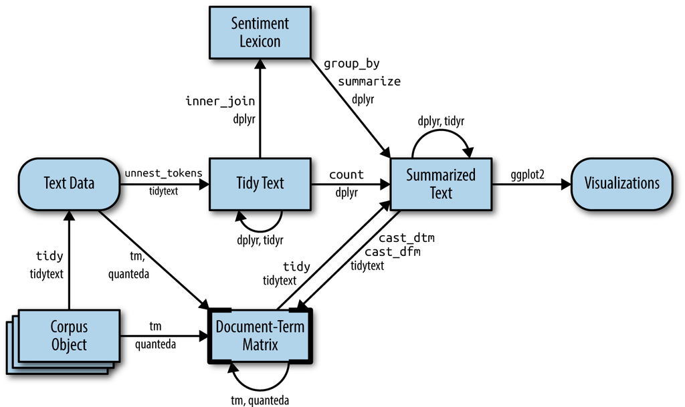

```{r setup, echo=FALSE, message=FALSE, error=FALSE, warning=FALSE}

# setwd("./undervisningsmateriell/seminarer")
library(knitr)
library(formatR)
library(rmdformats)

## Global options
# options(max.print = "75")
knitr::opts_chunk$set(
  message = FALSE, 
  warning = FALSE, 
  highlight = TRUE
)
#opts_knit$set(width = 75)

library(stringr)
library(dplyr) 
library(ggplot2)


# if("tidytext" %in% installed.packages() == FALSE) install.packages("tidytext")

load("./data/saker.rda")
```

# Introduksjon {#introduksjon}

Velkommen til STV2022 -- Store teksdata!

Dette er en arbeidsbok som går gjennom de forskjellige delene i kurset [STV2022 -- Store teksdata](https://www.uio.no/studier/emner/sv/statsvitenskap/STV2022/index.html), med tilhørende R-kode. Meningen med arbeidsboken, er at den kan brukes som forslag til implementering av metoder i semesteroppgaven. Merk likevel at dette ikke er en fasit! 

Om du skulle finne feil i dokumentet, legg gjerne inn en [issue på github](https://github.com/martigso/stv2022/issues/) så får vi fikset det i en fei.


Siste endring:
```{r siste_commit, echo=FALSE}

gh_com <- "https://github.com/martigso/stv2022/commits/master.atom" %>% 
  rvest::read_html(.)


gh_com_title_latest <- gh_com %>% 
  rvest::html_elements("title") %>% 
  rvest::html_text() %>% 
  .[2] %>% 
  str_trim()

gh_com_date_latest <- gh_com %>% 
  rvest::html_elements("updated") %>% 
  rvest::html_text() %>% 
  .[2] %>% 
  as.Date()

cat(paste0(gh_com_title_latest, " (", gh_com_date_latest, ")"))
```


## Kort om kurset

I kurset skal vi bli kjent med analyseprosessen av store tekstdata: Hvordan samler man effektivt og redelig store mengder politiske tekster? Hva må til for å gjøre slike tekster klare for analyse? Og hvordan kan vi analysere tekstene?

Politikere og politiske partier produserer store mengder tekst hver dag. Om det er gjennom debatter, taler på Stortinget, lovforslag fra regjeringen, høringer, offentlige utredninger med mer, er digitaliserte politiske tekster i det offentlige blitt mer tilgjengelig de siste tiårene. Dette har åpnet et mulighetsrom for tekstanalyse som ikke var mulig/veldig vanskelig og tidkrevende før.

Det kan ofte være vanskelig å finne mønster som kan svare på spørsmål og teorier vi har i statsvitenskap i disse store tekstsamlingene. Derfor kan vi se til metoder innenfor maskinlæring for å analysere store samlinger av tekst systematisk. Samtidig er ikke alltid digitaliserte politiske tekster tilrettelagt for å analysers direkte. I disse tilfellene er god strukturering av rådata viktig.

Gjennom å delta i dette kurset vil du lære å søke i store mengder dokumenter, oppsummere disse på meningsfulle måter og indentifisere riktige analysemetoder for å teste statsvitenskaplige teorier med store tekstdata. Kurset vil dekke samling av store volum tekst fra offentlige kilder, strukturering og klargjøring av tekst for analyse og kvantitative tekstanalysemetoder.

## Oppbygging av arbeidsboken

Denne arbeidsboken er ment som supplement til pensum i kurset forøvrig. Her vil vi gå gjennom de ulike delene av kurset, og spesielt legge oss tett opp til seminarundervisningen.

Under vil vi gå gjennom undervisningsopplegget, som arbeidsboken er lagt opp etter. Delene av boken er strukturert som følgende:

1.  [Anskaffelse av tekst](#anskaff)
2.  [Laste inn eksisterende tekstkilder](#lastetekst)
3.  [Forbehandling av tekst (preprosessering)](#prepros)
4.  [Veiledet læring (supervised)](#sup)
5.  [Ikke-veiledet læring (unsupervised)](#unsup)
6.  [Ordbøker](#ordboker)
7.  [Tekststatistikk](#tekststats)
8.  [Sentiment](#sentiment)
9.  [Temamodellering](#topicmod)
10. [Latente posisjoner i tekst](#posisjon)

### Nødvendige pakker

Vi kommer til å bruke noen pakker gjennom kurset, som det kan være lurt å lære seg litt ekstra godt. Disse pakkene er:

| Pakkenavn              | Beskrivelse                                                                      |
|:-----------------------|:---------------------------------------------------------------------------------|
| [tidyverse]()          | Inneholder pakker som `dplyr`, `ggplot2`, `stringr`, med mer. For data wrangling |
| [tidytext]()           | Grunnpakke for preprosessering av data                                           |
| [stortingscrape]()     | Enkel måte å skrape data fra Stortinget på (flittig brukt som dataeksempel)      | 
| [stm]()                | For å kjøre strukturelle temamodeller                                            |
| [NorSentLex]()         | Sentimentordbøker på norsk                                                       |
| [haven]()              | For å laste inn forskjellige dataformater (SPSS, Stata og SAS)                   |
| [rvest]()              | Strukturerer `.html/.xml`                                                        |
| &hellip;               |             

## Anbefalte forberedelser

Siden kurset krever noe forkunnskap om R og generell metodisk kompetanse, anbefaler vi å se over følgende materiale før kurset starter:

- [Arbeidsbøker for R ved UiO](https://shinyibv02.uio.no/connect/#/apps/55/access)
- [R materiale for STV1020](https://github.com/liserodland/STV1020)


## Nyttige linker

- [Emneside UiO](https://www.uio.no/studier/emner/sv/statsvitenskap/STV2022/index.html)
- [Coffee and coding](https://www.sv.uio.no/isv/english/research/courses/coffee-and-coding/)
- [Bli med på discord for R!](https://discord.com/invite/CAP9TbdWFa) 
- [Eller facebook](https://www.facebook.com/groups/427792970608618)

# Undervisning

Undervisningen i STV2022 består av 10 forelesninger og 5 seminarer. Vi vil bruke forelesningene til å oppsummere hovedkonseptene i hver ukes tema, både metodisk og anvendt. Seminarene vil ha hovedfokus på teknisk gjennomføring av tekstanalyse i R. Hvert seminar vil være delt i to med én del der seminarleder går gjennom ekstempler på kodeimplementering og én del der studentene kan jobbe med semesteroppgaven. Det er også verdt å merke seg at mange av implementeringene i kurset krever en del prøving og feiling.

Etter hvert seminar skal du levere et utkast av oppgaven for temaet man har gått gjennom i seminaret. Disse delene må bestås for å få vurdert semesteroppgave.

## Forelesninger

De ti forelesningene har følgende timeplan (høsten 2022):

| Dato         | Tid         | Aktivitet                                                                                                    | Sted       | Foreleser                  | Ressurser/pensum                                                                        |
|:-------------|:------------|:-------------------------------------------------------------------------------------------------------------|:-----------|:---------------------------|:----------------------------------------------------------------------------------------|
| ti. 23. aug. | 10:15–12:00 | [Introduksjon](https://shiny.uio.no/content/71d813c6-621a-4b7e-9c4d-c4a09a047acd)                            |	ES, Aud. 5 | S. Bjørkholt og M. Søyland | @Grimmer2022 kap. 1-2 og 22, @Lucas2015, @Silge2017 kap. 1, @Pang2008 kap. 1            |
| ti. 30. aug. | 10:15–12:00 | [Anskaffelse og innlasting av tekst](https://shiny.uio.no/content/9db02855-a99c-438c-94da-6c411d4f3db0)      | ES, Aud. 5 | M. Søyland                 | @Grimmer2022 kap. 3-4, @Cooksey2014 kap. 1, @Wickham2020, @Hoyland2019                  |
| ti. 6.  sep. | 10:15–12:00 | [Forbehandling av tekst 1](https://shiny.uio.no/content/c21f421b-935e-4a16-a453-f0fc6239c8c8)                | ES, Aud. 5 | M. Søyland                 | @Grimmer2022 kap. 5, @Silge2017 kap. 3, @Joergensen2019, @Barnes2019, @Benoit2020       |
| ti. 13. sep. | 10:15–12:00 | [Forbehandling av tekst 2](https://shiny.uio.no/content/b06d5eb3-8687-4769-98b2-d027712f5547)                | ES, Aud. 5 | S. Bjørkholt               | @Grimmer2022 kap. 9, @Silge2017 kap. 4, @Denny2018                                      |
| ti. 20. sep. | 10:15–12:00 | [Bruke API – Case: Stortinget](https://shiny.uio.no/content/91ce72a8-7b85-4e5d-b784-81645dc9bfb6)            | ES, Aud. 5 | M. Søyland                 | @datastortinget2022, @Soeyland2022, @Finseraas2021                                      |
| ti. 11. okt. | 10:15–12:00 | [Veiledet og ikke-veiledet læring](https://shiny.uio.no/content/48bdb245-5b50-4511-b61d-d365ef14cfbb)        | ES, Aud. 5 | S. Bjørkholt               | @Grimmer2022 kap. 10 og 17, @DOrazio2014, @Feldman2006a, @Feldman2006b  @Muchlinski2016 |
| ti. 18. okt. | 10:15–12:00 | [Ordbøker, tekstlikhet og sentiment](https://shinyibv02.uio.no/content/8ee655cb-1a8b-42e6-8c75-6921b45c03c7) | ES, Aud. 5 | S. Bjørkholt               | @Grimmer2022 kap. 7 og 16, @Silge2017 kap. 2, @Pang2008 kap. 3-4, @Liu2015, Liu2015a    | 
| ti. 25. okt. | 10:15–12:00 | [Temamodellering](https://shinyibv02.uio.no/content/b4755f1c-ea07-4192-84ae-0de608f05801)	                  | ES, Aud. 5 | M. Søyland                 | @Grimmer2022 kap. 13, @Blei2012, @Silge2017 kap. 6, @Roberts2014                        |
| ti. 1. nov.	 | 10:15–12:00 | [Estimere latent posisjon fra tekst](https://shinyibv02.uio.no/content/b0d65318-435b-44d6-a85d-af22987308c4) | ES, Aud. 5 | S. Bjørkholt               | @Laver2003, @Slapin2008, @Lowe2017, @Lauderdale2016, @Peterson2018                      |
| ti. 15. nov. | 10:15–12:00 | Oppsummering	                      | ES, Aud. 5 | S. Bjørkholt og M. Søyland | @Grimmer2022 kap 28, @Wilkerson2017                                                     |


## Seminarer

I seminarene vil vi jobbe med en kombinasjon av kodeløsning for temaer fra forelesning og de forskjellige delene av semesteroppaven. Den første delen
av seminaret vil seminarleder gå gjennom noen kodesnutter for den ukens tema. Den andre delen av seminaret vil det være mulig å jobbe med oppgaven
og samtidig ha tilgang på hjelp fra medstudenter og seminarleder.

Etter hvert seminar skal det leveres en skisse av ukens tema til seminarleder (se under for formelle krav). Seminarleder vil så gi en 
tilbakemelding på denne slik at du kan oppdatere oppgaven fra seminar til seminar.

| Uke | Aktivitet                                          | 
|:----|:---------------------------------------------------|
| 36  | Seminar 1: Anskaffe tekst og lage dtm i R          |
| 38  | Seminar 2: Preprosessering av tekstdata i R        |
| 42  | Seminar 3: Veiledet og ikke-veiledet læring i R    |
| 44  | Seminar 4: Modelleringsmetoder i R                 |
| 46  | Seminar 5: Fra tekst til funn, Q&A og oppgavehjelp |

Seminarledere:

- Eli Sofie Baltzersen <e.s.baltzersen@stv.uio.no>
- Eric Gabo Ekeberg Nilsen <e.g.e.nilsen@stv.uio.no>

## Oppgaver

Evalueringsformen for STV2022 er en semesteroppgave som man jobber med kontinuerlig over hele semesteret. 
Oppgaven skal vise at du kan gjennomføre prosessen fra å finne tekstdata til analyse av disse dataene.
Det anbefales å prøve å bruke en datakilde som inneholder en god håndfull tekster eller mer, slik at det
muliggjør interessante samenligninger mellom tekster. 

Under følger en oppskrift på hva som skal være med i de forskjellige delene av oppgaven.

### Uke 36 -- Anskaffe tekst

1. Skissér en hypotese basert på eksisterende teorier
1. Finn en datakilde du tenker kan brukes til å svare på hypotesen din
2. Hent og strukturer data
3. Gi en kort beskrivelse av hvordan dataene ble fanget og hvordan de er strukturert


### Uke 38 -- Preprosessering av tekstdata i R

1. (Rediger oppaven basert på tilbakemelding fra forrige uke)
1. Gjør nødvendige preprosesseringsgrep for å redusere/standardisere dataene dine
2. Visualiser forskjellen mellom tekstene før og etter preprosessering
3. Diskuter preprosesseringen kritisk


### Uke 42 -- Veiledet og ikke-veiledet læring i R

1. (Rediger oppaven basert på tilbakemelding fra forrige uke)
1. Identifiser en analysestrategi for dine data
2. Diskuter fordeler og ulemper med din strategi

### Uke 44 -- Modelleringsmetoder i R

1. (Rediger oppaven basert på tilbakemelding fra forrige uke)
1. Velg hvilke(n) analysemetode(r) du vil bruke for å analysere data
2. Kjør analysene
3. Tolk resultatene og implikasjonene av det du har funnet

### Uke 46 -- Siste utkast

1. Rediger oppaven basert på tilbakemeldinger fra de forrige ukene


### Formelle krav

- Skisser til seminar
    1. Følg oppskriften for seminargangen
        - For eksempel, skal du, etter seminar i uke 36, levere 
          en skisse som inneholder delene som beskrives i oppskriften for uke 36
    2. Oppgaven leveres senest kl. 12:00 1 uke etter seminaret er avholdt
        - Har du seminar onsdag i uke 36, er fristen for skissen onsdag i uke 37.
    3. Seminarleder gir tilbakemelding på skissen din og du reviderer oppgaven deretter
    4. Til neste seminar går du tilbake til punkt 1 og jobber deg gjennom lista igjen
- Den endelige semesteroppgaven...
    1. følger oppskriften over og inneholder...
        - ... introduksjon
        - ... teoribasert hypotese
        - ... beskrivelse av data og datafangst
        - ... kritisk diskusjon om preprosesseringen
        - ... diskusjon rundt valgt analysestrategi
        - ... resultat, tolkning og implikasjoner av analysen
        - ... konklusjon/oppsummering
    1. ... skal være mellom 3000 og 4000 ord (eksludert referanser)
    2. ... leveres i `.pdf`-format på Inspera
    3. ... har et kjørbart `.R`-script som reproduserer resultatene i oppgaven vedlagt


## Pensum

Som med alle andre fag, er det sterkt anbefalt at man ser over pensum før forelesning og seminar. Likevel kan pensum i kurset til tider være noe teknisk og uhåndterbart. Det er ikke forventet å _pugge_ formler eller fult ut forstå de matematiske beregninger bak de forskjellige modelleringsmetodene (selv om det åpenbart kan gjøre stoffet lettere å forstå). Hovedfokuset vårt vil være på å forstå hvilke operasjoner man må gjøre for å gå fra tekst til funn, hvilke antagelser man gjør i prosessen og klare å velge de riktige modellene for spørsmålet man vil ha svar på.

Grunnboken i pensum er @Grimmer2022. Vi vil lene oss mye på denne over alle temaene vi gjennomgår. For R har vi valgt å gjøre materialet så standardisert som mulig ved å bruke `tidyverse` så langt det lar seg gjøre. Spesielt bruker vi @Silge2017 for implementeringer via R-pakken `tidytext`.

Vi har også lagt inn noen bidrag som anvender metodene vi går gjennom i løpet av kurset, som @Peterson2018, @Lauderdale2016, @Hoyland2019, @Finseraas2021, for å synliggjøre nytten av metodene i anvendt forskning.


# Laste inn tekstdata {#lastetekst}

I denne delen av arbeidsboken vil vi gå gjennom noen eksempler på hvordan vi kan laste inn tekstdata i R.

Tekstdata kan komme i uendelig mange forskjellige formater, og det er umulig å gå gjennom alle. Vi har likevel noen typer data som er mer vanlig innenfor statsvitenskap enn andre. Under vil vi gå gjennom 1) lasting av ulike to-dimensjonale datasett (.rda/.Rdata, .csv, .sav og .dta), 2) rå tekstfiler (.txt), 3) tekstfiler med overhead (.pdf og .docx).

## To-dimensjonale datasett

Det vanligste formatet på eksisterende data innenfor politisk analyse er to-dimensjonale datasett. Et datasett består av rader (vanligvis observasjoner/enheter) og kolonner (vanligvis variabler). Disse datasettene kommer i mange forskjellige format, men de aller fleste (eller alle) kan leses inn i R om man finner de rette funksjonene.

Under vil vi illustre de forskjellige måtene å laste inn data på med eksempeldata fra pakken `stortingscrape`, som inneholder metadata på alle saker Stortinget behandlet i 2019-2020-sesjonen:

```{r laste_data_data, eval=-1}
 
library(stortingscrape)
#saker <- cases$root

saker %>% 
  select(id, document_group, status, title_short) %>% 
  mutate(title_short = str_sub(title_short, 1, 30)) %>% 
  tail()

```

### .rda og .Rdata

R har sin egen type filformat med filtypene `.rda` og `.Rdata` (`.Rds` finnes også, men vi hopper over det her). Disse to formatene er faktisk akkurat det samme formatet; `.rda` er bare en forkortelse for `.Rdata`. Disse filene er komprimerte versjoner av objekter i *Environment*, som man kan lagre lokalt. Fordi denne filtypen har veldig god kompresjon og selvfølgelig virker sømløst sammen med R, er det et veldig nyttig format å bruke. Dette gjelder særlig når man jobber med store tekstdata. 

Som eksempel på lagring kan jeg trekke ut data fra `stortingscrape`-pakken og lagre disse lokalt med `save()`-funksjonen:

```{r rda_save, eval=FALSE}

save(saker, file = "./data/saker.rda")

```

Om man har flere objekter i *Environment* man vil lagre samtidig som `.rda / .Rdata`, er dette mulig å gjøre med funksjonen `save.image()`.

For å laste inn `.rda / .Rdata` bruker man funksjonen `load()`:

```{r rda_load}

load("./data/saker.rda")

```

En ting som ofte er litt forvirrende, er at filnavnet til `.rda` ikke nødvendigvis samsvarer med navnet man får opp på objektene i R; objektene i *Environment* vil alltid ha samme navn som de hadde i *Environment* når filen ble lagret.

### .csv

Et veldig enkelt og vanlig format for å distribuere data, er kommaseparerte filer (`.csv`). Man kan enkelt lese inn `.csv`-filer med `read.csv()`, eller, som vist under, med funksjonen `read_csv()` fra pakken `readr`.^[Vi bruker `readr` fordi den virker godt sammen med `tidyverse` og er noe raskere enn base-funksjonen `read.csv()`]

```{r csv}

library(readr)

saker <- read_csv("./data/saker.csv", show_col_types = FALSE)

```

Argumentet `show_col_types` fjerner en beskjed om hvordan data blir lastet inn. Dette kan noen ganger være nyttig å se dette, men det blir fort litt *clutter* av det.

### .sav (SPSS) og .dta (Stata)

For å lese inn filer som er lagret i SPSS, bruker vi pakken `haven` som har flere fuksjoner for å lese diverse dataformat (SAS, Stata (se under) og SPSS). Pakken følger standard syntaks for innlesing av data:

```{r sav}
library(haven)
saker <- read_sav("./data/saker.sav")

```

For Stata (`.dta`) er det helt lik syntaks, bare nå med funksjonen `read_dta()`:

```{r dta}

saker <- read_dta("./data/saker.dta")

```

Merk at både SPSS- og Stata-filer kan komme med `labels` på variablene i datasettet. Dette kan noen ganger fungere som en kodebok.

## Rå tekstfiler (.txt)

Rå tekstfiler (`.txt`) er et veldig fint format å jobbe med når man jobber med tekst. Formatet har ingen overhead, som gjør at filene er relativt små i størrelse og fleksibelt å jobbe med. En vanlig måte å strukturere `.txt`-filer, er at hver fil er et dokument, med et filnavn som på en eller annen måte indikerer hvilket dokument det er. Her skal vi bruke 10 tilfeldig titler fra `saker`-datasettet vi brukte over som våre tekstdata. Hver fil er navngitt med tilsvarende `id` fra datasettet.

Vi lister opp filene som er i mappen `data/txt` og leser inn hver fil som et listeelement:

```{r txt}

filer <- list.files("./data/txt", pattern = ".txt", full.names = TRUE)
filer

titler <- lapply(filer, readLines)
class(titler)

# Første tekst
titler[[1]]

```

Hvis man vil gå rett over til et datasett, kan vi navngi listeelementene ved å trekke ut `id` fra filnavnene:

```{r txt2}

names(titler) <- str_extract(filer, "[0-9]+")
names(titler)

```

Deretter kan vi enkelt gjøre om tekstene til en vektor med `unlist()` og putte det inn i en `data.frame()` sammen med en `id` variabel, som vi henter fra navnene i lista:

```{r txt3}
saker_txt <- data.frame(titler = unlist(titler),
                        id = names(titler))
```

For å illustere at dette ble riktig, kan vi merge `saker` med `saker_txt`, og se om variabelen `titler` er den samme som variabelen `title`:

```{r txt4}
saker_merge <- left_join(saker_txt, saker[, c("id", "title")], by = "id")

saker_merge$titler == saker_merge$title

```

Det kan likevel være lurt å jobbe litt med dataene i listeformat før man går over til datasett, om man jobber med veldig store korpus. Lister krever litt mindre minne og kan ofte være litt mer effektivt å jobbe med gjennom funksjoner som `sapply()`, `lapply()` og `mclapply()`

## Tekstfiler med overhead

En `.txt`-fil er som den er; det er ingen sjulte datakilder i slike filer. Det er det derimot i andre filformater. En MS Word-fil, for eksempel, er egentlig bare et komprimert arkiv (.zip) med underliggende `html / xml` som bestemmer hvordan filen skal se ut når du åpner den i MS Word. Vi bruker det siste MS Word-dokumentet Martin skrev (bacheloroppgave fra 2013) som eksempel:

```{r msw_zip}

unzip("data/ba_thesis.docx", exdir = "data/wordfiles")

list.files("data/wordfiles/")

```

Dette gjør at disse filene er mye vanskeligere å lese inn i R enn rå tekstfiler, og vi får veldig rar output når vi bruker `readLines()`:

```{r read_msw_feil, warning=TRUE}

readLines("./data/ba_thesis.docx", n = 2)


```

Derfor vil det kreve andre metoder for å lese inn filer med overhead. Under eksemplifiserer vi med `.docx` og `.pdf`, som er de mest brukte av denne type filer.

### .docx

Heldigvis har andre laget løsninger for oss på dette også. Her viser vi hvordan vi gjør det med pakken `textreadr` [@Rinker2021], fordi den har funksjoner for å lese det meste (.doc, .docx, .pdf, .odt, .pptx, osv):

```{r docx, eval=FALSE}

# library(textreadr)

ba_docx <- read_docx("./data/ba_thesis.docx")

ba_docx[43:46]

```

Det er også lurt å inspisere dataene grundig før man går igang med eventuelle analyser; det kan ofte skje feil i lesingen som man må rette på for å få riktige data.

### .pdf

Det samme gjelder for `.pdf`-filer:

```{r read_pdf, eval=FALSE}

ba_pdf <- read_pdf("./data/ba_thesis.pdf")

ba_pdf <- ba_pdf$text[4] %>% 
  strsplit("\\n") %>% 
  unlist()

ba_pdf[11:14]

```

Her ble outputen av `read_pdf()` delt inn i sider, i tillegg til at teksten ikke ble delt opp i linjer. Så vi har gått inn og tatt ut side 4, delt opp teksten i linjer og trukket ut tilsvarende linjer som vi gjorde i MS Word-filen.

La oss også nevne at endel (spesielt historiske) dokumenter i `.pdf`-format er scannet og bare inneholder bilder av tekst -- ikke tekst man enkelt kan ta ut av dokumentet. Da må man ty til *Optical Character Recognition* (OCR), noe vi dessverre ikke kommer til å gå gjennom i dette kurset.

<!-- 
# Anskaffelse av tekst #
-->

# Anskaffelse av tekst {#anskaff}

## .html-skraping

Internett er en fantastisk kilde til informasjon, og derfor også en veldig god måte å anskaffe data på. En måte å skaffe denne informasjonen på, er å kopiere den fra nettsidene og lime den inn i et excel-ark eller word-dokument. Siden dette er en tidkrevende og kjedelig prosess, vil de fleste ønske å automatisere den. Det er dette som er *skraping*. Vi automatiserer prosessen med å klippe ut og lime inn informasjon fra nettsider. Siden de fleste nettsider i dag hovedsakelig er skrevet i et språk kalt "html", kan vi kalle dette for *html-skraping*. 

All html-kode ligger åpent tilgjengelig for alle. For å finne den, åpne en nettside, høyreklikk på siden og velg "Inspect". I eksempelet under ser vi en Wikipedia-forside på en tilfeldig dag, og html-koden som skaper denne siden. 

```{r wiki_bilde, out.width="100%", echo = FALSE}
knitr::include_graphics("./figurer/wikipedia.png")
```

All html-kode er hierarkisk. Egentlig likner den veldig på et familietre. I toppen har vi familiens overhode, `<html>`-noden. Her finner vi generell informasjon som hvilket språk nettsiden er på -- engelsk, norsk, fransk, kinesisk... De neste familiemedlemmene er `<head>` og `<body>`.

 - `<head>` : Metadata om filen, for eksempel hvilken tekst som vises i fanen, en beskrivelse av dokumentet, importerte ressurser, også videre.
 - `<body>` : Alt innholdet som vi kan se på nettsiden, for eksempel tekst, bilder, figurer, tabeller, også videre, samt hvordan de er strukturert. 
 
Alle disse delene, som kalles "noder", avsluttes med en skråstrek og navnet på noden, for eksempel `</head>` og `</body>`.

```{r wiki_bilde2, out.width="100%", echo = FALSE}
knitr::include_graphics("./figurer/wikipedia2.png")
```

`<head>` og `<body>` er barn av noden `<html>`. Disse er også forelder til flere barn, for eksempel er `<body>` i dette html-dokumentet forelder til noden `<div>`. `<div>` angir et spesielt område i dokumentet. Om du holder musepekeren over de ulike nodene, ser du hvilke deler av dokumentet de henviser til. 

```{r wiki_bilde3, out.width="50%", fig.align="center", echo = FALSE}
knitr::include_graphics("./figurer/wikipedia3.png")
```

Noen eksempler på HTML-noder er:

 - `<div>` : Del av dokumentet 
 - `<section>` : Seksjon av dokumentet
 - `<table>` : En tabell
 - `<p>` : Et avsnitt
 - `<h2>` : Overskrift i størrelse 2
 - `<h6>` : Overskrift i størrelse 6
 - `<a>` : Hyperlenke som refererer til andre nettsider gjennom `href`
 - `` : Et bilde
 - `<br>` : Avstand mellom avsnitt
 

### Hvordan skrape en nettside

Vi bruker R-pakken `rvest` for å skrape. For å laste inn en pakke bruker vi `library`. Om du ikke har installert den før, må du gjøre dette med `install.packages("rvest")` (husk gåsetegnene når man installerer pakker).

```{r laste_rvest}
library(rvest)
```

Når vi skraper en nettside, er det fem steg vi må gjennom:

1. I RStudio, skriv `read_html` og sett som argument addressen eller filstien til nettsiden du vil hente informasjon fra.
2. "Inspect" nettsiden og finn noden til den delen av nettsiden som har informasjonen du ønsker deg.
3. Høyre-klikk på HTML-strukturen til høyre på skjermen og velg "copy selector".
4. Gå tilbake til RStudio. I `html_element` spesifiserer du den relevante noden ved å lime inn det du kopierte i forrige steg. 
5. Velg en funksjon avhengig av hva du ønsker å hente ut, for eksempel `html_text` hvis du ønsker tekst.

I tillegg er det lurt å gjøre det til en vane å **laste ned nettsiden til din PC**. Dette vil hjelpe på flere måter:

 - Det gjør presset på serveren mindre ettersom du bare laster ned nettsiden én gang. 
 - Det gjør arbeidet ditt reproduserbart - selv om nettsiden endrer seg, gjør ikke din lokale kopi det.
 - Det gjør at du kan nå disse filene selv uten at du har internett.

For å laste ned en html-fil kan du bruke `download.file` og sette som argument URL-addressen til nettsiden. Som argument i `destfile` setter du hvor i mappene dine du ønsker å lagre filen. I eksempel under laster jeg ned Wikipedia-artikkelen om appelsiner.

```{r laste_ned_appelsin, eval=FALSE}

download.file("https://en.wikipedia.org/wiki/Orange_(fruit)", # Last ned en html-fil ...
                destfile = "./data/links/Oranges.html") # ... inn i en spesifikk mappe

# Hvis du har mac, må du sette tilde (~) istedenfor punktum (.)
# Husk å være oppmerksom på hvor du har working directory, sjekk med getwd() og sett nytt working directory med setwd()

```

Vi leser inn nettsiden til R med `read_html`. Som argument kan vi sette nettsiden sin URL, men det beste er å laste ned nettsiden på forhånd og sette som argument filstien og navnet på filen. 

```{r lese_appelsin, warning=FALSE, error=FALSE, message=FALSE, eval=-4}

library(rvest)

read_html("https://en.wikipedia.org/wiki/Orange_(fruit)") # Les inn direkte fra nettside

read_html("./data/links/Oranges.html") # Les inn fra din nedlastede fil

```

#### Tekst

La oss si vi ønsker oss tekst fra nettsiden. Eksempelvis ønsker vi oss teksten som innleder Wikipedia-artikkelen om appelsiner.

```{r appelsin_bilde, out.width="100%", echo = FALSE}

```

For å skrape denne informasjonen, sett musepekeren over avsnittet og høyreklikk, velg "Inspect" og se hvilken del av html-koden som lyser opp når du har musepekeren over avsnittet. Vi ser at det er en `<p>`-node som inneholder denne teksen. For å finne den fulle html-noden:

1. Høyreklikk på noden.
2. Velg "Copy".
3. Velg "Copy selector".

```{r appelsin_bilde2, out.width="100%", echo = FALSE}
knitr::include_graphics("./figurer/oranges2.png")
```

Lim inn dette under `html_element`. Videre, siden vi ønsker oss tekst, velg `html_text`. For å ta ut whitespace kan vi sette `trim = TRUE`.

```{r strukturere_appelsin}

read_html("./data/links/Oranges.html") %>%
  html_element("#mw-content-text > div.mw-parser-output > p:nth-child(9)") %>%
  html_text(trim = TRUE)

```

#### Tabeller

Tabeller er også typisk nokså enkle å hente fra nettsider. De befinner seg gjerne i html-noder kalt `<table>` og `<tbody>`. 

```{r appelsin_bilde3, out.width="100%", echo = FALSE}
knitr::include_graphics("./figurer/oranges3.png")
```

Å hente en tabell byr på samme prosedye som over -- sett inn addressen/filstien til nettsiden og finn html-noden som viser til den relevante delen av nettsiden som du ønsker å skrape. Istedenfor å velge `html_text` velger du da `html_table`. 

```{r appelsintabell}

read_html("./data/links/Oranges.html") %>%
  html_element("#mw-content-text > div.mw-parser-output > table.infobox.nowrap") %>%
  html_table()

```

Vi kan i tillegg rydde litt opp i koden for å få en penere tabell.

```{r appelsintabell2}

read_html("./data/links/Oranges.html") %>%
  html_element("#mw-content-text > div.mw-parser-output > table.infobox.nowrap") %>%
  html_table() %>%
  na_if("") %>% # Erstatter "" med NA (missing)
  na.omit() # Fjerner alle NA

```

#### Lenker

Internett er proppfullt av lenker. Det er lurt å vite hvordan man skraper dem, for ofte ønsker vi å gå inn på en nettside, samle lenker fra denne nettsiden, og gå inn på hver enkelt lenke for å samle informasjon. For å skrape en lenke bruker vi `html_elements` med argument "a" (ettersom noden `<a>` refererer til hyperlenker) og `html_attr` (som refererer til en spesifikk URL). Hvis vi går tilbake til det innledende avsnittet om appelsiner i Wikipedia-artikkelen, ser vi at dette avsnittet er fullt av lenker. For å samle disse kan vi bruke koden under:

```{r trekke_ut_lenker, eval = FALSE}

read_html("./data/links/Oranges.html") %>%
  html_elements("#mw-content-text > div.mw-parser-output > p:nth-child(9) > a") %>%
  html_attr("href")

```

For å få fullstendige lenker, må hente ut de lenkene vi tenker å bruke og lime på første halvdel av URL-en. Dette kan vi gjøre med `str_extract` og `str_c`.

```{r trekke_ut_lenker2}

links <- read_html("./data/links/Oranges.html") %>%
  html_elements("#mw-content-text > div.mw-parser-output > p:nth-child(9) > a") %>%
  html_attr("href") %>%
  str_extract("/wiki.*") %>% # Samle bare de URL-ene som starter med "/wiki", fulgt av hva som helst (.*)
  na.omit() %>% # Alle andre strenger blir NA, vi fjerner disse
  str_c("https://en.wikipedia.org/", .) # str_c limer sammen to strenger, vi limer på første halvdel av URL-en.

```

Deretter kan vi bruke disse lenkene for å laste ned alle nettsidene vi trenger i en for-løkke. 

```{r laste_ned_flere_sider, eval=FALSE}

linkstopic <- str_remove(links, "https://en.wikipedia.org//wiki/")

for(i in 1:length(links)) { # For alle lenkene...
  
  download.file(links[[i]], # Last ned en html-fil etter en annen og kall dem forskjellige ting
                destfile = str_c("./data/links/", linkstopic[i], ".html"))
}

```

Deretter kan vi lage en for-løkke for å laste inn testen fra alle nettsidene i folderen. 

```{r laste_inn_flere_filer}

fruit_files <- list.files("./data/links", full.names = TRUE) # Liste med filene vi har lastet ned

info <- list() # Lag et liste-objekt hvor du kan putte output fra løkken

for (i in 1:length(fruit_files)) { # For hver enhet (i) som finnes i links, fra plass 1 til sisteplass i objektet (gitt med length(links))...
  
  page <- read_html(fruit_files[i]) # ... les html-filen for hver i
  
  page <- page %>% # Bruk denne siden
    html_elements("p") %>% # Og få tak i avsnittene
    html_text() # Deretter, hent ut teksten fra disse avsnittene
  
  info[[i]] <- page # Plasser teksten inn på sin respektive plass i info-objektet
  
}

# Info-objektet inneholder nå blant annet:

info[[1]][3]
info[[2]][3]
info[[3]][2]

```


## Andre formater og APIer {#api}

Selv om nettsider i `.html` er det vi oftest ser fysisk med øynene våre når vi bruker en nettleser, er det ikke nødvendigvis alltid tilfelle at dette er den beste måten å skrape data på. Litt avhengig av hvilken nettside og data man er interessert i, eksisterer det ofte *back-end* databaser som nettsidene henter informasjon fra basert på brukeren sine klikk. Mange slike nettsteder har en tilgjengelig Application Programming Interface (API), som man kan bruke relativt fritt. Og noen nettsider er i seg selv en API. Ta for eksempel [Star Wars API](https://swapi.dev/), som er en database med data på karakterer, verdener, filmer, mm, i Star Wars universet.

Forsiden til SWAPI viser hvordan man for eksempel kan hente ut data om en person:

```{r swapi_intro, echo=1:5, eval=6}

person1_url <- "https://swapi.dev/api/people/1/"

readLines(person1_url)

readLines("./data/swapi/person1.json")

```

### .json

Her ser dataformatet veldig annerledes ut enn en `.html` fordi `.html` er en dårlig måte å lagre data på. De aller fleste APIer bruker heller formater som `.xml` og `.json`. I SWAPI sitt tilfelle, får vi ut data i `.json`-format. Dette formatet egner seg ikke kjempegodt å lese med `readLines()`. Men, som alltid, har noen laget en pakke som parser data i `.json` for oss:

```{r swapi_luke}

library(jsonlite)

person1 <- read_json("./data/swapi/person1.json")

names(person1)
class(person1)

person1$name
person1$starships

```

Elementer som `starships`, `homeworld` og`films` linker videre til andre deler av APIet, som man kan trekke ut videre data fra om det er ønskelig

Under finner du et litt lenger eksempel på en potensiell workflow for SWAPI, som det går an å eksperimentere med:

```{r swapi_long_ex, file="r/swapi_ex.R", eval=FALSE, class.source="fold-hide"}

```

Et lite tips, om man jobber med vedlig uoversiktelige `.json`-filer, er å bruke `listviewer`-pakken. Den gir et veldig oversiktelig visuelt tre av dataene.


### .xml

Det andre dataformatet som er mest vanlig i APIer er `.xml`. Siden vi skal bruke [Stortinget](https://data.stortinget.no) som eksempel i en hel forelesning, bruker vi et annet eksempel her: kollektivstopp i Oslo via [API til Entur](https://developer.entur.org/stops-and-timetable-data). `.xml` er ganske likt `.html`, bare lettere å jobbe med (stort sett).

Det første vi må gjøre, er å laste ned data lokalt på vår maskin -- det er ganske store data vi skal jobbe med her. Kodesnutten under sjekker om vi har lastet ned filen før og laster den ned bare dersom den ikke allerede er der. Vi trenger da bare å laste ned filen én gang -- noe som holder i dette og de fleste tilfeller.


```{r entur_dl, eval=FALSE}

if(file.exists("./data/ruter.xml") == FALSE){
  download.file(url = "https://api.entur.io/realtime/v1/rest/et?datasetId=RUT",
                destfile = "./data/ruter.xml")
}

```

Vi skal bruke deler av `.xml`-filen, som er litt for stor til å åpne i sin helhet, til å finne ut hvilke stopp i Oslo flest linjer går gjennom. Disse delene ser ut som dette:

```{bash entur_preview, class.source="fold-hide", eval=FALSE}
# Dette er en Unix-command som gjør -xml filer litt finere når vi printer dem i console
xmllint --encode utf8 --format data/ruter.xml | sed -n 1185,1247p

```

```
<RecordedCalls>
  <RecordedCall>
    <StopPointRef>NSR:Quay:8107</StopPointRef>
    <Order>1</Order>
    <StopPointName>Lillestrøm bussterminal</StopPointName>
    <AimedDepartureTime>2022-08-03T13:50:00+02:00</AimedDepartureTime>
    <ActualDepartureTime>2022-08-03T13:50:00+02:00</ActualDepartureTime>
  </RecordedCall>
  <RecordedCall>
    <StopPointRef>NSR:Quay:9371</StopPointRef>
    <Order>2</Order>
    <StopPointName>Eikeliveien</StopPointName>
    <AimedArrivalTime>2022-08-03T13:52:00+02:00</AimedArrivalTime>
    <ActualArrivalTime>2022-08-03T13:52:00+02:00</ActualArrivalTime>
    <AimedDepartureTime>2022-08-03T13:52:00+02:00</AimedDepartureTime>
    <ActualDepartureTime>2022-08-03T13:52:00+02:00</ActualDepartureTime>
  </RecordedCall>
  . . .
</RecordedCalls>
```

Det ligner litt på `.html` i skrivemåte, men er veldig mye mer strukturert.

Det neste vi må gjøre er å lese den lokale `.xml` filen. Det gjør vi med samme funksjon som vi bruke på front-end `.html`-sider: `rvest::read_html()`:

```{r entur_les, eval=FALSE}

library(rvest)

ruter <- read_html("./data/ruter.xml")

```


```{r entur_jukselitt, echo=FALSE, eval=TRUE}
load("./data/entur_alle_stop.rda")
```

Nå står vi fritt til å trekke ut de dataene vi ønsker fra filen. I vårt tilfelle skal vi ha ut alle stopp på alle kollektivruter i Oslo. Disse finnes innenfor `<recordedcall> . . . </recordedcall>`. Koden under kan nok virke litt avansert med første øyekast, men et tips for å se hva som skjer inni funksjonen kan være å lage objektet `x` som det første listeelementet i `stopp`^[`x <- stopp[[1]]`], for så å kjøre hver linje inni funksjonen bare på dette elementet

```{r entur_strukt, eval=FALSE, echo=TRUE}
# Deler opp .xml-dokumentet i hver del som er innenfor 
# <recordedcall> . . . </recordedcall
stopp <- ruter %>% html_elements("recordedcall")

# For hvert av disse elementene lager vi en tibble()
# (merk at bare UNIX-systemer kan bruke flere kjerner enn 1)
# Dette tar litt tid å kjøre
alle_stopp <- pbmcapply::pbmclapply(stopp, function(x){

    
  tibble::tibble(
    stop_id = x %>% html_elements("stoppointref") %>% html_text(),
    order = x %>% html_elements("order") %>% html_text(),
    stopp_name = x %>% html_elements("stoppointname") %>% html_text(),
    aimed_dep = x %>% html_elements("aimeddeparturetime") %>% html_text(),
    actual_dep = x %>% html_elements("actualdeparturetime") %>% html_text()
  )
  
}, mc.cores = parallel::detectCores()-1)

alle_stopp <- bind_rows(alle_stopp)

```

Da har vi et datasett som vi kan bruke til å lage for eksempel en ordsky!

```{r entur_wordcloud}

# Viser data
head(alle_stopp)

# Lager nytt datasett der ... 
stop_name_count <- alle_stopp %>% 
  count(stopp_name) %>%             # vi teller stoppnavn
  arrange(desc(n)) %>%              # sorterer data etter # linjer
  filter(nchar(stopp_name) > 3) %>% # tar bort korte stoppnavn
  slice_max(n = 30, order_by = n)   # tar med bare de 30 mest brukte stoppene


library(ggwordcloud)

# Setter opp tilfeldige farger
cols <- sample(colors(),
               size = nrow(stop_name_count),
               replace = TRUE)

# Lager plot
stop_name_count %>% 
  ggplot(., aes(label = stopp_name, 
                size = n,  
                color = cols)) +
  geom_text_wordcloud_area()+
  scale_size_area(max_size = 10) +
  ggdark::dark_theme_void()

```

Som ventet, er Jernbanetorget-stoppet flest linjer går gjennom.


### API-liste

Her er en liste over noen APIer med (stort sett) norske data:

- [Brønnøysundregistrene](https://www.brreg.no/produkter-og-tjenester/apne-data/)
- [Entur](https://developer.entur.org/)
- [Felles datakatalog](https://data.norge.no/)
- [Helsedirektoratet](https://www.helsedirektoratet.no/om-oss/apne-data-api)
- [Kartverket](https://www.kartverket.no/api-og-data)
- [Kystverket](https://data.kystverket.no/)
- [Nasjonalbiblioteket](https://api.nb.no/)
- [SSB](https://www.ssb.no/api)
- [Statens vegvesen](https://dataut.vegvesen.no/)
- [Stortinget](https://data.stortinget.no)
- [Wikipedia](https://www.mediawiki.org/wiki/API:Main_page)
- [yr.no](https://developer.yr.no/)

Det er også verdt å merke seg at veldig mange nettsider som ikke har en åpen API, gjerne har en backend API der data hentes for å vise nettsiden til brukere av frontend. Dette kan man finne, men det er ikke alltid du har lov å bruke det (vi snakker mer om dette i forelesning <font style='color:#D13F11'>[02] Anskaffelse og innlasting av tekst</font>)

## Litt om kravling

Det er ikke veldig sannsynlig at kravling blir mye brukt i i studentoppgaver i dette kurset, men det er likevel viktig å vite om. Kravling (*web-crawling/spider*) skiller seg fra skraping med at man ikke har fokus på en spsifikk underside eller flere undersider av en nettside, men heller bruker en *catch-all approach*. Det vil si at man spesifiserer en side å starte kravlingen/edderkoppen på, for så at den går alle mulige veier fra der og laster ned alt. Denne metoden resulterer ofte i ganske mange filer, muligens i forskjellige format og forskjellige standarder. Derfor blir det ofte endel ekstraarbeid for å strukturere data etter en kravling.

I R kan vi bruke pakken `Rcrawler`. Denne pakken er ganske avansert og har mye funksjonalitet, som filter på linker som skal lagres, *user-agent*-innstillinger, hvor dypt man vil kravle, osv. Under viser kode for å laste ned alle tekster fra [Virksomme ord](http://virksommeord.no). Men se også forelesning <font style='color:#D13F11'>[02] Anskaffelse og innlasting av tekst</font>

```{r kravling, eval=FALSE}
# Laster inn pakke for kravling
library(Rcrawler)

Rcrawler("http://virksommeord.no/", # Nettsiden vi skal kravle
         DIR = "./crawl",           # mappen vi lagrer filene i
         no_cores = 4,              # kjerner for å prosessere data
         dataUrlfilter = "/tale/",  # subset filter for kravling
         RequestsDelay = 2 + abs(rnorm(1)))
```


# Preprosessering {#prepros}

Når vi nå har lært både å laste inn eksisterende tekstdata og strukturere våre egne data via skraping, kan vi begynne å tenke på hvordan vi kan sammenligne tekstene i vårt korpus eller datasett. Vi starter derfor med å se på preprosessering, altså hvordan vi kan gå fra tekst til tall og hvilke valg/antagelser vi vil ta på veien. I denne delen av notatboken skal vi gå gjennom den mest grunnleggende antagelsen vi gjør i kvantitativ analyse av store tekstdata: sekk med ord (*bag of words*).

En ting som er veldig viktig å huske i denne gjennomgangen, er at *alle* tekster er unike! Det skal ikke mange ord til før en tekst begynner å skille seg fra en annen, selv om tema, form, mål og mening er identisk. Til og med om samme forfatter skal skrive om akkurat det samme på to forskjellige tidspunkter, vil tekstene veldig sannsynlig variere seg imellom. Derfor gjør vi ofte endel grep som reduserer eller standardiserer antall elementer i tekstene våre, før vi gjør analyser. Dette er det vi her forstår som preprosessering.

Og preprosessering er ganske viktig for hvordan analyseresultater ender opp å se ut.

## Sekk med ord {#sekkmedord}

Ta for eksempel spor 6 på No.4-albumet vi allerede har jobbet med -- *Regndans i skinnjakke*. Hvis vi skal følge en vanlig antagelse i kvantitativ tekstanalyse -- "sekk med ord" eller *bag of words* -- skal vi kunne forstå innholdet i en tekst hvis vi deler opp teksten i segmenter, putter det i en pose, rister posen og tømmer det på et bord. Da vil denne sangen for eksempel se slik ut:

```{r bow, tidy=TRUE, results='markup'}

regndans <- readLines("./data/regndans.txt")

bow <- regndans %>% str_split("\\s") %>% unlist()

set.seed(984301)

cat(bow[sample(1:length(bow))])

```

De fleste (som ikke kan sangen fra før) vil ha vanskelig å forstå hva den egentlig handler om bare ved å se på dette. Vi kan identifisere meningsbærende ord som "Oslofjorden", "Grille", "trampoline", "dragepust", med mer. Likevel er det vanskelig å skjønne hva låtskriveren egentlig vil formidle med denne teksten. Det er dette som gjør "sekk med ord"-antagelsen veldig sterk. Språk er veldig komplekst og ordene i en tekst kan endre mening drastisk bare ved å se på en liten del av konteksten de dukker opp i. Om vi bare ser på linjen som inneholder orded "dragepust", innser vi fort at konteksten rundt ordet gir oss et veldig tydelig bilde av hva låtskriveren mener med akkurat den linjen:

```{r dragepust}

regndans[which(str_detect(regndans, "dragepust"))]

```

Likevel gir det oss ikke et godt bilde på hva teksten handler om i sin helhet. Det får vi bare sett ved å se på hele teksten:

```{r regndans_full, echo=FALSE}
cat(paste(regndans, collapse = "\n"))
```

Nå teksten gir mening! Tolkninger kan selvfølgelig variere fra individ til individ og den "riktige" tolkningen, er det bare forfatteren som vet hva er. Personlig tolker jeg denne teksten som et utløp for frustrasjon under corona-pandemien, og prospektene ved livet når samfunnet gjenåpnes, fordi jeg hørte den for første gang under nedstengningen.

Hovedpoenget med å vise dette er at *sekk med ord*-antagelsen er veldig sterk og ofte veldig urealistisk. Tekster (og språk generelt) er ekstremt komplekst. Det kan variere mellom geografiske områder (nasjoner, dialekter, osv), aldersgrupper, arenaer (talestol, dialog, monolog, osv), og individuell stil. Oppi alt dette skal vi prøve å finne mønster som sier noe om likhet/ulikhet mellom tekster. Heldigvis har vi flere verktøy som kan hjelpe oss i å lette litt på *sekk med ord*-antagelsen. Men antagelsen vil likevel alltid være der, i en eller annen form. La oss se litt på hvilke teknikker vi kan bruke for å gjøre modellering av tekst noe mer omgripelig¸ men aller først skal vi se litt på hvilke trekk som muligens ikke gir oss så mye informasjon om det vi er ute etter, eller støy, som vi ofte vil fjerne.

<!-- mange gifte par vs. gifte et par -->

## Regex

Regex står for "regular expressions". Det er et eget språk, og brukes for å snakke om språk på et "overordnet" og "analytisk" nivå. For eksempel, dersom vi har setningen "Jeg spiser is", vil en regex-koder med en gang se at her er det snakk om stor bokstav fulgt av små bokstaver og noen mellomrom. Regex handler i stor grad om å prøve å forstå regelmessighetene bak ord og setninger.


| **Tegn** | **Betydning**                                                |
|----------|--------------------------------------------------------------|
| \        | Brukes for å omgå et tegn som betyr noe i regex              |
| ^        | Starten på en streng                                         |
| $        | Slutten på en streng                                         |
| .        | Passer til et hvilket som helst tegn                         |
| \|       | Passer til forrige ELLER neste tegn/gruppe                   |
| ?        | Passer null eller én av de forrige                           |
| *        | Passer til null, én eller flere av de forrige                |
| +        | Passer til en eller fler av det forrige                      |
| ( )      | En gruppe tegn                                               |
| [ ]      | Passer til et sett av tegn                                   |
| { }      | Passer til et spesifikt antall av forekomster av det forrige |


**Eksempler:**

`Finished\? matches “Finished?”`

`^http matches strings that begin with http`

`[^0-9] matches any character not 0-9`

`ing$ matches “exciting” but not “ingenious”`

`gr.y matches “gray“, “grey”`

`Red|Yellow matches “Red” or “Yellow”`

`colou?r matches colour and color`

`Ah? matches “Al” or “Ah”`

`Ah* matches “Ahhhhh” or “A”`

`Ah+ matches “Ah” or “Ahhh” but not “A”`

`[cbf]ar matches “car“, “bar“, or “far”`

`[a-zA-Z] matches ascii letters a-z (uppercase and lower case)`


## Fjerne trekk?

Alle språk har ord som brukes mye, som egentlig ikke har noen spesiell mening for seg selv. Ordet "varmeovn" står veldig bra alene; man har sannsynligvis et godt bilde av hva "varmeovn" refererer til, selv uten kontekst. Slike ord kalles *innholdsord* og skiller seg fra *funksjonsord*.

*Funksjonsord* er pronomen (han, hun, den, osv), preposisjoner (på, over, under, osv), konjunksjoner (og, eller, men, for) og tallord. *Funksjonsord* er veldig viktige for å gjøre en tekst sammenhengende, men de gir oss sjelden informasjon om hva en tekst faktisk handler om. Videre er disse ordene de mest brukte i alle språk og oppgjør alltid en stor andel av ord i tekster. Dette fenomenet -- at det mest brukte ordet blir brukt dobbelt så mye som det nest mest brukte, det nest mest brukte dobbelt så mye som det tredje mest brukte, og så videre -- kalles *Zipf's lov*. Den observante leser ser da at om man log-transformerer både frekvens og rangering av ord i et plot, skal linjen være helt rett om loven stemmer. For å illustrere, trenger vi endel data. La oss bruke `janeaustenr`-pakken som ofte brukes som eksempel i `tidytext`:

```{r zipf, echo=TRUE, eval=TRUE, warning=FALSE}

library(janeaustenr)
library(dplyr)
library(tidytext)
library(ggplot2)

original_books <- austen_books() %>%
  group_by(book) %>%
  mutate(line = row_number()) %>%
  ungroup()


tidy_books <- original_books %>%
  unnest_tokens(word, text) %>% 
  count(word) %>% 
  arrange(desc(n))

tidy_books %>% head(300) %>% 
  ggplot(., aes(x = 1:300, y = n)) +
  geom_point() +
  geom_line(aes(group = 1)) +
  scale_y_continuous(trans = "log") +
  scale_x_continuous(trans = "log") +
  geom_smooth(method = "lm", se = FALSE) +
  ggrepel::geom_label_repel(aes(label = word)) +
  ggdark::dark_theme_classic() +
  labs(x = "Rangering (log)", y = "Frekvens (log)", title = "Zipf's lov illustrasjon")

```

For at loven skal "stemme", må alle ordene ligge langs den gule linja. Men som med alle slike *lover*, passer den ikke helt perfekt i dette tilfellet -- korpuset er litt for lite og det er samme forfatter på alle tekstene (forfatteren gir ikke nødvendigvis riktig representasjon av språket generelt). Den illusterer likevel poenget ganske greit. Ordet *the* brukes over 26 000 ganger i korpuset, mens ord som *kitchen* (kjøkken) brukes 17 ganger^[`tidy_books %>% filter(str_detect(word, "kitchen"))`]. Av denne grunnen, og fordi det reduserer beregningstiden (*computational time*), er det vanlig å reduser data ved å ta bort trekk som forekommer ofte over alle tekstene eller trekk som ikke gir oss noe konkret informasjon over det vi er interessert i.


### Stoppord {#stoppord}

Det vi kaller **stoppord** er noe man ofte fjerner før vi kjører analyser. Det er flere måter å fjerne stoppord på, men den vanligste er å bruke stoppord-lister. For norsk har pakken [`snowball`](https://snowballstem.org/projects.html) den mest brukte stoppordlista. Vi har tilgang til denne gjennom `quanteda`-pakken:


<details><summary>**Klikk her for å vise norske stoppord**</summary>

```{r quanteda_stopwords_nor, fold.output=FALSE}

quanteda::stopwords("no")

```

</details>

De fleste vil umiddelbart se at det er noen problemer med denne stoppordboken: den har både nynorsk- og bokmålord, den har mange ord som brukes ekstremt sjelden, og mangler noen viktige funksjonsord (som "hvilket"). Skulle vi likevel sammenligne de mest brukte ordene i No.4-tekstene, ser vi at det er mer mening i dataene når vi har fjernet 

```{r no4_stoppordliste}
library(tidytext)

load("./data/no4.rda")

no4_tokens <- no4 %>%
  group_by(spor, titler) %>%
  unnest_tokens(output = token,
                input = tekst) %>%
  count(token)

# Med stoppord
no4_tokens %>%
  slice_max(order_by = n,
            n = 2,
            with_ties = FALSE)

# Uten stoppord
no4_tokens %>%
  filter(token %in% quanteda::stopwords("no") == FALSE) %>% 
  slice_max(order_by = n,
            n = 2,
            with_ties = FALSE)


```

En alternativ måte å beregne stoppord på, er å bruke [*TF-IDF*](#tfidf), eller rettere sagt *IDF*-delen av *TF-IDF* til å regne ut hvile ord som er minst unike over alle tekstene i korpuset.

```{r no4_idf_stop}

idf_stop <- no4_tokens %>%
  bind_tf_idf(token, titler, n) %>% 
  ungroup() %>% 
  select(token, idf) %>% 
  unique() %>% 
  arrange(idf)

idf_stop

```

Fordelen med å gjøre det på denne måten, er at stoppordlisten tilpasser seg korpuset man jobber med. Om man, for eksempel, har hange stortingstaler, vil ord som *president*, *representant*, *storting*, osv være ganske meningsløse fordi de brukes så ofte, og vil ha lav *IDF*.

Det er likevel også noen utfordringer med denne metoden å identifisere stoppord. Det viktiste er hvor man skal sette grensen for hva som er et stoppord og ikke. Her er det ingen fasit, men krever god inspeksjon av data og litt eksperimentering. I akkurat No.4-albumet er det spesielt vanskelig å sette en grense fordi det ikke er et stort korpus; ord som åpenbart er stoppord får ikke mulighet til å bli brukt nok til å få lav *IDF*. 

La oss likevel se på toppord etter å ha fjernet de ordene som har laver *IDF* enn 1.

```{r no4_idf_stop_gone}

idf_stop <- idf_stop %>% 
  filter(idf < 1)

no4_tokens %>%
  filter(token %in% idf_stop$token == FALSE) %>% 
  slice_max(order_by = n,
            n = 2,
            with_ties = FALSE)


```

Resultatet blir ikke så veldig forskjellig fra å bruke stoppordlisten, som kanskje er et bra tegn.


### Punktsetting og tall

Andre ting som er vanlige å fjerne fra et korpus før man transformerer til tall, er punktsetting og tall. Punktsetting er vanlig å fjerne, fordi det ikke gir oss noe særlig informasjon i en standard [*sekk med ord*-modell](#sekkmedord). Likevel kan punktsetting være relevant informasjon om man vil dele opp tekster i for eksempel setninger. Det kan også være relevant å ta vare på ting som paragraftegnet (`§`) om man jobber med lovtekster. Tenk nøye gjennom hvilke trekk du fjerner, før du fjerner dem.


I `unnest_tokens()`-funksjonen fra `tidytext` fjernes punktsetting automatisk (men ikke alt):

```{r fjerne_puktsetting}

no4_tokens <- no4 %>%
  group_by(spor, titler) %>%
  unnest_tokens(output = token,
                input = tekst) 

table(str_detect(no4_tokens$token, "[[:punct:]]"))

no4_tokens$token %>% 
  .[which(str_detect(., "[[:punct:]]"))]

```

Hvis du vil ta vare på punksetting kan du spesifisere dette i `unnest_tokens()`:

```{r ikke_fjerne_puktsetting}

no4_tokens <- no4 %>%
  group_by(spor, titler) %>%
  unnest_tokens(output = token,
                input = tekst,
                strip_punct = FALSE) 

table(str_detect(no4_tokens$token, "[[:punct:]]"))

```

Videre kan vi spesifisere at tall skal fjernes (default er at de ikke fjernes):

```{r fjerne_tall}
no4_tokens <- no4 %>%
  group_by(spor, titler) %>%
  unnest_tokens(output = token,
                input = tekst,
                strip_numeric = TRUE) 

table(str_detect(no4_tokens$token, "[0-9]"))

```


## Rotform av ord

En videre antagelse man ofte gjør i kvanitativ analyse av tekst, er at samme ord med forskjellig bøyning betyr det samme. For eksempel at "hus" og "huset" egentlig er samme ord. Selv om bøyninger gir ekstra betydning til ord -- "huset" er bestemt entall av hus, altså at man snakker om et spesifikt hus -- er ofte dette en rimelig antagelse å gjøre. Å **standardisere** ord på denne måten vil også kunne redusere tid man bruker på modelleringer, fordi datamatrisen reduseres i størrelse.

Det er hovedsaklig to måter å finne rotformen av et ord på: stemming og lemmatisering.

### Stemming

Stemming finner rotformen av et ord ved å kutte det ned til sitt minste komponent som gir mening uten at det blir et annet ord (i de fleste tilfeller).

```{r stemming}

stem1 <- tokenizers::tokenize_words("det satt to katter på et bord") %>% 
  unlist() %>% 
  quanteda::char_wordstem(., language = "no")

stem2 <- tokenizers::tokenize_words("det satt en katt på et bordet") %>% 
  unlist() %>% 
  quanteda::char_wordstem(., language = "no")

cbind(stem1, stem2, samme = stem1 == stem2)

```

Som vi ser, fungerer dette ganske godt! Problemene med stemming oppstår når vi bøying av ord er uregelmessig (for eksempel svake verb):

```{r uregel_stemming}

stem1 <- tokenizers::tokenize_words("jeg har én god fot og én dårlig hånd") %>% 
  unlist() %>% 
  quanteda::char_wordstem(., language = "no")

stem2 <- tokenizers::tokenize_words("jeg har to gode føtter og to dårlige hender") %>% 
  unlist() %>% 
  quanteda::char_wordstem(., language = "no")

cbind(stem1, stem2, samme = stem1 == stem2)

```

Her fungerer stemmingen godt på de regelmessige adjektivene ("god/gode" og "dårlig/dårlige"), mens den ikke fungerer på de uregelmessige substantivene ("fot/føtter" og "hånd/hender"). Noen vil kanksje påpeke at det "hånd/hender" og "fot/føtter" virkelig ikke er det samme, og det er en vurdering man må gjøre. Det vil uansett (nesten) alltid være tilfelle at samme tekst med og uten stemming (og lemmatisering -- se under) er mer lik seg selv enn en helt annen tekst. 

### Lemmatisering

Lemmatisering skiller seg fra stemming ved at man bruker konteksten bruker en trent modell som tolker den grammatiske formen til et ord og finner rotformen til dette ordet med en ordbok. Dette gjør at man letter på problemet der ord er like, men betyr forskjellige ting i forskjellige kontekster. For eksempel vil ordet "merke" kunne bety både et fysisk merke som substantiv (arr for eksempel) og det å merke noe ("merke at noe skjer") som verb. Lemmatisering skjer gjerne ved at man bruker en tagger som analyserer teksten man gir og spytter ut litt forskjellige egenskaper ved hvert ord i teksten.

For norsk er det litt begrensede ressurser på lett tilgjengelige lemmatiserere. Den enkleste å bruke kommer fra pakken `spacyr` (samme forfattere som `quanteda`). Her må man både ha en fungerende versjon av [`Python`](https://www.python.org/) og [`spaCy`](https://spacy.io/) før man installerer `spacyr` i `R`. I tillegg må man installere språkpakker for de språkene man skal bruke. For norsk, bruker vi her [`nb_core_news_lg`](https://spacy.io/models/nb#nb_core_news_lg).


```{r spacyr_ex, eval = FALSE, echo = TRUE, warning=FALSE}

library(spacyr)
spacy_initialize("nb_core_news_lg")

spacy_eksempel <- spacy_parse(c("jeg har én god fot og én dårlig hånd",
                                "jeg har to gode føtter og to dårlige hender"))


spacy_eksempel
```

```{r spacy_juksechunk, echo=FALSE}

load("./data/spacy_eksempel.rda")

spacy_eksempel

```

Her ser vi at lemma på "hånd"/"hender" har blitt "hånd" og "fot"/"føtter" har blitt "fot". Akkurat som vi vil. Likevel er ikke lemmatisereren til `spacyr` helt perfekt og man får en advarsel om dette når man kjører taggeren. Variablene vi får av taggeren er:

| Variabel    | Beskrivelse                                                     |
|:------------|:----------------------------------------------------------------|
| doc_id      | Id for teksten                                                  | 
| sentence_id | Indikator for setningsnummer i teksten                          | 
| token_id    | Indeks for ord i setningen                                      |
| token       | Den originale versjonen av ordet i teksten                      |
| lemma       | Lemmatisert (rotform) ord                                       |
| pos         | Part-of-speech ([taledeler](#pos))                              |
| entity      | Navngitt enhet (*named entity*) som Oslo, Solveig, Slottet, etc |

Siden `spaCy` ikke er alltid fungerer på lemmatisering, vil vi også nevne at Universitetet i Oslo og Universitetet i Bergen har sammarbeidet om å lage en tagger, som virker veldig godt. Og vi anbefaler denne om man skal bruke tagger i en evt. masteroppgave eller lignende. Taggeren heter [Oslo-Bergen-tagger](http://www.tekstlab.uio.no/obt-ny/) (OBT). Den er ikke veldig enkel å sette opp (det enkleste er å sette det opp som via en [docker container](https://hub.docker.com/r/textlab/obt)), men for å eksemplifisere hvordan den virker, har jeg kjørt `stem2`-teksten over gjennom taggeren og leser resultatet inn i R ved hjelp av `read_obt()`-funksjonen i pakken `stortingscrape`:

```{r merke_subverb}

tekst2 <- stortingscrape::read_obt("./data/lemmatisering/tekst2_tag.txt")

tekst2

```

Her har vi fått et datasett hvor hver rad er et ord (inkl. punktsetting) og kolonnene er forskjellige egenskaper ved dette ordet. Disse variablene viser følgende:

| Variabel | Beskrivelse                                                  |
|:---------|:-------------------------------------------------------------|
| sentence | Indikator for setningsnummer i teksten                       | 
| index    | Indeks for ord i setningen                                   |
| token    | Den originale versjonen av ordet i teksten                   |
| lwr      | Den originale versjonen av ordet i teksten med små bokstaver |
| lemma    | Lemmatisert (rotform) ord                                    |
| pos      | Part-of-speech ([taledeler](#pos))                           |
| morph    | Morfologi (oppbyggingen av ordet via dets minste deler)      |

Vi diskuterer taledeler litt mer under, og morfologi vil vi ikke bruke noe særlig tid på her, selv om det kan være veldig interessant. Det vi skal legge merke til er at kolonnen `lemma` viser at ordene "hender" og "føtter" har blitt bøyd riktig til "hånd" og "fot".

## Taledeler (parts of speech) {#pos}

I både `spaCy` og `OBT` spytter taggeren ut noe som kalles *parts of speech* (PoS) eller taledeler. Dette er, kort sagt, den grammatiske formen til et ord. Innenfor feltet språkteknoligi er slik informasjon om språk veldig viktig. I samfunnsvitenskap ser vi ofte at å inkludere PoS som språktrekk ofte har marginal påvirkning på resultatene av modellen (se for eksempel [Lapponi et.al (2019)](https://link.springer.com/article/10.1007/s10579-018-9411-5).

Hovedtanken bak PoS, er at vi vil skille mellom ord som skrives likt, men har forskjellig grammatisk funksjon.

```{r pos_eks, warning=FALSE, eval=FALSE}

grei1 <- "den snegler seg fremover"
grei2 <- "det er mange snegler her"

grei <- spacy_parse(c(grei1, grei2)) %>% 
  tibble() %>% 
  select(doc_id, token, pos) %>% 
  filter(str_detect(token, "snegl")) %>% 
  mutate(token_pos = str_c(token, ":", pos))

grei
```

```{r spacy_juksechunk2, echo=FALSE}

load("./data/spacy_eksempel2.rda")

grei

```

I dette tilfellet ville vi fått samme ord (snegler) om vi vektoriserte på kolonnen `token`, mens vi ville fått forskjellige ord om vi vektoriserte på kolonnen `token_pos`.

## ngrams

Når vi lager en "sekk med ord", splitter vi ofte teksten inn i ett og ett ord. Ordene kaller vi gjerne *tokens* (derav funksjonen `unnest_tokens()`). Men det er ikke alltid mest hensiktsmessig å preprosessere slik at teksten splittes opp i ett og ett ord -- kanskje ønsker vi å bevare litt av rekkefølgen på ordene, eller kanskje er vi interessert i ord som hører sammen, for eksempel fornavn og etternavn. Da kan vi lage tokens som består av for eksempel to og to ord, tre og tre ord, eller til og med hele setninger. 

```{r tokenizing_fig, out.width="100%", echo = FALSE}
knitr::include_graphics("./figurer/tokenizing.jpeg")
```

Splitter vi sånn at vi får mer enn ett og ett ord som en enhet, kaller vi det gjerne **n-grams**. Ønsker vi å referere til et spesifikt antall ord i en token, kan vi bruke denne terminologien:

 - Ett og ett ord: Unigram
 - To og to ord: Bigrams
 - Tre og tre ord: Trigrams


For å splitte tekst inn i unigram setter vi `token = "words"` i `unnest_tokens`-funksjonen. Dette er også default for funksjonen, så dersom vi ikke spesifiserer noen ting, så er det unigrams vi får.

```{r unigram}
no4 %>%
  group_by(spor, titler) %>%
  unnest_tokens(output = token,
                input = tekst,
                token = "words")
```

For å hente ut bigrams, sett `token = "ngrams"` og `n = 2`. Kan du tenke deg hva vi ville fått dersom vi hadde satt `n = 3`?

```{r bigram}
no4 %>%
  group_by(spor, titler) %>%
  unnest_tokens(output = token,
                input = tekst,
                token = "ngrams",
                n = 2) 
```

## Word embeddings

Når vi skal jobbe med tekst, må vi finne en måte å gjøre om teksten til tall. Datamaskinen jobber best med tall. Prosessen med å gjøre om ord til tall kalles "vektorisering". Det finnes flere måter å vektorisere på, deriblant:
  
- Sekk med ord (bag of words): Gir oss frekvensen av ord per dokument.
- TF-IDF: Gir oss frekvens av ord per dokument, vektet etter hvor hyppig ordet forekommer i dokumentmassen.
- Word embeddings: Gir oss en vektor i et lav-dimensjonalt rom for hvert ord.

Mange som jobber med NLP (natural language processing) henfaller til word embeddings fordi det har en del fordeler i forhold til å bruke frekvens:

- Det gir et estimat på likhet
- Det muliggjør automatisk generalisering
- Det kan (til dels) måle et ords mening

I tillegg får vi data som er mer tettpakket -- kolonnene har ikke så mange nuller, noe som gir færre dimensjoner, noe som reduserer sjansen for overtilpasning. 

Det finnes flere pakker for word embeddings i `R`, for eksempel `word2vec`, `GloVe` og `fastText`.  

Her følger et eksempel med hvordan man kan bruke `fastText` for å lage word embeddings:
  
  **Steg 1:** Som vanlig må vi huske å preprosessere teksten før vi setter i gang med analysene våre. 

```{r we_strukturere}

stoppord <- stopwords::stopwords("Norwegian") # Finner stoppord fra den norske bokmålslista til "stopwords" pakken

stoppord_boundary <- str_c("\\b", stoppord, "\\b", # Lager en vektor med "word boundary" for å ta ut ord fra en streng
                           collapse = "|") # Setter | mellom hver ord for å skille dem fra hverandre med "eller"-operator

no4_prepped <- no4 %>%
  mutate(tekst = str_to_lower(tekst), # Setter all tekst til liten bokstav
         tekst = str_replace_all(tekst, "[0-9]+", ""), # Fjerner tall fra teksten
         tekst = str_squish(tekst), # Fjerner whitespace
         tekst = str_replace_all(tekst, "\\b\\w{1,1}\\b", ""), # Fjerner enkeltbokstaver
         tekst = str_replace_all(tekst, stoppord_boundary, ""), # Fjerner stoppord
         tekst = str_replace_all(tekst, "[:punct:]", "")) # Fjerner all punktsetting

```


**Steg 2:** Fasttext er en algoritme utviklet av Facebook. De har laget den slik at den skal fungere for alle utviklere der ute, enten de jobber i terminalen, i Python, i Java, i R, eller i noe annet. Derfor krever de en input som er litt utenom det vanlige -- et vanlig tekstdokument, altså en *.txt* fil. Dette kan vi lage i R med koden under.

```{r we_tmpfile}
no4_tekster <- tempfile() # Oppretter en midlertidig fil på PCen
writeLines(text = no4_prepped %>% pull(tekst), con = no4_tekster) # I denne filen skriver vi inn teksten fra datasettet. 
```

**Steg 3:** Nå kan vi kjøre modellen for å lage word embeddings. Noen av valgene vi må ta er:

 - Hvor stort skal kontekstvinduet være? Altså hvor mange ord foran og bak hovedordet skal algoritmen bruke for å forstå konteksten.
 - Hvor mange dimensjoner skal det være? Her får vi automatisk 100 dimensjoner. For å endre dette måtte vi kjørt modellen via terminalen.
 - Hvilken modell skal vi bruke? Fasttext tilbyr både `cbow` og `skipgram`.

```{r fasttextr_train_test}

library(fastTextR)

ft_cbow <- ft_train(no4_tekster, 
                    type = "cbow", # Velger cbow modell
                    control = ft_control(window_size = 5L)) # Setter kontekstvinduet til 5

ft_skipgram <- ft_train(no4_tekster, 
                        type = "skipgram", # Velger skipgram modell
                        control = ft_control(window_size = 5L))

```

Vi kan finne ord-vektorene med `ft_word_vectors`. Legg merke til at de går til 100. Vi har altså 100 dimensjoner. Hadde vi brukt "sekk av ord", hadde vi hatt like mange dimensjoner som vi har ord, altså nesten 1000. Vi har, med andre ord, redusert antall dimensjoner ganske kraftig.

```{r we_features}
ft_word_vectors(ft_cbow, c("fordi", "himmel"))
```

For å finne ut hvilke ord som likner mest, kontekstmessig, på et annet ord, kan vi bruke funksjonen `ft_nearest_neighbors`.

```{r we_nearest_neighbors}
ft_nearest_neighbors(ft_cbow, "himmel", k = 5L)
```

Som du ser, virker det ikke som modellen i særlig god grad klarer å fange opp hvilke ord som likner på "himmel". Ved mindre vi har ekstremt store mengder med data å trene våre word embeddings på, er det ofte best å bruke ferdigtrent data. Du kan finne facebook sine ferdigtrente word embeddings i diverse språk her: https://fasttext.cc/docs/en/crawl-vectors.html


# Veildedet læring {#sup}

```{r governing_with_words, out.width="40%", fig.align='center', echo = FALSE}

```

Valgkamper dreier seg gjerne om enkelte saker som er viktige der og da, men viktigheten av disse sakene skifter over tid. Innvandring, miljø, bompenger, enkelte saker får mer oppmerksomhet enn andre under valg. Derfor kan det være interessant å spørre seg hvor vidt det at noe er en sak i valgkampen, egentlig har noe å si for andre prosesser, for eksempel agenda, diskusjoner, og iverksetting av faktisk politikk. Med utgangspunkt i saker knyttet til rase var det var dette [Gillion (2016)](https://www.cambridge.org/core/books/governing-with-words/5D4F713A016401E3FC3922C66D371FF2) satte seg fore å gjøre (Grimmer et al. 2022). Han samlet inn store mengder tekst fra presidentdebatter, taler, radioinnlegg, også videre, for å kunne måle hvordan retorikk i valgkampen påvirket andre deler av politikken. 

Første steg i prosessen etter å ha samlet inn data, handler om å *måle*. Hvordan visste Gillion at en tekst (debattinnlegg, tale, eller liknende) handlet om rase? Han kunne kanskje brukt noen stikkord og sagt at dersom disse og disse ordene dukker opp, så handler teksten om rase, men dette ville vært en grovsortering. Isteden ansatte Gillion noen folk til å lese gjennom tekstene, vurdere om de handlet om rase eller ikke, og merke dem deretter.

Gillion sin analyseenhet er avsnitt, og han har millioner av avsnitt som må merkes. Dermed har han et problem. Hvis mennesker gjør denne jobben vil det ta evigheter, og det blir dyrt å lønne dem for strevet. Derfor ba Gillion disse menneskene om bare å merke (også kalt å "kode")^[Uttrykket "koding" kan brukes på to forskjellige aktiviteter. På den ene siden snakker vi om å "kode" som å programmere - hvilket er det vi lærer i dette emnet. Å "kode" kan også bety å bygge ut et datasett. Når man ansetter noen til å merke rader i et datasett avhengig av om de faller innenfor en kategori eller ikke, kalles dette også ofte for koding (men en ganske annen form for koding).] noen av tekstene. Deretter brukte han denne kunnskapen om hvor vidt en viss type tekst ga uttrykk for å handle om rase, til å trene opp en modell som kunne merke de resterende tekstene. Dette er et godt eksempel på hva **veiledet maskinlæring** brukes til. 

Veiledet læring fungerer godt når vi har *merket* data, det vil si at vi vet hva `Y` er. I tilfellet over, var `Y` kjent for enkelte av tekstene. Takket være de som merket avsnittene, vet vi noe om hvordan en viss kombinasjon av ord (altså `X`ene) øker sannsynligheten for at et avsnitt omhandler rase (`Y`). Hva som er `X`ene, vil variere avhengig av hvordan vi har vektorisert teksten (fra tekst til tall), men hvis vi bruker en "sekk med ord"-framgangsmåte, så er `X` et ord, og $\beta$ er effekten av dette ordet på om avsnittet handler om rase. Enkelt demonstrert får vi:

$rase_D = \alpha + \beta_1ord1 + \beta_2ord2 + \beta_3ord3 ...$^[Denne regresjonslikningen er en forenkling. Hvordan sannsynligheten for at et avsnitt handler om rase estimeres, avhenger av hvilken modell vi bruker. Likningen for logistisk regresjon er mer komplisert enn denne, og det samme gjelder SVM, random forest, og andre modeller vi kan bruke for å estimere Y. Intuisjonen er imidlertid den samme - vi bruker tilgjengelig informasjon om ordenes fordeling blant dokumentene for å måle hvor vidt avsnittet handler om rase.]


### Merket ("labelled") data

Å jobbe med maskinlæring er omfattende, og her gir vi kun en liten introduksjon. Det kan likevel være fint å se hvordan dette gjøres i R, for å få en oversikt over hvordan det fungerer i praksis. Her viser jeg hvordan man kan klassifisere tekster. Estimering kalles klassifisering når målet er å estimere en kategorisk variabel. Hadde `Y` vært kontinuerlig, hadde vi kalt det regresjon.

Som eksempel bruker vi innlegg fra et datasett som har lagret diverse TED-talks. Dette datasettet har 5631 rader (altså talks). Siden TED er et forum for å snakke om nye ideer, kan vi tenke oss at dette er et datasett som reflekterer noen av de gryende problemstillingene i samfunnet. La oss si at vi er interessert i å vite hvor mange av disse talene som handler om politikk. En mulighet hadde vært å lese enkelte av talene, merke dem etter om de handlet om politikk eller ikke, og brukt denne informasjonen for å klassifisere resten av talene. I dette tilfellet har datasettet allerede en kolonne kalt "topics" som lister opp hva TED-talken har handlet om. I plottet under kan du selv utforske hvilke temaer de ulike TED-talksene handlet om, og hvilke temaer som gikk igjen mest. 

```{r, message=FALSE, warning = FALSE, error = FALSE}

library(tidyverse)
library(jsonlite)
library(plotly)

tedtalks <- read_csv("./data/teds.csv") %>% # Leser inn data fra en .csv-fil
  janitor::clean_names() # Bruker funksjonen "clean_names" fra pakken "janitor" for å gjøre variabelnavnene litt penere

tedtalks_subset <- tedtalks %>% # Fra objektet tedtalks
  rename(doc_id = id) %>% # Endrer navn på variabelen "id" til å hete "doc_id" isteden
  select(doc_id, transcript, topics) %>% # Henter ut variablene doc_id, transcript og topics
  mutate(topics = map(topics, # Variabelen topics ligger inne i json-format, jeg bruker "map" for å gå over hver rad 
                      ~ fromJSON(.) %>% # og gjør om fra json-format slik at vi får to variabler "id" på topic og "name" på topic
                        as_tibble())) %>% # Gjør om til en vanlig tibble (en R dataframe)
  unnest(cols = c(topics)) %>% # Hver talk har flere topics, når jeg bruker unnest får hver topic sin egen rad
  select(-id) # Fjerner variabelen som indikerer topicet sin id

tedtalks_subset %>%
  count(name) %>% # Teller opp hvor mange ganger hver topic dukker opp
  plot_ly(x = ~n, # Plotter med plotly-pakken (kunne også brukt ggplot, men da blir det ikke interaktivt)
          y = ~name, # Setter antall ganger topic dukker opp på x-aksen og navnet på topicet på y-aksen
          text = ~name, # Når man hovrer over søylene, skal man få opp navn på topic
          type = "bar")  %>% # Lager et stolpediagram (bar chart)
  layout(xaxis = list(title = ""), # Ønsker ikke at det skal være tekst på y-eller x-aksen
         yaxis = list(title = "", categoryorder = "total ascending")) # Sorter søylene i synkende rekkefølge ift. y-aksen (altså antallet)

```

Jeg bruker kolonnen "topics" for å lage en variabel som sier om en talk handlet om politikk. Framgangsmåten er slik: hvis talen har enten "politics" eller "international relations" som en topic, så handler den om politikk, hvis ikke handlet den om noe annet. I koden under *strukturerer* jeg datasettet slik at jeg får en variabel, "tema", med et merke på tekstene som enten er "politikk" eller "annet".

```{r, message=FALSE, warning = FALSE, error = FALSE}

tedtalks_subset <- tedtalks_subset %>%
  filter(name %in% c("politics", "international relations")) %>% # Hent ut de talene som har politics og/eller international relations som tema
  mutate(tema = "politikk") %>% # Lag en variabel "topic" med verdien "politikk".
  select(doc_id, tema) %>% # Hent ut id på TED-talken og dens topic
  unique() # Fjern duplikater

ted <- tedtalks_subset %>%
  full_join(tedtalks %>% # Sett sammen datasettet som bare inneholder talks som handlet om politikk, med det fulle datasettet...
              select(id, transcript, topics), # ...der jeg plukker ut kun variablene "id", "transcript" og "topics"
            by = c("doc_id" = "id")) %>% # Endre navn på id til doc_id
  mutate(tema = replace_na(tema, "annet")) %>% # Variabel "tema" har missingverdien for de talkene som ikke handler om politikk, jeg bytter ut missing med "annet"
  select(transcript, tema) %>% # Hent ut to kolonner, kolonnen med tekst (transcript) og kolonnen med merke (tema)
  rename(text = transcript) %>% # Endre navn på transcript-variabelen til "text" (for at senere kode skal fungere)
  drop_na(text) # Fjern missingverdier fra variabelen "text"

```

Dette er et ubalansert datasett. Det er 249 TED-talks som handler om politikk, og 4734 TED-talks som handler om noe annet (etter at jeg fjernet missingverdier).

```{r}

ted %>% 
  count(tema) # Tell opp hvor mange rader som har hver sin verdi på variabelen "tema". 

```

I dette tilfellet er hele datasettet merket. Typisk vil vi være interessert i å bruke veiledet læring hvis vi plutselig fikk tilgang på flere TED-talks som *ikke* hadde informasjon om hvor vidt de handlet om politikk. Kanskje ville dette vært tilfellet for nyere eller eldre innlegg? Kluet er da å bruke den dataen vi har, for å trene en modell som kan klassifisere TED-talks der vi ikke vet tema.


### Treningsdata, valideringsdata og testdata

Et viktig poeng når man jobber med maskinlæring, er at modellen kan bli veldig god på å forstå mønstre og sammenhenger innad i data. Den kan faktisk bli så god at hvis du gir den en tekst, så vet den helt sikkert om denne teksten handler om politikk eller ikke. Men det at modellen er veldig god på den dataen vi bruker for å estimere modellen, betyr ikke at den kommer til å være god på data som *ikke* er brukt for å estimere modellen. Her er det variasjon og forskjelligheter som gjør at de sammenhengene modellen tenkte var brennsikre for sin egen data, ikke gjelder ellers. Dette problemet kaller *overtilpasning* (*overfitting*). 

```{r overfitting, out.width="50%", fig.align='center', echo = FALSE}
knitr::include_graphics("./figurer/overfitting.png")
```

For å unngå at modellen overtilpasser seg, velger vi å splitte opp data og gi modellen porsjoner av datasettet å trene på.

 - **Treningsdata:** Den dataen modellen bruker for å estimere klassifikasjonsmodellen.
 - **Valideringsdata:** Den dataen modellen bruker regelmessig for å sjekke at klassifiseringene ikke er overtilpasset treningsdata.
 - **Testdata:** Datasettet som brukes som en endelig test på om modellen klarer å klassifisere observasjonene godt (nok).

```{r testtreningvalideringssett, out.width="50%", fig.align='center', echo = FALSE}

```

```{r, message=FALSE, warning = FALSE, error = FALSE}

library(tidymodels)

set.seed(930) # Denne koden gjør at R gir tilsvarende resultater hver gang man kjører samme kode (dvs. splitter på samme sted)

ted_splitt <- initial_split(ted, #  Del datasettet i to
                            prop = 0.8, # 80 prosent av data (dvs. 80 prosen av radene/talksene) skal gå inn i treningsdata, resten blir testdata
                            strata = tema) # Passer på at Y, tema, er godt representert i både treningsdatasett og testdatasett

ted_trening <- training(ted_splitt) # Lager treningsdatasett
ted_test <- testing(ted_splitt) # Lager testdatasett

ted_trening %>% head()
ted_test %>% head()

ted_folds <- vfold_cv(ted_trening, # Splitt treningsdatasettet inn i valideringsdatasett 
                      strata = tema, # Passer på at Y, tema, er godt representert i både valideringsdatasett og treningsdatasett
                      v = 5) # Splitter opp fem ganger (slik at vi får "5-fold cross validation")

ted_folds

```

### Preprosessering 

Tekstene må preprosesseres før vi kan bruke en modell på dem. Her bruker jeg "textrecipes", som er laget spesielt for å få en [god arbeidsflyt når man jobber med maskinklæring på tekst](https://juliasilge.com/blog/chocolate-ratings/). Under kan du se at vi får ut en dokument-term-matrise (document feature matrix, DFM), der radene er dokumenter (talks i vårt tilfelle), og variablene er ord. Siden vi har brukt TF-IDF, er verdiene en vektet representasjon av hvor viktig dette ordet er for det gitte dokumentet. Dette er akkurat slik vi har jobbet med før, men `textrecipes` pakken slenger på en pretekst foran ordet, derfor har alle ordene fortegnelsen "tfidf_text".

```{r, message=FALSE, warning = FALSE, error = FALSE}

library(textrecipes)
library(quanteda)
library(tm)

ted_oppskrift <- recipe(tema ~ ., data = ted_trening) %>% # Modellen jeg ønsker å kjøre - jeg vil estimere Y ved å bruke resten av dataene
  step_mutate(text = str_to_lower(text)) %>% # Setter alle til liten bokstav
  step_mutate(text = removeNumbers(text)) %>%  # Fjerner tall
  step_mutate(text = removePunctuation(text)) %>% # Fjerner punktsetting
  step_tokenize(text) %>% # Tokeniserer teksten
  step_stem(text) %>% # Lager ordstammer
  step_stopwords(text, custom_stopword_source = stopwords("en")) %>% # Fjerner stoppord
  step_tokenfilter(text, max_tokens = 1000, min_times = 2) %>% # Beholder tokens som dukker opp maks 1000 ganger, fjerner de som dukker opp mindre enn 2 ganger
  step_tfidf(text) # Vektoriserer teksten med TF-IDF

prep(ted_oppskrift) %>% # Iverksetter preprosesseringsstegene slik beskrevet i oppskriften over
  bake(new_data = NULL) %>% # Ser på hvordan oppskrifts-objektet ser ut
  head(5) %>% select(1:5) # Henter ut de fem første radene, og de fem første kolonnene

```

### Velg modell

Det finnes mange forskjellige modeller vi kan bruke for å estimere Y. Dere har sikkert vært borti lineær regresjon - dette er én type modell. Det finnes imidlertid flere, og noen av dem er svært avanserte. Så avanserte at noen kaller dem en "black box" - du putter data inn, modellen gjør noen kompliserte matematiske beregninger, og du får klassifiseringer ut. Dette gjelder spesielt modeller som bygger på nevrale nett og dyplæring. Vi skal ikke gå mye inn i ulike modeller i dette emnet, men pensum tar for seg applikasjonen av tre ulike modeller i statsvitenskap; support vector machine ([D'Orazio et al., 2016](https://www.cambridge.org/core/journals/political-analysis/article/separating-the-wheat-from-the-chaff-applications-of-automated-document-classification-using-support-vector-machines/1E5431CC964E45218255584A4331D423), og random forest og logistisk regresjon ([Muchlinski et al., 2016](https://www.cambridge.org/core/journals/political-analysis/article/comparing-random-forest-with-logistic-regression-for-predicting-classimbalanced-civil-war-onset-data/109E1511378A38BB4B41F721E6017FB1)). 

Hvordan implementerer vi disse modellene i R? Under demonstrerer jeg for hver av modellene ved bruk av `tidymodels`-pakken. Men først, la meg legge inn et objekt som forteller R litt om hvordan den skal beregne disse modellene. 

```{r}
contrl_preds <- control_resamples(save_pred = TRUE) # Velger å lagre prediksjonene etter at modellen har kjørt
```

#### Logistisk regresjon 

```{r, eval = FALSE}

glmn_spec <- 
  logistic_reg(penalty = 0.001, # Setter et par argumenter for å forhinde modeller fra å overtilpasse seg
               mixture = 0.5) %>% # Dette er typisk noe man går fram og tilbake med (kalt å "tune" modellen)
  set_engine("glmnet") %>% # Logistisk modell får vi ved å spesifisere "glmnet"
  set_mode("classification") # Vi ønsker klassifisering, ikke regresjon

glm_wf <- workflow(ted_oppskrift, # Datasettet vårt etter preprosessering
                   glmn_spec) # Modellen som spesifisert over, altså logitisk

glm_rs <- fit_resamples( # Passer modellen ved å bruke testdata og valideringsdata i sekvens fem ganger
  glm_wf, # Dette objektet forteller hva som er data og hva som er modellen
  resamples = ted_folds, # Spesifiserer hva valideringsdataene er
  control = contrl_preds # Legger valgene som jeg lagret over
)

```

```{r, echo = FALSE}
load("./data/glm_rs.rda")
```

#### Random forest

```{r, eval = FALSE}

rf_spec <-
  rand_forest(trees = 500) %>% # Spesifiserer valg for å prøve å sørge for at modellen er best mulig tilpasset data
  set_mode("classification") 

rf_wf <- workflow(ted_oppskrift, 
                  rf_spec) 

ranger_rs <- fit_resamples(
  rf_wf,
  resamples = ted_folds,
  control = contrl_preds
)

```

```{r, echo = FALSE}
load("./data/ranger_rs.rda")
```

#### SVM

```{r, eval = FALSE}

svm_spec <-
  svm_rbf() %>%
  set_engine("kernlab", scaled = FALSE) %>% # Valg for å tune modellen
  set_mode("classification") 

svm_wf <- workflow(ted_oppskrift, 
                   svm_spec)

svm_rs <- fit_resamples(
  svm_wf,
  resamples = ted_folds,
  control = contrl_preds,
)

```

```{r, echo = FALSE}

svm_spec <-
  svm_rbf() %>%
  set_engine("kernlab", scaled = FALSE) %>% # Valg for å tune modellen
  set_mode("classification") 

svm_wf <- workflow(ted_oppskrift, 
                   svm_spec)

load("./data/svm_rs.rda")
```


### Vurder hvor gode modellene er

Det finnes flere måter å vurdere hvor godt en modell har gjort det, og hvilket mål man bruker avhenger gjerne av hva man er mest opptatt av. "Accuracy" er et mål som gir oss overordnet treffsikkerhet på modellen. Den spør: "Hvor mange av alle observasjonene, klarte modellen å klassifisere riktig?" Men vi kunne også vært spesielt interessert i antall sanne positive, falske positive, også videre. Modellen kommer nemlig aldri til å kunne klassifisere alle observasjonene riktig, og vi må gjøre en vurdering på hvor vidt vi ønsker en skjevhet i den ene eller andre retningen. Tenk deg for eksempel at vi har en modell som måler risikoen for å begå en kriminell handling etter å ha vært i fengsel - er det da viktigst at modellen predikerer de som begår kriminalitet feil, eller de som ikke begår kriminalitet? 

 - Accuracy: Hvor mange observasjoner klarte modellen å klassifisere riktig?
 - Recall (sensitivity): Hvor godt modellen klassifiserer sanne positive.
 - Precision: Hvor mange positive utfall som var sanne positive.
 - Specificity: Hvor mange negative utfall som var sanne negative.
 - F1: En vektet form for "accuracy", som gir høyere vekt til falske negative og positive.

```{r klasse1, out.width="80%", fig.align='center', echo = FALSE}

```

```{r klasse2, out.width="80%", fig.align='center', echo = FALSE}

```

```{r}

collect_metrics(glm_rs) # Accuracy til den logistiske modellen er på 95 prosent. Den klassifiserer 95 prosent av observasjonene riktig.
collect_metrics(ranger_rs) # Random forest klassifiserer 95,2 prosent av observasjonene riktig
collect_metrics(svm_rs) # SVM klassifiserer 95,9 prosent riktig.

```

Forvirringsmatriser (confusion matrix) gir oss en oversikt over hvor mange tekster som ble klassifisert riktig og hvor mange som ble klassifisert feil innenfor hver kategori. Her ser vi noe av problemet med å stole på "accuracy" alene. Random forest latet til å klassifisere flere tekster riktig enn den logistiske modellen, men den klassifiserer også alle tekstene som "annet".

```{r}
# Lager forvirringsmatriser for hver av modellene

metrikk_glm <- collect_predictions(glm_rs)
metrikk_glm %>%
  conf_mat(truth = tema, estimate = .pred_class) %>%
  autoplot(type = "heatmap")

metrikk_rf <- collect_predictions(ranger_rs) 
metrikk_rf %>%
  conf_mat(truth = tema, estimate = .pred_class) %>%
  autoplot(type = "heatmap")

metrikk_svm <- collect_predictions(svm_rs) 
metrikk_svm %>%
  conf_mat(truth = tema, estimate = .pred_class) %>%
  autoplot(type = "heatmap")

```

Specificity, som fokuserer på sanne og falske negative, gir oss en annen historie enn accuracy. Her gjør random forest det elendig. Fordi den ikke har klassifisert noen observasjoner til å ha tema "politikk", blir specificity NA. Vår SVM-modell gjør det fortsatt ganske bra, med en precision på 93 prosent - mot den logistiske modellen sine 47 prosent. La oss ta med oss SVM-modellen videre.

```{r}
# Undersøker recall for hver av modellene
spec(metrikk_rf, metrikk_rf$.pred_class, metrikk_rf$tema)
spec(metrikk_glm, metrikk_glm$.pred_class, metrikk_glm$tema)
spec(metrikk_svm, metrikk_svm$.pred_class, metrikk_svm$tema)
```

Til slutt kjører vi den endelige modellen på testdatasettet for å se hvor godt modellen klassifiserer her. Testdatasettet har ikke vært i bruk før nå, vi har holdt det fullstendig utenfor hele analysen. Dette er dermed den siste sjekken av hvor godt modellen klarer å klassifisere TED-talks som den aldri har sett før.  

```{r}

final_fitted <- last_fit(svm_wf, ted_splitt) # Passer SVM-modellen til testdatasettet

collect_metrics(final_fitted) # Sjekker hvor bra modellen gjorde det (accuracy og ROC-kurve)

```


### Bruk modellen videre

Hvis modellen er god nok, kan vi nå gå videre med å applisere modellen på TED-talksene der vi ikke vet tema. Det er viktig at vi validerer modellen grundig og vurderer om den er god nok, for alle målefeil tar vi med oss videre i analysen. På den positive siden, å bruke veiledet læring for å merke dataene, gjør at vi også kan gi et mål på hvor stor vi kan anta at målefeilen er.


# Ikke-veiledet læring {#unsup}

Mye data er ikke merket. Det er typisk at vi står foran en stor samling tekster, men vi vet ikke hva tekstene handler om eller hvordan vi skal gruppere dem. I dette tilfellet er ikke-veiledet maskinlæring nyttig. 

Det er vanlig å bruke ikke-veiledet maskinlæring for å: 

 - Gruppere tekster etter hvilke tekster som likner på hverandre (klustring)
 - Finne tekster som er spesielt annerledes fra andre tekster (anormalitetsdeteksjon)
 - Redusere antallet variabler som vi har med å gjøre (dimensjonsreduksjon)
 
Word-embeddings, som vi har vært gjennom overfor, er en form for ikke-veiledet læring. Her gjør vi en dimensjonsreduksjon. Et av målene med word embeddings var nemlig å gå fra et høy-dimensjonalt rom der hvert ord blir en variabel, til et lav-dimensjonalt rom der hver ord representeres på et knippe dimensjoner, ofte et sted mellom 50 og 500. Vi skal også gå gjennom temamodeller senere, hvilket er en måte å gruppere (klustre) tekster. Likhetsanalyser, som vi også skal gjennom, er også gjerne ikke-veiledete. 

Siden vi skal gjennom såpass mange modeller senere, går vi ikke like grundig inn i materien på ikke-veiledet læring her, som over. Imidlertid er det bare å bla til kapitlene om word-embeddings, likhetsanalyser og temamodellering for å se eksempler på ikke-veiledet læring på tekstdata.

### Hierarkisk klustring

Som en innføring, er det under et eksempel på ikke-veiledet læring ved bruk av hierarkisk klustring. Her prøver modellen å organisere tekstene i grupper som hører sammen i et tre. 

```{r, eval = FALSE}

library(tidytext)
library(quanteda)
library(rainette)

tedtalks_tfidf <- tedtalks %>%
  group_by(id) %>%
  unnest_tokens(input = transcript,
                output = token,
                strip_punct = TRUE,
                strip_numeric = TRUE,
                token = "words") %>%
  filter(!token %in% stopwords("en")) %>%
  count(token) %>% 
  bind_tf_idf(token, id, n) %>%
  na.omit()

tedtalks_dfm <- tedtalks_tfidf %>%
  cast_dfm(id, token, tf_idf) %>%
  dfm_trim(min_termfreq = 2, max_termfreq = 1000)

rainette_cluster <- rainette(
  tedtalks_dfm,
  k = 8)

```

```{r, echo = FALSE}
load("./data/rainette_cluster.rda")
load("./data/tedtalks_dfm.rda")
library(rainette)
```

```{r}
rainette_plot(rainette_cluster, tedtalks_dfm, k = 6)
```


# Ordbøker {#ordboker}

Ordbøker er en form for regelbasert estimering (estimere vil si å bruke tilgjengelig informasjon for å gjøre slutninger). Ordbøker bruker ordfrekvens for å si noe om tekstene. Reglene går da ut på å finne ut hvilke ord som gir uttrykk for et fenomen, telle opp disse (altså finne frekvensen), og dermed oppdage hvilke tekster som bruker ordene mest. Disse tekstene kan da antas å gi mest uttrykk for fenomenet.

```{r, out.width="70%", fig.align="center", echo = FALSE}
knitr::include_graphics("./figurer/rulebased.PNG")
```

Ordbøker er vanlig å bruke i sentimentanalyse. Fenomenet man da forsøker å måle er sentiment, for eksempel hvor positiv, negativ eller nøytral en tekst er. Vi kan anta at ord som "glad", "best" og "fantastisk" gir uttrykk for positivitet, og "dårlig", "elendig" og "forferdelig" gir uttrykk for negativitet. Utfra dette kan vi konstruere en ordbok.

```{r}

ordbok <- tibble(positiv = c("glad", "beste", "fantastisk"), # Lag en dataframe (også kalt 'tibble') med variabler positiv og negativ
                 negativ = c("dårlig", "elendig", "forferdelig")) # Legg inn som verdier ordene som regnes som positive og negative

ordbok

```

Ta disse to tilbakemeldingene på en reise av Bennie og Bjarne:

*Bennie:*

> Dette har vært en fantastisk ferie. Jeg blir så glad av å se på bildene, selv om de har litt dårlig kvalitet.

*Bjarne:*

> Det er helt forferdelig at de glemte bagasjen min, i den kofferten hadde jeg mine beste bukser. For en elendig service. 

Hva er deres overordnede sentiment i forhold til reisen? Vi kan anvende ordboken over for å måle forekomsten og frekvensen av negative og positive ord, og bruke disse for å si noe om deres sentiment. 

```{r}

library(dplyr)
library(tidytext)

# Legger tekstene til Bennie og Bjarne inn i en ny dataframe "tekster"
tekster <- tibble(person = c("Bennie", "Bjarne"),
                  tekst = c("Dette har vært en fantastisk ferie. Jeg blir så glad av å se på bildene, selv om de har litt dårlig kvalitet.",
"Det er helt forferdelig at de har glemt bagasjen min, det var der jeg hadde mine beste bukser. For en elendig service."))

tekster %>%
  unnest_tokens(input = tekst, # Hent ut bag of words ved bruk av unnest_tokens, hent ut ord fra variabelen "tekst"
                output = ord) %>% # Kall den nye variabelen "ord"
  mutate(positiv = ifelse(ord %in% ordbok$positiv, 1, 0), # Lag en ny variabel "positiv" og gi den verdi 1 hver gang variabelen "ord" har samme verdi som variabelen "positiv" i ordbok-datasettet vi lagde over
         negativ = ifelse(ord %in% ordbok$negativ, 1, 0)) %>% # Gjør samme operasjon for negative ord
  group_by(person) %>% # Grupper på person
  summarise(positiv = sum(positiv), # Legg sammen hvor mange ganger hver person hadde positive ord i teksten sin
            negativ = sum(negativ)) %>% # Og hvor mange ganger hver person hadde negative ord i teksten sin
  mutate(sentiment = positiv - negativ) # Lag en ny variabel "sentiment" der jeg trekker summen av positive ord fra summen av negative ord

```

Bennie hadde to positive ord i sin tekst, "fantastisk" og "glad". Han hadde også et negativt ord, "dårlig". Bjarne hadde to negative ord, "forferdelig" og "elendig", og ett positivt ord, "beste". Legger vi sammen og trekker positivt og negativt sentiment fra hverandre, får vi overordnet sentiment. Bjarne virker å være negativ til reisen, mens Bennie er positiv til reisen. 

Ordbøker kan brukes til flere ting enn sentiment. Man kan for eksempel lage ordbøker på hvor teknisk en tekst er, eller hvor miljø-orientert den er, eller liknende. Utfordringen er å lage en ordbok som i god nok grad dekker det den er ment å dekke, og å deretter validere ordboken. Det krever ofte mye lesing av tekstene for å sjekke at ordboken har klart å plukke opp alle relevante ord og aggregere riktig.

Aggregering er en annen utfordring. Aggregere vil si å gå fra individuell informasjon til overordnet informasjon - for eksempel fra ordnivå til tekstnivå. Vi vil ikke bare vite om enkelte ord er negative eller positive, men om hele teksten er negativ eller positiv. I eksempel over brukte jeg summen av positive og negative ord, og differansen mellom dem, for å finne ut hva sentiment på teksten var. I mer avanserte tilfeller vil dette sjelden fungere bra, for eksempel i tilfeller der lengden på tekstene varierer en del. Da kan det for eksempel være lurt å dele på antall ord i teksten for å få et vektet aggregat. For mer informasjon om aggregering, ta en titt på [denne artikkelen](https://doi.org/10.1177/0165551519837187). 

Vi skriver med om ordbøker under [sentimentanalyse](#sentiment), der vi tar for oss den norske sentimentordboken `NorSentLex`. 

# Tekststatistikk {#tekststats}

Tekststatistikk er ulike former for mål som vi kan bruke på tekster for å kvantifisere fenomener. Dette skiller seg fra andre metoder, som å anvende en ekstern ordbok for å sjekke ordfrekvens, eller å bruke modeller på tekstene, slik vi gjør i veiledet og ikke-veiledet læring. Mens ordbøker krever at man utarbeider sin egen ordbok, og modellbaserte metoder krever at man gjør visse antakelser som kreves for å kjøre en modell, så handler tekststatistikk rett og slett om å utføre regneoperasjoner på tekstene for å si noe om dem, for eksempel hvor like eller ulike de er hverandre. 

## Likhet

Hvor like er to tekster hverandre? Dette kan for eksempel være interessant for å se i hvor stor grad ulike aktører snakker om samme tema på samme måte (for eksempel hvordan stater snakker om internasjonale spørsmål i felles fora). Det vanligste målet på likhet når vi jobber med tekst er *cosine*. Det finnes også andre mål på likhet, for eksempel korrelasjonsmål, jaccard og dice, men vi går ikke mer inn på disse her.

For å finne cosine-likhet mellom tekstene kan vi bruke funksjonen `textstat_simil` med argumentet `method = "cosine"`. Denne funksjonen er en del av `quanteda.textstats`-pakken. Før vi kan komme dit, må vi imidlertid forbehandle (preprosessere), tokenisere og vektorisere teksten, som vanlig. For å illustrere, la oss finne cosine-likheten mellom TED-talksene som vi brukte i seksjonen om veiledet og ikke-veiledet læring. 

#### Steg 1: Les inn data

```{r}

library(tidyverse) # Pakke som brukes for veldig mange funksjoner
library(tidytext) # Pakke som brukes for veldig mange tekst-funksjoner
library(quanteda.textstats) # Pakke som har mange funksjoner for å finne tekststatistikk

tedtalks <- read_csv("./data/teds.csv") %>% # Leser inn data fra en .csv-fil
  janitor::clean_names() # Bruker funksjonen clean_names() fra janitor-pakken for å gjøre om variabelnavnene til små bokstaver med understrek

```

#### Steg 2: Forbehandle og tokenisere tekstene

Her må vi velge om vi ønsker å fjerne alle tall og symboler, hva slags enhet vi ønsker for tokens (f. eks. unigram eller bigram), om vi vil fjerne stoppord og i så fall hvilke, også videre. 

```{r}

tedtalks_token <- tedtalks %>%
  group_by(title) %>%
  unnest_tokens(input = transcript, # Gjør om tekstene (variabel med tekstene er kalt "transcript")
                output = token, # Gjør dem om til enkeltord kalt "token"
                token = "words", # Skal ha unigram (ett og ett ord)
                strip_punct = TRUE, # Fjern punktsetting
                strip_numeric = TRUE) %>% # Fjern tall
  filter(!token %in% quanteda::stopwords("en")) # Fjern stoppord (engelsk siden TED-talksene er på engelsk)

```

#### Steg 3: Vektorisere tekstene 

Her gjør vi om tekstene til tall. I en "sekk med ord"-modell teller vi rett og slett opp hvor mange ord som forekommer innenfor hver tekst. Her regner jeg ut TF-IDF, som også vekter antallet ord etter hvor hyppig det forekommer i dokumentmassen som helhet, i et forsøk på å vekte ord som er mer toneangivende for gjeldende dokument tyngre. 

```{r}

tedtalks_tfidf <- tedtalks_token %>%
  count(token, name = "antall") %>% # Tell opp hvor ofte hver token dukker opp (dette gir oss sekk med ord), kaller variabelen "antall"
  bind_tf_idf(token, title, antall) # Regn om frekvensen av ord til TF-IDF - må supplere med variabel som inneholder ord (token), variabel med navn på dokument (title) og variabel med ordfrekvensen (antall)

```

Når tekstene er vektorisert, gjør vi dem om til en dokument-frekvens-matrise (DFM). Dette er den typen format som mange av tekststatistikk-funksjonene trenger for å kunne regne med.

```{r}

tedtalks_dfm <- tedtalks_tfidf %>%
  cast_dfm(document = title, # Lag en dokument-frekevens-matrise med funksjonen cast_dfm(), fortell hva som er dokumentnavnene
           term = token, # Hva som er navnet på variabelen som inneholder tokens
           value = tf_idf) # Hva som skal bli verdien til hver observasjon på hver variabel (TF-IDF i dette tilfellet)

```

#### Steg 4: Regn ut cosine-likhet

Endelig er vi klare til å regne ut cosine-likheten mellom tekstene. Legg merke til at det er dokument-frekvens-matrisen som brukes som objekt for å regne ut likhetsmålet. 

```{r}

simil_tf_idf_ted <- textstat_simil(tedtalks_dfm, method = "cosine") # Funksjon for å regne ut cosine-likhet

```

#### Steg 5: Bruke funnene

La oss se litt på dataene. Hvilke tekster er mest like hverandre?

```{r}

simil_tf_idf_ted %>% # Går inn i cosine-likhet objektet som ble lagd over
  as.data.frame(., diag = FALSE) %>% # Gjør om objektet til en dataframe der diagonalen er 0 (tekster likhet med seg selv er uinteressant)
  arrange(desc(cosine)) %>% # Sorter observasjonene i synkende rekkefølge etter cosine-variabelen
  slice_head(n = 20) # Hent ut bare de 20 øverste observasjonene

```

Noen tekster har 1 i likhet. Det betyr at de deler *alle* ord. Det virker litt suspekt, så la oss se nærmere på to av tekstene med 1 i cosine-likhet.

```{r}

tedtalks %>% 
  filter(title %in% c("A dance in a hurricane of paper, wind and light", # Hent ut observasjonene som hadde følgende verdier på variabelen "tittel"
                      "An 11-year-old prodigy performs old-school jazz")) %>% 
  select(title, transcript) # Hent ut variabelene title og transcript (altså tittel på talen og teksten på talen)

```

Jepp, her har mye av teksten rett og slett ikke blitt transkribert. Tekstene deler "(Music)" og "(Applause)". Vi bør nok kaste ut disse tekstene før vi gjør en eventuell analyse på TED-talksene, sammen med de andre tekstene som enten er duplikater eller har avkortet transkribering. For å fjerne observasjoner fra datasettet kunne vi for eksempel brukt koden under. Deretter måtte vi gjort steg 1, 2, 3 og 4 om igjen. Slik er det med iterative prosesser. 

```{r, eval = FALSE}

tedtalks <- tedtalks %>%
  filter(!title %in% c("A dance in a hurricane of paper, wind and light", # Filter med utropstegn foran betyr "ikke"
                       "An 11-year-old prodigy performs old-school jazz")) # Altså henter vi ut alle observasjoner unntatt de med følgende verdier på variabelen "title"

```

Hva med noen av TED-talksene som ikke hadde 1 i likhet, men latet til å score relativt likt?

```{r}

tedtalks %>% 
  filter(title %in% c("Questions no one knows the answers to",
                      "How many universes are there?")) %>% 
  select(title, transcript) 

```

Dette ser mer riktig ut, begge disse TED-talkene tar for seg de store spørsmålene om livet, universet og evigheten. Cosine-likhet? 0,789.


## Avstand

Noen ganger er vi interessert i likhet mellom tekster, andre ganger er vi mer interessert i hvor forskjellige tekstene er fra hverandre. For eksempel brukte Denny og Spirling (2018) et ulikhetsmål da de forsøkte å finne ut hvor forskjellige tekster ble etter at man hadde forbehandlet dem på forskjellige måter - i et forsøk på å finne ut hvilke forbehandlingssteg som kunne ha spesielt stor innvirkning på analysen. 

Noen former for avstandsmål er:

 - Euclidean distanse
 - Manhattan distanse
 - Minkowski distanse
 - Cosine distanse (differanse mellom 1 og cosine-likhet)
 
For å finne de ulike avstansmålene, bruk funksjonen `textstat_dist` og sett avstandsmålet som argument under `method`, slik som vist under.

```{r, eval = FALSE}
textstat_dist(tedtalks_dfm, method = "euclidean") 
```

```{r, eval = FALSE}
textstat_dist(tedtalks_dfm, method = "manhattan") 
```

```{r, eval = FALSE}
textstat_dist(tedtalks_dfm, method = "minkowski") 
```

Euclidean-avstand er det vanligste distansemålet. La oss ta en titt på hvilke TED-talks som er mest ulike hverandre ifølge euclidean-distansen. 

```{r}

dist_tf_idf_ted <- textstat_dist(tedtalks_dfm, method = "euclidean") # Regn ut euclidean-distanse mellom tekstene

dist_tf_idf_ted %>% 
  as.data.frame(., diag = FALSE) %>% # Lag en dataframe og sett diagnonalen til 0 (teksters ulikhet med seg selv er uinteressant)
  arrange(desc(euclidean)) %>% # Sorter observasjonene i synkende rekkefølge etter euclidean-variabelen
  slice_head(n = 10) # Hent ut de 10 øverste radene

```

Svært mange TED-talks skiller seg mye fra talen med tittel "How I turned my Tourette's tics into art". Det er kanskje ikke så rart. Ser vi på denne talen kan vi se at det dukker opp mange tilfeldige ord underveis i talen (som passer med tittelen), hvilket øker ulikheten til andre taler. 

```{r}
tedtalks %>%
  filter(title == "How I turned my Tourette's tics into art") %>%
  select(title, transcript)
```

Vi kan plotte ulikheten til talene i et varmediagram (heatmap). Siden vi har så mange observasjoner (5621 TED-talks), velger jeg å plukke ut seks tilfeldige taler til plottet. 

```{r}

set.seed(721) # Dette gjør at vi henter ut de samme 20 tilfeldige observasjonene hver gang vi kjører koden

dist_tf_idf_ted %>% 
  as.data.frame(., diag = FALSE) %>% # Lager om distanse-målet til en dataframe
  filter(document1 %in% c("Your body was forged in the spectacular death of stars",
                          "What coronavirus means for the global economy",
                          "What reality are you creating for yourself?",
                          "What playing Monopoly with real money taught me about my kids--and humanity",
                          "What makes the Great Wall of China so extraordinary",
                          "What it's like to be a transgender dad")) %>%
  filter(document2 %in% c("Your body was forged in the spectacular death of stars",
                          "What coronavirus means for the global economy",
                          "What reality are you creating for yourself?",
                          "What playing Monopoly with real money taught me about my kids--and humanity",
                          "What makes the Great Wall of China so extraordinary",
                          "What it's like to be a transgender dad")) %>%
  ggplot(aes(x = document1, y = document2, fill = euclidean)) + # Plotter dokumentene mot hverandre med distansemålet som verdi
  geom_tile(stat = "identity") + # geom_tile gir et varmediagram
  geom_text(aes(label = ifelse(euclidean > .001, round(euclidean, 2), ""))) + # Legger tekst inn i cellene
  scale_fill_gradient2(low = "green", mid = "white", high = "blue", midpoint = 0) + # Bestemmer fargene i cellene
  labs(x = NULL, y = NULL, color = NULL, fill = NULL) + # Vil ikke ha noe informasjon på aksene
  theme_minimal() + # Hvit plottebakgrunn
  theme(axis.text.x = element_text(angle = 30, hjust = 1, vjust = 1)) # Bestemmer vinkel og plassering på teksten på x-aksen

```


## Lesbarhet

## Uttrykk

# Sentimentanalyse {#sentiment}

Sentimentanalyse vil si å prøve å finne hensikt eller følelse bak en tekst. Dette kan være emosjoner, subjektivitet, eller mening. Disse klassifiserer vi gjerne under den generelle betegnelsen "sentiment". 

Sentimentanalyse er en analyseform, og ikke en metode. Isteden kan vi bruke noen av metodene vi har lært for å gjennomføre en sentimentanalyse. Det er hovedsakelig to metoder. Den ene metoden er å bruke en ordbok med ord som i ulik grad måler sentiment. Den andre metoden er å bruke veiledet læring. Den første metoden krever at man har en ordbok som inneholder mange relevante ord for å fange opp sentiment i den gitte konteksten, den andre metoden krever at man har treningsdata, altså enkelte tekster der vi allerede ved teksten sitt sentiment. 

Her går vi gørst gjennom hvordan man kan gjøre en sentimentanalyse med den norske ordboken NorSentLex. Deretter viser vi hvordan man kan gjennomføre en sentimentanalyse med veiledet læring. 

## Sentimentanalyse på norsk med ordbok: NorSentLex

Det har lenge vært ganske lite ressurser for sentimentanalyse på norsk. @Barnes2019 har ganske nylig satt sammen en stor [ordbok](#ordboker) med positive og negative ord i for både fullform og lemmatisert form med [PoS-tags](#pos)^[se: https://github.com/ltgoslo/norsentlex]. Disse ordbøkene bygger på en en oversatt og manuelt korrigert engelsk korpus av kundetilbakemeldinger [@Hu2004] og er pakket i både rå `.txt`-filer og `.json`-filer. Heldigvis har en tulling også konvertert dette til en pakke i R: [`NorSentLex`](https://github.com/martigso/NorSentLex) (for øyblikket ikke på CRAN). For å laste inn/ned ordbøkene, kan du enten installere R-pakken med `devtools::install_github("martigso/NorSentLex")` eller bruke det du lærte i [skrape-delen](#anskaff) av denne notatboken på [de originale filene](https://github.com/ltgoslo/norsentlex). La oss illustrer med R-pakken:

```{r norsentlex_hidden, echo=FALSE}
load("./data/nor_fullform_sent.rda")
load("./data/nor_lemma_sent.rda")
```

```{r norsentlex_load, eval=FALSE}
# devtools::install_github("martigso/NorSentLex")

# library(NorSentLex)
```

```{r norsentlex_general}

# Ordbøker i fullform
names(nor_fullform_sent)

# Ordbøker for lemma med PoS-tags
names(nor_lemma_sent)

```

Hvis vi vil se på, for eksempel, noen positive ord i fullform, kan vi gå inn i listen `nor_fullform_sent` og listeelementet som heter `$positive`:

```{r pos_fullform, echo=-1}
set.seed(58493)
nor_fullform_sent$positive %>% head()
nor_fullform_sent$positive %>% tail()
nor_fullform_sent$positive %>% sample(., 6)

```

Det er ikke nødvendigvis alt som gir mening som positive og negative ord, med mindre man har i bakhodet at dette er basert på kundeanmeldelser. Så vær varsom!

Om vi videre vil bruke den lemmatiserte ordboken, kan vi også trekke dette ut enkelt fra de forskjellige elementene i `nor_lemma_sent`. Si at vi skal bruke bare positive substantiv:

```{r pos_subst, echo=-1}
set.seed(8943)
nor_lemma_sent$lemma_noun_positive %>% sample(., 6)

```

Nå når vi vet hvordan vi finner ordboken, gjenstår å lære hvordan vi bruker den. La oss bruke fullformord fra No.4-albumet `data`-mappen (`no4.rda`) som eksempel. Først splitter vi opp teksten i ord (*tokens*):

```{r regndans_sent_setup}

library(tidytext)

load("./data/no4.rda")

no4 <- no4 %>% 
  group_by(titler) %>% 
  unnest_tokens(ord, tekst)

```

Så kryss-refererer vi hvert ord med de positive og negative fullformordene i ordboken:

```{r regndans_sent}


no4$pos_sent <- ifelse(no4$ord %in% nor_fullform_sent$positive, 1, 0)
no4$neg_sent <- ifelse(no4$ord %in% nor_fullform_sent$negative, 1, 0)

table(no4$pos_sent, 
      no4$neg_sent, 
      dnn = c("positiv", "negativ"))

```

Som vi ser, er det faktisk noen flere negative ord enn positive i albument. Men overvekten av ord er nøytrale (0 på begge). Vi kan også summere opp sentiment over sangene, og se om det er noe forskjell i sentiment mellom dem:

```{r no4_sent_sum}

no4_sent <- no4 %>% 
  group_by(titler) %>% 
  summarize(pos_sent = mean(pos_sent),
            neg_sent = mean(neg_sent)) %>% 
  mutate(sent = pos_sent - neg_sent)

no4_sent
```

Ikke alverden forskjell, men noen sanger er med positive enn negative og motsatt. La oss visualisere:

```{r no4_vis}

no4_sent %>% 
  mutate(neg_sent = neg_sent * -1) %>% 
  ggplot(., aes(x = str_c(sprintf("%02d", 1:12),
                          ". ",
                          str_sub(titler, 1, 7),
                          "[...]"))) +
  geom_point(aes(y = neg_sent, color = "Negativ")) +
  geom_point(aes(y = pos_sent, color = "Positiv")) +
  geom_point(aes(y = sent, color = "Snitt")) +
  geom_linerange(aes(ymin = neg_sent, ymax = pos_sent), color = "gray40") +
  scale_color_manual(values = c("red", "cyan", "gray70")) +
  labs(x = NULL, y = "Sentiment", color = NULL) +
  ggdark::dark_theme_minimal() +
  theme(axis.text.x = element_text(angle = 90, vjust = .25, hjust = 0))

```


## Sentimentanalyse med veiledet læring

Hvis vi har god treningsdata, kan det være fint å gjøre en sentimentanalyse med veiledet læring. Treningsdata vil si at vi allerede har merket data for noen av observasjonene - med andre ord vet vi allerede sentiment for enkelte tekster. Kanskje har vi satt oss ned og klassifisert dem selv (kodet tekstene til positiv, negativ eller nøytral), kanskje har vi betalt noen andre for å gjøre det, eller kanskje har noen allerede klassifisert tekstene for oss i forbindelse med en annen prosess. Du kan lese mer om dette under delen om [veiledet læring](#sup). 

I forelesning brukte vi et eksempel med tweeter om brexit. Disse var allerede merket som enten "positiv", "negativ" eller "nøytral", altså har vi treningsdata. Her viser jeg hvordan man kan gjennomføre en veiledet læring for å måle sentiment.

#### Steg 1: Les inn data

```{r, eval=T}

library(tidyverse)
library(tidymodels)
library(tm)

brexit <- readRDS("./data/brexit.rds") # Leser inn datasettet

```

#### Steg 2: Splitt opp i treningssett, valideringssett og testsett

For å ikke overtilpasse modellen, må vi splitte opp data og trene på ulike biter av datasettene. Treningssettet bruker vi til å trene modellen på, valideringssettet brukes som en fasit underveis i treningen for å sjekke at modellen gjør det bra også på out-of-sample data. Siste sjekk på om modellen klassifiserer sentiment godt nok gjøres på test-settet. 

Før vi splitter opp, gjør jeg litt databehandling for å få datasettet klart til analyse. Siden vi har ekstremt mange rader i datasettet, henter jeg ut 1000 tilfeldige rader til denne illustrasjonen. Vanligvis ville vi brukt all tilgjengelig data. Til egne analyser, behold alle observasjoner som er relevant å ta med. Det gjør at treningen av modellen tar lengre tid, men desto mer informasjon modellen har å gå på, dess bedre. 

```{r, eval=T}

set.seed(201) # Sår et frø sånn at vi splitter opp på de samme radene i trening-, validering- og testsett hver gang

brexit_classify <- brexit %>% 
  filter(sentiment != "Not Rated") %>% # Fjerner kategori "Not Rated", ettersom vi ikke er interessert i å kategorisere denne
  drop_na(influencer) %>% # Fjern missingverdier fra influencer-variabelen 
  select(influencer, hit_sentence, sentiment) %>% # Hent ut variablene influener (den som skrev tweeten), hit_sentence (teksten i tweeten) og sentiment (hva slags sentiment tweeten er klassifisert til)
  rename(text = hit_sentence) %>% # Endre navn på tekst-variabelen til "text" for å gjøre preprosessering mer oversiktlig
  slice_sample(n = 1000) # Henter ut 1000 tilfeldige rader (dvs. observasjoner) for illustrasjonsformål.

brexit_classify %>%
  slice_head(n = 5) # Viser de fem første radene i datasettet 


```

Hvor balansert er dette datasettet? Det er en stor overvekt av tweeter som er nøytrale.

```{r, eval=T}

brexit_classify %>%
  janitor::tabyl(sentiment) # Ser hvor mange observasjoner som har hver sin klasse

```

Da er vi klare for å splitte data. Jeg bruker `initial_split` og setter argument `strata` til sentiment for at vi skal få eksempler av både positive, negative og nøytrale tweeter i trening-, validering- og test-settene. 

```{r, eval=T}

brexit_classify_split <- initial_split(brexit_classify, # Splitt opp datasettet
                                       strata = sentiment, # Balanser etter utfallsvariabel, sentiment
                                       prop = 0.8) # 80 prosent av radene i datasettet går i treningssettet

brexit_trening <- training(brexit_classify_split) # Hent ut treningssettet fra splitten
brexit_validering <- vfold_cv(brexit_trening, v = 5) # Lag valideringssett av treningsdataene, vi lager fem valideringssett

brexit_testing <- testing(brexit_classify_split) # Hent ut testsettet fra splitten

```

#### Steg 3: Forbehandling av teksten

Tekst er rotene greier, så vi må forbehandle den før vi analyserer. Dette innebærer å fjerne irrelevante deler og støy for å sitte igjen med det som er informasjonsbærende. I takt med `tidymodels`-syntaksen, bruker jeg forbehandlingsmetoden som er gitt av `textrecipes`-pakken. Merk at denne gjør det samme som vi har gjort tidligere når vi har brukt blant annet `unnest_tokens`, det er bare en litt annen måte å gjøre det samme på.

```{r, eval=T}

library(textrecipes)

brexit_oppskrift <- recipe(sentiment ~ text + influencer, data = brexit_trening) %>% 
  # Forteller hva som er modellen - sentiment er avhengig variabel mens teksten er uavhengig variabel
  update_role(influencer, new_role = "id variable") %>% # La med influencer over, her spesifiserer jeg at dette er id-variabel slik at den ikke brukes som en uavhengig variabel i analysen
  step_text_normalization(text) %>% # Normaliserer teksten, fjerner unicode-støy
  step_mutate(text = str_to_lower(text)) %>% # Setter alle bokstaver til liten bokstav
  step_mutate(text = removeNumbers(text)) %>% # Fjerner tall
  step_mutate(text = removePunctuation(text)) %>% # Fjerner punktsetting
  step_tokenize(text) %>% # Tokeniserer teksten til unigrams
  step_stopwords(text, custom_stopword_source = stopwords("en")) %>% # Fjerner stoppord
  step_tokenfilter(text, max_tokens = tune()) %>% # Setter en tuningsvariabel som vil finne det optimale antallet tokens å fjerne for å få best mulig treffsikkerhet i modellen senere
  step_stem(text) %>% # Tar stammen av tokensene
  step_tfidf(text) # Vektoriserer ved å hente ut tf-idf 

```

#### Steg 4: Kjør modellene

Her må vi velge hvilken maskinlæringsmodell som er best å bruke. Jeg går ikke nøye inn på dette her, og velger å enkelt bruke en SVM-modell. Denne trener jeg deretter på treningssettet og valideringssettet. 

```{r, eval=T}

brexit_modell <- svm_rbf(cost = 3, 
                         rbf_sigma = NULL) %>% # Setter noen "tuning-argumenter". Dere kan lære mer om dette i andre maskinlæringskurs.
  set_engine("kernlab") %>% # Måten SVM estimerer på
  set_mode("classification") # Vi ømsker klassifisering, ikke regresjon

# Lager en workflow-oppskrift
brexit_wf <- workflow() %>% 
  add_recipe(brexit_oppskrift) %>%
  add_model(brexit_modell)

# Tuner modellen
tune_res <- tune_grid(
  brexit_wf, # Setter inn workflow-objektet slik det ble lagd over
  resamples = brexit_validering, # Trener med valideringssettet som sjekk
  grid = 5, # Kjører over fem ganger (bør økes i egne analyser) 
  metrics = metric_set(accuracy, sens, spec), # Henter ut treffsikkerhetsmålene "accuracy", "sensitivity" og "specificity" - noen mål er bedre enn andre for å si noe om hvor god modellen er avhengig av om man er mest opptatt av sanne positive, falske positive, falske negative eller sanne negative.
  control = control_grid(verbose = FALSE, # Ikke la modellen forklare oss hva den driver med mens den kjører
                         save_pred = TRUE) # Lagre prediksjonene
)

tune_res %>%
  autoplot(type = "marginals") # Her ser vi et plott som viser noe om hvordan modellen har valgt hva som er optimalt antall tokens gitt accuracy, sensitivity og specificity. 

```

Det ser ut til at høyest treffsikkerhet får vi når man beholder omtrent 1000 tokens. 

```{r, eval=T}

collect_metrics(tune_res) %>% 
  arrange(desc(mean))

```

Da velger jeg like gjerne modellen med best accuracy, den som hadde beholdt 981 tokens. 

```{r, eval=T}

best_accuracy <- select_best(tune_res, "accuracy")

```


#### Steg 5: Vurder hvor god modellen er

Har modellen blitt trent godt nok til å kunne bruke på annen data? La oss teste med en forvirringsmatrise. 

```{r, eval=T}

final_wf <- finalize_workflow( # Ferdigstiller workflow med modellen som gir best accuracy gitt antall tokens
  brexit_wf,
  best_accuracy
)

final_res <- final_wf %>%
  last_fit(brexit_classify_split) # Kjører modellen på testsettet

final_res %>%
  collect_predictions() %>% # Samler prediksjonene fra modellen
  conf_mat(truth = sentiment,  # Plotter de sanne verdiene
           estimate = .pred_class) %>% # Opp mot de predikerte verdiene
  autoplot("heatmap") # Lager et varmediagram (heatmap) som gir oss forvirringsmatrisen

```

Modellen sliter med å klassifisere positivt sentiment riktig. Som vi har sett før, har den en tendens til å klassifisere en overvekt av tekstene inn i den dominerende kategorien - her "neutral". Vi kunne kanskje gjort en større jobb med forbehandlingen av tekstene, tatt ut flere stoppord, tatt mer hensyn til emojis, og vært mer påpasselige når vi trente modellen. Kanskje ville modellen gjort det bedre om vi beholdt enda flere tokens. Hadde vi beholdt alle observasjonene, og ikke bare trent på 1000 av dem, ville modellen også hatt mer informasjon å gå på og kunne gjort det bedre. Å prøve, justere og sjekke på denne måten er en del av den iterative prosessen. 

# Emnemodellering {#topicmod}

Emnemodellering er en veldig nyttig metode man kan bruke for å sortere korpus. De tidlige metodene for å estimere slike modeller (se @Blei2012) har vist seg å være veldig effektive i å sortere tekster i emner basert på innhold. Emnemodeller kan derfor være et sterkt verktøy for de som vil finne strukturer i sitt korpus og evt kategorisere tekstene inn i emner/temaer. I samfunnsvitenskap er vi likevel ofte interessert i å ta det et steg videre; vi prøver å finne årsakssammenhenger. Nyere versjoner av emnemodellering tillater oss å se på slike årsakssammenhenger: endrer temaene i korpus seg over tid? Påvirker eksterne forhold hvordan dokumentene genereres? Har trekk ved forfatteren av teksten noe å si? Alt dette kan vi finne ut av ved hjelp av strukturell emnemodellering (se @Roberts2019). I denne delen av notatboka skal vi se på hvordan vi estimerer både LDA (Latent Dirichlet Allocation) og STM (Structural Topic Model), hvordan vi kan validere og trekke ut meningsfulle estimater fra disse, og diskutere hvilke eventuelle svakheter denne analysemetoden kan ha.


## Sette opp korpus for `stm`-pakken

Pakken `stm` (Structural Topic Models, se @Roberts2019) inneholder egentlig alt vi trenger for å gå fra rå tekst til ferdig emnemodel. Likevel, for å holde den røde tråden fra resten av notatboka, vil vi bruke `tidytext` til preprosessering i denne delen også.

Vi bruker data fra forelesning [Anskaffelse og innlasting av tekst](https://shiny.uio.no/content/9db02855-a99c-438c-94da-6c411d4f3db0) som ble hentet fra [virksommeord.no](http://virksommeord.no):

```{r virksomme_topics, echo=TRUE, eval=FALSE}

library(tidyverse)
library(tidytext)

load("./data/virksommeord_id.rda")


# Lager dfm
virkord_dfm <- virkord %>% 
  group_by(id) %>%                                 # grupperer på id variabelen
  unnest_tokens(output = token,                    # skal dele opp data i tokens
                input = tekst,                     # der tekst inneholder tokens
                to_lower = FALSE) %>%              # skal ikke lower case
  filter(str_detect(token, "[0-9]+") == FALSE) %>% # fjerner tokens med tall
  count(token) %>%                                 # teller tokens i hver gruppe (id)
  cast_dfm(document = id,                          # lager dfm med id som dokument ...
           term = token,                           # token som "term"
           value = n)                              # og n som antall ganger term er nevnt

# Trimmer dfm
virkord_dfm <- virkord_dfm %>%   
  quanteda::dfm_trim(min_termfreq = 5) # reduserer dfm til å ikke ta med ord som nevnes mindre enn 5 ganger

virkord_dfm

```

Merk at vi gjør ganske lite preprosessering her. Vi har ikke fjernet stoppord, gjort stemming, konvertert til små bokstaver, osv. Dette er for å illustrere et poeng med forskjell på høyt ladende ord og ord som er høyt ladende og eksklusive for et emne


```{r load_virkdfm, echo=FALSE, eval=TRUE}
load("./data/virksommeord_id.rda")
load("./data/virksommeord_dfm.rda")

```


## Latent Dirichlet Allocation (LDA)

Vi begynner med å estimere en LDA-modell på virksommeord-korpuset. Merk at vi likevel bruker `stm`-pakken for _Structural Topic Models_. Dette er fordi det også er mulig å estimere LDA via denne pakken og det er fint å forholde seg til ett rammeverk.^[Om man vil bruke andre pakker for emnemodellering, står ingenting i veien for det.]

Selve estimeringen av modellen er ganske rett fram:

```{r lda_est, echo=TRUE, eval=FALSE}

library(stm)

# Estimere LDA-modell
virkord_lda <- stm(virkord_dfm,       # dfm objekt
                   data = virkord,    # legger til metadata
                   K = 20,            # antall emner man ønsker
                   init.type = "LDA") # initialiseringstype, her LDA

```

Legg merke til at `init.type = "LDA"` er det som gjør modellen til en LDA-modell. Det kan ta ganske lang tid å estimere en emnemodell på et stort korpus, men du får noen indikasjoner på hva modellen finner underveis, i konsollen.

```{r load_lda_est, echo=FALSE, eval=TRUE}
library(stm)
load("./data/virkord_lda.rda")
```


Når modellen er ferdig estimert, kan vi raskt få en oversikt over hva den har funnet med å bruke `plot()`-funksjonen på vår emnemodell. I slutten av dette kapittelet skal jeg gå gjennom hvordan man kan konstruere dette plottet selv, via `ggplot2()`.


```{r lda_topwords, echo=TRUE, eval=TRUE}
plot(virkord_lda)

```

Det er ganske åpenbart at vi ikke får veldig mye utav dette plottet. Grunnen kan man finne i dokumentasjonen (`?plot.STM`), der argumentet `labeltype` er satt til "prob" som default. Vi kan enkelt endre på dette:

```{r lda_topwords2, echo=TRUE, eval=TRUE}
plot(virkord_lda, labeltype = "frex")

```

Brått får vi et plot som gir oss litt mer informasjon om hva modellen har funnet. De fire måtene å organisere ord på i `STM`-pakken -- sannsynlighet ("prob"), frekvens og eksklusivitet ("frex"), Score ("score") og Lift ("lift"). Du kan lese mer om forskjellen på disse ved å se på hjelpefilen til `?labelTopics`. En god regel på hvilke av disse målene man bør sjekke i validering av en emnemodell er: bruke alle, alltid. Hver har sine styrker og svakheter (bortsett fra "prob", som stort sett ikke gir noe særlig nyttig).

Nå kan vi begynne å lete etter det vi evt kunne være interessert i. La oss, for eksempel, si emne nr 7 ser interessant ut for oss. Vi kan enkelt hente ut de høyest ladede tekstene ved hjelp av `findThoughts`:

```{r lda_toptexts, echo=TRUE, eval=TRUE}

findThoughts(model = virkord_lda,                    # Emnemodell
             texts = str_sub(virkord$tekst, 1, 500), # Originale tekster (her kuttet)
             topics = c(7),                          # Emnet vi vil ha topptekst fra
             n = 3)                                  # Antall topptekster

```

Her får vi ut tre tekster som ser veldig like ut. Dette er noe vi bør undersøke nærmere. Hvis vi lagrer topptekstsøket vårt i et objekt:

```{r lda_store_toptextindex, echo=TRUE, eval=TRUE}
topptekster_t7lda <- findThoughts(model = virkord_lda,                    
                                  texts = str_sub(virkord$tekst, 1, 500), 
                                  topics = c(7),                          
                                  n = 5)                                  

```

Kan vi sjekke ut disse dokumentene i de originale dataene, fordi `findThoughts` tar vare på radnummeret til disse tekstene:

```{r topptekst_meta_inspect, echo=TRUE, eval=TRUE}

virkord[topptekster_t7lda$index$`Topic 7`, ]
```

Vi ser da at 3 av de 5 høyest ladede talene er fra ledere av FrP, 1 er fra en av partilederne til MDG og den siste fra partilederen til SV. Interessant! I en evt analyse bør vi gå dypere inn i toppord og lese flere topptekster osv.

Om vi har spesifikke emner vi er på utkikk etter som kan identifiseres enkelt via nøkkelord, kan vi også bruke funksjonen `findTopic`:

```{r lda_searchtopics, echo=TRUE, eval=TRUE}

kvinde_topics <- findTopic(virkord_lda,
                          list = "Kvinden",
                          n = 20,
                          type = "frex")

findThoughts(model = virkord_lda,                    
             texts = str_sub(virkord$tekst, 1, 500), 
             topics = kvinde_topics,
             n = 3)

```

Her søker jeg etter ordet "Kvinden" i topp 20 FREX-ord for hvert emne, for å se om dette ordet er viktig i noen av emnene vi har fått ut fra modellen. Merk at det i veldig store korpus er lurt å øke argumentet `n` her. Det er også viktig å validere med å se på topptekster for emnet, før man konkluderer med hva det handler om.


Nå har vi gått gjennom grunnkonseptene i emnemodellering. Som vi ser, er det veldig viktig å validere veldig grundig når man estimerer en emnemodell. Dette innebærer å se på en god del toppord og mange av de høyest ladende tekstene for de emnene vi evt skal bruke i en analyse.

## Structural Topic Model (STM)

I samfunnsvitenskap er vi ofte interessert i sammenheng mellom årsaker og utfall. Her er ikke LDA-emnemodellen så hjelpsom. @Roberts2019 har derfor utviklet en strukturell emnemodell (STM) hvor man kan dytte inn det som ligner veldig på uavhengige variabler i en regresjon. Selve koden for STM er ganske lik som over:

```{r stm_est, echo=TRUE, eval=FALSE}

library(stm)

# Estimere STM-modell
virkord_lda <- stm(virkord_dfm,                   # dfm objekt
                   prevalence = ~ factor(gender), # legger til kjønn som UV
                   data = virkord,                # legger til metadata
                   K = 20,                        # antall emner man ønsker
                   init.type = "Spectral")        # initialiseringstype, her "spectral"

```

```{r load_stm, echo=FALSE, eval=TRUE}

```

### STM med uspesifisert K


### Søke etter "optimal" K


# Latente posisjoner {#posisjon}

En latent variabel er en variabel som ikke kan observeres direkte, den kan kun observeres gjennom en rekke andre variabler. For eksempel, hvis en lege skal diagnosere en sykdom, kan ikke legen observere sykdommen direkte. Legen observerer symptomene, for eksempel rennende nese og vond hals, og konkluderer utfra dette med at pasienten er forkjølet. Innenfor statsvitenskap er for eksempel "tillt" og "ytringsfrihet" latente variabler i den grad disse ikke kan observeres direkte, men må utforskes gjennom en sammensetning av mange andre observerbare fenomener. 

Politisk posisjon er også en latent variabel. En måte å observere den politiske posisjonen til en aktør, er gjennom språket. Ordene kan si oss mye om hvorvidt de befinner seg på en politisk skala, for eksempel på høyre- og venstresiden i politikken. Siden vi gikk gjennom dette i forelesning, bruker jeg her *populisme* som et latent konsept, og forsøker å måle dette gjennom partiprogram. 

Vi starter med å laste inn noen nødvendige pakker:

```{r, include = FALSE}
library(Rttf2pt1)
library(extrafontdb)
```


```{r}

library(tidyverse) # Vanlig pakke for databehandling i R
library(manifestoR) # Pakken som gjør at vi kan hente data fra Manifesto sitt API
library(tidytext) # Vanlig pakke for tekstbehandling i R
library(quanteda) # Pakke med mange nyttige funksjoner rundt tekstmodellering i R
library(quanteda.textmodels) # Spesifikke funksjoner for tekstmodellering (det er her wordscore og wordfish-funksjonene finnes)
library(quanteda.textplots) # Pakke for å plotte modeller og output fra quanteda

```


Det første vi må gjøre er å lese inn datasettet. Jeg bruker `manifestoR`-pakken for å lese inn partiprogram fra Sverige, Danmark og Norge etter 2017 (altså valgprogrammene fra de nyeste valgene per 2022). API-nøkkel må du få tak i selv gjennom å lage en bruker på https://manifesto-project.wzb.eu/information/documents/api. 

```{r, eval = FALSE}

mp_setapikey("manifesto_api_key_sb.txt") # Sett API-nøkkel

valgprogram_corpus <- mp_corpus(countryname %in% c("Sweden", "Denmark", "Norway") & # Ønsker disse landene 
                                  edate > as.Date("2017-01-01")) # Alle partiprogrammer fra etter 2017

```

```{r, eval = TRUE, include = FALSE}
valgprogram_corpus <- readRDS("./data/valgprogram_corpus.rds")
```

Her viser jeg hvordan man estimerer `wordscores` og `wordfish`. Dette er to metoder som brukes for å estimere latent posisjon fra tekster. Den største forskjellen på dem er at `wordscores` er en form for veiledet læring, mens `wordfish` er ikke-veiledet.

## Wordscores

Fordi `wordscores` er en form for veiledet læring, trenger vi treningsdata for å estimere modeller som bruker denne typen modell. Denne treningsdataen skal helst komme fra sikre kilder, som for eksempel ekspert-surveyer. Jeg bruker [V-Party datasettet](https://www.v-dem.net/data/v-party-dataset/) for å finne ekspertkodere sin vurdering av hvor vidt et parti har populistiske verdier. Spørsmålet og kodingen av svarene ser slik ut:

**4.1.6 Populist values type (E) (ep_type_populist_values)**
Question: The Populist Values typology combines the categories of rhetoric (V8_Bin) and the social values (B6_Bin) for each party.

Responses:
1: Pluralist–Liberal.
2: Pluralist–Conservative.
3: Populist–Liberal.
4: Populist–Conservative.

Det er ikke alle partiene som har blitt kodet, derfor kunne det vært tilfellet at vi ønsket å bruke denne informasjonen for å si noe om de andre partiene sine verdier. Her ser du de partiene som har fått en kode i V-Party surveyen. 

```{r}

populist_precoded <- readRDS("./data/populist_precoded.rds")

populist_precoded %>%
  kableExtra::kable(row.names = F) %>%
  kableExtra::kable_styling()

```

Før vi kan analysere, må dataene struktureres. Under gjør jeg en del bearbeiding av data som blant annet innebærer å omkode fra parti-id til partinavn, indikere hvilket land partiet er fra og hvilket år det er. Legg også merke til at jeg går fra et "corpus"-objekt til en dataframe ved å bruke funksjonen `tidy`. Vi har ikke jobbet mye med korpuser i dette emnet, men du kan se på det som en samling av tekster. Enkelte som jobber med kvantitativ tekstanalyse arbeider utfra korpus. I dette emnet har vi fokusert på å bruke `tidytext`, og derfor gjør jeg om fra korpus til dataframe. Om du blir forvirret av konverteringen til og fra ulike objekter, kan du ta en titt på figuren under.  

```{r til-og-fra-tidy, out.width="100%", echo = FALSE}

```

```{r}

valgprogram_tekst <- valgprogram_corpus %>%
  tidy() %>% # Gjør om fra et korpus til en vanlig dataframe
  mutate(aar = str_sub(date, 1, 4)) %>% # Henter ut de fire første tegnene i "date"-variabelen, som er året
  mutate(land = ifelse(str_detect(id, "^12"), "Norge", # I koden "id" indikerer de to første tallene hvilket land det er snakk om
                       ifelse(str_detect(id, "^11"), "Sverige", # Derfor, hvis "id" starter med 11 skal variabelen "land" være Sverige
                                         ifelse(str_detect(id, "^13"), "Danmark", NA)))) %>% # Også videre
  mutate(parti = case_when(party == "12110" ~ "Green Party", # Her oppretter jeg en variabel "parti" og gir den navn avhengig av "id-koden
                           party == "12221" ~ "Socialist Left Party",
                           party == "12230" ~ "Red Party",
                           party == "12320" ~ "Labour Party",
                           party == "12420" ~ "Liberal Party",
                           party == "12520" ~ "Christian People Party",
                           party == "12620" ~ "Conservative Party",
                           party == "12810" ~ "Centre Party",
                           party == "12951" ~ "Progress Party",
                           party == "11110" ~ "Greens",
                           party == "11220" ~ "Left Party",
                           party == "11320" ~ "Social Democrats",
                           party == "11420" ~ "People’s Party",
                           party == "11520" ~ "Christian Democrats",
                           party == "11620" ~ "Right Party",
                           party == "11710" ~ "Sweden Democrats",
                           party == "11810" ~ "Centre Party",
                           party == "13001" ~ "Liberal Alliance",
                           party == "13110" ~ "Alternativ",
                           party == "13320" ~ "Social Democratic Party",
                           party == "13229" ~ "Red-Green Unity List",
                           party == "13230" ~ "Socialist People’s Party",
                           party == "13410" ~ "Danish Social-Liberal Party",
                           party == "13420" ~ "Liberals",
                           party == "13620" ~ "Conservative People’s Party",
                           party == "13720" ~ "Danish People Party",
                           party == "13730" ~ "The New Right")) %>%
  mutate(land_parti = str_c(land, parti, sep = "_"), # Setter sammen variabelen land og parti for lettere å plotte senere
         land_parti = str_replace_all(land_parti, " ", "_")) %>% # Erstatter mellomrom med understrek
  select(land_parti, aar, title, text) # Henter ut disse variabelene til videre analyse

```

Ved å bruke de ferdigkodede partiene overfor, kan jeg her opprette en ny variabel `ref_score` der jeg koder inn populisme-scoren for hvert parti i hvert land som ble gitt i tabellen overfor av ekspertkoderne fra V-Party-datasettet. 

```{r}

valgprogram_tekst <- valgprogram_tekst %>% # Koder inn score på populisme som allerede er supplert av ekspertkoderne
  mutate(ref_score = ifelse(land_parti == "Sverige_Sweden_Democrats", 4,
                            ifelse(land_parti == "Sverige_Greens", 1,
                                   ifelse(land_parti == "Sverige_Social_Democrats", 1,
                                          ifelse(land_parti == "Sverige_Christian_Democrats", 4,
                                                 ifelse(land_parti == "Svergie_Right_Party", 2,
                                                        ifelse(land_parti == "Sverige_Left_Party", 1,
                                                               ifelse(land_parti == "Danmark_Liberal_Alliance", 3,
                                                                      ifelse(land_parti == "Danmark_Social_Democrats", 3,
                                                                             ifelse(land_parti == "Danmark_Danish_People_Party", 4,
                                                                                    ifelse(land_parti == "Danmark_Liberals", 1,
                                                                                           ifelse(land_parti == "Danmark_Red-Green_Unity_List", 3,
                                                                                                  ifelse(land_parti == "Norge_Progress_Party", 4,
                                                                                                         ifelse(land_parti == "Norge_Labour_Party", 1,
                                                                                                                ifelse(land_parti == "Norge_Conservative_Party", 1,
                                                                                                                       ifelse(land_parti == "Norge_Christian_People_Party", 2, 
                                                                                                                              ifelse(land_parti == "Norge_Socialist_Left_Party", 3, NA))))))))))))))))) %>%
  select(land_parti, text, ref_score) # Henter ut disse variablene


```

Siden `quanteda` er vant til å jobbe med korpus-objekter, legger jeg inn informasjonen vi nettopp lagde i et korpus som jeg arbeider utfra når jeg skal estimere wordscores. Dette er for å hindre at vi ikke får matching av rader gitt de funksjonene som brukes i pakken. Som du ser er det en del tekster som fortsatt har `NA`, altså missingverdier, selv om vi har populismeverdien på enkelte av partiene.

```{r}

wordscore_corpus <- corpus(valgprogram_tekst) # Lager om objektet til et korpus igjen
docvars(wordscore_corpus, field = "land_parti") <- valgprogram_tekst %>% pull(land_parti) # Legger inn en dokumentvariabel "land-parti"
docvars(wordscore_corpus, field = "ref_score") <- valgprogram_tekst %>% pull(ref_score) # Legger inn en dokumentvariabel om populismeverdien, "ref_score"

summary(wordscore_corpus)

```

Før vi kan utføre modelleringen, må tekstene preprosesseres. Under gjør jeg en ganske grundig preprosessering med å ta ut tall, punktsetting, stoppord og hente stammen av ordene. 

```{r}

valgprogram_tokens <- wordscore_corpus %>%
  tidy() %>% # Gjør om fra korpus til dataframe igjen
  rowid_to_column() %>% # Setter radens tall som kolonne (for å matche de samme radene senere)
  mutate(text = str_remove_all(text, "[0-9]+")) %>% # Fjern tall fra teksten, også der tall dukker opp inni andre ord
  select(rowid, land_parti, text) %>% # Hent ut disse variablene
  unnest_tokens(input = text, # Tokeniser teksten fra variabelen "text"
                output = token, # Kall den nye variabelen for "token"
                token = "words", # Gjør om til unigram
                strip_punct = TRUE, # Fjern punktsetting
                strip_numeric = TRUE) %>% # Fjern tall
  filter(!token %in% quanteda::stopwords("no")) %>% # Fjern stoppord
  mutate(token = quanteda::char_wordstem(token, language = "no")) %>% # Hent ut stammen av ordene
  group_by(rowid, land_parti, token) %>% # Grupper på disse variablene
  count() %>% # Tell opp antall tokens per variablene overfor
  ungroup() # Fjern gruppering for å ikke skape krøll senere

valgprogram_dfm <- valgprogram_tokens %>% # Opprett en dokument-trekk-matrise
  cast_dfm(document = land_parti, # Enhetene, altså radene, skal være dokumentene - som er parti i ulike land
           term = token, # Plasser token som variabel i matrisen (dette blir kolonnene)
           value = n) # Fyll cellene med sekk av ord, altså frekvensen av ord per dokument

valgprogram_dfm$land_parti <- docvars(wordscore_corpus, field = "land_parti") # Plasser de samme variablene som variablene i dokument-trekk-matrisen
valgprogram_dfm$ref_score <- docvars(wordscore_corpus, field = "ref_score") # som ble gjort med korpuset

```

Da er vi endelig klare til å kjøre `wordscores`-modellen. Funksjonen for dette er `textmodel_wordscores`, som argumenter setter du (1) dokument-trekk-matrisen og (2) referansescorene. For å kjøre samme skaleringsmetode som fra pensum, sett `smooth = 0`.

```{r}

valgprogram_ws <- textmodel_wordscores(x = valgprogram_dfm, # Dokument-trekk-matrise for tekstene
                                       y = valgprogram_tekst$ref_score, # Referansescore på referansetekstene
                                       smooth = 0) # Denne må være 0 for å kjøre Laver, Benoit og Garry (2003) sin skaleringsmetode

```

`predict` gir oss den predikerte posisjonen til jomfrudokumentene gitt referansedokumentene (eller; estimert populismescore til testdata gitt treningsdata). Vi kan plotte disse posisjonene med funksjonen `textplot_scale1d`. 

```{r}

valgprogram_pred <- predict(valgprogram_ws, 
                            se.fit = TRUE, # TRUE for å få usikkerhetsmål på estimatene
                            rescaling = "none", # Sett denne til "lbg" for å transformere jomfrutekstene i takt med Laver, Benoit & Garry (2003)
                            newdata = valgprogram_dfm)

textplot_scale1d(valgprogram_pred) + theme_dark()# Plotter predikert populismescore til de ulike partiprogrammene

```

Wordscores sin metode bruker frekvens av ord gitt et referansedokument for å måle hvor mye et ord peker i retning av en viss posisjon. Med andre ord, hvis ordet "nasjonalisme" dukker opp mange ganger i en eller flere dokumenter som er sterkt assosiert med populisme, så får dette ordet en score som vil peke andre dokumenter med samme ord i retning av å også ha populistiske verdier. For å se på hvordan modellen vår har scoret ulike ord, kan vi bruke koden under. 

```{r}

ord <- attributes(valgprogram_ws$wordscores) %>% # Henter ut ordene fra wordscores-objektet inne i valgprogram-modellen
  unlist() %>% as.character() # Tar ut fra liste og gjør om til en vanlig character-vektor

tibble(ord = ord, # Lager en dataframe (tibble) med ord som en variabel, fyll med ordene vi fant over
       wordscore = round(valgprogram_ws$wordscores, 2)) %>% # Variabelen "wordscore" skal inneholde wordscorene avrundet til to desimaler
  arrange(desc(wordscore)) %>% # Sorter dem i synkende rekkefølge
  DT::datatable(rownames = FALSE) # Lag interaktiv tabell av dem, og ikke ta med radnummer

```


## Wordfish

`wordfish` er en ikke-veiledet modell, og krever derfor ikke at vi har referanseverdier (eller treningsdata) til å begynne med. Dette er en skaleringsmetode som antar en underliggende fordeling av ord, og bruker dette som utgangspunkt for å beregene dokumentenes plassering. Det vi behøver å tenke på her, er imidlertid at tekstene vi analyserer må gi uttrykk for den aksen vi forsøker å skalere etter. Hadde vi brukt alle partiprogrammene, slik over, ville vi kanskje målt høyre-venstre-aksen, siden man kan anta et partiprogram som helhet gir uttrykk for partienes plassering til høyre eller venstre i politikken.

Å bruke `wordfish` for å beregne populisme er derfor litt vanskeligere dersom vi skal ta utgangspunkt i partiprogrammene. Kanskje kunne vi hentet ut visse deler av partiprogrammene som snakker om temaer der partiene har mer sannsynlighet for å gi uttrykk for populistiske verdier? I dette eksempelet skifter jeg istedenfor til å bare fokusere på ett populistisk parti - Svergiedemokratene - over flere år. Dette kan kanskje indikere hvor vidt dette partiet har blitt mer populistisk over tid. 

```{r, eval = FALSE}

valgprogram_corpus <- mp_corpus(countryname == "Sweden" & # Henter ut Sverige
                                  party == 11710 & # Partikode for Sverigedemokratene 
                                  edate > as.Date("2000-01-01")) # Ønsker alle partiprogram etter 2000

valgprogram_tekst <- valgprogram_corpus %>%
  tidy() %>% # Gjør om til en dataframe
  mutate(aar = str_sub(date, 1, 4)) %>% # Henter ut de fire første tegnene i "date"-variabelen, som er året
  select(aar, title, text) # Årgang på partiprogrammet er enhet i dette tilfellet

```

```{r, include = FALSE}
valgprogram_tekst <- readRDS("./data/valgprogram_tekst2.rds")
```

Tekstene må også preprosesseres og gjøres om til en dokument-trekk-matrise her. Koden under gjør samme operasjon som for wordscores over.

```{r}

valgprogram_tokens <- valgprogram_tekst %>%
  mutate(text = str_remove_all(text, "[0-9]+")) %>% # Fjern tall fra teksten, også der tall dukker opp inni andre ord
  select(aar, text) %>% # Hent ut disse variablene
  unnest_tokens(input = text, # Tokeniser teksten fra variabelen "text"
                output = token, # Kall den nye variabelen for "token"
                token = "words", # Gjør om til unigram
                strip_punct = TRUE, # Fjern punktsetting
                strip_numeric = TRUE) %>% # Fjern tall
  filter(!token %in% quanteda::stopwords("no")) %>% # Fjern stoppord
  mutate(token = quanteda::char_wordstem(token, language = "no")) %>% # Hent ut stammen av ordene
  group_by(aar, token) %>% # Grupper på disse variablene
  count() %>% # Tell opp antall tokens per variablene overfor
  ungroup() # Fjern gruppering for å ikke skape krøll senere

valgprogram_dfm <- valgprogram_tokens %>% # Opprett en dokument-trekk-matrise
  cast_dfm(document = aar, # Enhetene, altså radene, skal være dokumentene - som er parti i ulike land
           term = token, # Plasser token som variabel i matrisen (dette blir kolonnene)
           value = n) # Fyll cellene med sekk av ord, altså frekvensen av ord per dokument

```

Deretter kan vi kjøre `wordfish`-modellen. Dette gjøres med funksjonen `textmodel_wordfish`, og tar dokument-trekk-matrisen som argument. 

```{r}

valgprogram_wf <- textmodel_wordfish(valgprogram_dfm, dir = c(1,3)) # Kjører en wordfish-modell
summary(valgprogram_wf)

```

For å plotte funnene kan man bruke denne koden.

```{r}

textplot_scale1d(valgprogram_wf) +  # Plotter modelle
  theme_dark()

```


Ordene blir også her gitt en score. Synes du disse ordene overenstemmer med antakelsen om at skaleringen skulle fange opp populistiske verdier? 

```{r}

ord <- valgprogram_wf$features # Henter ut ordene fra "features" i wordfish-modellen

tibble(ord = ord, # Legger inn ordene i en dataframe
       wordfish = round(valgprogram_wf$beta, 2)) %>% # Henter ut scoren på ordene og runder av til to desimaler
  arrange(desc(wordfish)) %>% # Sorterer i synkende rekkefølge
  DT::datatable(rownames = FALSE) # Lager interaktiv tabell uten radnummer

```

Vi kan også lage en ord-pyramide. I denne pyramiden kommer ordene som har minst vekst øverst - dette skal gjerne være ord uten substansiell betydning, som for eksempel stoppord. Ord nede til venstre vekter tekstene i retning av å være til venstre på skalaen, mens ord mot høyre vekter i retning av å være til høyre på skalaen. Nok en gang kan vi vurdere om disse ordene speiler aksen vi forsøker å måle på en god måte. At "upprör" speiler den ene enden av populisme mens "aggressiv" speiler den andre kan virke noe søkt, og derfor kan det være en ide å finne bedre tekster som fanger opp populisme dersom vi vil bruke `wordfish` for å estimere populisme i partiet over tid. 

```{r}

textplot_scale1d(valgprogram_wf, # Plotter modellen
                 margin = "features", # Setter ord inn i plottet
                 highlighted = c("barn", "välja", # Gjør akkurat disse ordene tydeligere
                                 "aggressiv", "genomför", 
                                 "upprör"))

```


## Andre metoder

Det finnes flere metoder for å skalere tekster og/eller finne latent posisjon, for eksempel korrespondanseanalyse. Sistnevnte har den fordelen at den kan estimere den latente posisjonen på flere dimensjoner. For eksempel kan den måle hvor miljøvennlig vs. vekstorientert et partiprogram er på den ene siden, og hvor byfokusert vs. distriktfokusert det er på den andre siden. For å kjøre en korrespondanseanalyse kan man bruke funksjonen `textmodel_ca`. For mer informasjon om ulike skaleringsmetoder, se [quanteda sine hjelpesider](https://tutorials.quanteda.io/machine-learning/). 


# Noen tanker om videre læring {#videreilivet}

## OSINT Telegram (hackathon prosjekt)

Et eksempel på hva man kan gjøre med `R` kan dere finne [her](https://solveig.shinyapps.io/prototype/). 

Hele denne prototypen er laget i R, med unntak av å bruke Telegram sitt API for å hente tekstene (her brukte vi python). Databehandlingen, entitetsrekogniseringen, sentimentanalysen, geokodingen, mappingen og appen er alle laget gjennom R. Dersom dere er nysgjerrig på koden som ligger bak, kan dere finne den [her](https://github.com/egen97/CoonAndFriends). 


# Oppsummering {#oppsummering}

`r if (knitr::is_html_output()) '# Referanser'`

```{r writeManifest, echo=FALSE, eval=FALSE}

# Oppdaterer manifest -- jeg tror vi må kjøre denne manuelt hver
# gang før vi pusher til github. uio-serveren er hvertfall ikke fornøyd
# når jeg ikke gjør det.
rsconnect::writeManifest("./")

# For å trekke ut koden fra hele boka til en R-fil
knitr::purl("./notatbok.Rmd",
            output = "./notatbok_kode.R",
            documentation = 1)
```